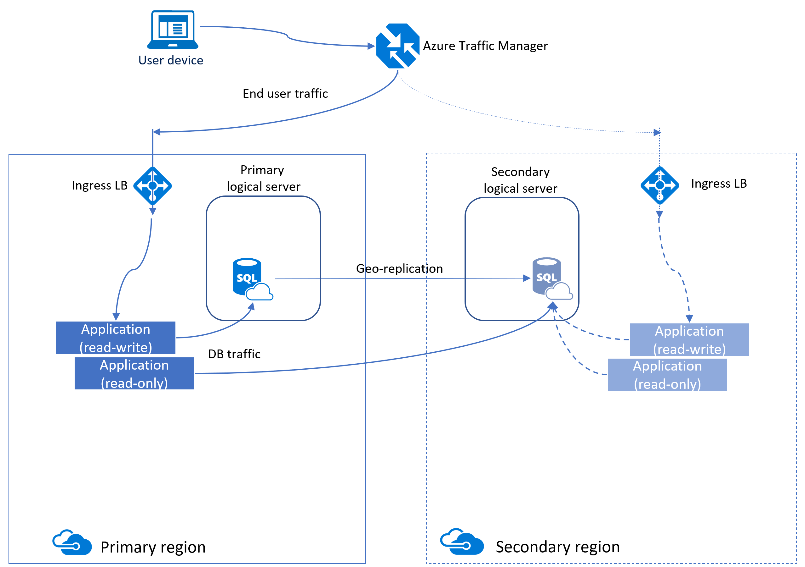

# Create readable database replicas using active geo-replication

Active geo-replication is Azure SQL Database feature that allows you to create readable replicas of individual databases in the same or different data center (region).

Active geo-replication is designed as a business continuity solution that allows the application to perform quick disaster recovery of individual databases in case of a regional disaster or large scale outage. If geo-replication is enabled, the application can initiate failover to a secondary database in a different Azure region. Up to four secondaries are supported in the same or different regions, and the secondaries can also be used for read-only access queries. The failover must be initiated manually by the application or the user. After failover, the new primary has a different connection end point. The following diagram illustrates a typical configuration of a geo-redundant cloud application using Active geo-replication.

> [!IMPORTANT]
> SQL Database also supports auto-failover groups. For more information, see using [auto-failover groups](sql-database-auto-failover-group.md). Also, active geo-replication is not supported for databases created within a Managed Instance. Consider using [failover groups](sql-database-auto-failover-group.md) with Managed Instances.

If for any reason your primary database fails, or simply needs to be taken offline, you can initiate failover to any of your secondary databases. When failover is activated to one of the secondary databases, all other secondaries are automatically linked to the new primary.

You can manage replication and failover of an individual database or a set of databases on a server or in an elastic pool using active geo-replication. You can do that using:

- The [Azure portal](sql-database-geo-replication-portal.md)
- [PowerShell: Single database](scripts/sql-database-setup-geodr-and-failover-database-powershell.md)
- [PowerShell: Elastic pool](scripts/sql-database-setup-geodr-and-failover-pool-powershell.md)
- [Transact-SQL: Single database or elastic pool](/sql/t-sql/statements/alter-database-azure-sql-database)
- [REST API: Single database](https://docs.microsoft.com/rest/api/sql/replicationlinks)

After failover, ensure the authentication requirements for your server and database are configured on the new primary. For details, see [SQL Database security after disaster recovery](sql-database-geo-replication-security-config.md).

Active geo-replication leverages the [Always On](https://docs.microsoft.com/sql/database-engine/availability-groups/windows/overview-of-always-on-availability-groups-sql-server) technology of SQL Server to asynchronously replicate committed transactions on the primary database to a secondary database using snapshot isolation. Auto-failover groups provide the group semantics on top of active geo-replication but the same asynchronous replication mechanism is used. While at any given point, the secondary database might be slightly behind the primary database, the secondary data is guaranteed to never have partial transactions. Cross-region redundancy enables applications to quickly recover from a permanent loss of an entire datacenter or parts of a datacenter caused by natural disasters, catastrophic human errors, or malicious acts. The specific RPO data can be found at [Overview of Business Continuity](sql-database-business-continuity.md).

The following figure shows an example of active geo-replication configured with a primary in the North Central US region and secondary in the South Central US region.

Because the secondary databases are readable, they can be used to offload read-only workloads such as reporting jobs. If you are using active geo-replication, it is possible to create the secondary database in the same region with the primary, but it does not increase the application's resilience to catastrophic failures. If you are using auto-failover groups, your secondary database is always created in a different region.

In addition to disaster recovery active geo-replication can be used in the following scenarios:

- **Database migration**: You can use active geo-replication to migrate a database from one server to another online with minimum downtime.
- **Application upgrades**: You can create an extra secondary as a fail back copy during application upgrades.

To achieve real business continuity, adding database redundancy between datacenters is only part of the solution. Recovering an application (service) end-to-end after a catastrophic failure requires recovery of all components that constitute the service and any dependent services. Examples of these components include the client software (for example, a browser with a custom JavaScript), web front ends, storage, and DNS. It is critical that all components are resilient to the same failures and become available within the recovery time objective (RTO) of your application. Therefore, you need to identify all dependent services and understand the guarantees and capabilities they provide. Then, you must take adequate steps to ensure that your service functions during the failover of the services on which it depends. For more information about designing solutions for disaster recovery, see [Designing Cloud Solutions for Disaster Recovery Using active geo-replication](sql-database-designing-cloud-solutions-for-disaster-recovery.md).

## Active geo-replication capabilities

The active geo-replication feature provides the following essential capabilities:

- **Automatic Asynchronous Replication**

 You can only create a secondary database by adding to an existing database. The secondary can be created in any Azure SQL Database server. Once created, the secondary database is populated with the data copied from the primary database. This process is known as seeding. After secondary database has been created and seeded, updates to the primary database are asynchronously replicated to the secondary database automatically. Asynchronous replication means that transactions are committed on the primary database before they are replicated to the secondary database.

- **Readable secondary databases**

  An application can access a secondary database for read-only operations using the same or different security principals used for accessing the primary database. The secondary databases operate in snapshot isolation mode to ensure replication of the updates of the primary (log replay) is not delayed by queries executed on the secondary.

  > [!NOTE]
  > The log replay is delayed on the secondary database if there are schema updates on the Primary. The latter requires a schema lock on the secondary database.

- **Multiple readable secondaries**

  Two or more secondary databases increase redundancy and level of protection for the primary database and application. If multiple secondary databases exist, the application remains protected even if one of the secondary databases fails. If there is only one secondary database, and it fails, the application is exposed to higher risk until a new secondary database is created.

  > [!NOTE]
  > If you are using active geo-replication to build a globally distributed application and need to provide read-only access to data in more than four regions, you can create secondary of a secondary (a process known as chaining). This way you can achieve virtually unlimited scale of database replication. In addition, chaining reduces the overhead of replication from the primary database. The trade-off is the increased replication lag on the leaf-most secondary databases.

- **Support of elastic pool databases**

  Each replica can separately participate in an Elastic Pool or not be in any elastic pool at all. The pool choice for each replica is separate and does not depend upon the configuration of any other replica (whether Primary or Secondary). Each Elastic Pool is contained within a single region, therefore multiple replicas in the same topology can never share an Elastic Pool.

- **Configurable compute size of the secondary database**

  Both primary and secondary databases are required to have the same service tier. It is also strongly recommended that secondary database is created with the same compute size (DTUs or vCores) as the primary. A secondary with lower compute size is at risk of an increased replication lag, potential unavailability of the secondary, and consequently at risk of substantial data loss after a failover. As a result, the published RPO = 5 sec cannot be guaranteed. The other risk is that after failover the application’s performance will be impacted due to a lack of compute capacity of the new primary until it is upgraded to a higher compute size. The time of the upgrade depends on the database  size. In addition, currently such upgrade requires that both primary and secondary databases are online and, therefore, cannot be completed until the outage is mitigated. If you decide to create the secondary with lower compute size, the log IO percentage chart on Azure portal provides a good way to estimate the minimal compute size of the secondary that is required to sustain the replication load. For example, if your Primary database is P6 (1000 DTU) and its log IO percent is 50% the secondary needs to be at least P4 (500 DTU). You can also retrieve the log IO data using [sys.resource_stats](/sql/relational-databases/system-catalog-views/sys-resource-stats-azure-sql-database) or [sys.dm_db_resource_stats](/sql/relational-databases/system-dynamic-management-views/sys-dm-db-resource-stats-azure-sql-database) database views.  For more information on the SQL Database compute sizes, see [What are SQL Database Service Tiers](sql-database-service-tiers.md).

- **User-controlled failover and failback**

  A secondary database can explicitly be switched to the primary role at any time by the application or the user. During a real outage the “unplanned” option should be used, which immediately promotes a secondary to be the primary. When the failed primary recovers and is available again, the system automatically marks the recovered primary as a secondary and bring it up-to-date with the new primary. Due to the asynchronous nature of replication, a small amount of data can be lost during unplanned failovers if a primary fails before it replicates the most recent changes to the secondary. When a primary with multiple secondaries fails over, the system automatically reconfigures the replication relationships and links the remaining secondaries to the newly promoted primary without requiring any user intervention. After the outage that caused the failover is mitigated, it may be desirable to return the application to the primary region. To do that, the failover command should be invoked with the “planned” option.

- **Keeping credentials and firewall rules in sync**

  We recommend using [database firewall rules](sql-database-firewall-configure.md) for geo-replicated databases so these rules can be replicated with the database to ensure all secondary databases have the same firewall rules as the primary. This approach eliminates the need for customers to manually configure and maintain firewall rules on servers hosting both the primary and secondary databases. Similarly, using [contained database users](sql-database-manage-logins.md) for data access ensures both primary and secondary databases always have the same user credentials so during a failover, there is no disruptions due to mismatches with logins and passwords. With the addition of [Azure Active Directory](../active-directory/fundamentals/active-directory-whatis.md), customers can manage user access to both primary and secondary databases and eliminating the need for managing credentials in databases altogether.

## Upgrading or downgrading a primary database

You can upgrade or downgrade a primary database to a different compute size (within the same service tier, not between General Purpose and Business Critical) without disconnecting any secondary databases. When upgrading, we recommend that you upgrade the secondary database first, and then upgrade the primary. When downgrading, reverse the order: downgrade the primary first, and then downgrade the secondary. When you upgrade or downgrade the database to a different service tier, this recommendation is enforced.

> [!NOTE]
> If you created secondary database as part of the failover group configuration it is not recommended to downgrade the secondary database. This is to ensure your data tier has sufficient capacity to process your regular workload after failover is activated.

## Preventing the loss of critical data

Due to the high latency of wide area networks, continuous copy uses an asynchronous replication mechanism. Asynchronous replication makes some data loss unavoidable if a failure occurs. However, some applications may require no data loss. To protect these critical updates, an application developer can call the [sp_wait_for_database_copy_sync](/sql/relational-databases/system-stored-procedures/active-geo-replication-sp-wait-for-database-copy-sync) system procedure immediately after committing the transaction. Calling **sp_wait_for_database_copy_sync** blocks the calling thread until the last committed transaction has been transmitted to the secondary database. However, it does not wait for the transmitted transactions to be replayed and committed on the secondary. **sp_wait_for_database_copy_sync** is scoped to a specific continuous copy link. Any user with the connection rights to the primary database can call this procedure.

> [!NOTE]
> **sp_wait_for_database_copy_sync** prevents data loss after failover, but does not guarantee full synchronization for read access. The delay caused by a **sp_wait_for_database_copy_sync** procedure call can be significant and depends on the size of the transaction log at the time of the call.

## Programmatically managing active geo-replication

As discussed previously, active geo-replication can also be managed programmatically using Azure PowerShell and the REST API. The following tables describe the set of commands available. Active geo-replication includes a set of Azure Resource Manager APIs for management, including the [Azure SQL Database REST API](https://docs.microsoft.com/rest/api/sql/) and [Azure PowerShell cmdlets](https://docs.microsoft.com/powershell/azure/overview). These APIs require the use of resource groups and support role-based security (RBAC). For more information on how to implement access roles, see [Azure Role-Based Access Control](../role-based-access-control/overview.md).

### T-SQL: Active geo-replication failover with single and pooled databases

> [!IMPORTANT]
> These Transact-SQL commands only apply to active geo-replication and do not apply to failover groups. As such, they also do not apply to Managed Instances, as they only support failover groups.

| Command | Description |
| --- | --- |
| [ALTER DATABASE](https://docs.microsoft.com/sql/t-sql/statements/alter-database-transact-sql?view=azuresqldb-current) |Use ADD SECONDARY ON SERVER argument to create a secondary database for an existing database and starts data replication |
| [ALTER DATABASE](https://docs.microsoft.com/sql/t-sql/statements/alter-database-transact-sql?view=azuresqldb-current) |Use FAILOVER or FORCE_FAILOVER_ALLOW_DATA_LOSS to switch a secondary database to be primary to initiate failover |
| [ALTER DATABASE](https://docs.microsoft.com/sql/t-sql/statements/alter-database-transact-sql?view=azuresqldb-current) |Use REMOVE SECONDARY ON SERVER to terminate a data replication between a SQL Database and the specified secondary database. |
| [sys.geo_replication_links](/sql/relational-databases/system-dynamic-management-views/sys-geo-replication-links-azure-sql-database) |Returns information about all existing replication links for each database on the Azure SQL Database logical server. |
| [sys.dm_geo_replication_link_status](/sql/relational-databases/system-dynamic-management-views/sys-dm-geo-replication-link-status-azure-sql-database) |Gets the last replication time, last replication lag, and other information about the replication link for a given SQL database. |
| [sys.dm_operation_status](/sql/relational-databases/system-dynamic-management-views/sys-dm-operation-status-azure-sql-database) |Shows the status for all database operations including the status of the replication links. |
| [sp_wait_for_database_copy_sync](/sql/relational-databases/system-stored-procedures/active-geo-replication-sp-wait-for-database-copy-sync) |causes the application to wait until all committed transactions are replicated and acknowledged by the active secondary database. |
|  | |

### PowerShell: Active geo-replication failover with single and pooled databases

| Cmdlet | Description |
| --- | --- |
| [Get-AzureRmSqlDatabase](https://docs.microsoft.com/powershell/module/azurerm.sql/get-azurermsqldatabase) |Gets one or more databases. |
| [New-AzureRmSqlDatabaseSecondary](https://docs.microsoft.com/powershell/module/azurerm.sql/new-azurermsqldatabasesecondary) |Creates a secondary database for an existing database and starts data replication. |
| [Set-AzureRmSqlDatabaseSecondary](https://docs.microsoft.com/powershell/module/azurerm.sql/set-azurermsqldatabasesecondary) |Switches a secondary database to be primary to initiate failover. |
| [Remove-AzureRmSqlDatabaseSecondary](https://docs.microsoft.com/powershell/module/azurerm.sql/remove-azurermsqldatabasesecondary) |Terminates data replication between a SQL Database and the specified secondary database. |
| [Get-AzureRmSqlDatabaseReplicationLink](https://docs.microsoft.com/powershell/module/azurerm.sql/get-azurermsqldatabasereplicationlink) |Gets the geo-replication links between an Azure SQL Database and a resource group or SQL Server. |
|  | |

> [!IMPORTANT]
> For sample scripts, see [Configure and failover a single database using active geo-replication](scripts/sql-database-setup-geodr-and-failover-database-powershell.md) and [Configure and failover a pooled database using active geo-replication](scripts/sql-database-setup-geodr-and-failover-pool-powershell.md).

### REST API: Active geo-replication failover with single and pooled databases

| API | Description |
| --- | --- |
| [Create or Update Database (createMode=Restore)](https://docs.microsoft.com/rest/api/sql/databases/createorupdate) |Creates, updates, or restores a primary or a secondary database. |
| [Get Create or Update Database Status](https://docs.microsoft.com/rest/api/sql/databases/createorupdate) |Returns the status during a create operation. |
| [Set Secondary Database as Primary (Planned Failover)](https://docs.microsoft.com/rest/api/sql/replicationlinks/failover) |Sets which replica database is primary by failing over from the current primary replica database. **This option is not supported for Managed Instance.**|
| [Set Secondary Database as Primary (Unplanned Failover)](https://docs.microsoft.com/rest/api/sql/replicationlinks/failoverallowdataloss) |Sets which replica database is primary by failing over from the current primary replica database. This operation might result in data loss. **This option is not supported for Managed Instance.**|
| [Get Replication Link](https://docs.microsoft.com/rest/api/sql/replicationlinks/get) |Gets a specific replication link for a given SQL database in a geo-replication partnership. It retrieves the information visible in the sys.geo_replication_links catalog view. **This option is not supported for Managed Instance.**|
| [Replication Links - List By Database](https://docs.microsoft.com/rest/api/sql/replicationlinks/listbydatabase) | Gets all replication links for a given SQL database in a geo-replication partnership. It retrieves the information visible in the sys.geo_replication_links catalog view. |
| [Delete Replication Link](https://docs.microsoft.com/rest/api/sql/replicationlinks/delete) | Deletes a database replication link. Cannot be done during failover. |
|  | |

## Next steps

- For sample scripts, see:
  - [Configure and failover a single database using active geo-replication](scripts/sql-database-setup-geodr-and-failover-database-powershell.md)
  - [Configure and failover a pooled database using active geo-replication](scripts/sql-database-setup-geodr-and-failover-pool-powershell.md)
- SQL Database also supports auto-failover groups. For more information, see using [auto-failover groups](sql-database-auto-failover-group.md).
- For a business continuity overview and scenarios, see [Business continuity overview](sql-database-business-continuity.md)
- To learn about Azure SQL Database automated backups, see [SQL Database automated backups](sql-database-automated-backups.md).
- To learn about using automated backups for recovery, see [Restore a database from the service-initiated backups](sql-database-recovery-using-backups.md).
- To learn about authentication requirements for a new primary server and database, see [SQL Database security after disaster recovery](sql-database-geo-replication-security-config.md).
