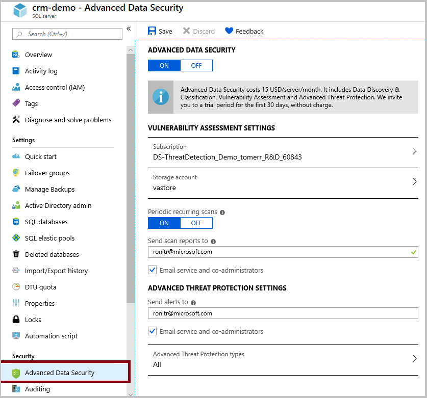
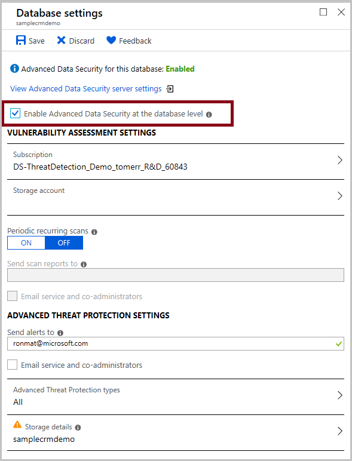
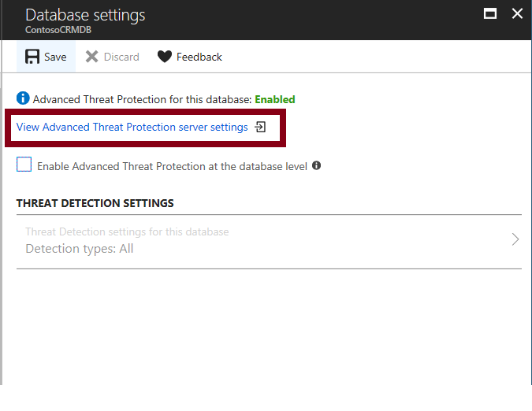

# Advanced data security for Azure SQL Database

Advanced data security is a unified package for advanced SQL security capabilities. It includes functionality for discovering and classifying sensitive data, surfacing and mitigating potential database vulnerabilities, and detecting anomalous activities that could indicate a threat to your database. It provides a single go-to location for enabling and managing these capabilities.

## Overview

Advanced data security (ADS) provides a set of advanced SQL security capabilities, including data discovery & classification, vulnerability assessment, and Advanced Threat Protection.

- [Data discovery & classification](sql-database-data-discovery-and-classification.md) (currently in preview) provides capabilities built into Azure SQL Database for discovering, classifying, labeling & protecting the sensitive data in your databases. It can be used to provide visibility into your database classification state, and to track the access to sensitive data within the database and beyond its borders.
- [Vulnerability assessment](sql-vulnerability-assessment.md) is an easy to configure service that can discover, track, and help you remediate potential database vulnerabilities. It provides visibility into your security state, and includes actionable steps to resolve security issues, and enhance your database fortifications.
- [Advanced Threat Protection](sql-database-threat-detection-overview.md) detects anomalous activities indicating unusual and potentially harmful attempts to access or exploit your database. It continuously monitors your database for suspicious activities, and provides immediate security alerts on potential vulnerabilities, SQL injection attacks, and anomalous database access patterns. Advanced Threat Protection alerts provide details of the suspicious activity and recommend action on how to investigate and mitigate the threat.

Enable SQL ADS once to enable all of these included features. With one click, you can enable ADS for all databases on your SQL Database server or managed instance. Enabling or managing ADS settings requires belonging to the [SQL security manager](https://docs.microsoft.com/azure/role-based-access-control/built-in-roles#sql-security-manager) role, SQL database admin role or SQL server admin role. 

ADS pricing aligns with Azure Security Center standard tier, where each protected SQL Database server or managed instance is counted as one node. Newly protected resources qualify for a free trial of Security Center standard tier. For more information, see the [Azure Security Center pricing page](https://azure.microsoft.com/pricing/details/security-center/).

## Getting Started with ADS

The following steps get you started with ADS.

## 1. Enable ADS

Enable ADS by navigating to **Advanced Data Security** under the **Security** heading for your SQL Database server or manged instance. To enable ADS for all databases on the database server or managed instance, click **Enable Advanced Data Security on the server**.

> [!NOTE]
> A storage account is automatically created and configured to store your **Vulnerability Assessment** scan results. If you've already enabled ADS for another server in the same resource group and region, then the existing storage account is used.

 

> [!NOTE]
> The cost of ADS is aligned with Azure Security Center standard tier pricing per node, where a node is the entire SQL Database server or managed instance. You are thus paying only once for protecting all databases on the database server or managed instance with ADS. You can try ADS out initially with a free trial.

## 2. Start classifying data, tracking vulnerabilities, and investigating threat alerts

Click the **Data Discovery & Classification** card to see recommended sensitive columns to classify and to classify your data with persistent sensitivity labels. Click the **Vulnerability Assessment** card to view and manage vulnerability scans and reports, and to track your security stature. If security alerts have been received, click the **Advanced Threat Protection** card to view details of the alerts and to see a consolidated report on all alerts in your Azure subscription via the Azure Security Center security alerts page.

## 3. Manage ADS settings on your SQL Database server or managed instance

To view and manage ADS settings, navigate to **Advanced Data Security** under the **Security** heading for your SQL Database server or managed instance. On this page, you can enable or disable ADS, and modify vulnerability assessment and Advanced Threat Protection settings for your entire SQL Database server or managed instance.

 

## 4. Manage ADS settings for a SQL database

To override ADS settings for a particular database, check the **Enable Advanced Data Security at the database level** checkbox. Use this option only if you have a particular requirement to receive separate Advanced Threat Protection alerts or vulnerability assessment results for the individual database, in place of or in addition to the alerts and results received for all databases on the database server or managed instance.

Once the checkbox is selected, you can then configure the relevant settings for this database.
 
 

Advanced data security settings for your database server or managed instance can also be reached from the ADS database pane. Click **Settings** in the main ADS pane, and then click **View Advanced Data Security server settings**. 

 

## Next steps 

- Learn more about [data discovery & classification](sql-database-data-discovery-and-classification.md) 
- Learn more about [vulnerability assessment](sql-vulnerability-assessment.md) 
- Learn more about [Advanced Threat Protection](sql-database-threat-detection.md)
- Learn more about [Azure security center](https://docs.microsoft.com/azure/security-center/security-center-intro)
