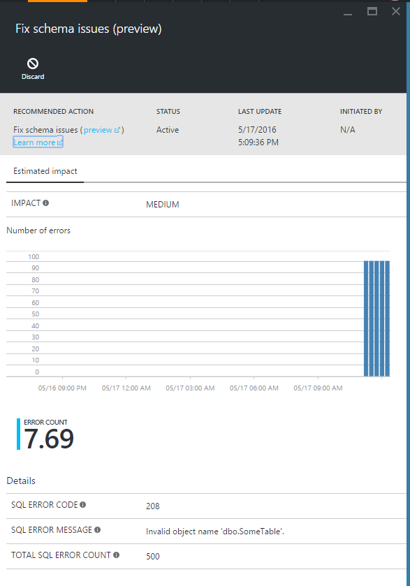
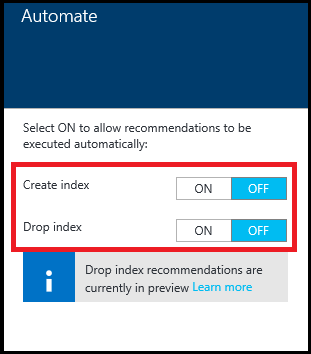

<properties 
   pageTitle="Azure SQL Database Advisor using the Azure portal | Microsoft Azure" 
   description="You can use the Azure SQL Database Advisor in the Azure portal to review and implement recommendations for your existing SQL Databases that can improve current query performance." 
   services="sql-database" 
   documentationCenter="" 
   authors="stevestein" 
   manager="jhubbard" 
   editor="monicar"/>

<tags
   ms.service="sql-database"
   ms.devlang="na"
   ms.topic="article"
   ms.tgt_pltfrm="na"
   ms.workload="data-management" 
   ms.date="06/22/2016"
   ms.author="sstein"/>

# SQL Database Advisor

> [AZURE.SELECTOR]
- [SQL Database Advisor Overview](sql-database-advisor.md)
- [Portal](sql-database-advisor-portal.md)

You can use the Azure SQL Database Advisor in the Azure portal to review and implement recommendations for your existing SQL Databases that can improve current query performance.

## Viewing recommendations

The recommendations page is where you view the top recommendations based on their potential impact to improve performance. You can also view the status of the historical operations. Select a recommendation or status to see it's details.

To view and apply recommendations, you need the correct [role-based access control](../active-directory/role-based-access-control-configure.md) permissions in Azure. **Reader**, **SQL DB Contributor** permissions are required to view recommendations, and **Owner**, **SQL DB Contributor** permissions are required to execute any actions; create or drop indexes and cancel index creation.

1. Sign in to the [Azure portal](https://portal.azure.com/).
2. Click **BROWSE** > **SQL databases**, and select your database.
5. Click **All settings** > **Recommendations** to view available **Recommendations** for the selected database.

> [AZURE.NOTE] To get recommendations a database needs to have about a week of usage, and within that week there needs to be some activity. There also needs to be some consistent activity as well. The SQL Database Advisor can more easily optimize for consistent query patterns than it can for random spotty bursts of activity. If recommendations are not available, the **Recommendations** page should provide a message explaining why.

Here is an example of "Fix schema issue" recommendation in the Azure portal.

Recommendations are sorted by their potential impact on performance into the following 4 categories:

| Impact | Description |
| :--- | :--- |
| High | High impact recommendations should provide the most significant performance impact. |
| Medium | Medium impact recommendations should improve performance, but not substantially. |
| Low | Low impact recommendations should provide better performance than without, but improvements might not be significant. 

### Removing recommendations from the list

If your list of recommendations contains items that you want to remove from the list, you can discard the recommendation:

1. Select a recommendation in the list of **Recommendations**.
2. Click **Discard** on the **Details** blade.

If desired, you can add discarded items back to the **Recommendations** list:

1. On the **Recommendations** blade click **View discarded**.
1. Select a discarded item from the list to view its details.
1. Optionally, click **Undo Discard** to add the index back to the main list of **Recommendations**.

## Applying recommendations

SQL Database Advisor gives you full control over how recommendations are enabled using any of the 3 options below. 

- Apply individual recommendations one at a time.
- Enable the advisor to automatically apply recommendations (currently applies to index recommendations only).
- Manually run the recommended T-SQL script against your database to implement a recommendation.

Select any recommendation to view its details and then click **View script** to review the exact details of how the recommendation will be created.

The database remains online while the advisor applies the recommendation -- using SQL Database Advisor will never take a database offline.

### Apply an individual recommendation

You can review and accept recommendations one at a time.

1. On the **Recommendations** blade click a recommendation.
2. On the **Details** blade click **Apply**.

    

### Enable automatic index management

You can set the SQL Database Advisor to implement recommendations automatically. As recommendations become available they will automatically be applied. As with all index operations managed by the service if the performance impact is negative the recommendation will be reverted.

1. On the **Recommendations** blade click **Automate**:

    

2. Set the advisor to automatically **Create** or **Drop** indexes:

    

### Manually run the recommended T-SQL script

Select any recommendation and then click **View script**. Run this script against your database to manually apply the recommendation.

*Indexes that are manually executed are not monitored and validated for performance impact by the service* so it is suggested that you monitor these indexes after creation to verify they provide performance gains and adjust or delete them if necessary. For details about creating indexes, see [CREATE INDEX (Transact-SQL)](https://msdn.microsoft.com/library/ms188783.aspx).

### Canceling recommendations

Recommendations that are in a **Pending**, **Verifying**, or **Success** status can be canceled. Recommendations with a status of **Executing** cannot be canceled.

1. Select a recommendation in the **Tuning History** area to open the **recommendations details** blade.
2. Click **Cancel** to abort the process of applying the recommendation.

## Monitoring operations

Applying a recommendation might not happen instantaneously. The portal provides details regarding the status of recommendation operations. The following are possible states that an index can be in:

| Status | Description |
| :--- | :--- |
| Pending | Apply recommendation command has been received and is scheduled for execution. |
| Executing | The recommendation is being applied. |
| Success | Recommendation was successfully applied. |
| Error | An error occurred during the process of applying the recommendation. This can be a transient issue, or possibly a schema change to the table and the script is no longer valid. |
| Reverting | The recommendation was applied, but has been deemed non-performant and is being automatically reverted. |
| Reverted | The recommendation was reverted. |

Click an in-process recommendation from the list to see it's details:

### Reverting a recommendation

If you used the advisor to apply the recommendation (meaning you did not manually run the T-SQL script) it will automatically revert it if it finds the performance impact to be negative. If for any reason you simply want to revert a recommendation you can do the following:

1. Select a successfully applied recommendation in the **Tuning history** area.
2. Click **Revert** on the **recommendation details** blade.

## Monitoring performance impact of index recommendations

After recommendations are successfully implemented (currently, index operations and parameterize queries recommendations only) you can click **Query Insights** on the recommendation details blade to open [Query Performance Insights](sql-database-query-performance.md) and see the performance impact of your top queries.

## Summary

SQL Database Advisor provides recommendations for improving SQL database performance. By providing T-SQL scripts, as well as individual and fully-automatic (currently index only), the advisor provides helpful assistance in optimizing your database and ultimately improving query performance.

## Next steps

Monitor your recommendations and continue to apply them to refine performance. Database workloads are dynamic and change continuously. SQL Database advisor will continue to monitor and provide recommendations that can potentially improve your database's performance. 

 - See [SQL Database Advisor](sql-database-advisor.md) for an overview of SQL Database Advisor.
 - See [Query Performance Insights](sql-database-query-performance.md) to learn about view the performance impact of your top queries.

## Additional resources

- [Query Store](https://msdn.microsoft.com/library/dn817826.aspx)
- [CREATE INDEX](https://msdn.microsoft.com/library/ms188783.aspx)
- [Role-based access control](../active-directory/role-based-access-control-configure.md)

