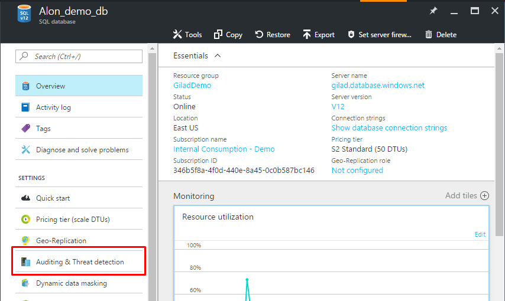

# Configure and manage SQL database auditing in the Azure portal

The following section describes how to configure and manage auditing using the Azure portal. To configure and manage auditing using PowerShell, see [Configure auditing with PowerShell](scripts/sql-database-create-and-configure-database-powershell.md). 

For an overview of auditing, see [SQL Database auditing](sql-database-auditing.md).

## Configure blob auditing

1. Launch the [Azure portal](https://portal.azure.com) at https://portal.azure.com.
2. Navigate to the Settings blade of the SQL Database / SQL Server you want to audit. In the Settings blade, select **Auditing & Threat detection**.

    
3. In the Database Auditing Configuration blade, you can check the **Inherit settings from server** checkbox to designate that this database be audited according to its server's settings. If this option is checked, you see a **View server auditing settings** link that allows you to view or modify the server auditing settings from this context.

    ![Navigation pane][2]
4. If you prefer to enable blob auditing on the database-level (in addition or instead of server-level auditing), **uncheck** the **Inherit Auditing settings from server** option, turn **ON** Auditing, and choose the **Blob** Auditing Type.

    ![Navigation pane][3]
5. Select **Storage Details** to open the Audit Logs Storage blade. Select the Azure storage account where logs are saved, and the retention period, after which the old logs are deleted, then click **OK** at the bottom. **Tip:** Use the same storage account for all audited databases to get the most out of the auditing reports templates.

    
    ![Navigation pane][4]
6. If you want to customize the audited events, you can do this via PowerShell or the REST API.
7. Once you've configured your auditing settings, you can turn on the new Threat Detection (preview) feature, and configure the emails to receive security alerts. Threat Detection allows you to receive proactive alerts on anomalous database activities that may indicate potential security threats. See [Threat detection](sql-database-threat-detection.md) for more details.
8. Click **Save**.

## Table auditing

> [!IMPORTANT]
> Before setting up **Table auditing**, check if you are using a ["Downlevel Client"](sql-database-auditing-and-dynamic-data-masking-downlevel-clients.md). Also, if you have strict firewall settings, please note that the [IP endpoint of your database changes](sql-database-auditing-and-dynamic-data-masking-downlevel-clients.md) when enabling Table Auditing.
>

1. Launch the [Azure portal](https://portal.azure.com) at https://portal.azure.com.
2. Navigate to the Settings blade of the SQL Database / SQL Server you want to audit. In the Settings blade, select **Auditing & Threat detection** (*[see screenshot in Blob Auditing section](#auditing-screenshot)*).
3. In the Database Auditing Configuration blade, you can check the **Inherit settings from server** checkbox to designate that this database be audited according to its server's settings. If this option is checked, you see a **View server auditing settings** link that allows you to view or modify the server auditing settings from this context.

    ![Navigation pane][2]
4. If you prefer not to inherit auditing settings from server, **uncheck** the **Inherit Auditing settings from server** option, turn **ON** auditing, and choose **Table** auditing type.

    ![Navigation pane][3-tbl]
5. Select **Storage Details** to open the Audit Logs Storage blade. Select the Azure storage account where logs are saved, and the retention period, after which the old logs are deleted. **Tip:** Use the same storage account for all audited databases to get the most out of the auditing reports templates (*[see screenshot in Blob Auditing section](#storage-screenshot)*).
6. Click on **Audited Events** to customize which events to audit. In the Logging by Event blade, click **Success** and **Failure** to log all events, or choose individual event categories.

    ![Navigation pane][5]
7. Once you've configured your auditing settings, you can turn on the new Threat Detection (preview) feature, and configure the emails to receive security alerts. Threat Detection allows you to receive proactive alerts on anomalous database activities that may indicate potential security threats. See [Threat detection](sql-database-threat-detection.md) for more details.
8. Click **Save**.

## Auditing geo-replicated databases

When using geo-replicated databases, it is possible to set up Auditing on either the primary database, the secondary database, or both, depending on the audit type.

**Table Auditing:** You can configure a separate policy, on either the database or the server level, for each of the two databases (primary and secondary).

**Blob Auditing:** Follow these instructions:

1. **Primary database:** Turn on blob auditing either on the server or the database itself.
2. **Secondary database:** Blob auditing can only be turned on/off from the primary database auditing settings.

   * Turn on blob auditing on the primary database. Blob auditing must be enabled on the *primary database itself*, not the server.
   * Once blob auditing is enabled on the primary database, it is also become enabled on the secondary database.

    > [!IMPORTANT]
    > By default, the storage settings for the secondary database are identical to those of the primary database, causing cross-regional traffic. You can avoid this by enabling blob auditing on the secondary server and configuring local storage in the Secondary server storage settings (this overrides the storage location for the Secondary database and result in each database saving the Audit logs to local storage).  

## Viewing blob auditing logs

Blob auditing logs are saved as a collection of blob files within a container named "**sqldbauditlogs**".

For further details about the Blob audit logs storage folder hierarchy, blob naming convention, and log format, see the [Blob Audit Log Format Reference (doc file download)](https://go.microsoft.com/fwlink/?linkid=829599).

There are several methods to view Blob Auditing logs:

* Through the [Azure portal](https://portal.azure.com) - open the relevant database. At the top of the database's Auditing & Threat detection blade, click on **View audit logs**.

    ![Navigation Pane][10]

    An Audit records blade opens, where you'll be able to view the logs.

    - You can choose to view specific dates by clicking on **Filter** at the top area of the Audit records blade
    - You can toggle between audit records that were created by server policy or database policy audit

    ![Navigation Pane][11]
* Download log files from your Azure storage blob container via the portal or by using a tool such as [Azure Storage Explorer](http://storageexplorer.com/).

    Once you have downloaded the log file locally, you can double-click the file to open, view and analyze the logs in SSMS.

* Additional methods:

   * You can download multiple files simultaneously via Azure Storage Explorer - right-click on a specific subfolder (a subfolder that includes all log files for a specific date) and choose **Save as** to save in a local folder.

       After downloading several files (or an entire day, as described above), you can merge them locally as follows:

       **Open SSMS -> File -> Open -> Merge Extended Events -> Choose all files to merge**
   * Programmatically:

     * [Extended Events Reader C# library](https://blogs.msdn.microsoft.com/extended_events/2011/07/20/introducing-the-extended-events-reader/)
     * [Querying Extended Events Files using PowerShell](https://sqlscope.wordpress.com/2014/11/15/reading-extended-event-files-using-client-side-tools-only/)

   * We have created a [sample application](https://github.com/Microsoft/Azure-SQL-DB-auditing-OMS-integration) that runs in Azure and utilizes OMS public APIs to push SQL audit logs into OMS for consumption via the OMS dashboard.

## Viewing table audit logs

Table auditing logs are saved as a collection of Azure Storage Tables with a **SQLDBAuditLogs** prefix.

For further details about the Table audit log format, see the [Table Audit Log Format Reference (doc file download)](http://go.microsoft.com/fwlink/?LinkId=506733).

There are several methods to view Table Auditing logs:

* Through the [Azure portal](https://portal.azure.com) - open the relevant database. At the top of the database's Auditing & Threat detection blade, click on **View audit logs**.

    ![Navigation Pane][10]

    An Audit records blade opens, where you'll be able to view the logs.

    * You can choose to view specific dates by clicking on **Filter** at the top area of the Audit records blade
    * You can download and view the audit logs in Excel format by clicking on **Open in Excel** at the top area of the Audit records blade

    ![Navigation Pane][12]

* Alternatively, a preconfigured report template is available as a [downloadable Excel spreadsheet](http://go.microsoft.com/fwlink/?LinkId=403540) to help you quickly analyze log data. To use the template on your audit logs, you need Excel 2013 or later and [Power Query(http://www.microsoft.com/download/details.aspx?id=39379).

* You can also import your audit logs into the Excel template directly from your Azure storage account using Power Query. You can then explore your audit records and create dashboards and reports on top of the log data.

    ![Navigation Pane][9]

## Storage key regeneration
In production, you are likely to refresh your storage keys periodically. When refreshing your keys, you need to re-save the auditing policy. The process is as follows:

1. In the Storage details blade switch the **Storage Access Key** from *Primary* to *Secondary*, and then click **OK** at the bottom. Then click **SAVE** at the top of the auditing configuration blade.

    ![Navigation Pane][6]
2. Go to the Storage configuration blade and **regenerate** the *Primary Access Key*.

    ![Navigation Pane][8]
3. Go back to the Auditing configuration blade, switch the **Storage Access Key** from *Secondary* to *Primary*, and then click **OK** at the bottom. Then click **SAVE** at the top of the Auditing configuration blade.
4. Go back to the Storage configuration blade and **regenerate** the *Secondary Access Key* (in preparation for the next keys refresh cycle).

<!--Anchors-->
[Azure SQL Database Auditing overview]: #subheading-1
[Set up auditing for your database]: #subheading-2
[Analyze audit logs and reports]: #subheading-3
[Practices for usage in production]: #subheading-5
[Storage Key Regeneration]: #subheading-6
[Automation (PowerShell / REST API)]: #subheading-7
[Blob/Table differences in Server auditing policy inheritance]: (#subheading-8)  

<!--Image references-->
[1]: ./media/sql-database-auditing-get-started/1_auditing_get_started_settings.png
[2]: ./media/sql-database-auditing-get-started/2_auditing_get_started_server_inherit.png
[3]: ./media/sql-database-auditing-get-started/3_auditing_get_started_turn_on.png
[3-tbl]: ./media/sql-database-auditing-get-started/3_auditing_get_started_turn_on_table.png
[4]: ./media/sql-database-auditing-get-started/4_auditing_get_started_storage_details.png
[5]: ./media/sql-database-auditing-get-started/5_auditing_get_started_audited_events.png
[6]: ./media/sql-database-auditing-get-started/6_auditing_get_started_storage_key_regeneration.png
[7]: ./media/sql-database-auditing-get-started/7_auditing_get_started_activity_log.png
[8]: ./media/sql-database-auditing-get-started/8_auditing_get_started_regenerate_key.png
[9]: ./media/sql-database-auditing-get-started/9_auditing_get_started_report_template.png
[10]: ./media/sql-database-auditing-get-started/10_auditing_get_started_blob_view_audit_logs.png
[11]: ./media/sql-database-auditing-get-started/11_auditing_get_started_blob_audit_records.png
[12]: ./media/sql-database-auditing-get-started/12_auditing_get_started_table_audit_records.png

## Next steps

* To configure and manage auditing using PowerShell, see [Configure database auditing using PowerShell](scripts/sql-database-create-and-configure-database-powershell.md).
* For an overview of auditing, see [Database auditing](sql-database-auditing.md).

