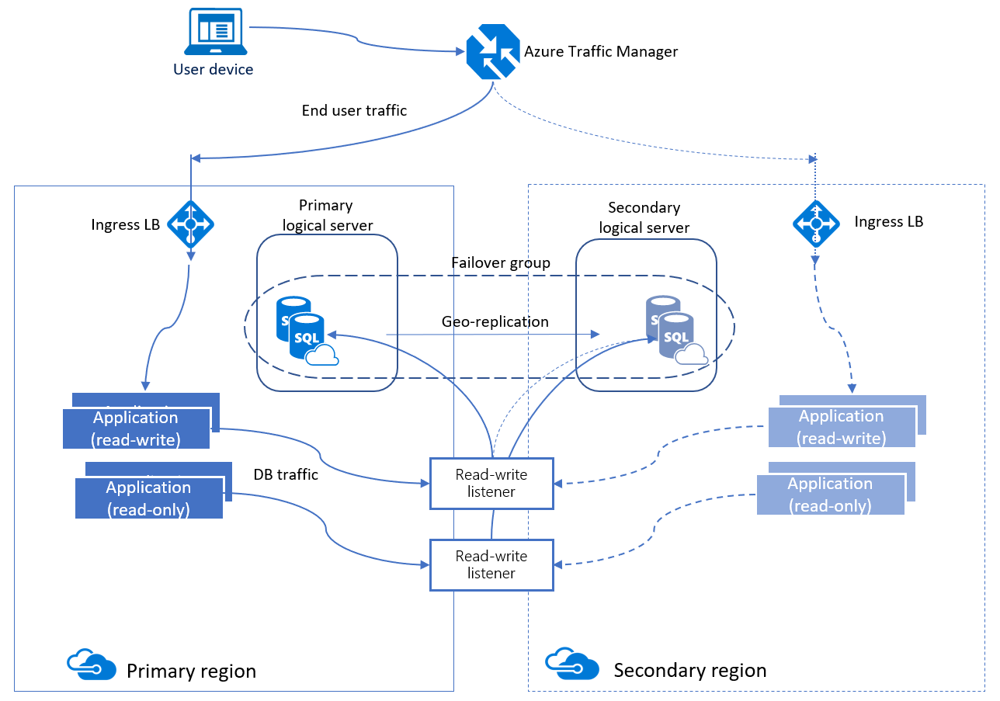
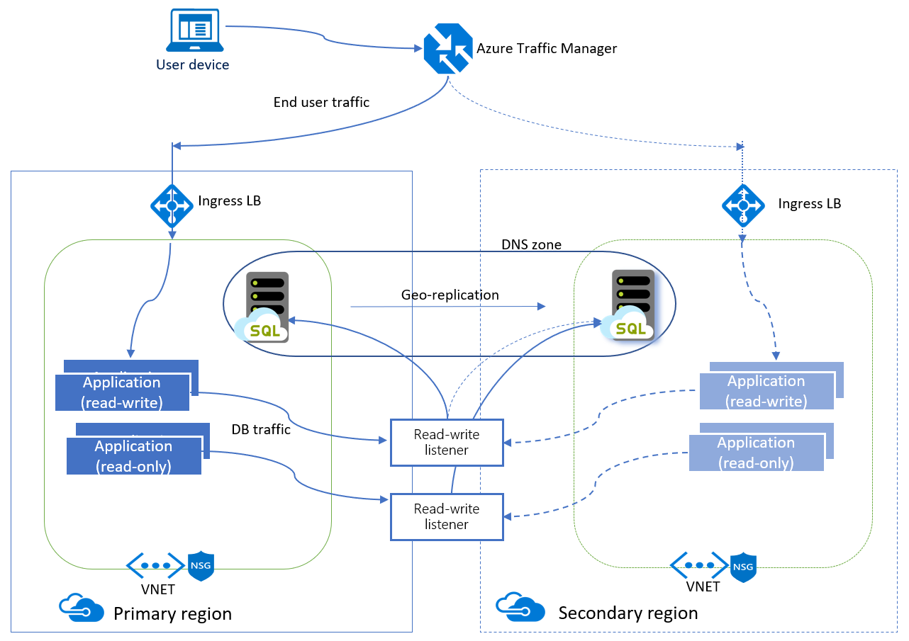

# Use auto-failover groups to enable transparent and coordinated failover of multiple databases

Auto-failover groups is a SQL Database feature that allows you to manage replication and failover of a group of databases on a SQL Database server or all databases in a managed instance to another region. It is a declarative abstraction on top of the existing [active geo-replication](sql-database-active-geo-replication.md) feature, designed to simplify deployment and management of geo-replicated databases at scale. You can initiate failover manually or you can delegate it to the SQL Database service based on a user-defined policy. The latter option allows you to automatically recover multiple related databases in a secondary region after a catastrophic failure or other unplanned event that results in full or partial loss of the SQL Database service’s availability in the primary region. A failover group can include one or multiple databases, typically used by the same application. Additionally, you can use the readable secondary databases to offload read-only query workloads. Because auto-failover groups involve multiple databases, these databases must be configured on the primary server. Auto-failover groups support replication of all databases in the group to only one secondary server in a different region.

> [!NOTE]
> When working with single or pooled databases on a SQL Database server and you want multiple secondaries in the same or different regions, use [active geo-replication](sql-database-active-geo-replication.md). 

When you are using auto-failover groups with automatic failover policy, any outage that impacts one or several of the databases in the group results in automatic failover. Typically these are incidents that cannot be self-mitigated by the built-in automatic high availability operations. The examples of failover triggers include an incident caused by a SQL tenant ring or control ring being down due to an OS kernel memory leak on several compute nodes, or an incident caused by one or more tenant rings being down because a wrong network cable was cut during routine hardware decommissioning.  For more information, see [SQL Database High Availability](sql-database-high-availability.md).

In addition, auto-failover groups provide read-write and read-only listener end-points that remain unchanged during failovers. Whether you use manual or automatic failover activation, failover switches all secondary databases in the group to primary. After the database failover is completed, the DNS record is automatically updated to redirect the endpoints to the new region. For the specific RPO and RTO data, see [Overview of Business Continuity](sql-database-business-continuity.md).

When you are using auto-failover groups with automatic failover policy, any outage that impacts databases in the SQL Database server or managed instance results in automatic failover. You can manage auto-failover group using:

- [Azure portal](sql-database-implement-geo-distributed-database.md)
- [Azure CLI: Failover Group](scripts/sql-database-add-single-db-to-failover-group-cli.md)
- [PowerShell: Failover Group](scripts/sql-database-add-single-db-to-failover-group-powershell.md)
- [REST API: Failover group](/rest/api/sql/failovergroups).

After failover, ensure the authentication requirements for your server and database are configured on the new primary. For details, see [SQL Database security after disaster recovery](sql-database-geo-replication-security-config.md).

To achieve real business continuity, adding database redundancy between datacenters is only part of the solution. Recovering an application (service) end-to-end after a catastrophic failure requires recovery of all components that constitute the service and any dependent services. Examples of these components include the client software (for example, a browser with a custom JavaScript), web front ends, storage, and DNS. It is critical that all components are resilient to the same failures and become available within the recovery time objective (RTO) of your application. Therefore, you need to identify all dependent services and understand the guarantees and capabilities they provide. Then, you must take adequate steps to ensure that your service functions during the failover of the services on which it depends. For more information about designing solutions for disaster recovery, see [Designing Cloud Solutions for Disaster Recovery Using active geo-replication](sql-database-designing-cloud-solutions-for-disaster-recovery.md).

## Auto-failover group terminology and capabilities

- **Failover group (FOG)**

  A failover group is a named group of databases managed by a single SQL Database server or within a single managed instance that can fail over as a unit to another region in case all or some primary databases become unavailable due to an outage in the primary region. When created for managed instances, a failover group contains all user databases in the instance and therefore only one failover group can be configured on an instance.
  
  > [!IMPORTANT]
  > The name of the failover group must be globally unique within the `.database.windows.net` domain.

- **SQL Database servers**

     With SQL Database servers, some or all of the user databases on a single SQL Database server can be placed in a failover group. Also, a SQL Database server supports multiple failover groups on a single SQL Database server.

- **Primary**

  The SQL Database server or managed instance that hosts the primary databases in the failover group.

- **Secondary**

  The SQL Database server or managed instance that hosts the secondary databases in the failover group. The secondary cannot be in the same region as the primary.

- **Adding single databases to failover group**

  You can put several single databases on the same SQL Database server into the same failover group. If you add a single database to the failover group, it automatically creates a secondary database using the same edition and compute size on secondary server.  You specified that server when the failover group was created. If you add a database that already has a secondary database in the secondary server, that geo-replication link is inherited by the group. When you add a database that already has a secondary database in a server that is not part of the failover group, a new secondary is created in the secondary server.

  > [!IMPORTANT]
  > Make sure that the secondary server doesn't have a database with the same name unless it is an existing secondary database. In failover groups for managed instance all user databases are replicated. You cannot pick a subset of user databases for replication in the failover group.

- **Adding databases in elastic pool to failover group**

  You can put all or several databases within an elastic pool into the same failover group. If the primary database is in an elastic pool, the secondary is automatically created in the elastic pool with the same name (secondary pool). You must ensure that the secondary server contains an elastic pool with the same exact name and enough free capacity to host the secondary databases that will be created by the failover group. If you add a database in the pool that already has a secondary database in the secondary pool, that geo-replication link is inherited by the group. When you add a database that already has a secondary database in a server that is not part of the failover group, a new secondary is created in the secondary pool.
  
- **Initial Seeding** 

  When adding databases, elastic pools, or managed instances to a failover group, there is an initial seeding phase before data replication starts. The initial seeding phase is the longest and most expensive operation. Once initial seeding completes, data is synchronized, and then only subsequent data changes are replicated. The time it takes for the initial seed to complete depends on the size of your data, number of replicated databases, and the speed of the link between the entities in the failover group. Under normal circumstances, typical seeding speed is 50-500 GB an hour for a single database or elastic pool, and 18-35 GB an hour for a managed instance. Seeding is performed for all databases in parallel. You can use the stated seeding speed, along with the number of databases and the total size of data to estimate how long the initial seeding phase will take before data replication starts.

  For managed instances, the speed of the Express Route link between the two instances also needs to be considered when estimating the time of the initial seeding phase. If the speed of the link between the two instances is slower than what is necessary, the time to seed is likely be notably impacted. You can use the stated seeding speed, number of databases, total size of data, and the link speed to estimate how long the initial seeding phase will take before data replication starts. For example, for a single 100 GB database, the initial seed phase would take anywhere from 2.8 - 5.5 hours if the link is capable of pushing 35 GB per hour. If the link can only transfer 10 GB per hour, then seeding a 100 GB database will take about 10 hours. If there are multiple databases to replicate, seeding will be executed in parallel, and, when combined with a slow link speed, the initial seeding phase may take considerably longer, especially if the parallel seeding of data from all databases exceeds the available link bandwidth. If the network bandwidth between  two instances is limited and you are adding multiple managed instances to a failover group, consider adding multiple managed instances to the failover group sequentially, one by one.

  
- **DNS zone**

  A unique ID that is automatically generated when a new instance is created. A multi-domain (SAN) certificate for this instance is provisioned to authenticate the client connections to any instance in the same DNS zone. The two managed instances in the same failover group must share the DNS zone.
  
  > [!NOTE]
  > A DNS zone ID is not required for failover groups created for SQL Database servers.

- **Failover group read-write listener**

  A DNS CNAME record that points to the current primary's URL. It is created automatically when the failover group is created and allows the read-write SQL workload to transparently reconnect to the primary database when the primary changes after failover. When the failover group is created on a SQL Database server, the DNS CNAME record for the listener URL is formed as `<fog-name>.database.windows.net`. When the failover group is created on a managed instance, the DNS CNAME record for the listener URL is formed as `<fog-name>.zone_id.database.windows.net`.

- **Failover group read-only listener**

  A DNS CNAME record formed that points to the read-only listener that points to the secondary's URL. It is created automatically when the failover group is created and allows the read-only SQL workload to transparently connect to the secondary using the specified load-balancing rules. When the failover group is created on a SQL Database server, the DNS CNAME record for the listener URL is formed as `<fog-name>.secondary.database.windows.net`. When the failover group is created on a managed instance, the DNS CNAME record for the listener URL is formed as `<fog-name>.zone_id.secondary.database.windows.net`.

- **Automatic failover policy**

  By default, a failover group is configured with an automatic failover policy. The SQL Database service triggers failover after the failure is detected and the grace period has expired. The system must verify that the outage cannot be mitigated by the built-in [high availability infrastructure of the SQL Database service](sql-database-high-availability.md) due to the scale of the impact. If you want to control the failover workflow from the application, you can turn off automatic failover.
  
  > [!NOTE]
  > Because verification of the scale of the outage and how quickly it can be mitigated involves human actions by the operations team, the grace period cannot be set below one hour.  This  limitation applies to all databases in the failover group regardless of their data synchronization state. 

- **Read-only failover policy**

  By default, the failover of the read-only listener is disabled. It ensures that the performance of the primary is not impacted when the secondary is offline. However, it also means the read-only sessions will not be able to connect until the secondary is recovered. If you cannot tolerate downtime for the read-only sessions and are OK to temporarily use the primary for both read-only and read-write traffic at the expense of the potential performance degradation of the primary, you can enable failover for the read-only listener by configuring the `AllowReadOnlyFailoverToPrimary` property. In that case, the read-only traffic will be automatically redirected to the primary if the secondary is not available.

- **Planned failover**

   Planned failover performs full synchronization between primary and secondary databases before the secondary switches to the primary role. This guarantees no data loss. Planned failover is used in the following scenarios:

  - Perform disaster recovery (DR) drills in production when the data loss is not acceptable
  - Relocate the databases to a different region
  - Return the databases to the primary region after the outage has been mitigated (failback).

- **Unplanned failover**

   Unplanned or forced failover immediately switches the secondary to the primary role without any synchronization with the primary. This operation will result in data loss. Unplanned failover is used as a recovery method during outages when the primary is not accessible. When the original primary is back online, it will automatically reconnect without synchronization and become a new secondary.

- **Manual failover**

  You can initiate failover manually at any time regardless of the automatic failover configuration. If automatic failover policy is not configured, manual failover is required to recover databases in the failover group to the secondary. You can initiate forced or friendly failover (with full data synchronization). The latter could be used to relocate the primary to the secondary region. When failover is completed, the DNS records are automatically updated to ensure connectivity to the new primary

- **Grace period with data loss**

  Because the primary and secondary databases are synchronized using asynchronous replication, the failover may result in data loss. You can customize the automatic failover policy to reflect your application’s tolerance to data loss. By configuring `GracePeriodWithDataLossHours`, you can control how long the system waits before initiating the failover that is likely to result data loss.

- **Multiple failover groups**

  You can configure multiple failover groups for the same pair of servers to control the scale of failovers. Each group fails over independently. If your multi-tenant application uses elastic pools, you can use this capability to mix primary and secondary databases in each pool. This way you can reduce the impact of an outage to only half of the tenants.

  > [!NOTE]
  > Managed Instance does not support multiple failover groups.
  
## Permissions

Permissions for a failover group are managed via [role-based access control (RBAC)](../role-based-access-control/overview.md). The [SQL Server Contributor](../role-based-access-control/built-in-roles.md#sql-server-contributor) role has all the necessary permissions to manage failover groups.

### Create failover group

To create a failover group, you need RBAC write access to both the primary and secondary servers, and to all databases in the failover group. For a managed instance, you need RBAC write access to both the primary and secondary managed instance, but permissions on individual databases are not relevant since individual managed instance databases cannot be added to or removed from a failover group. 

### Update a failover group

To update a failover group, you need RBAC write access to the failover group, and all databases on the current primary server or managed instance.  

### Failover a failover group

To fail over a failover group, you need RBAC write access to the failover group on the new primary server or managed instance.

## Best practices of using failover groups with single databases and elastic pools

The auto-failover group must be configured on the primary SQL Database server and will connect it to the secondary SQL Database server in a different Azure region. The groups can include all or some databases in these servers. The following diagram illustrates a typical configuration of a geo-redundant cloud application using multiple databases and auto-failover group.

> [!NOTE]
> See [Add single database to a failover group](sql-database-single-database-failover-group-tutorial.md) for a detailed step-by-step tutorial adding a single database to a failover group.

When designing a service with business continuity in mind, follow these general guidelines:

### Using one or several failover groups to manage failover of multiple databases

One or many failover groups can be created between two servers in different regions (primary and secondary servers). Each group can include one or several databases that are recovered as a unit in case all or some primary databases become unavailable due to an outage in the primary region. The failover group creates geo-secondary database with the same service objective as the primary. If you add an existing geo-replication relationship to the failover group, make sure the geo-secondary is configured with the same service tier and compute size as the primary.
  
> [!IMPORTANT]
> Creating failover groups between two servers in different subscriptions is not currently supported for single databases and elastic pools. If you move the primary or secondary server to a different subscription after the failover group has been created, it could result in failures of the failover requests and other operations.

### Using read-write listener for OLTP workload

When performing OLTP operations, use `<fog-name>.database.windows.net` as the server URL and the connections are automatically directed to the primary. This URL does not change after the failover. Note the failover involves updating the DNS record so the client connections are redirected to the new primary only after the client DNS cache is refreshed.

### Using read-only listener for read-only workload

If you have a logically isolated read-only workload that is tolerant to certain staleness of data, you can use the secondary database in the application. For read-only sessions, use `<fog-name>.secondary.database.windows.net` as the server URL and the connection is automatically directed to the secondary. It is also recommended that you indicate in connection string read intent by using `ApplicationIntent=ReadOnly`. If you want to ensure that the read-only workload can reconnect after failover or in case the secondary server goes offline, make sure to configure the `AllowReadOnlyFailoverToPrimary` property of the failover policy.

### Preparing for performance degradation

A typical Azure application uses multiple Azure service and consists of multiple components. The automated failover of the failover group is triggered based on the state the Azure SQL components alone. Other Azure services in the primary region may not be affected by the outage and their components may still be available in that region. Once the primary databases switch to the DR region, the latency between the dependent components may increase. To avoid the impact of higher latency on the application's performance, ensure the redundancy of all the application's components in the DR region and follow these [network security guidelines](#failover-groups-and-network-security).

### Preparing for data loss

If an outage is detected, SQL waits for the period you specified by `GracePeriodWithDataLossHours`. The default value is 1 hour. If you cannot afford data loss, make sure to set `GracePeriodWithDataLossHours` to a sufficiently large number, such as 24 hours. Use manual group failover to fail back from the secondary to the primary.

> [!IMPORTANT]
> Elastic pools with 800 or fewer DTUs and more than 250 databases using geo-replication may encounter issues including longer planned failovers and degraded performance.  These issues are more likely to occur for write intensive workloads, when geo-replication endpoints are widely separated by geography, or when multiple secondary endpoints are used for each database.  Symptoms of these issues are indicated when the geo-replication lag increases over time.  This lag can be monitored using [sys.dm_geo_replication_link_status](/sql/relational-databases/system-dynamic-management-views/sys-dm-geo-replication-link-status-azure-sql-database).  If these issues occur, then mitigations include increasing the number of pool DTUs, or reducing the number of geo-replicated databases in the same pool.

### Changing secondary region of the failover group

To illustrate the change sequence, we will assume that server A is the primary server, server B is the existing secondary server, and server C is the new secondary in the third region.  To make the transition, follow these steps:

1.	Create additional secondaries of each database on server A to server C using [active geo-replication](sql-database-active-geo-replication.md). Each database on server A will have two secondaries, one on server B and one on server C. This will guarantee that the primary databases remain protected during the transition.
2.	Delete the failover group. At this point the logins will be failing. This is because the SQL aliases for the failover group listeners have been deleted and the gateway will not recognize the failover group name.
3.  Re-create the failover group with the same name between servers A and C. At this point the logins will stop failing.
4.	Add all primary databases on server A to the new failover group.
5.	Drop server B. All databases on B will be deleted automatically. 

### Changing primary region of the failover group

To illustrate the change sequence, we will assume server A is the primary server, server B is the existing secondary server, and server C is the new primary in the third region.  To make the transition, follow these steps:

1.	Perform a planned failover to switch the primary server to B. Server A will become the new secondary server. The failover may result in several minutes of downtime. The actual time will depend on the size of failover group.
2.	Create additional secondaries of each database on server B to server C using [active geo-replication](sql-database-active-geo-replication.md). Each database on server B will have two secondaries, one on server A and one on server C. This will guarantee that the primary databases remain protected during the transition.
3.	Delete the failover group. At this point the logins will be failing. This is because the SQL aliases for the failover group listeners have been deleted and the gateway will not recognize the failover group name.
4.  Re-create the failover group with the same name between servers A and C. At this point the logins will stop failing.
5.	Add all primary databases on B to the new failover group. 
6.	Perform a planned failover of the failover group to switch B and C. Now server C will become the primary and B - the secondary. All secondary databases on server A will be automatically linked to the primaries on C. As in step 1, the failover may result in several minutes of downtime.
6.	Drop the server A. All databases on A will be deleted automatically.

> [!IMPORTANT]
> When the failover group is deleted, the DNS records for the listener endpoints are also deleted. At that point, there is a non-zero probability of somebody else creating a failover group or server alias with the same name, which will prevent you from using it again. To minimize the risk, don't use generic failover group names.

## Best practices of using failover groups with managed instances

The auto-failover group must be configured on the primary instance and will connect it to the secondary instance in a different Azure region.  All databases in the instance will be replicated to the secondary instance.

The following diagram illustrates a typical configuration of a geo-redundant cloud application using managed instance and auto-failover group.

> [!NOTE]
> See [Add managed instance to a failover group](sql-database-managed-instance-failover-group-tutorial.md) for a detailed step-by-step tutorial adding a managed instance to use failover group.

If your application uses managed instance as the data tier, follow these general guidelines when designing for business continuity:

### Creating the secondary instance 

To ensure non-interrupted connectivity to the primary instance after failover both the primary and secondary instances must be in the same DNS zone. It will guarantee that the same multi-domain (SAN) certificate can be used to authenticate the client connections to either of the two instances in the failover group. When your application is ready for production deployment, create a secondary instance in a different region and make sure it shares the DNS zone with the primary instance. You can do it by specifying a `DNS Zone Partner` optional parameter using the Azure portal, PowerShell, or the REST API.

> [!IMPORTANT]
> First instance created in the subnet determines DNS zone for all subsequent instances in the same subnet. This means that two instances from the same subnet cannot belong to different DNS zones.

For more information about creating the secondary instance in the same DNS zone as the primary instance, see [Create a secondary managed instance](sql-database-managed-instance-failover-group-tutorial.md#3---create-a-secondary-managed-instance).

### Enabling replication traffic between two instances

Because each instance is isolated in its own VNet, two-directional traffic between these VNets must be allowed. See [Azure VPN gateway](../vpn-gateway/vpn-gateway-about-vpngateways.md)

### Creating a failover group between managed instances in different subscriptions

You can create a failover group between managed instances in two different subscriptions. When using PowerShell API you can do it by  specifying the `PartnerSubscriptionId` parameter for the secondary instance. When using REST API, each instance ID included in the `properties.managedInstancePairs` parameter can have its own subscriptionID.
  
> [!IMPORTANT]
> Azure Portal does not support failover groups across different subscriptions.

### Managing failover to secondary instance

The failover group will manage the failover of all the databases in the instance. When a group is created, each database in the instance will be automatically geo-replicated to the secondary instance. You cannot use failover groups to initiate a partial failover of a subset of the databases.

> [!IMPORTANT]
> If a database is removed from the primary instance, it will also be dropped automatically on the geo secondary instance.

### Using read-write listener for OLTP workload

When performing OLTP operations, use `<fog-name>.zone_id.database.windows.net` as the server URL and the connections are automatically directed to the primary. This URL does not change after the failover. The failover involves updating the DNS record, so the client connections are redirected to the new primary only after the client DNS cache is refreshed. Because the secondary instance shares the DNS zone with the primary, the client application will be able to reconnect to it using the same SAN certificate.

### Using read-only listener to connect to the secondary instance

If you have a logically isolated read-only workload that is tolerant to certain staleness of data, you can use the secondary database in the application. To connect directly to the geo-replicated secondary, use `server.secondary.zone_id.database.windows.net` as the server URL and the connection is made directly to the geo-replicated secondary.

> [!NOTE]
> In certain service tiers, Azure SQL Database supports the use of [read-only replicas](sql-database-read-scale-out.md) to load balance read-only query workloads using the capacity of one read-only replica and using the `ApplicationIntent=ReadOnly` parameter in the connection string. When you have configured a geo-replicated secondary, you can use this capability to connect to either a read-only replica in the primary location or in the geo-replicated location.
> - To connect to a read-only replica in the primary location, use `<fog-name>.zone_id.database.windows.net`.
> - To connect to a read-only replica in the secondary location, use `<fog-name>.secondary.zone_id.database.windows.net`.

### Preparing for performance degradation

A typical Azure application uses multiple Azure service and consists of multiple components. The automated failover of the failover group is triggered based on the state the Azure SQL components alone. Other Azure services in the primary region may not be affected by the outage and their components may still be available in that region. Once the primary databases switch to the DR region, the latency between the dependent components may increase. To avoid the impact of higher latency on the application's performance, ensure the redundancy of all the application's components in the DR region and follow these [network security guidelines](#failover-groups-and-network-security).

### Preparing for data loss

If an outage is detected, SQL automatically triggers read-write failover if there is zero data loss to the best of our knowledge. Otherwise, it waits for the period you specified by `GracePeriodWithDataLossHours`. If you specified `GracePeriodWithDataLossHours`, be prepared for data loss. In general, during outages, Azure favors availability. If you cannot afford data loss, make sure to set GracePeriodWithDataLossHours to a sufficiently large number, such as 24 hours.

The DNS update of the read-write listener will happen immediately after the failover is initiated. This operation will not result in data loss. However, the process of switching database roles can take up to 5 minutes under normal conditions. Until it is completed, some databases in the new primary instance will still be read-only. If failover is initiated using PowerShell, the entire operation is synchronous. If it is initiated using the Azure portal, the UI will indicate completion status. If it is initiated using the REST API, use standard Azure Resource Manager’s polling mechanism to monitor for completion.

> [!IMPORTANT]
> Use manual group failover to move primaries back to the original location. When the outage that caused the failover is mitigated, you can move your primary databases to the original location. To do that you should initiate the manual failover of the group.
  
### Changing secondary region of the failover group

Let's assume that instance A is the primary instance, instance B is the existing secondary instance, and instance C is the new secondary instance in the third region.  To make the transition, follow these steps:

1.	Create instance C with same size as A and in the same DNS zone. 
2.	Delete the failover group between instances A and B. At this point the logins will be failing because the SQL aliases for the failover group listeners have been deleted and the gateway will not recognize the failover group name. The secondary databases will be disconnected from the primaries and will become read-write databases. 
3.	Create a failover group with the same name between instance A and C. Follow the instructions in [failover group with managed instance tutorial](sql-database-managed-instance-failover-group-tutorial.md). This is a size-of-data operation and will complete when all databases from instance A are seeded and synchronized.
4.	Delete instance B if not needed to avoid unnecessary charges.

> [!NOTE]
> After step 2 and until step 3 is completed the databases in instance A will remain unprotected from a catastrophic failure of instance A.

### Changing primary region of the failover group

Let's assume instance A is the primary instance, instance B is the existing secondary instance, and instance C is the new primary instance in the third region.  To make the transition, follow these steps:

1.	Create instance C with same size as B and in the same DNS zone. 
2.	Connect to instance B and manually failover to switch the primary instance to B. Instance A will become the new secondary instance automatically.
3.	Delete the failover group between instances A and B. At this point the logins will be failing because the SQL aliases for the failover group listeners have been deleted and the gateway will not recognize the failover group name. The secondary databases will be disconnected from the primaries and will become read-write databases. 
4.	Create a failover group with the same name between instance A and C. Follow the instructions in the [failover group with managed instance tutorial](sql-database-managed-instance-failover-group-tutorial.md). This is a size-of-data operation and will complete when all databases from instance A are seeded and synchronized.
5.	Delete instance A if not needed to avoid unnecessary charges.

> [!NOTE] 
> After step 3 and until step 4 is completed the databases in instance A will remain unprotected from a catastrophic failure of instance A.

> [!IMPORTANT]
> When the failover group is deleted, the DNS records for the listener endpoints are also deleted. At that point, there is a non-zero probability of somebody else creating a failover group or server alias with the same name, which will prevent you from using it again. To minimize the risk, don't use generic failover group names.

## Failover groups and network security

For some applications the security rules require that the network access to the data tier is restricted to a specific component or components such as a VM, web service etc. This requirement presents some challenges for business continuity design and the use of the failover groups. Consider the following options when implementing such restricted access.

### Using failover groups and virtual network rules

If you are using [Virtual Network service endpoints and rules](sql-database-vnet-service-endpoint-rule-overview.md) to restrict access to your SQL database, be aware that Each Virtual Network service endpoint applies to only one Azure region. The endpoint does not enable other regions to accept communication from the subnet. Therefore, only the client applications deployed in the same region can connect to the primary database. Since the failover results in the SQL client sessions being rerouted to a server in a different (secondary) region, these sessions will fail if originated from a client outside of that region. For that reason, the automatic failover policy cannot be enabled if the participating servers are included in the Virtual Network rules. To support manual failover, follow these steps:

1. Provision the redundant copies of the front-end components of your application (web service, virtual machines etc.) in the secondary region
2. Configure the [virtual network rules](sql-database-vnet-service-endpoint-rule-overview.md) individually for primary and secondary server
3. Enable the [front-end failover using a Traffic manager configuration](sql-database-designing-cloud-solutions-for-disaster-recovery.md#scenario-1-using-two-azure-regions-for-business-continuity-with-minimal-downtime)
4. Initiate manual failover when the outage is detected. This option is optimized for the applications that require consistent latency between the front-end and the data tier and supports recovery when either front end, data tier or both are impacted by the outage.

> [!NOTE]
> If you are using the **read-only listener** to load-balance a read-only workload, make sure that this workload is executed in a VM or other resource in the secondary region so it can connect to the secondary database.

### Using failover groups and SQL database firewall rules

If your business continuity plan requires failover using groups with automatic failover, you can restrict access to your SQL database using the traditional firewall rules. To support automatic failover, follow these steps:

1. [Create a public IP](../virtual-network/virtual-network-public-ip-address.md#create-a-public-ip-address)
2. [Create a public load balancer](../load-balancer/quickstart-create-basic-load-balancer-portal.md#create-a-basic-load-balancer) and assign the public IP to it.
3. [Create a virtual network and the virtual machines](../load-balancer/quickstart-create-basic-load-balancer-portal.md#create-back-end-servers) for your front-end components
4. [Create network security group](../virtual-network/security-overview.md) and configure inbound connections.
5. Ensure that the outbound connections are open to Azure SQL database by using ‘Sql’ [service tag](../virtual-network/security-overview.md#service-tags).
6. Create a [SQL database firewall rule](sql-database-firewall-configure.md) to allow inbound traffic from the public IP address you create in step 1.

For more information about on how to configure outbound access and what IP to use in the firewall rules, see [Load balancer outbound connections](../load-balancer/load-balancer-outbound-connections.md).

The above configuration will ensure that the automatic failover will not block connections from the front-end components and assumes that the application can tolerate the longer latency between the front end and the data tier.

> [!IMPORTANT]
> To guarantee business continuity for regional outages you must ensure geographic redundancy for both front-end components and the databases.

## Enabling geo-replication between managed instances and their VNets

When you set up a failover group between primary and secondary managed instances in two different regions, each instance is isolated using an independent virtual network. To allow replication traffic between these VNets ensure these prerequisites are met:

1. The two managed instances need to be in different Azure regions.
2. The two managed instances need to be the same service tier, and have the same storage size.
3. Your secondary managed instance must be empty (no user databases).
4. The virtual networks used by the managed instances need to be connected through a [VPN Gateway](../vpn-gateway/vpn-gateway-about-vpngateways.md) or [Express Route](../expressroute/expressroute-howto-circuit-portal-resource-manager.md). When two virtual networks connect through an on-premises network, ensure there is no firewall rule blocking ports 5022, and 11000-11999. Global VNet Peering is not supported.
5. The two managed instance VNets cannot have overlapping IP addresses.
6. You need to set up your Network Security Groups (NSG) such that ports 5022 and the range 11000~12000 are open inbound and outbound for connections from the subnet of the other managed instance. This is to allow replication traffic between the instances.

   > [!IMPORTANT]
   > Misconfigured NSG security rules leads to stuck database copy operations.

7. The secondary instance is configured with the correct DNS zone ID. DNS zone is a property of a managed instance and virtual cluster, and its ID is included in the host name address. The zone ID is generated as a random string when the first managed instance is created in each VNet and the same ID is assigned to all other instances in the same subnet. Once assigned, the DNS zone cannot be modified. Managed instances included in the same failover group must share the DNS zone. You accomplish this by passing the primary instance's zone ID as the value of DnsZonePartner parameter when creating the secondary instance. 

   > [!NOTE]
   > For a detailed tutorial on configuring failover groups with managed instance, see [add a managed instance to a failover group](sql-database-managed-instance-failover-group-tutorial.md).

## Upgrading or downgrading a primary database

You can upgrade or downgrade a primary database to a different compute size (within the same service tier, not between General Purpose and Business Critical) without disconnecting any secondary databases. When upgrading, we recommend that you upgrade all of the secondary databases first, and then upgrade the primary. When downgrading, reverse the order: downgrade the primary first, and then downgrade all of the secondary databases. When you upgrade or downgrade the database to a different service tier, this recommendation is enforced.

This sequence is recommended specifically to avoid the problem where the secondary at a lower SKU gets overloaded and must be re-seeded during an upgrade or downgrade process. You could also avoid the problem by making the primary read-only, at the expense of impacting all read-write workloads against the primary.

> [!NOTE]
> If you created secondary database as part of the failover group configuration it is not recommended to downgrade the secondary database. This is to ensure your data tier has sufficient capacity to process your regular workload after failover is activated.

## Preventing the loss of critical data

Due to the high latency of wide area networks, continuous copy uses an asynchronous replication mechanism. Asynchronous replication makes some data loss unavoidable if a failure occurs. However, some applications may require no data loss. To protect these critical updates, an application developer can call the [sp_wait_for_database_copy_sync](/sql/relational-databases/system-stored-procedures/active-geo-replication-sp-wait-for-database-copy-sync) system procedure immediately after committing the transaction. Calling `sp_wait_for_database_copy_sync` blocks the calling thread until the last committed transaction has been transmitted to the secondary database. However, it does not wait for the transmitted transactions to be replayed and committed on the secondary. `sp_wait_for_database_copy_sync` is scoped to a specific continuous copy link. Any user with the connection rights to the primary database can call this procedure.

> [!NOTE]
> `sp_wait_for_database_copy_sync` prevents data loss after failover, but does not guarantee full synchronization for read access. The delay caused by a `sp_wait_for_database_copy_sync` procedure call can be significant and depends on the size of the transaction log at the time of the call.

## Failover groups and point-in-time restore

For information about using point-in-time restore with failover groups, see [Point in Time Recovery (PITR)](sql-database-recovery-using-backups.md#point-in-time-restore).

## Limitations of failover groups

Be aware of the following limitations:

- Failover group cannot be created between two servers or instances in the same Azure regions.
- Failover group cannot be renamed. You will need to delete the group and re-create it with a different name. 
- Database rename is not supported for instances in failover group. You will need to temporarily delete failover group to be able to rename a database.

## Programmatically managing failover groups

As discussed previously, auto-failover groups and active geo-replication can also be managed programmatically using Azure PowerShell and the REST API. The following tables describe the set of commands available. Active geo-replication includes a set of Azure Resource Manager APIs for management, including the [Azure SQL Database REST API](https://docs.microsoft.com/rest/api/sql/) and [Azure PowerShell cmdlets](https://docs.microsoft.com/powershell/azure/overview). These APIs require the use of resource groups and support role-based security (RBAC). For more information on how to implement access roles, see [Azure Role-Based Access Control](../role-based-access-control/overview.md).

# [PowerShell](#tab/azure-powershell)

### Manage SQL database failover with single databases and elastic pools

| Cmdlet | Description |
| --- | --- |
| [New-AzSqlDatabaseFailoverGroup](/powershell/module/az.sql/new-azsqldatabasefailovergroup) |This command creates a failover group and registers it on both primary and secondary servers|
| [Remove-AzSqlDatabaseFailoverGroup](/powershell/module/az.sql/remove-azsqldatabasefailovergroup) | Removes a failover group from the server |
| [Get-AzSqlDatabaseFailoverGroup](/powershell/module/az.sql/get-azsqldatabasefailovergroup) | Retrieves a failover group's configuration |
| [Set-AzSqlDatabaseFailoverGroup](/powershell/module/az.sql/set-azsqldatabasefailovergroup) |Modifies configuration of a failover group |
| [Switch-AzSqlDatabaseFailoverGroup](/powershell/module/az.sql/switch-azsqldatabasefailovergroup) | Triggers failover of a failover group to the secondary server |
| [Add-AzSqlDatabaseToFailoverGroup](/powershell/module/az.sql/add-azsqldatabasetofailovergroup)|Adds one or more databases to a failover group|

### Manage SQL database failover groups with managed instances

| Cmdlet | Description |
| --- | --- |
| [New-AzSqlDatabaseInstanceFailoverGroup](/powershell/module/az.sql/new-azsqldatabaseinstancefailovergroup) |This command creates a failover group and registers it on both primary and secondary instances|
| [Set-AzSqlDatabaseInstanceFailoverGroup](/powershell/module/az.sql/set-azsqldatabaseinstancefailovergroup) |Modifies configuration of a failover group|
| [Get-AzSqlDatabaseInstanceFailoverGroup](/powershell/module/az.sql/get-azsqldatabaseinstancefailovergroup) |Retrieves a failover group's configuration|
| [Switch-AzSqlDatabaseInstanceFailoverGroup](/powershell/module/az.sql/switch-azsqldatabaseinstancefailovergroup) |Triggers failover of a failover group to the secondary instance|
| [Remove-AzSqlDatabaseInstanceFailoverGroup](/powershell/module/az.sql/remove-azsqldatabaseinstancefailovergroup) | Removes a failover group|

# [Azure CLI](#tab/azure-cli)

### Manage SQL database failover with single databases and elastic pools

| Command | Description |
| --- | --- |
| [az sql failover-group create](/cli/azure/sql/failover-group#az-sql-failover-group-create) |This command creates a failover group and registers it on both primary and secondary servers|
| [az sql failover-group delete](/cli/azure/sql/failover-group#az-sql-failover-group-delete) | Removes a failover group from the server |
| [az sql failover-group show](/cli/azure/sql/failover-group#az-sql-failover-group-show) | Retrieves a failover group configuration |
| [az sql failover-group update](/cli/azure/sql/failover-group#az-sql-failover-group-update) |Modifies a failover group's configuration  and/or adds one or more databases to a failover group|
| [az sql failover-group set-primary](/cli/azure/sql/failover-group#az-sql-failover-group-set-primary) | Triggers failover of a failover group to the secondary server |

### Manage SQL database failover groups with managed instances

| Command | Description |
| --- | --- |
| [az sql instance-failover-group create](/cli/azure/sql/instance-failover-group#az-sql-instance-failover-group-create) | This command creates a failover group and registers it on both primary and secondary instances |
| [az sql instance-failover-group update](/cli/azure/sql/instance-failover-group#az-sql-instance-failover-group-update) | Modifies a failover group's configuration|
| [az sql instance-failover-group show](/cli/azure/sql/instance-failover-group#az-sql-instance-failover-group-show) | Retrieves a failover group's configuration|
| [az sql instance-failover-group set-primary](/cli/azure/sql/instance-failover-group#az-sql-instance-failover-group-set-primary) | Triggers failover of a failover group to the secondary instance|
| [az sql instance-failover-group delete](/cli/azure/sql/instance-failover-group#az-sql-instance-failover-group-delete) | Removes a failover group |

* * *

> [!IMPORTANT]
> For a sample script, see [Configure and failover a failover group for a single database](scripts/sql-database-add-single-db-to-failover-group-powershell.md).

### REST API: Manage SQL database failover groups with single and pooled databases

| API | Description |
| --- | --- |
| [Create or Update Failover Group](https://docs.microsoft.com/rest/api/sql/failovergroups/createorupdate) | Creates or updates a failover group |
| [Delete Failover Group](https://docs.microsoft.com/rest/api/sql/failovergroups/delete) | Removes a failover group from the server |
| [Failover (Planned)](https://docs.microsoft.com/rest/api/sql/failovergroups/failover) | Triggers failover from the current primary server to the secondary server with full data synchronization.|
| [Force Failover Allow Data Loss](https://docs.microsoft.com/rest/api/sql/failovergroups/forcefailoverallowdataloss) | Triggers failover from the current primary server to the secondary server without synchronizing data. This operation may result in data loss. |
| [Get Failover Group](https://docs.microsoft.com/rest/api/sql/failovergroups/get) | Retrieves a failover group's configuration. |
| [List Failover Groups By Server](https://docs.microsoft.com/rest/api/sql/failovergroups/listbyserver) | Lists the failover groups on a server. |
| [Update Failover Group](https://docs.microsoft.com/rest/api/sql/failovergroups/update) | Updates a failover group's configuration. |

### REST API: Manage failover groups with Managed Instances

| API | Description |
| --- | --- |
| [Create or Update Failover Group](https://docs.microsoft.com/rest/api/sql/instancefailovergroups/createorupdate) | Creates or updates a failover group's configuration |
| [Delete Failover Group](https://docs.microsoft.com/rest/api/sql/instancefailovergroups/delete) | Removes a failover group from the instance |
| [Failover (Planned)](https://docs.microsoft.com/rest/api/sql/instancefailovergroups/failover) | Triggers failover from the current primary instance to this instance with full data synchronization. |
| [Force Failover Allow Data Loss](https://docs.microsoft.com/rest/api/sql/instancefailovergroups/forcefailoverallowdataloss) | Triggers failover from the current primary instance to the secondary instance without synchronizing data. This operation may result in data loss. |
| [Get Failover Group](https://docs.microsoft.com/rest/api/sql/instancefailovergroups/get) | retrieves a failover group's configuration. |
| [List Failover Groups - List By Location](https://docs.microsoft.com/rest/api/sql/instancefailovergroups/listbylocation) | Lists the failover groups in a location. |

## Next steps

- For detailed tutorials, see
    - [Add single database to a failover group](sql-database-single-database-failover-group-tutorial.md)
    - [Add elastic pool to a failover group](sql-database-elastic-pool-failover-group-tutorial.md)
    - [Add a managed instance to a failover group](sql-database-managed-instance-failover-group-tutorial.md)
- For sample scripts, see:
  - [Use PowerShell to configure active geo-replication for a single database in Azure SQL Database](scripts/sql-database-setup-geodr-and-failover-database-powershell.md)
  - [Use PowerShell to configure active geo-replication for a pooled database in Azure SQL Database](scripts/sql-database-setup-geodr-and-failover-pool-powershell.md)
  - [Use PowerShell to add an Azure SQL Database single database to a failover group](scripts/sql-database-add-single-db-to-failover-group-powershell.md)
- For a business continuity overview and scenarios, see [Business continuity overview](sql-database-business-continuity.md)
- To learn about Azure SQL Database automated backups, see [SQL Database automated backups](sql-database-automated-backups.md).
- To learn about using automated backups for recovery, see [Restore a database from the service-initiated backups](sql-database-recovery-using-backups.md).
- To learn about authentication requirements for a new primary server and database, see [SQL Database security after disaster recovery](sql-database-geo-replication-security-config.md).
