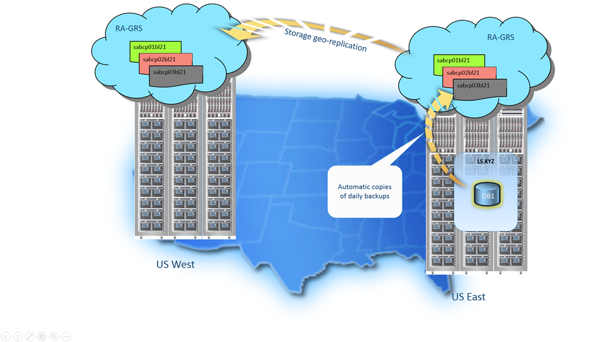

<properties
   pageTitle="Cloud business continuity - Builit-in backup - SQL Database | Microsoft Azure"
   description="Learn about SQL Database builit-in backups that enable you to roll back an Azure SQL Database to a previous point in time or copy a database to a new database in an geographic region (up to 35 days)."
   services="sql-database"
   documentationCenter=""
   authors="carlrabeler"
   manager="jhubbard"
   editor="monicar"/>

<tags
   ms.service="sql-database"
   ms.devlang="NA"
   ms.topic="article"
   ms.tgt_pltfrm="NA"
   ms.workload="sqldb-bcdr"
   ms.date="06/16/2016"
   ms.author="carlrab"/>

# SQL Database automated backups

The Azure SQL Database service protects all databases with an automated backup that is retained for 7 days for Basic, 35 days for Standard, and 35 days for Premium. See [Service-tiers](sql-database-service-tiers.md) for more information features avaiable with each service tier. 

The database backups are taken automatically with no need to opt-in and no additional charges. These automated backups and point-in-time restore provide a zero-cost, zero-admin way to protect databases from accidental corruption or deletion, whatever the cause. You can use these automated backup to perform point-in-time restores and to restore a deleted database after accidental data corruption or deletion.

## Automated backup costs

Microsoft Azure SQL Database provides up to 200% of your maximum provisioned database storage of backup storage at no additional cost. For example, if you have a Standard DB instance with a provisioned DB size of 250 GB, you will be provided with 500 GB of backup storage at no additional charge. If your database exceeds the provided backup storage, you can choose to reduce the retention period by contacting Azure Support or pay for the extra backup storage billed at standard Read-Access Geographically Redundant Storage (RA-GRS) rate. 

## Automatic backup details

All Basic, Standard, and Premium databases are protected by automatic backups. Full database backups are taken every week, differential database backups are taken hourly, and transaction log backups are taken every 5 minutes. The first full backup is scheduled immediately after a database is created. Normally this completes within 30 minutes but it can take longer. If a database is already big, for example if it is created as the result of a database copy or restore from a large database, then the first full backup may take longer to complete. After the first full backup all further backups are scheduled automatically and managed silently in the background. Exact timing of full and differential backups is determined by the system to balance overall load. 

## Geo-redundancy

Backup files are stored in a geo-redundant storage account with read access (RA-GRS) to ensure availability for disaster recovery purposes. The following shows the geo-replication of weekly and daily backups stored in a geo-redundant storage account with read access (RA-GRS) to ensure availability for disaster recovery purposes.

## Using automated backups

You can [restore a database from the service-initiated backups](sql-database-recovery-using-backups.md) during their [retention period](sql-database-service-tiers.md) to:

- A new database on the same logical server recovered to a specified point in time within the retention period. 
- A database on the same logical server recovered to the deletion time for a deleted database.
- A new database on any logical server in any region recovered to the most recent daily backups in geo-replicated blob storage (RA-GRS).

You can also use [SQL Database automated backups](sql-database-automated-backups.md) to create a [database copy](sql-database-copy.md) on any logical server in any region that is transactionally consistent with the current SQL Datbase. You can use database copy and [export to a BACPAC](sql-database-export.md) to archive a transactionally consistent copy of a database for long-term storage beyond your retention period, or to transfer a copy of your database to an on-premises or Azure VM instance of SQL Server.

## What happens to my restore point retention period when I downgrade/upgrade by service tier?

After downgrading to a lower performance tier, the restore point’s retention period is immediately truncated to the retention period of the performance tier of the current database. If the service tier is upgraded, the retention period will begin extending only after the database is upgraded. For example, if a datbase is downgraded from P1 to S3, the retention period will change from 35 days to 35 days immediately, all the restore points prior to 35 days will no longer be available. Subsequently, if it is upgraded to P1 again, the retention period would begin from 35 days and start building up to 35 days.

## How long is the retention period for a dropped DB? 
The retention period is determined by the service tier of the database while it existed or the number of days where the database exists, whichever is less.

> [AZURE.IMPORTANT] If you delete an Azure SQL Database server instance, all of its databases are also deleted and cannot be recovered. There is no support for restoring a deleted server at this time.

## Next steps

- To learn about using automated backups for recovery, see [restore a database from the service-initiated backups](sql-database-recovery-using-backups.md)
- To learn about faster recovery options, see [Active-Geo-Replication](sql-database-geo-replication-overview.md)  
- To learn about using automated backups for archiving, see [database copy](sql-database-copy.md)
- For a business continuity overview, see [Business continuity overview](sql-database-business-continuity.md)
