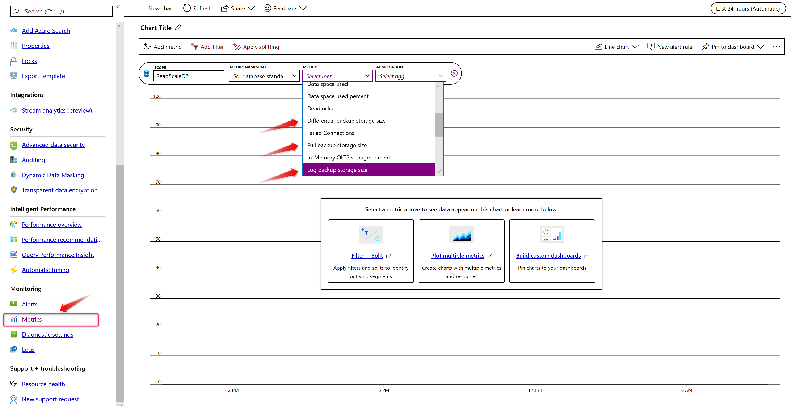
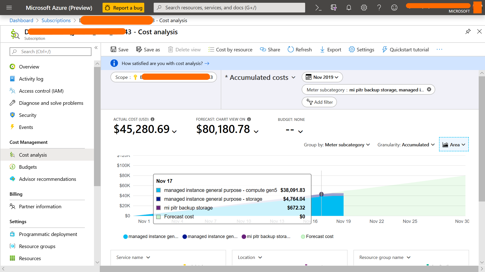
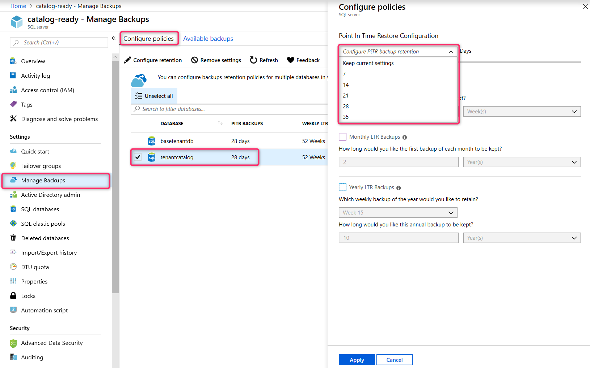
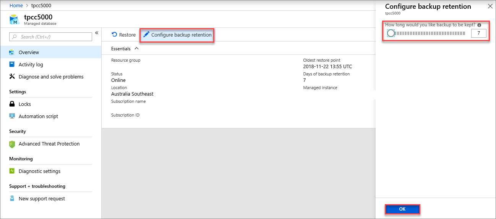

# Automated backups

Azure SQL Database automatically creates the database backups that are kept for the duration of the configured retention period. It uses Azure [read-access geo-redundant storage (RA-GRS)](../storage/common/storage-redundancy.md) to ensure the backups are preserved even if the datacenter is unavailable.

Database backups are an essential part of any business continuity and disaster recovery strategy because they protect your data from accidental corruption or deletion. If your security rules require that your backups are available for an extended time (up to 10 years), you can configure [long-term retention](sql-database-long-term-retention.md) on singleton databases and elastic database pools.

[!INCLUDE [GDPR-related guidance](../../includes/gdpr-intro-sentence.md)]

## What is a SQL Database backup?

SQL Database uses SQL Server technology to create [full backups](https://docs.microsoft.com/sql/relational-databases/backup-restore/full-database-backups-sql-server) every week, [differential backups](https://docs.microsoft.com/sql/relational-databases/backup-restore/differential-backups-sql-server) every 12 hours, and [transaction log backups](https://docs.microsoft.com/sql/relational-databases/backup-restore/transaction-log-backups-sql-server) every 5 to 10 minutes. The backups are stored in [RA-GRS storage blobs](../storage/common/storage-redundancy.md) that are replicated to a [paired datacenter](../best-practices-availability-paired-regions.md) for protection against a datacenter outage. When you restore a database, the service determines which full, differential, and transaction log backups need to be restored.

You can use these backups to:

- **Restore an existing database to a point in time in the past** within the retention period by using the Azure portal, Azure PowerShell, Azure CLI, or the REST API. For single databases and elastic database pools, this operation will create a new database on the same server as the original database. In managed instance, this operation can create a copy of the database or the same or a different managed instance under the same subscription.
- **Restore a deleted database to the time of deletion** or anytime within the retention period. The deleted database can be restored only on the same logical server or managed instance where the original database was created.
- **Restore a database to another geographic region**. Geo-restore allows you to recover from a geographic disaster when you can't access your server and database. It creates a new database on any existing server, anywhere in the world.
- **Restore a database from a specific long-term backup** on a single database or elastic database pool, if the database is configured with a long-term retention policy (LTR). LTR allows you to restore an old version of the database by using [the Azure portal](sql-database-long-term-backup-retention-configure.md#using-azure-portal) or [Azure PowerShell](sql-database-long-term-backup-retention-configure.md#using-powershell) to satisfy a compliance request or to run an old version of the application. For more information, see [Long-term retention](sql-database-long-term-retention.md).

To perform a restore, see [Restore database from backups](sql-database-recovery-using-backups.md).

> [!NOTE]
> In Azure Storage, the term *replication* refers to copying files from one location to another. SQL Server *database replication* refers to keeping multiple secondary databases synchronized with a primary database.

You can try some of these operations by using the following examples:

| | The Azure portal | Azure PowerShell |
|---|---|---|
| Change backup retention | [Single database](sql-database-automated-backups.md?tabs=managed-instance#change-the-pitr-backup-retention-period-by-using-the-azure-portal) <br/> [Managed instance](sql-database-automated-backups.md?tabs=managed-instance#change-the-pitr-backup-retention-period-by-using-the-azure-portal) | [Single database](sql-database-automated-backups.md#change-the-pitr-backup-retention-period-by-using-powershell) <br/>[Managed instance](https://docs.microsoft.com/powershell/module/az.sql/set-azsqlinstancedatabasebackupshorttermretentionpolicy) |
| Change long-term backup retention | [Single database](sql-database-long-term-backup-retention-configure.md#configure-long-term-retention-policies)<br/>Managed instance - N/A  | [Single database](sql-database-long-term-backup-retention-configure.md)<br/>Managed instance - N/A  |
| Restore a database from a point in time | [Single database](sql-database-recovery-using-backups.md#point-in-time-restore) | [Single database](https://docs.microsoft.com/powershell/module/az.sql/restore-azsqldatabase) <br/> [Managed instance](https://docs.microsoft.com/powershell/module/az.sql/restore-azsqlinstancedatabase) |
| Restore a deleted database | [Single database](sql-database-recovery-using-backups.md) | [Single database](https://docs.microsoft.com/powershell/module/az.sql/get-azsqldeleteddatabasebackup) <br/> [Managed instance](https://docs.microsoft.com/powershell/module/az.sql/get-azsqldeletedinstancedatabasebackup)|
| Restore a database from Azure Blob storage | Single database - N/A <br/>Managed instance - N/A  | Single database - N/A <br/>[Managed instance](https://docs.microsoft.com/azure/sql-database/sql-database-managed-instance-get-started-restore) |


## Backup frequency

### Point-in-time restore

SQL Database supports self-service for point-in-time restore (PITR) by automatically creating full backups, differential backups, and transaction log backups. Full database backups are created weekly, and differential database backups are generally created every 12 hours. Transaction log backups are generally created every 5 to 10 minutes. The frequency of transaction log backups is based on the compute size and the amount of database activity. 

The first full backup is scheduled immediately after a database is created. This backup usually completes within 30 minutes, but it can take longer when the database is large. For example, the initial backup can take longer on a restored database or a database copy. After the first full backup, all further backups are scheduled automatically and managed silently in the background. The exact timing of all database backups is determined by the SQL Database service as it balances the overall system workload. You can't change or disable the backup jobs.

PITR backups are protected with geo-redundant storage. For more information, see [Azure Storage redundancy](../storage/common/storage-redundancy.md).

For more information about PITR, see [Point-in-time restore](sql-database-recovery-using-backups.md#point-in-time-restore).

### Long-term retention

For single and pooled databases, you can configure long-term retention (LTR) of full backups for up to 10 years in Azure Blob storage. If you enable LTR policy, the weekly full backups are automatically copied to a different RA-GRS storage container. To meet various compliance requirements, you can select different retention periods for weekly, monthly, and/or yearly backups. The storage consumption depends on the selected frequency of backups and the retention period or periods. You can use the [LTR pricing calculator](https://azure.microsoft.com/pricing/calculator/?service=sql-database) to estimate the cost of LTR storage.

Like PITR backups, LTR backups are protected with geo-redundant storage. For more information, see [Azure Storage redundancy](../storage/common/storage-redundancy.md).

For more information about LTR, see [Long-term backup retention](sql-database-long-term-retention.md).

## Backup storage consumption

For single databases, this equation is used to calculate the total backup storage usage:

`Total backup storage size = (size of full backups + size of differential backups + size of log backups) – database size`

For elastic database pools, the total backup storage size is aggregated at the pool level and is calculated as follows:

`Total backup storage size = (total size of all full backups + total size of all differential backups + total size of all log backups) - allocated pool data storage`

Backups that occur before the retention period are automatically purged based on their timestamp. Because differential backups and log backups require an earlier full backup to be useful, they're purged together in weekly chunks.

Azure SQL Database computes your total in-retention backup storage as a cumulative value. Every hour, this value is reported to the Azure billing pipeline, which is responsible for aggregating this hourly usage to calculate your consumption at the end of each month. After the database is dropped, consumption decreases as backups age. After backups become older than the retention period, billing stops.

   > [!IMPORTANT]
   > Backups of a database are retained for the specified retention period, even if the database has been dropped. While dropping and re-creating a database can frequently save on storage and compute costs, it might increase backup storage costs because Microsoft retains a backup for the specified retention period (which is 7 days at minimum) for each dropped database, every time it's dropped.

### Monitor consumption

Each type of backup (full, differential, and log) is reported on the database monitoring blade as a separate metric. The following diagram shows how to monitor the backup storage consumption for a single database. This feature is currently unavailable for managed instances.



### Fine-tune backup storage consumption

Excess backup storage consumption will depend on the workload and the size of the individual databases. Consider some of the following tuning techniques to reduce your backup storage consumption:

* Reduce the [backup retention period](#change-the-pitr-backup-retention-period-by-using-the-azure-portal) to the minimum possible for your needs.
* Avoid doing large write operations, like index rebuilds, more frequently than you need to.
* For large data load operations, consider using [clustered columnstore indexes](https://docs.microsoft.com/sql/database-engine/using-clustered-columnstore-indexes), reduce the number of non-clustered indexes, and consider bulk load operations with row count around 1 million.
* In the general purpose service tier, the provisioned data storage is less expensive than the price of the excess backup storage. If you have continually high excess backup storage costs, you might consider increasing the data storage to save on the backup storage.
* Use TempDB instead of permanent tables in your ETL logic for storing temporary results. (Applicable only to managed instance.)
* Consider turning off TDE encryption for databases that don't contain sensitive data (development or test databases, for example). Backups for non-encrypted databases are typically compressed with a higher compression ratio.

> [!IMPORTANT]
> For analytical data mart \ data warehouse workloads, we strongly recommend that you use [clustered columnstore indexes](https://docs.microsoft.com/sql/database-engine/using-clustered-columnstore-indexes), reduce the number of non-clustered indexes, and consider bulk load operations with row count around 1 million to reduce excess backup storage consumption.

## Storage costs

The price for storage varies depending on whether you're using the DTU model or the vCore model.

### DTU model

There's no additional charge for backup storage for databases and elastic database pools if you're using the DTU model.

### vCore model

For single databases, a minimum backup storage amount equal to 100 percent of the database size is provided at no extra charge. For elastic database pools and managed instances, a minimum backup storage amount equal to 100 percent of the allocated data storage for the pool or instance size, respectively, is provided at no extra charge. Additional consumption of backup storage will be charged in GB/month. This additional consumption will depend on the workload and size of the individual databases.

Azure SQL Database will compute your total in-retention backup storage as a cumulative value. Every hour, this value is reported to the Azure billing pipeline, which is responsible for aggregating this hourly usage to get your consumption at the end of each month. After the database is dropped, Microsoft decreases the consumption as the backups age. After backups become older than the retention period, billing stops. Because all log backups and differential backups are retained for the full retention period, heavily modified databases will have higher backup charges.

Assume a database has accumulated 744 GB of backup storage and that this amount stays constant throughout an entire month. To convert this cumulative storage consumption to hourly usage, divide it by 744.0 (31 days per month * 24 hours per day). So SQL Database will report that the database consumed 1 GB of PITR backup each hour. Azure billing will aggregate this consumption and show a usage of 744 GB for the entire month. The cost will be based on the $/GB/month rate in your region.

Now, a more complex example. Suppose the database has its retention increased to 14 days in the middle of the month. Assume this increase (hypothetically) results in the total backup storage doubling to 1,488 GB. SQL Database would report 1 GB of usage for hours 1 through 372. It would report the usage as 2 GB for hours 373 through 744. This usage would be aggregated to a final bill of 1,116 GB/month.

### Monitor costs

To understand backup storage costs, go to **Cost Management + Billing** in the Azure portal, select **Cost Management**, and then select **Cost analysis**. Select the desired subscription as the **Scope**, and then filter for the time period and service that you're interested in.

Add a filter for **Service name**, and then select **sql database** in the drop-down list. Use the **meter subcategory** filter to choose the billing counter for your service. For a single database or an elastic database pool, select **single/elastic pool pitr backup storage**. For a managed instance, select **mi pitr backup storage**. The **Storage** and **compute** subcategories might interest you as well, but they're not associated with backup storage costs.



## Backup retention

All Azure SQL databases (single, pooled, and managed instance databases) have a default backup retention period of 7 days. You can [change the backup retention period](#change-the-pitr-backup-retention-period) to as long as 35 days.

If you delete a database, SQL Database will keep the backups in the same way it would for an online database. For example, if you delete a Basic database that has a retention period of seven days, a backup that's four days old is saved for three more days.

If you need to keep the backups for longer than the maximum retention period, you can modify the backup properties to add one or more long-term retention periods to your database. For more information, see [Long-term retention](sql-database-long-term-retention.md).

> [!IMPORTANT]
> If you delete the Azure SQL server that hosts SQL databases, all elastic database pools and databases that belong to the server are also deleted. They can't be recovered. You can't restore a deleted server. But if you configured long-term retention, the backups for the databases with LTR won't be deleted, and these databases can be restored.

## Encrypted backups

If your database is encrypted with TDE, backups are automatically encrypted at rest, including LTR backups. When TDE is enabled for an Azure SQL database, backups are also encrypted. All new Azure SQL databases are configured with TDE enabled by default. For more information on TDE, see  [Transparent Data Encryption with Azure SQL Database](/sql/relational-databases/security/encryption/transparent-data-encryption-azure-sql).

## Backup integrity

On an ongoing basis, the Azure SQL Database engineering team automatically tests the restore of automated database backups of databases placed in logical servers and elastic database pools. (This testing isn't available in managed instance.) Upon point-in-time restore, databases also receive DBCC CHECKDB integrity checks.

Managed instance takes automatic initial backup with `CHECKSUM` of databases restored with the native `RESTORE` command or with Azure Data Migration Service after the migration is completed.

Any issues found during the integrity check will result in an alert to the engineering team. For more information, see [Data Integrity in Azure SQL Database](https://azure.microsoft.com/blog/data-integrity-in-azure-sql-database/).

## Compliance

When you migrate your database from a DTU-based service tier to a vCore-based service tier, the PITR retention is preserved to ensure that your application's data recovery policy isn't compromised. If the default retention doesn't meet your compliance requirements, you can change the PITR retention period by using PowerShell or the REST API. For more information, see [Change the PITR backup retention period](#change-the-pitr-backup-retention-period).

[!INCLUDE [GDPR-related guidance](../../includes/gdpr-intro-sentence.md)]

## Change the PITR backup retention period

You can change the default PITR backup retention period by using the Azure portal, PowerShell, or the REST API. The following examples illustrate how to change the PITR retention to 28 days.

> [!WARNING]
> If you reduce the current retention period, all existing backups that are older than the new retention period are no longer available. If you increase the current retention period, SQL Database will keep the existing backups until the end of the longer retention period is reached.

> [!NOTE]
> These APIs will affect only the PITR retention period. If you configured LTR for your database, it won't be affected. For information about how to change LTR retention periods, see [Long-term retention](sql-database-long-term-retention.md).

### Change the PITR backup retention period by using the Azure portal

To change the PITR backup retention period by using the Azure portal, go to the server object whose retention period you want to change in the portal. Then select the appropriate option based on the server object you're modifying.

#### [Single database and elastic database pools](#tab/single-database)

Changes to PITR backup retention for single Azure SQL databases are done at the server level. Changes made at the server level apply to databases on the server. To change PITR retention for an Azure SQL Database server from the Azure portal, go to the server overview blade. Select **Manage Backups** in the left pane, and then select **Configure retention** at the top of the screen:



#### [Managed instance](#tab/managed-instance)

Changes to PITR backup retention for SQL Database managed instances are done at an individual database level. To change PITR backup retention for an instance database from the Azure portal, go to the individual database overview blade. Then select **Configure backup retention** at the top of the screen:



---

### Change the PITR backup retention period by using PowerShell

[!INCLUDE [updated-for-az](../../includes/updated-for-az.md)]
> [!IMPORTANT]
> The PowerShell AzureRM module is still supported by Azure SQL Database, but all future development is for the Az.Sql module. For more information, see [AzureRM.Sql](https://docs.microsoft.com/powershell/module/AzureRM.Sql/). The arguments for the commands in the Az module are substantially identical to those in the AzureRm modules.

```powershell
Set-AzSqlDatabaseBackupShortTermRetentionPolicy -ResourceGroupName resourceGroup -ServerName testserver -DatabaseName testDatabase -RetentionDays 28
```

### Change the PITR backup retention period by using the REST API

#### Sample request

```http
PUT https://management.azure.com/subscriptions/00000000-1111-2222-3333-444444444444/resourceGroups/resourceGroup/providers/Microsoft.Sql/servers/testserver/databases/testDatabase/backupShortTermRetentionPolicies/default?api-version=2017-10-01-preview
```

#### Request body

```json
{
  "properties":{
    "retentionDays":28
  }
}
```

#### Sample response

Status code: 200

```json
{
  "id": "/subscriptions/00000000-1111-2222-3333-444444444444/providers/Microsoft.Sql/resourceGroups/resourceGroup/servers/testserver/databases/testDatabase/backupShortTermRetentionPolicies/default",
  "name": "default",
  "type": "Microsoft.Sql/resourceGroups/servers/databases/backupShortTermRetentionPolicies",
  "properties": {
    "retentionDays": 28
  }
}
```

For more information, see [Backup Retention REST API](https://docs.microsoft.com/rest/api/sql/backupshorttermretentionpolicies).

## Next steps

- Database backups are an essential part of any business continuity and disaster recovery strategy because they protect your data from accidental corruption or deletion. To learn about the other Azure SQL Database business continuity solutions, see [Business continuity overview](sql-database-business-continuity.md).
- Get more information about how to [restore a database to a point in time by using the Azure portal](sql-database-recovery-using-backups.md).
- Get more information about how to [restore a database to a point in time by using PowerShell](scripts/sql-database-restore-database-powershell.md).
- For information about how to configure, manage, and restore from long-term retention of automated backups in Azure Blob storage by using the Azure portal, see [Manage long-term backup retention by using the Azure portal](sql-database-long-term-backup-retention-configure.md).
- For information about how to configure, manage, and restore from long-term retention of automated backups in Azure Blob storage by using PowerShell, see [Manage long-term backup retention by using PowerShell](sql-database-long-term-backup-retention-configure.md).
