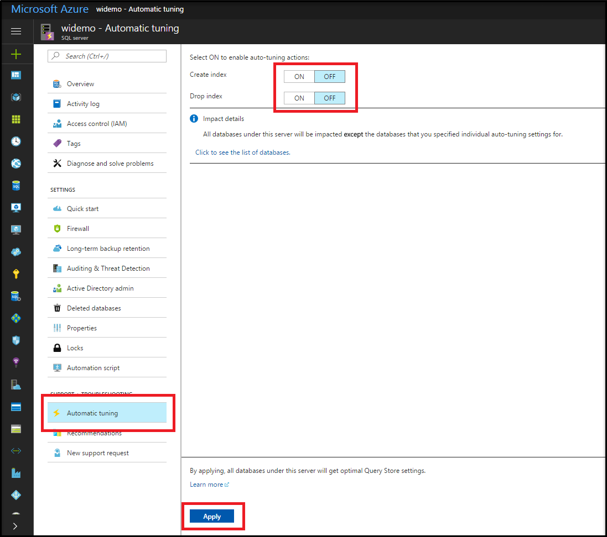
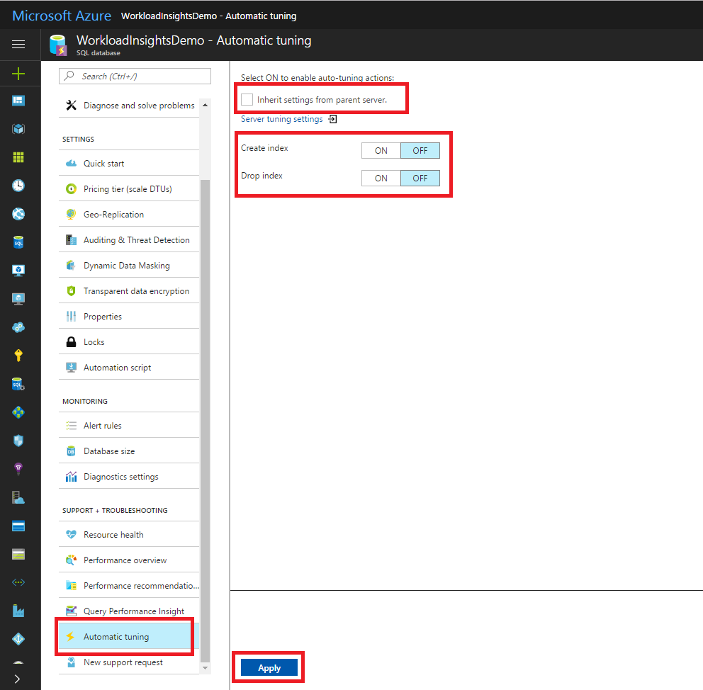

# Enable automatic tuning to monitor queries and improve workload performance

Azure SQL Database is an automatically managed data service that constantly monitors your queries and identifies the action that you can perform to improve performance of your workload. You can review recommendations and manually apply them, or let Azure SQL Database automatically apply corrective actions - this is known as **automatic tuning mode**.

Automatic tuning can be enabled at the server or the database level through the [Azure portal](sql-database-automatic-tuning-enable.md#azure-portal), [REST API](sql-database-automatic-tuning-enable.md#rest-api) calls and [T-SQL](https://docs.microsoft.com/sql/t-sql/statements/alter-database-transact-sql-set-options?view=azuresqldb-current) commands.

> [!NOTE]
> For Managed Instance, the supported option FORCE_LAST_GOOD_PLAN can be configured through [T-SQL](https://azure.microsoft.com/blog/automatic-tuning-introduces-automatic-plan-correction-and-t-sql-management) only. Portal based configuration and automatic index tuning options described in this article do not apply to Managed Instance.

> [!NOTE]
> Configuring Automatic tuning options through ARM (Azure Resource Manager) template is not supported at this time.

## Enable automatic tuning on server

On the server level you can choose to inherit automatic tuning configuration from "Azure Defaults" or not to inherit the configuration. Azure defaults are FORCE_LAST_GOOD_PLAN is enabled, CREATE_INDEX is enabled, and DROP_INDEX is disabled.

### Azure portal

To enable automatic tuning on Azure SQL Database logical **server**, navigate to the server in Azure portal and then select **Automatic tuning** in the menu.



> [!NOTE]
> Please note that **DROP_INDEX** option at this time is not compatible with applications using partition switching and index hints and should not be enabled in these cases.
>

Select the automatic tuning options you want to enable and select **Apply**.

Automatic tuning options on a server are applied to all databases on this server. By default, all databases inherit configuration from their parent server, but this can be overridden and specified for each database individually.

### REST API

Find out more about using REST API to enable Automatic tuning on a server, see [SQL Server Automatic tuning UPDATE and GET HTTP methods](https://docs.microsoft.com/rest/api/sql/serverautomatictuning).

## Enable automatic tuning on an individual database

The Azure SQL Database enables you to individually specify the automatic tuning configuration for each database. On the database level you can choose to inherit automatic tuning configuration from the parent server, "Azure Defaults" or not to inherit the configuration. Azure Defaults are set to FORCE_LAST_GOOD_PLAN is enabled, CREATE_INDEX is enabled, and DROP_INDEX is disabled.

> [!TIP]
> The general recommendation is to manage the automatic tuning configuration at **server level** so the same configuration settings can be applied on every database automatically. Configure automatic tuning on an individual database only if you need that database to have different settings than others inheriting settings from the same server.
>

### Azure portal

To enable automatic tuning on a **single database**, navigate to the database in Azure portal and select **Automatic tuning**.

Individual automatic tuning settings can be separately configured for each database. You can manually configure an individual automatic tuning option, or specify that an option inherits its settings from the server.



Please note that DROP_INDEX option at this time is not compatible with applications using partition switching and index hints and should not be enabled in these cases.

Once you have selected your desired configuration, click **Apply**.

### Rest API

Find out more about using REST API to enable Automatic tuning on a single database, see [SQL Database Automatic tuning UPDATE and GET HTTP methods](https://docs.microsoft.com/rest/api/sql/databaseautomatictuning).

### T-SQL

To enable automatic tuning on a single database via T-SQL, connect to the database and execute the following query:

```SQL
ALTER DATABASE current SET AUTOMATIC_TUNING = AUTO | INHERIT | CUSTOM
```

Setting automatic tuning to AUTO will apply Azure Defaults. Setting it to INHERIT, automatic tuning configuration will be inherited from the parent server. Choosing CUSTOM, you will need to manually configure automatic tuning.

To configure individual automatic tuning options via T-SQL, connect to the database and execute the query such as this one:

```SQL
ALTER DATABASE current SET AUTOMATIC_TUNING (FORCE_LAST_GOOD_PLAN = ON, CREATE_INDEX = DEFAULT, DROP_INDEX = OFF)
```

Setting the individual tuning option to ON, will override any setting that database inherited and enable the tuning option. Setting it to OFF, will also override any setting that database inherited and disable the tuning option. Automatic tuning option, for which DEFAULT is specified, will inherit the configuration from the database level automatic tuning setting.  

> [!IMPORTANT]
> In case of [active geo-replication](sql-database-auto-failover-group.md), Automatic tuning needs to be configured on the primary database only. Automatically applied tuning actions, such are for example index create or delete will be automatically replicated to the read-only secondary. Attempting to enable Automatic tuning via T-SQL on the read-only secondary will result in a failure as having a different tuning configuration on the read-only secondary is unsupported.
>

Find our more abut T-SQL options to configure Automatic tuning, see [ALTER DATABASE SET Options (Transact-SQL) for SQL Database server](https://docs.microsoft.com/sql/t-sql/statements/alter-database-transact-sql-set-options?view=azuresqldb-current).

## Disabled by the system

Automatic tuning is monitoring all the actions it takes on the database and in some cases it can determine that automatic tuning can't properly work on the database. In this situation, tuning option will be disabled by the system. In most cases this happens because Query Store is not enabled or it's in read-only state on a specific database.

## Configure automatic tuning e-mail notifications

See [Automatic tuning e-mail notifications](sql-database-automatic-tuning-email-notifications.md) guide.

## Next steps

* Read the [Automatic tuning article](sql-database-automatic-tuning.md) to learn more about automatic tuning and how it can help you improve your performance.
* See [Performance recommendations](sql-database-advisor.md) for an overview of Azure SQL Database performance recommendations.
* See [Query Performance Insights](sql-database-query-performance.md) to learn about viewing the performance impact of your top queries.
