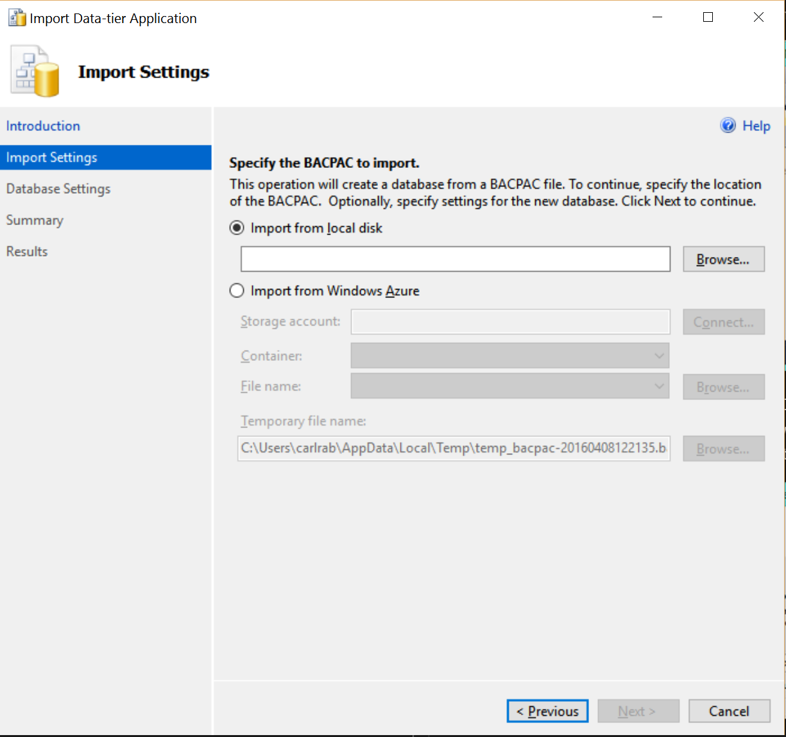
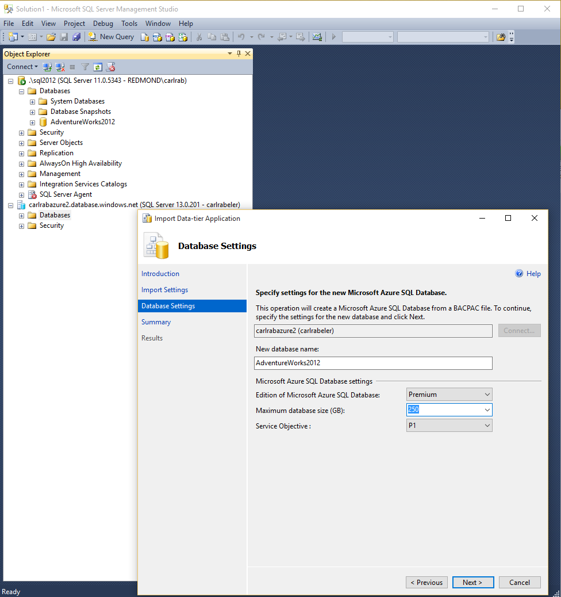

<properties
   pageTitle="Migrating a SQL Server database to Azure SQL Database | Microsoft Azure"
   description="Microsoft Azure SQL Database, database deploy, database migration, import database, export database, migration wizard"
   services="sql-database"
   documentationCenter=""
   authors="CarlRabeler"
   manager="jhubbard"
   editor=""/>

<tags
   ms.service="sql-database"
   ms.devlang="NA"
   ms.topic="article"
   ms.tgt_pltfrm="NA"
   ms.workload="sqldb-migrate"
   ms.date="06/07/2016"
   ms.author="carlrab"/>

# Import from BACPAC to SQL Database using SSMS

> [AZURE.SELECTOR]
- [SSMS](sql-database-cloud-migrate-compatible-import-bacpac-ssms.md)
- [SqlPackage](sql-database-cloud-migrate-compatible-import-bacpac-sqlpackage.md)
- [Azure Portal](sql-database-import.md)
- [PowerShell](sql-database-import-powershell.md)

This article shows how to import from a [BACPAC](https://msdn.microsoft.com/library/ee210546.aspx#Anchor_4) file to SQL Database using the Export Data Tier Application Wizard in SQL Server Management Studio.

> [AZURE.NOTE] The steps below assume that you have already provisioned your Azure SQL logical instance and have the connection information on hand.

1. Verify that you have the latest version of SQL Server Management Studio. New versions of Management Studio are updated monthly to remain in sync with updates to the Azure portal.

	 > [AZURE.IMPORTANT] It is recommended that you always use the latest version of Management Studio to remain synchronized with updates to Microsoft Azure and SQL Database. [Update SQL Server Management Studio](https://msdn.microsoft.com/library/mt238290.aspx).

2. Connect to your Azure SQL Database server, right-click the **Databases** folder and click **Import Data-tier Application...**

    

3.	In the import wizard, import your BACPAC file from your local disk or select the Azure storage account and container to which you uploaded your BACPAC file to create the new database in Azure SQL Database.

    

    ***Important:*** When importing a BACPAC from Azure blob storage, use standard storage. Importing a BACPAC from premium storage is not supported.

4.	Provide the **New database name** for the database on Azure SQL DB, set the **Edition of Microsoft Azure SQL Database** (service tier), **Maximum database size** and **Service Objective** (performance level).

    

5.	Click **Next** and then click **Finish** to import the BACPAC file into a new database in the Azure SQL Database server.

6. Using Object Explorer, connect to your migrated database in your Azure SQL Database server.

6.	Using the Azure Portal, view your database and its properties.

## Next steps

- [Newest version of SSDT](https://msdn.microsoft.com/library/mt204009.aspx)
- [Newest version of SQL Server Management Studio](https://msdn.microsoft.com/library/mt238290.aspx)

## Additional resources

- [SQL Database V12](sql-database-v12-whats-new.md)
- [Transact-SQL partially or unsupported functions](sql-database-transact-sql-information.md)
- [Migrate non-SQL Server databases using SQL Server Migration Assistant](http://blogs.msdn.com/b/ssma/)
