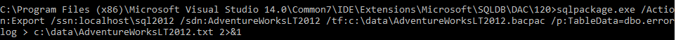
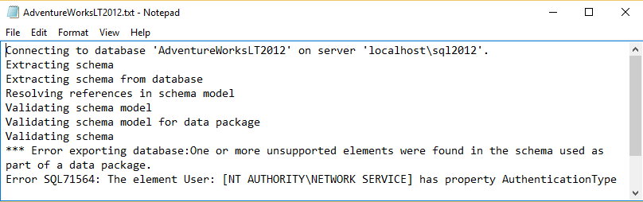

<properties
   pageTitle="Determine SQL Database compatibility using SqlPackage.exe | Microsoft Azure"
   description="Microsoft Azure SQL Database, database migration, SQL Database compatibility, SqlPackage"
   services="sql-database"
   documentationCenter=""
   authors="CarlRabeler"
   manager="jhubbard"
   editor=""/>

<tags
   ms.service="sql-database"
   ms.devlang="NA"
   ms.topic="article"
   ms.tgt_pltfrm="NA"
   ms.workload="sqldb-migrate"
   ms.date="06/07/2016"
   ms.author="carlrab"/>

# Determine SQL Database compatibility using SqlPackage.exe

> [AZURE.SELECTOR]
- [SSDT](sql-database-cloud-migrate-fix-compatibility-issues-ssdt.md)
- [SqlPackage](sql-database-cloud-migrate-determine-compatibility-sqlpackage.md)
- [SSMS](sql-database-cloud-migrate-determine-compatibility-ssms.md)
- [Upgrade Advisor](http://www.microsoft.com/download/details.aspx?id=48119)
- [SAMW](sql-database-cloud-migrate-fix-compatibility-issues.md)

In this article you learn to determine if a SQL Server database is compatible to migrate to SQL Database using the [SqlPackage](https://msdn.microsoft.com/library/hh550080.aspx) command-prompt utility.

## Using SqlPackage.exe

1. Open a command prompt and change a directory containing the newest version of sqlpackage.exe. This utility ships with both Visual Studio and SQL Server. Download the [newest version of SQL Server Data Tools for Visual Studio](https://msdn.microsoft.com/library/mt204009.aspx) to get the latest version of the SqlPackage utility.
2. Execute the following SqlPackage command with the following arguments for your environment:

	'sqlpackage.exe /Action:Export /ssn:< server_name > /sdn:< database_name > /tf:< target_file > /p:TableData=< schema_name.table_name > > < output_file > 2>&1'

	| Argument  | Description  |
	|---|---|
	| < server_name >  | source server name  |
	| < database_name >  | source database name  |
	| < target_file >  | file name and location for BACPAC file  |
	| < schema_name.table_name >  | the tables for which data will be output to the target file  |
	| < output_file >  | the file name and location for the output file with errors, if any  |

	The reason for the /p:TableName argument is that we only want to test for database compability for export to Azure SQL DB V12 rather than export the data from all tables. Unfortunately, the export argument for sqlpackage.exe does not support extracting no tables, so you will need to specify a single small table. The < output_file > will contain the report of any errors. The "> 2>&1" string pipes both the standard output and the standard error resulting from the command execution to specified output file.

	

3. Open the output file and review the compatibility errors, if any. 

	

## Next steps

- [Newest version of SSDT](https://msdn.microsoft.com/library/mt204009.aspx)
[Newest version of SQL Server Management Studio](https://msdn.microsoft.com/library/mt238290.aspx)
- [Fix database migration compatibility issues](sql-database-cloud-migrate.md#fix-database-migration-compatibility-issues)
- [Migrate a compatible SQL Server database to SQL Database](sql-database-cloud-migrate.md#migrate-a-compatible-sql-server-database-to-sql-database)

## Additional resources

- [SQL Database V12](sql-database-v12-whats-new.md)
- [Transact-SQL partially or unsupported functions](sql-database-transact-sql-information.md)
- [Migrate non-SQL Server databases using SQL Server Migration Assistant](http://blogs.msdn.com/b/ssma/)
