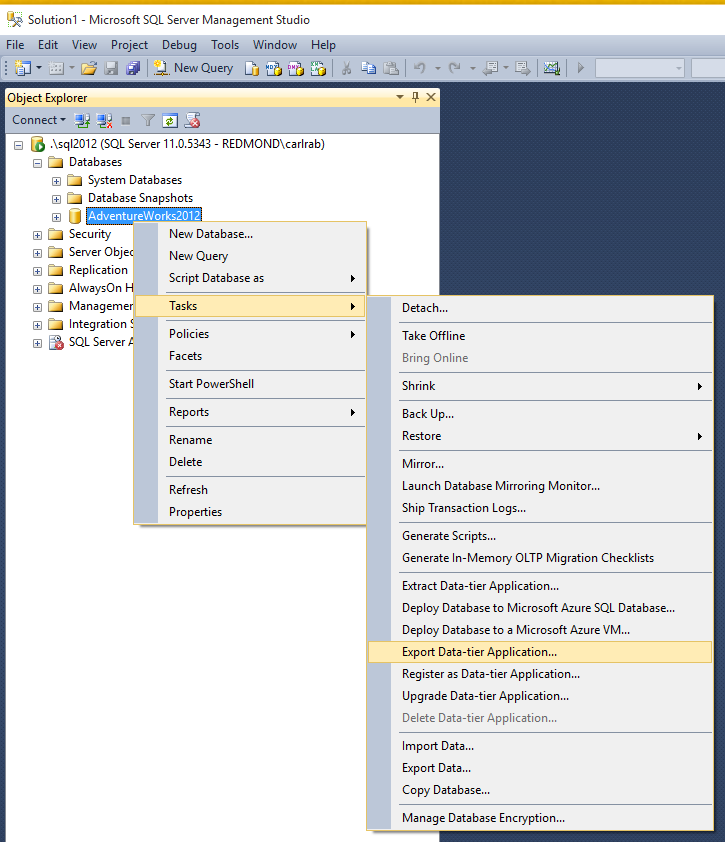
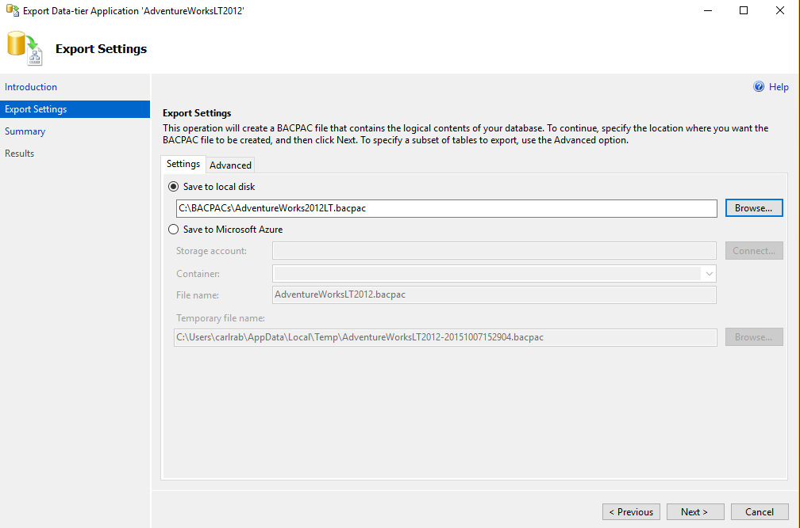
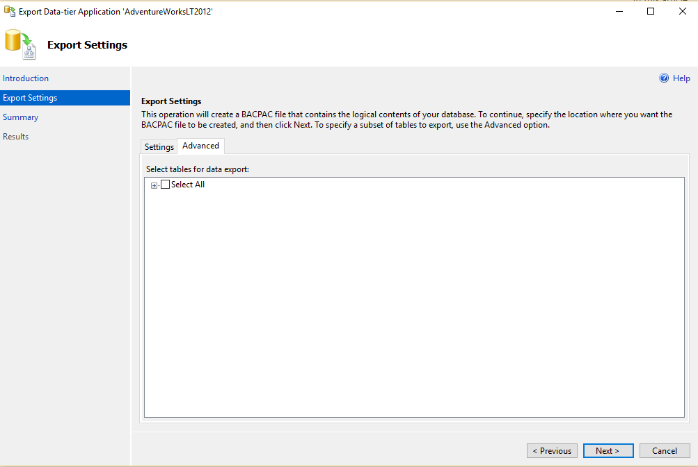
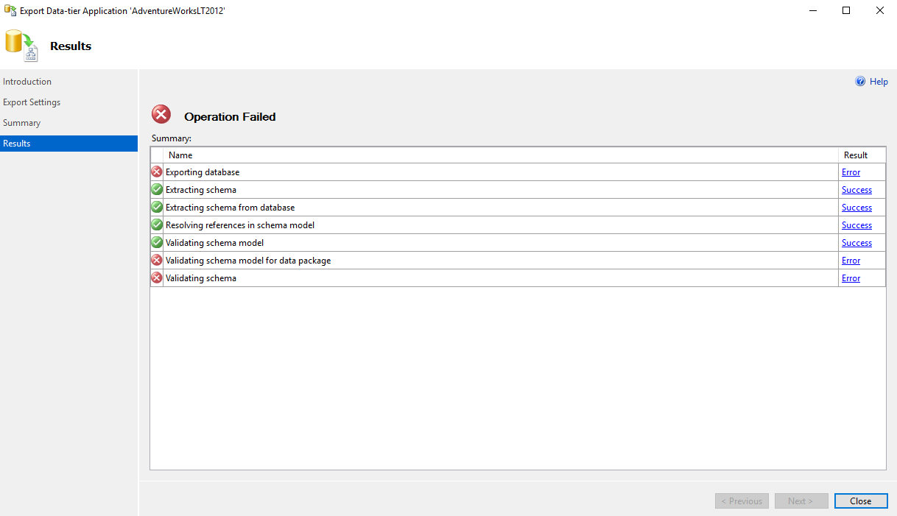
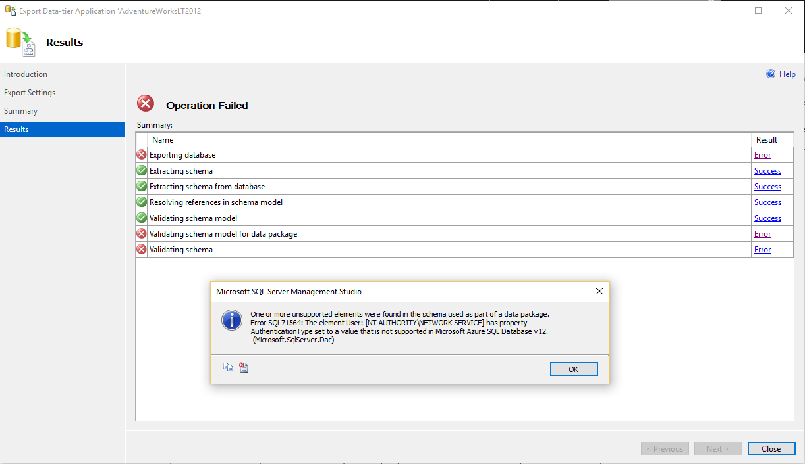

<properties
   pageTitle="Use SQL Server Management Studio to Determine SQL Database compatibility before migration to Azure SQL Database | Microsoft Azure"
   description="Microsoft Azure SQL Database, database migration, SQL Database compatibility, Export Data Tier Application Wizard"
   services="sql-database"
   documentationCenter=""
   authors="CarlRabeler"
   manager="jhubbard"
   editor=""/>

<tags
   ms.service="sql-database"
   ms.devlang="NA"
   ms.topic="article"
   ms.tgt_pltfrm="NA"
   ms.workload="sqldb-migrate"
   ms.date="06/07/2016"
   ms.author="carlrab"/>

# Use SQL Server Management Studio to Determine SQL Database compatibility before migration to Azure SQL Database

> [AZURE.SELECTOR]
- [SSDT](sql-database-cloud-migrate-fix-compatibility-issues-ssdt.md)
- [SqlPackage](sql-database-cloud-migrate-determine-compatibility-sqlpackage.md)
- [SSMS](sql-database-cloud-migrate-determine-compatibility-ssms.md)
- [Upgrade Advisor](http://www.microsoft.com/download/details.aspx?id=48119)
- [SAMW](sql-database-cloud-migrate-fix-compatibility-issues.md)
 
In this article you learn to determine if a SQL Server database is compatible to migrate to SQL Database using the Export Data Tier Application Wizard in SQL Server Management Studio.

## Using SQL Server Management Studio

1. Verify that you have the latest version of SQL Server Management Studio. New versions of Management Studio are updated monthly to remain in sync with updates to the Azure portal.

 	 > [AZURE.IMPORTANT] It is recommended that you always use the latest version of Management Studio to remain synchronized with updates to Microsoft Azure and SQL Database. [Update SQL Server Management Studio](https://msdn.microsoft.com/library/mt238290.aspx).

2. Open Management Studio and connect to your source database in Object Explorer.
3. Right-click the source database in the Object Explorer, point to **Tasks**, and click **Export Data-Tier Application…**

	

4. In the export wizard, click **Next**, and then on the **Settings** tab, configure the export to save the BACPAC file to either a local disk location or to an Azure blob. A BACPAC file will only be saved if you have no database compatibility issues. If there are compatibility issues, they will be displayed on the console.

	

5. Click the **Advanced tab** and clear the **Select All** checkbox to skip exporting data. Our goal at this point is only to test for compatibility.

	

6. Click **Next** and then click **Finish**. Database compatibility issues, if any, will appear after the wizard validates the schema.

	

7. If no errors appear, your database is compatible and you are ready to migrate. If you have errors, you will need to fix them. To see the errors, click **Error** for **Validating schema**. 
	

8.	If the *.BACPAC file is successfully generated, then your database is compatible with SQL Database, and you are ready to migrate.

## Next steps

- [Newest version of SSDT](https://msdn.microsoft.com/library/mt204009.aspx)
- [Newest version of SQL Server Management Studio](https://msdn.microsoft.com/library/mt238290.aspx)
- [Fix database migration compatibility issues](sql-database-cloud-migrate.md#fix-database-migration-compatibility-issues)
- [Migrate a compatible SQL Server database to SQL Database](sql-database-cloud-migrate.md#migrate-a-compatible-sql-server-database-to-sql-database)

## Additional resources

- [SQL Database V12](sql-database-v12-whats-new.md)
- [Transact-SQL partially or unsupported functions](sql-database-transact-sql-information.md)
- [Migrate non-SQL Server databases using SQL Server Migration Assistant](http://blogs.msdn.com/b/ssma/)
