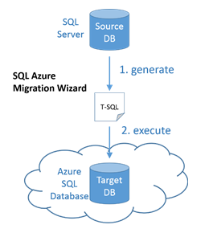

<properties
   pageTitle="Fix SQL Server database compatibility issues before migration to SQL Database | Microsoft Azure"
   description="Microsoft Azure SQL Database, database migration, compatibility, SQL Azure Migration Wizard"
   services="sql-database"
   documentationCenter=""
   authors="CarlRabeler"
   manager="jhubbard"
   editor=""/>

<tags
   ms.service="sql-database"
   ms.devlang="NA"
   ms.topic="article"
   ms.tgt_pltfrm="NA"
   ms.workload="sqldb-migrate"
   ms.date="06/07/2016"
   ms.author="carlrab"/>

# Use SQL Azure Migration Wizard to Fix SQL Server database compatibility issues before migration to Azure SQL Database

> [AZURE.SELECTOR]
- Use [SQL Azure Migration Wizard](sql-database-cloud-migrate-fix-compatibility-issues.md)
- Use [SSDT](sql-database-cloud-migrate-fix-compatibility-issues-ssdt.md)
- Use [SSMS](sql-database-cloud-migrate-fix-compatibility-issues-ssms.md)

In this article, you learn to detect and fix SQL Server database compatibility issues using the SQL Azure Migration Wizard before migration to Azure SQL Database.

## Using SQL Azure Migration wizard

Use the [SQL Azure Migration wizard](http://sqlazuremw.codeplex.com/) CodePlex tool to generate a T-SQL script from an incompatible source database that is then transformed by the wizard to make it compatible with the SQL Database and then connect to Azure SQL Database to execute the script. This tool will also analyze trace files to determine compatiblity issues. The script can be generated with schema only or can include data in BCP format. Additional documentation, including step-by-step guidance is available on CodePlex at [SQL Azure Migration wizard](http://sqlazuremw.codeplex.com/).  

 

  > [AZURE.NOTE] Note that not all incompatible schema that can be detected by the wizard can be fixed by its built-in transformations. Incompatible script that cannot be addressed will be reported as errors, with comments injected into the generated script. If many errors are detected, use either Visual Studio or SQL Server Management Studio to step through and fix each error that could not be fixed using the SQL Server Migration Wizard.

## Next steps

- [Newest version of SSDT](https://msdn.microsoft.com/library/mt204009.aspx)
- [Newest version of SQL Server Management Studio](https://msdn.microsoft.com/library/mt238290.aspx)
- [Migrate a compatible SQL Server database to SQL Database](sql-database-cloud-migrate.md#migrate-a-compatible-sql-server-database-to-sql-database)

## Additional resources

- [SQL Database V12](sql-database-v12-whats-new.md)
- [Transact-SQL partially or unsupported functions](sql-database-transact-sql-information.md)
- [Migrate non-SQL Server databases using SQL Server Migration Assistant](http://blogs.msdn.com/b/ssma/)
