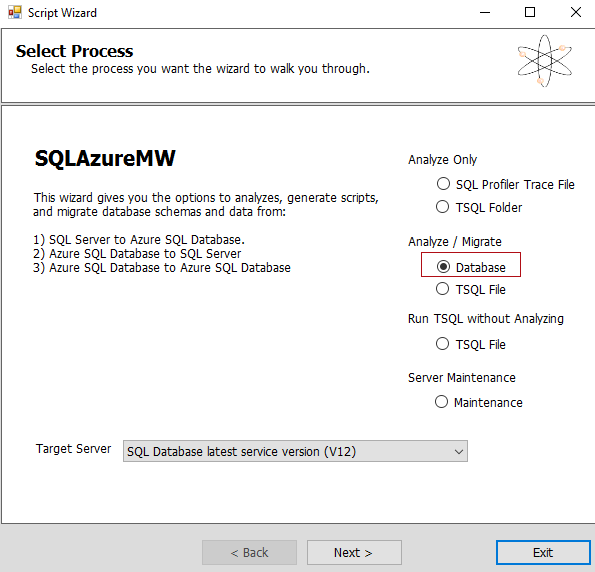
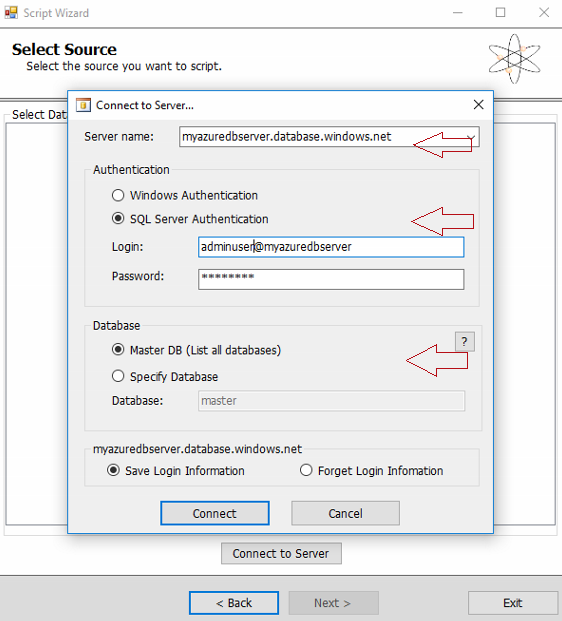
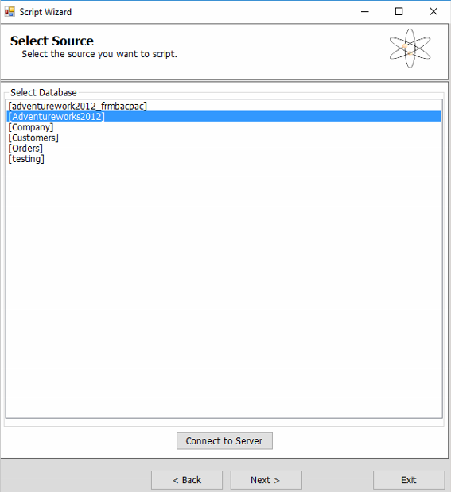
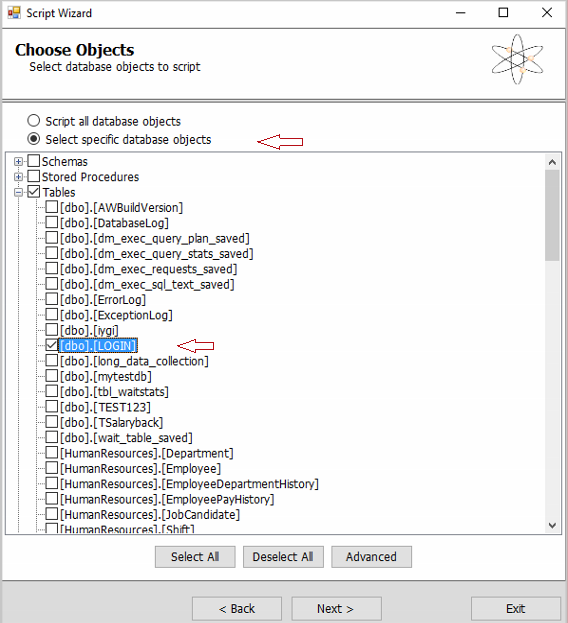
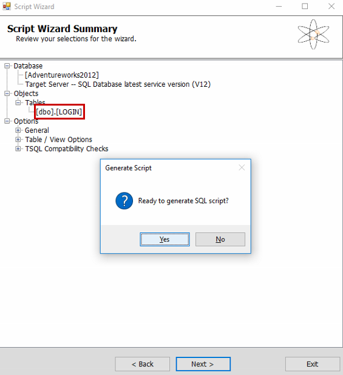
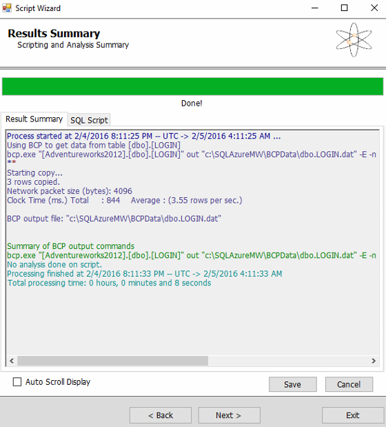
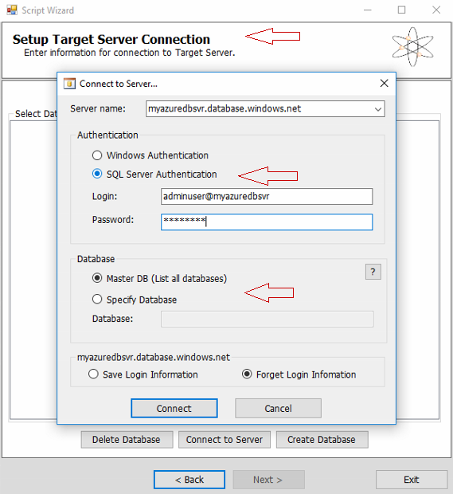

<properties
	pageTitle="Restore a single table from Azure SQL Database backup | Microsoft Azure"
	description="Learn how to restore a single table from Azure SQL Database backup."
	services="sql-database"
	documentationCenter=""
	authors="dalechen"
	manager="felixwu"
	editor=""/>

<tags
	ms.service="sql-database"
	ms.workload="data-management"
	ms.tgt_pltfrm="na"
	ms.devlang="na"
	ms.topic="article"
	ms.date="06/02/2016"
	ms.author="daleche"/>

# How to restore a single table from an Azure SQL Database backup

You may encounter a situation in which you accidentally modified some data in a SQL database and now you want to recover the single affected table. This article describes how to restore a single table in a database from one of the [backups that are automatically](sql-database-automated-backups.md) that are performed by Azure SQL Database, based on your selected performance tier.

## Preparation steps: Rename the table and restore a copy of the database
1. Identify the table in your Azure SQL database that you want to replace with the restored copy. Use Microsoft SQL Management Studio to rename the table. For example, rename the table as &lt;table name&gt;_old.

	**Note** To avoid being blocked, make sure that there's no activity running on the table that you are renaming. If you encounter issues, make sure that perform this procedure during a maintenance window.

2. Restore a backup of your database to a point in time that you want to recover to. To do this, see the steps in [Point-In_Time Restore](sql-database-recovery-using-backups.md#point-in-time-restore).

	**Notes**:
	- The name of the restored database will be in the DBName+TimeStamp format; for example, **Adventureworks2012_2016-01-01T22-12Z**. This step won't overwrite the existing database name on the server. This is a safety measure, and it's intended to let the user verify the restored database before they drop their current database and rename the restored database for production use.
	- All performance tiers from Basic to Premium are automatically backed up by the service, with varying backup retention metrics, depending on the tier:

| DB Restore | Basic tier | Standard tiers | Premium tiers |
| :-- | :-- | :-- | :-- |
|  Point In Time Restore |  Any restore point within 7 days|Any restore point within 35 days| Any restore point within 35 days|

## Copying the table from the restored database by using the SQL Database Migration tool
1. Download and install the [SQL Database Migration Wizard](https://sqlazuremw.codeplex.com).

2. Open the SQL Database Migration Wizard, on the **Select Process** page, select **Database under Analyze/Migrate**, and then click **Next**.

3. In the **Connect to Server** dialog box, apply the following settings:
 - **Server name**: Your SQL Azure instance
 - **Authentication**: **SQL Server Authentication**. Enter your login credentials.
 - **Database**: **Master DB (List all databases)**.
 - **Note** By default the wizard saves your login information. If you don't want it to, select **Forget Login Information**.

4. In the **Select Source** dialog box, select the restored database name from the **Preparation steps** section as your source, and then click **Next**.

	

5. In the **Choose Objects** dialog box, select the **Select specific database objects** option, and then select the table(or tables) that you want to migrate to the target server.

6. On the **Script Wizard Summary** page, click **Yes** when you’re prompted about whether you’re ready to generate a SQL script. You also have the option to save the TSQL Script for later use.

7. On the **Results Summary** page, click **Next**.

8. On the **Setup Target Server Connection** page,  click **Connect to Server**, and then enter the details as follows:
	- **Server Name**: Target server instance
	- **Authentication**: **SQL Server authentication**. Enter your login credentials.
	- **Database**: **Master DB (List all databases)**. This option lists all the databases on the target server.

	

9. Click **Connect**, select the target database that you want to move the table to, and then click **Next**. This should finish running the previously generated script, and you should see the newly moved table copied to the target database.

## Verification step
1. Query and test the newly copied table to make sure that the data is intact. Upon confirmation, you can drop the renamed table form **Preparation steps** section. (for example, &lt;table name&gt;_old).

## Next steps

[SQL Database automatic backups](sql-database-automated-backups.md)
