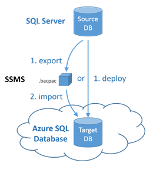

<properties
   pageTitle="Migrating a SQL Server Database to Azure SQL Database"
   description="Microsoft Azure SQL Database, database deploy, database migration, import database, export database, migration wizard"
   services="sql-database"
   documentationCenter=""
   authors="carlrabeler"
   manager="jeffreyg"
   editor=""/>

<tags
   ms.service="sql-database"
   ms.devlang="NA"
   ms.topic="article"
   ms.tgt_pltfrm="NA"
   ms.workload="data-management"
   ms.date="09/02/2015"
   ms.author="carlrab"/>

# Migrating a SQL Server database to Azure SQL Database

Azure SQL Database V12 brings near-complete engine compatibility with SQL Server 2014 and SQL Server 2016. For compatible databases, migration to Azure SQL Database is a straightforward schema and data movement operation requiring few, if any, changes to the schema and little or no re-engineering of applications. Where databases need to be changed, the scope of these changes is more confined than with Azure SQL Database V11.

By design, server-scoped features of SQL Server are not supported by Azure SQL Database V12. Databases and applications that rely on these features will need some re-engineering before they can be migrated.

 >[AZURE.NOTE] To migrate other types of databases, including Microsoft Access, Sybase, MySQL Oracle, and DB2 to an Azure SQL Database, see [SQL Server Migration Assistant](http://blogs.msdn.com/b/ssma/).

The workflow for migrating a SQL Server database to Azure SQL Database are:

 1. [Determine if your database is compatible](#determine-if-your-database-is-compatible)
 2. [If not compatible, fix database compatibility issues](#fix-database-compatibility-issues)
 3. [Migrate a compatible database](#migrate-a-compatible-database)

## Determine if your database is compatible
Use the Export Data Tier Application wizard in Management Studio or use the [sqlpackage.exe](https://msdn.microsoft.com/library/hh550080.aspx) command-line version of this wizard.

> [AZURE.TIP] If you want to generate a report of database incompatibilities that you will need to fix, use [sqlpackage.exe](https://msdn.microsoft.com/library/hh550080.aspx).

###Determine if your database is compatible using the sqlpackage.exe command line utility

1. Open a command prompt and change a directory containing the sqlpackage.exe command line utility - this utility ships with both Visual Studio and SQL Server.
2. Execute the following command, substituting for the following arguments: < servername >, < databasename >, < targetfile >, < schemaname.tablename > and < outputfile >. The reason for the /p:TableName argument is that we only want to test for database compability for export to Azure SQL DB V12 rather than export the data from all tables. Unfortunately, the export argument for sqlpackage.exe does not support extracting no tables, so you will need to specify a single small table. The < outputfile > will contain the report of any errors.

	'sqlpackage.exe /Action:Export /ssn:< servername > /sdn:< databasename > /tf:< targetfile > /p:TableData=< schemaname.tablename > > < outputfile > 2>&1'

	

3. Open the output file and review the compatibility errors, if any. For guidance on how to fix compatibility issues, go to [fix compatibility issues](#fix-compatibility-issues).

	

###Determine if your database is compatible using the Export Data Tier Application wizard

 1. Verify that you have version 13.0.600.65 or later of SQL Server Management Studio. New versions of Management Studio are updated monthly to remain in sync with updates to the Azure portal.

 > [AZURE.IMPORTANT] Download the [latest](https://msdn.microsoft.com/library/mt238290.aspx) version of Microsoft SQL Server Management Studio for SQL Server]

2. Open Management Studio and connect to your source database.
3. Right-click the source database in the Object Explorer, point to **Tasks**, and click **Export Data-Tier Application…**

	

3. In the export wizard, on the **Settings** tab, configure the export to save a BACPAC file to either a local disk location or to an Azure blob. A BACPAC file will only be saved if you have no database compatibility issues. If there are compatibility issues, they will be displayed on the console.

	

4. Click the **Advanced tab** and clear the **Select All** checkbox to skip exportation of the data at this point. Our goal here is only to test for compatibility.

	

5. Click **Next** and then click **Finish**.
6. Database compatibility issues, if any, will appear after the wizard validates the schema.

	

7. If no errors appear, your database is compatible and you are ready to migrate. If you have errors, you will need to fix them. To see the errors, click **Error** for **Validating schema**. For how to fix these errors, go to [fix compatibility issues](#fix-compatibility-issues).

	

## Options to Migrate a compatible database to Azure SQL Database using SQL Server Management Studio

- For small to medium databases, migrating compatible SQL Server 2005 or later databases is as simple as running the [Deploy Database to Microsoft Azure Database wizard in SQL Server Management Studio](#use-the-deploy-database-to-microsoft-azure-database-wizard-in-sql-server-management-studio), provided you do not have connectivity challenges (no connectivity, low bandwidth, or timeout issues).
- For medium to large databases or when you have connectivity challenges, you can [use a BACPAC to migrate a database to Azure SQL Database](#use-a-bacpac-to-migrate-a-database-to-azure-sql-database). With this method, you use SQL Server Management Studio to export the data and schema to a [BACPAC](https://msdn.microsoft.com/library/ee210546.aspx) file (stored locally or in an Azure blob) and then import the BACPAC file into your Azure SQL instance. If you store the BACPAC in an Azure blob, you can also import the BACPAC file from within the Azure portal.
- For larger databases, you will achieve the best performance by migrating the schema and the data separately. With this methods, you script the schema using SQL Server Management Studio or create a database project in Visual Studio and then deploy the schema to the Azure SQL Database server instance to create the Azure SQL database. You then extract the data using BCP to a flat file and then you can use BCP to import the data using parallel streams into the Azure SQL Database logical server instance.

 

##Use the Deploy Database to Microsoft Azure Database wizard in SQL Server Management Studio

The Deploy Database to Microsoft Azure Database wizard in SQL Server Management Studio migrates a compatible SQL Server 2005 or later database directly to your Azure SQL logical server instance.

> [AZURE.NOTE] The steps below assume that you have already provisioned your Azure SQL logical instance and have the connection information on hand.

1. Verify that you have version 13.0.600.65 or later of SQL Server Management Studio. New versions of Management Studio are updated monthly to remain in sync with updates to the Azure portal.

	 > [AZURE.IMPORTANT] Download the [latest](https://msdn.microsoft.com/library/mt238290.aspx) version of Microsoft SQL Server Management Studio for SQL Server]

2. Open Management Studio and connect to your source database in Object Explorer.
3. Right-click the source database in the Object Explorer, point to **Tasks**, and click **Deploy Database to Microsoft Azure SQL Database…**

	

4.	In the deployment wizard, configure the connection to your Azure SQL Database logical server.
5.	Provide the **New database name** for the database on Azure SQL DB, set the **Edition of Microsoft Azure SQL Database** (service tier), **Maximum database size**, **Service Objective** (performance level), and **Temporary file name** for the BACPAC file that this wizard creates during the migration process.

	> [AZURE.NOTE]	See [Azure SQL Database service tiers](sql-database-service-tiers.md) for more information on service tiers and performance levels.

	

6.	Complete the wizard to migrate the database. Depending on the size and complexity of the database, deployment may take from a few minutes to many hours.
7.	Using Object Explorer, connect to your migrated database in your Azure SQL Database logical server.
8.	Using the Azure Portal, view your database and its properties.

##Use a BACPAC to Migrate a Database to Azure SQL Database

For medium to large databases or when you have connectivity challenge, you can separate the migration process into two discrete steps. You can export of the schema and its data into a [BACPAC](https://msdn.microsoft.com/library/ee210546.aspx) file (stored locally or in an Azure blob). and import. Next, you can import this BACPAC file into your Azure SQL Database logical serverinstance.

> [AZURE.NOTE] The steps below assume that you have already provisioned your Azure SQL logical instance and have the connection information on hand.

1. Verify that you have version 13.0.600.65 or later of SQL Server Management Studio. New versions of Management Studio are updated monthly to remain in sync with updates to the Azure portal.

	 > [AZURE.IMPORTANT] Download the [latest](https://msdn.microsoft.com/library/mt238290.aspx) version of Microsoft SQL Server Management Studio for SQL Server]

2. Open Management Studio and connect to your source database in Object Explorer.

	

3. In the export wizard, configure the export to save the BACPAC file to either a local disk location or to an Azure blob. The exported BACPAC always includes the complete database schema and, by default, data from all the tables. Use the Advanced tab if you want to exclude data from some or all of the tables. You might, for example, choose to export only the data for reference tables rather than from all tables.

	

4.	Once the BACPAC has been created, connect to your Azure SQL Database logical server instance, right-click the **Databases** folder and click **Import Data-tier Application...**

	>[AZURE.NOTE] Note: You could also import the BACPAC file stored in an Azure blob directly from within the Azure management portal.

	

5.	In the import wizard, choose the BACPAC file you just exported to create the new database in Azure SQL Database.

	

6.	Provide the **New database name** for the database on Azure SQL DB, set the **Edition of Microsoft Azure SQL Database** (service tier), **Maximum database size** and **Service Objective** (performance level).

    > [AZURE.NOTE]	See [Azure SQL Database service tiers](sql-database-service-tiers.md) for more information on service tiers and performance levels.

    

7.	Click **Next** and then click **Finish** to import the BACPAC file into a new database in the Azure SQL Database logical server instance.

8. Using Object Explorer, connect to your migrated database in your Azure SQL Database logical server.

9.	Using the Azure Portal, view your database and its properties.

> [AZURE.TIP]
You can also use the [SqlPackage.exe](https://msdn.microsoft.com/library/hh550080.aspx) command line utility to export a database to a BACPAC and to import a BACPAC into Azure SQL Database.

##Fix database compatibility issues

If your on-premises SQL Server database is not compatible or to determine if it is compatible, you can import the database schema into a Visual Studio database project for analysis. To analyze, you specify the target platform for the project as SQL Database V12 and then build the project. If the build is successful, the database is compatible. If the build fails, you can resolve the errors in SQL Server Data Tools for Visual Studio ("SSDT"). Once the project builds successfully, you can publish it back as a copy of the source database and then use the data compare feature in SSDT to copy the data from the source database to the Azure SQL V12 compatible database. This updated database is then deployed to Azure SQL Database using option #1. If schema-only migration is required, the schema can be published directly from Visual Studio directly to Azure SQL Database. Use this method when the database schema requires more changes than can be handled by the migration wizard alone.
>[AZURE.NOTE] For step-by-step guidance in using this option, see [Use Visual Studio](sql-database-migrate-visualstudio-ssdt.md).

## Deciding options to use
- If you anticipate that a database can be migrated without change you should use option #1, which is quick and easy.  If you are uncertain, start by exporting a schema-only BACPAC from the database as described in option #1. If the export succeeds with no errors, you can use option #1 to migrate the database with its data.  
- If you encounter errors during the export of option#1, use option #2 and correct the database schema offline in Visual Studio using a combination of the migration wizard and manually applied schema changes. A copy of the source database is then updated in situ and then migrated to Azure using option #1.

## Migration tools
Tools used include SQL Server Management Studio (SSMS) and the SQL Server tooling in Visual Studio (VS, SSDT), as well the Azure portal.

> [AZURE.IMPORTANT] Be sure to install the latest versions of the client tools as earlier versions are not compatible with the Azure SQL Database V12.

### SQL Server Management Studio (SSMS)
SSMS can be used to deploy a compatible database directly to Azure SQL Database or to export a logical backup of the database as a BACPAC, which can then be imported, still using SSMS, to create a new Azure SQL Database.  

[Download the latest version of SSMS](https://msdn.microsoft.com/library/mt238290.aspx)  

### SQL Server tooling in Visual Studio (VS, SSDT)
The SQL Server tooling in Visual Studio can be used to create and manage a database project comprising a set of Transact-SQL files for each object in the schema. The project can be imported from a database or from a script file. Once created, the project can be to Azure SQL Database v12; building the project then validates schema compatibility. Clicking on an error opens the corresponding Transact-SQL file allowing it to be edited and the error corrected. Once all the errors are fixed the project can be published, either directly to SQL Database to create an empty database or back to (a copy of) the original SQL Server database to update its schema, which allows the database to be deployed with its data using SSMS as above.

Use the [latest SQL Server Data Tools for Visual Studio](https://msdn.microsoft.com/library/mt204009.aspx) with Visual Studio 2013 Update 4 or later.

## Comparisons
| Option #1 | Option #2 |
| ------------ | ------------ | ------------ |
| Deploy a compatible database to Azure SQL Database |   Update database in-place then deploy to Azure SQL Database |
||  |
| Uses SSMS | Uses VS and SSMS |
|Simple process requires that schema is compatible (see above to determine compatibility). Schema is migrated unchanged. | Schema is imported into a database project in Visual Studio. Additional updates are made using SSDT for Visual Studio and final schema used to update the database in situ. |
| Always deploys or exports the entire database. | Full control of the objects that are included in the migration. |
| No provision for changing the output if there are errors, the source schema must be compatible. | Full features of SSDT for Visual Studio available. Schema is changed offline. | Application validation occurs in Azure. Should be minimal as schema is migrated without change. | Application validation can be done in SQL Server before the database is deployed to Azure. |
| Simple, easily configured one- or two-step process. | More complex multi-step process (easier if only deploying schema). |
