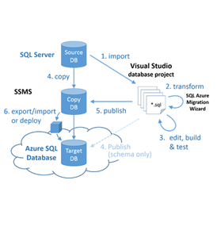
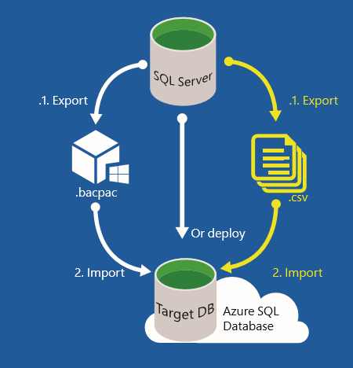

<properties
   pageTitle="SQL Server database migration to SQL Database | Microsoft Azure"
   description="Learn how about on-premises SQL Server database migration to Azure SQL Database in the cloud. Use database migration tools to test compatibility prior to database migration."
   keywords="database migration,sql server database migration,database migration tools,migrate database,migrate sql database"
   services="sql-database"
   documentationCenter=""
   authors="CarlRabeler"
   manager="jhubbard"
   editor=""/>

<tags
   ms.service="sql-database"
   ms.devlang="NA"
   ms.topic="article"
   ms.tgt_pltfrm="NA"
   ms.workload="sqldb-migrate"
   ms.date="06/07/2016"
   ms.author="carlrab"/>

# SQL Server database migration to SQL Database in the cloud

In this article you learn to how to migrate an on-premises SQL Server 2005 or later database to Azure SQL Database. In this database migration process, you migrate your schema and your data from the SQL Server database in your current environment into SQL Database, provided the existing database passes compatibility tests. With [SQL Database V12](sql-database-v12-whats-new.md), there are very few remaining compatibility issues other than server-level and cross-database operations. Databases and applications that rely on [partially or unsupported functions](sql-database-transact-sql-information.md) will need some re-engineering  to fix these incompatibilities before the SQL Server database can be migrated.

To migrate, these are the steps you will take:

- **Test for Compatibility**: You must first validate database compatibility with [SQL Database V12](sql-database-v12-whats-new.md). 
- **Fix Compatibility Issues, if any**: If validation fails, you must fix the validation errors.  
- **Perform the migration** Once your database is compatible, you can use one or several methods to perform the migration. 

SQL Server provides several methods to accomplish each of these tasks. This article will provide an overview of the available methods for each task. The following diagram illustrates the steps and the methods.

  
  
 > [AZURE.NOTE] To migrate a non-SQL Server database, including Microsoft Access, Sybase, MySQL Oracle, and DB2 to Azure SQL Database, see [SQL Server Migration Assistant](http://blogs.msdn.com/b/ssma/).

## Database migration tools test SQL Server database compatibility with SQL Database

To test for SQL Database compatibility issues before you start the database migration process, use one of the following methods:

> [AZURE.SELECTOR]
- [SSDT](sql-database-cloud-migrate-fix-compatibility-issues-ssdt.md)
- [SqlPackage](sql-database-cloud-migrate-determine-compatibility-sqlpackage.md)
- [SSMS](sql-database-cloud-migrate-determine-compatibility-ssms.md)
- [Upgrade Advisor](http://www.microsoft.com/download/details.aspx?id=48119)
- [SAMW](sql-database-cloud-migrate-fix-compatibility-issues.md)

- [SQL Server Data Tools for Visual Studio ("SSDT")](sql-database-cloud-migrate-fix-compatibility-issues-ssdt.md): SSDT uses the most recent compatibility rules to detect SQL Database V12 incompatibilities. If incompatibilities are detected, you can fix detected issues directly in this tool. This is currently the recommended method to test and fix SQL Database V12 compatibility issues. 
- [SqlPackage](sql-database-cloud-migrate-determine-compatibility-sqlpackage.md): SqlPackage is a command-prompt utility will test for and, if found, generate a report containing detected compatibility issues. If you use this tool, make sure you use the most recent version to use the most recent compatibility rules. If errors are detected, you must use another tool to fix any detected compatibility issues - SSDT is recommended.  
- [The Export Data Tier application wizard in SQL Server Management Studio](sql-database-cloud-migrate-determine-compatibility-ssms.md): This wizard will detect and report errors to the screen. If not errors are detected, you can continue and complete the migration to SQL Database. If errors are detected, you must use another tool to fix any detected compatibility issues - SSDT is recommended.
- [The Microsoft SQL Server 2016 Upgrade Advisor Preview](http://www.microsoft.com/download/details.aspx?id=48119): This standalone tool, that is currently in preview, will detect and generate a report of SQL Database V12 incompatibilities. This tool does not yet have the most recent compatibility rules. This If no errors are detected, you can continue and complete the migration to SQL Database. If errors are detected, you must use another tool to fix any detected compatibility issues - SSDT is recommended. 
- [SQL Azure Migration Wizard ("SAMW")](sql-database-cloud-migrate-fix-compatibility-issues.md): SAMW is a codeplex tool that uses the Azure SQL Database V11 compatibility rules to detect Azure SQL Database V12 incompatibilities. If incompatibilities are detected, some issues can be fixed directly in this tool. This tool may find incompatibilities that do not need to be fixed, but it was the first Azure SQL Database migration assistance tool available and there is a lot of support for it from the SQL Server community. Also, this tool can complete the migration from within the tool itself. 

## Fix database migration compatibility issues

If compatibility issues are detected, you must fix them before proceeding with the SQL Server database migration. There are a wide variety of compatibility issues that you might encounter, depending both on the version of SQL Server in the source database and the complexity of the database you are migrating. The older the version of SQL Server for your source database, the more potential incompatibilities you will encounter. Use the following resources, in addition to a targeted Internet search using your search engine of choices:

- [SQL Server database features not supported in Azure SQL Database](sql-database-transact-sql-information.md)
- [Discontinued Database Engine Functionality in SQL Server 2016](https://msdn.microsoft.com/library/ms144262%28v=sql.130%29)
- [Discontinued Database Engine Functionality in SQL Server 2014](https://msdn.microsoft.com/library/ms144262%28v=sql.120%29)
- [Discontinued Database Engine Functionality in SQL Server 2012](https://msdn.microsoft.com/library/ms144262%28v=sql.110%29)
- [Discontinued Database Engine Functionality in SQL Server 2008 R2](https://msdn.microsoft.com/library/ms144262%28v=sql.105%29)
- [Discontinued Database Engine Functionality in SQL Server 2005](https://msdn.microsoft.com/library/ms144262%28v=sql.90%29)

In addition to searching the Internet and using these resources, another good resource to identify how best to fix an incompatibility issue, use the [MSDN SQL Server coummunity forums](https://social.msdn.microsoft.com/Forums/sqlserver/home?category=sqlserver) or [StackOverflow](http://stackoverflow.com/).

Use one of the following database migration tools to fix the issues detected:

> [AZURE.SELECTOR]
- [SSDT](sql-database-cloud-migrate-fix-compatibility-issues-ssdt.md)
- [SSMS](sql-database-cloud-migrate-fix-compatibility-issues-ssms.md)
- [SAMW](sql-database-cloud-migrate-fix-compatibility-issues.md)

- Use [SQL Server Data Tools for Visual Studio ("SSDT")](sql-database-cloud-migrate-fix-compatibility-issues-ssdt.md): To use SSDT, you import your database schema into SQL Server Data Tools for Visual Studio "SSDT"), build the project for a SQL Database V12 deployment, fix all detected compatibility issues in SSDT, and then synchronize the changes back to the source database (or a copy of the source database. This is currently the recommended method to test and fix SQL Database V12 compatibility issues. Follow the link for a [walk-through using SSDT](sql-database-cloud-migrate-fix-compatibility-issues-ssdt.md).
- Use [SQL Server Management Studio ("SSMS")](sql-database-cloud-migrate-fix-compatibility-issues-ssms.md): To use SSMS, you execute Transact-SQL commands to fix the errors detected using another tool. This method is primarily for advanced users to modify the database schema directly in the source database. 
- Use [SQL Azure Migration Wizard ("SAMW")](sql-database-cloud-migrate-fix-compatibility-issues.md): To use SAMW, you generate a Transact-SQL script from the source database that is then transformed by the wizard, whenever possible, to make the schema compatible with the SQL Database V12. When complete, SAMW can connect to SQL Database V12 to execute the script. This tool will also analyze trace files to determine compatibility issues. The script can be generated with schema only or can include data in BCP format.

## Migrate a compatible SQL Server database to SQL Database

To migrate a compatible SQL Server database, Microsoft provides several migration methods for various scenarios. The method you choose depends upon your tolerance for downtime, the size and complexity of your SQL Server database, and your connectivity to the Microsoft Azure cloud.  

> [AZURE.SELECTOR]
- [SSMS Migration Wizard](sql-database-cloud-migrate-compatible-using-ssms-migration-wizard.md)
- [Export to BACPAC File](sql-database-cloud-migrate-compatible-export-bacpac-ssms.md)
- [Import from BACPAC File](sql-database-cloud-migrate-compatible-import-bacpac-ssms.md)
- [Transactional Replication](sql-database-cloud-migrate-compatible-using-transactional-replication.md)

To choose your migration method, the first question to ask is can you afford to take the database out of production during the migration. Migrating a database while active transactions are occurring can result in database inconsistencies and possible database corruption. There are many methods to quiesce a database, from disabling client connectivity to creating a [database snapshot](https://msdn.microsoft.com/library/ms175876.aspx).

To migrate with minimal downtime, use [SQL Server transaction replication](sql-database-cloud-migrate-compatible-using-transactional-replication.md) if your database meets the requirements for transactional replication. If you can afford some downtime or you are performing a test migration of a production database for later migration, consider one of the following three methods:

- [SSMS Migration Wizard](sql-database-cloud-migrate-compatible-using-ssms-migration-wizard.md): For small to medium databases, migrating a compatible SQL Server 2005 or later database is as simple as running the [Deploy Database to Microsoft Azure Database Wizard](sql-database-cloud-migrate-compatible-using-ssms-migration-wizard.md) in SQL Server Management Studio.
- [Export to BACPAC File](sql-database-cloud-migrate-compatible-export-bacpac-ssms.md) and then [Import from BACPAC File](sql-database-cloud-migrate-compatible-import-bacpac-ssms.md): If you have connectivity challenges (no connectivity, low bandwidth, or timeout issues) and for medium to large databases, use a [BACPAC](https://msdn.microsoft.com/library/ee210546.aspx#Anchor_4) file. With this method, you export the SQL Server schema and data to a BACPAC file and then import the BACPAC file into SQL Database using the Export Data Tier Application Wizard in SQL Server Management Studio or the [SqlPackage](https://msdn.microsoft.com/library/hh550080.aspx) command-prompt utility.
- Use BACPAC and BCP together: Use a [BACPAC](https://msdn.microsoft.com/library/ee210546.aspx#Anchor_4) file and [BCP](https://msdn.microsoft.com/library/ms162802.aspx) for much large databases to achieve greater parallelization for increases performance, albeit with greater complexity. With this method, migrate the schema and the data separately.
 - [Export the schema only to a BACPAC file](sql-database-cloud-migrate-compatible-export-bacpac-ssms.md).
 - [Import the schema only from the BACPAC File](sql-database-cloud-migrate-compatible-import-bacpac-ssms.md) into SQL Database.
 - Use [BCP](https://msdn.microsoft.com/library/ms162802.aspx) to extract the data into flat files and then [parallel load](https://technet.microsoft.com/library/dd425070.aspx) these files into Azure SQL Database.

	 

## Next steps

- [The Microsoft SQL Server 2016 Upgrade Advisor Preview](http://www.microsoft.com/download/details.aspx?id=48119)
- [Newest version of SSDT](https://msdn.microsoft.com/library/mt204009.aspx)
- [Newest version of SQL Server Management Studio](https://msdn.microsoft.com/library/mt238290.aspx)

##Additional resources

- [SQL Database V12](sql-database-v12-whats-new.md)
[Transact-SQL partially or unsupported functions](sql-database-transact-sql-information.md)
- [Migrate non-SQL Server databases using SQL Server Migration Assistant](http://blogs.msdn.com/b/ssma/)
