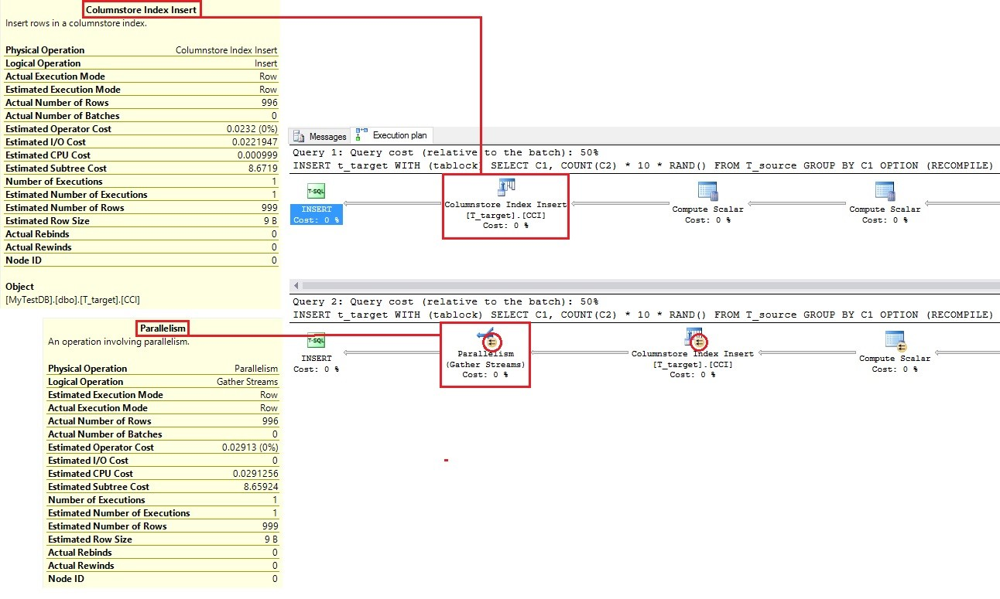
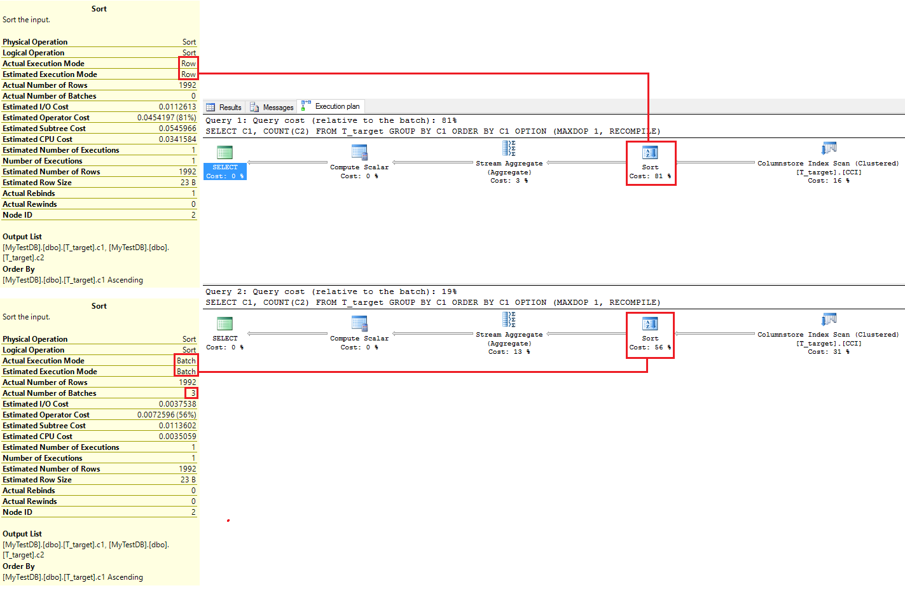
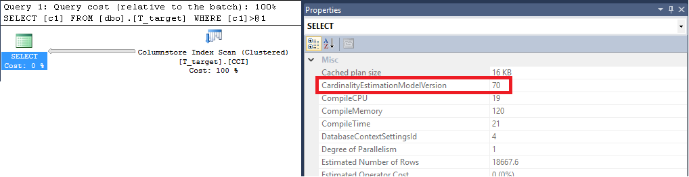
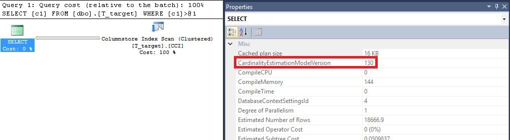
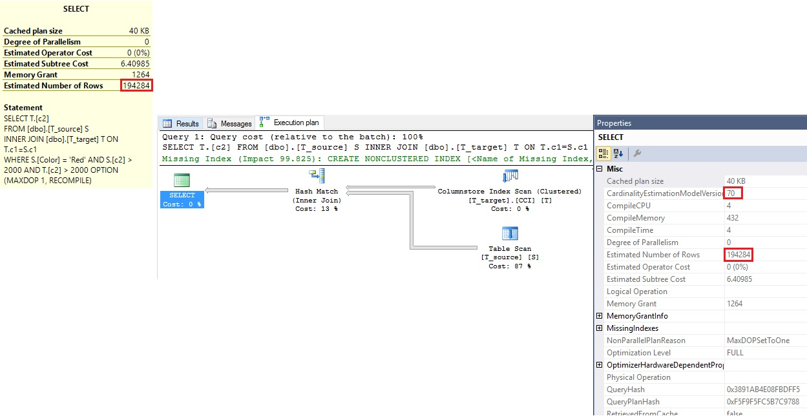
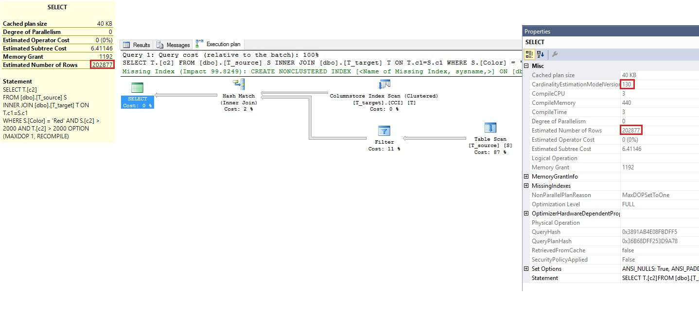

# Improved query performance with compatibility Level 130 in Azure SQL Database
Azure SQL Database is running transparently hundreds of thousands of databases at many different compatibility levels, preserving and guaranteeing the backward compatibility to the corresponding version of Microsoft SQL Server for all its customers!

In this article, we explore the benefits of running your Azure SQL Database at compatibility level 130, and using the benefits of the new query optimizer and query processor features. We also address the possible side effects on the query performance for the existing SQL applications.

As a reminder of history, the alignment of SQL versions to default compatibility levels are as follows:

* 100: in SQL Server 2008 and Azure SQL Database.
* 110: in SQL Server 2012 and Azure SQL Database.
* 120: in SQL Server 2014 and Azure SQL Database.
* 130: in SQL Server 2016 and Azure SQL Database.

> [!IMPORTANT]
> The default compatibility level is 130 for **newly created** databases.
> 
> Databases created before mid-June 2016 have the compatibility level in place at their creation time. Databases that migrated from an earlier version of Azure SQL Database have a compatibility level of either 100 or 110. The compatibility level of the master database for a server created prior to mid-June 2016 has the compatibility level in place when the server was created and cannot be changed. A different compatibility level between the master database and a user database is not something that impacts functionality or performance for user databases.
> 

## About compatibility level 130
First, if you want to know the current compatibility level of your database, execute the following Transact-SQL statement.

```
SELECT compatibility_level
    FROM sys.databases
    WHERE name = '<YOUR DATABASE_NAME>’;
```


Before this change to level 130 happens for **newly** created databases, let’s review what this change is all about through some basic query examples, and see how anyone can benefit from it.

Query processing in relational databases can be very complex and require a deep background in computer science and mathematics to understand the inherent design choices and behaviors. In this document, the content has been intentionally simplified to ensure that anyone with some minimum technical background can understand the impact of the compatibility level change and determine how it can benefit applications.

Let’s have a quick look at what the compatibility level 130 brings at the table.  You can find more details at [ALTER DATABASE Compatibility Level (Transact-SQL)](https://msdn.microsoft.com/library/bb510680.aspx), but here is a short summary:

* The Insert operation of an Insert-select statement can be multi-threaded or can have a parallel plan, while before this operation was single-threaded.
* Memory Optimized table and table variables queries can now have parallel plans, while before this operation was also single-threaded.
* Statistics for Memory Optimized table can now be sampled and are auto-updated. See [What's New in Database Engine: In-Memory OLTP](https://msdn.microsoft.com/library/bb510411.aspx#InMemory) for more details.
* Batch mode v/s Row Mode changes with Column Store indexes
  * Sorts on a table with a Column Store index are now in batch mode.
  * Windowing aggregates now operate in batch mode such as T-SQL LAG/LEAD statements.
  * Queries on Column Store tables with Multiple distinct clauses operate in Batch mode.
  * Queries running under DOP=1 or with a serial plan also execute in Batch Mode.
* Last, Cardinality Estimation improvements come with compatibility level 120, but for those of you running at a lower Compatibility level (that is 100, or 110), the move to compatibility level 130 also brings these improvements, and these can also benefit the query performance of your applications.

## Practicing compatibility level 130
First let’s get some tables, indexes, and random data created to practice some of these new capabilities. The T-SQL script examples can be executed under SQL Server 2016, or under Azure SQL Database. However, when creating an Azure SQL database, make sure you choose at the minimum a P2 database because you need at least a couple of cores to allow multi-threading and therefore benefit from these features.

```
-- Create a Premium P2 Database in Azure SQL Database

CREATE DATABASE MyTestDB
    (EDITION=’Premium’, SERVICE_OBJECTIVE=’P2′);
GO

-- Create 2 tables with a column store index on
-- the second one (only available on Premium databases)

CREATE TABLE T_source
    (Color varchar(10), c1 bigint, c2 bigint);

CREATE TABLE T_target
    (c1 bigint, c2 bigint);

CREATE CLUSTERED COLUMNSTORE INDEX CCI ON T_target;
GO

-- Insert few rows.

INSERT T_source VALUES
    (‘Blue’, RAND() * 100000, RAND() * 100000),
    (‘Yellow’, RAND() * 100000, RAND() * 100000),
    (‘Red’, RAND() * 100000, RAND() * 100000),
    (‘Green’, RAND() * 100000, RAND() * 100000),
    (‘Black’, RAND() * 100000, RAND() * 100000);

GO 200

INSERT T_source SELECT * FROM T_source;

GO 10
```


Now, let’s have a look to some of the Query Processing features coming with compatibility level 130.

## Parallel INSERT
Executing the following T-SQL statements executes the INSERT operation under compatibility level 120 and 130, which respectively executes the INSERT operation in a single threaded model (120), and in a multi-threaded model (130).

```
-- Parallel INSERT … SELECT … in heap or CCI
-- is available under 130 only

SET STATISTICS XML ON;

ALTER DATABASE MyTestDB
    SET COMPATIBILITY_LEVEL = 120;
GO 

-- The INSERT part is in serial

INSERT t_target WITH (tablock)
    SELECT C1, COUNT(C2) * 10 * RAND()
        FROM T_source
        GROUP BY C1
    OPTION (RECOMPILE);

ALTER DATABASE MyTestDB
    SET COMPATIBILITY_LEVEL = 130
GO

-- The INSERT part is in parallel

INSERT t_target WITH (tablock)
    SELECT C1, COUNT(C2) * 10 * RAND()
        FROM T_source
        GROUP BY C1
    OPTION (RECOMPILE);

SET STATISTICS XML OFF;
```


By requesting the actual the query plan, looking at its graphical representation or its XML content, you can determine which Cardinality Estimation function is at play. Looking at the plans side by side on figure 1, we can clearly see that the Column Store INSERT execution goes from serial in 120 to parallel in 130. Also, note that the change of the iterator icon in the 130 plan showing two parallel arrows, illustrating the fact that now the iterator execution is indeed parallel. If you have large INSERT operations to complete, the parallel execution, linked to the number of core you have at your disposal for the database, performs better; up to a 100 times faster depending on your situation!

*Figure 1: INSERT operation changes from serial to parallel with compatibility level 130.*



## SERIAL Batch Mode
Similarly, moving to compatibility level 130 when processing rows of data enables batch mode processing. First, batch mode operations are only available when you have a column store index in place. Second, a batch typically represents ~900 rows, and uses a code logic optimized for multicore CPU, higher memory throughput and directly leverages the compressed data of the Column Store whenever possible. Under these conditions, SQL Server 2016 can process ~900 rows at once, instead of 1 row at the time, and as a consequence, the overall overhead cost of the operation is now shared by the entire batch, reducing the overall cost by row. This shared number of operations combined with the column store compression basically reduces the latency involved in a SELECT batch mode operation. You can find more details about the column store and batch mode at [Columnstore Indexes Guide](https://msdn.microsoft.com/library/gg492088.aspx).

```
-- Serial batch mode execution

SET STATISTICS XML ON;

ALTER DATABASE MyTestDB
    SET COMPATIBILITY_LEVEL = 120;
GO

-- The scan and aggregate are in row mode

SELECT C1, COUNT (C2)
    FROM T_target
    GROUP BY C1
    OPTION (MAXDOP 1, RECOMPILE);
GO

ALTER DATABASE MyTestDB
    SET COMPATIBILITY_LEVEL = 130;
GO 

-- The scan and aggregate are in batch mode,
-- and force MAXDOP to 1 to show that batch mode
-- also now works in serial mode.

SELECT C1, COUNT(C2)
    FROM T_target
    GROUP BY C1
    OPTION (MAXDOP 1, RECOMPILE);
GO

SET STATISTICS XML OFF;
```


By observing the query plans side by side on figure 2, we can see that the processing mode has changed with the compatibility level, and as a consequence, when executing the queries in both compatibility level altogether, we can see that most of the processing time is spent in row mode (86%) compared to the batch mode (14%), where 2 batches have been processed. Increase the dataset, increase the benefit.

*Figure 2: SELECT operation changes from serial to batch mode with compatibility level 130.*


## Batch mode on Sort Execution
Similar to the preceding example, but applied to a sort operation, the transition from row mode (compatibility level 120) to batch mode (compatibility level 130) improves the performance of the SORT operation for the same reasons.

```
-- Batch mode on sort execution

SET STATISTICS XML ON;

ALTER DATABASE MyTestDB
    SET COMPATIBILITY_LEVEL = 120;
GO

-- The scan and aggregate are in row mode

SELECT C1, COUNT(C2)
    FROM T_target
    GROUP BY C1
    ORDER BY C1
    OPTION (MAXDOP 1, RECOMPILE);
GO

ALTER DATABASE MyTestDB
    SET COMPATIBILITY_LEVEL = 130;
GO

-- The scan and aggregate are in batch mode,
-- and force MAXDOP to 1 to show that batch mode
-- also now works in serial mode.

SELECT C1, COUNT(C2)
    FROM T_target
    GROUP BY C1
    ORDER BY C1
    OPTION (MAXDOP 1, RECOMPILE);
GO

SET STATISTICS XML OFF;
```


Visible side by side on figure 3, we can see that the sort operation in row mode represents 81% of the cost, while the batch mode only represents 19% of the cost (respectively 81% and 56% on the sort itself).

*Figure 3: SORT operation changes from row to batch mode with compatibility level 130.*



Obviously, these samples only contain tens of thousands of rows, which are nothing when looking at the data available in most SQL Servers these days. Project these against millions of rows instead, and this can translate in several minutes of execution spared every day pending the nature of your workload.

## Cardinality Estimation (CE) improvements
Introduced with SQL Server 2014, any database running at a compatibility level 120 or higher makes use of the new Cardinality Estimation functionality. Essentially, cardinality estimation is the logic used to determine how SQL server executes a query based on its estimated cost. The estimation is calculated using input from statistics associated with objects involved in that query. Practically, at a high-level, Cardinality Estimation functions are row count estimates along with information about the distribution of the values, distinct value counts, and duplicate counts contained in the tables and objects referenced in the query. Getting these estimates wrong, can lead to unnecessary disk I/O due to insufficient memory grants (that is TempDB spills), or to a selection of a serial plan execution over a parallel plan execution, to name a few. Conclusion, incorrect estimates can lead to an overall performance degradation of the query execution. On the other side, better estimates, more accurate estimates, leads to better query executions!

As mentioned before, query optimizations and estimates are a complex matter, but if you want to learn more about query plans and cardinality estimator, you can refer to the document at [Optimizing Your Query Plans with the SQL Server 2014 Cardinality Estimator](https://msdn.microsoft.com/library/dn673537.aspx) for a deeper dive.

## Which Cardinality Estimation do you currently use?
To determine under which Cardinality Estimation your queries are running, use the following query samples. This first example runs under compatibility level 110, implying the use of the old Cardinality Estimation functions.

```
-- Old CE

ALTER DATABASE MyTestDB
    SET COMPATIBILITY_LEVEL = 110;
GO

SET STATISTICS XML ON;

SELECT [c1]
    FROM [dbo].[T_target]
    WHERE [c1] > 20000;
GO

SET STATISTICS XML OFF;
```


Once execution is complete, click the XML link, and look at the properties of the first iterator. Note the property name called CardinalityEstimationModelVersion currently set on 70. It does not mean that the database compatibility level is set to the SQL Server 7.0 version (it is set on 110 as visible in the preceding T-SQL statements), but the value 70 represents the legacy Cardinality Estimation functionality available since SQL Server 7.0, which had no major revisions until SQL Server 2014 (which comes with a compatibility level of 120).

*Figure 4: The CardinalityEstimationModelVersion is set to 70 when using a compatibility level of 110 or lower.*



Alternatively, you can change the compatibility level to 130, and disable the use of the new Cardinality Estimation function by using the LEGACY_CARDINALITY_ESTIMATION set to ON with [ALTER DATABASE SCOPED CONFIGURATION](https://msdn.microsoft.com/library/mt629158.aspx). This is the same as using 110 from a Cardinality Estimation function point of view, while using the latest query processing compatibility level. Doing so, you can benefit from the new query processing features coming with the latest compatibility level (that is batch mode), but still rely on the old Cardinality Estimation functionality if necessary.

```
-- Old CE

ALTER DATABASE MyTestDB
    SET COMPATIBILITY_LEVEL = 130;
GO

ALTER DATABASE
    SCOPED CONFIGURATION
    SET LEGACY_CARDINALITY_ESTIMATION = ON;
GO

SET STATISTICS XML ON;

SELECT [c1]
    FROM [dbo].[T_target]
    WHERE [c1] > 20000;
GO

SET STATISTICS XML OFF;
```


Changing the compatibility level 120 or 130 enables the new Cardinality Estimation functionality. In such a case, the default CardinalityEstimationModelVersion is set to 120 or 130.

```
-- New CE

ALTER DATABASE MyTestDB
    SET COMPATIBILITY_LEVEL = 130;
GO

ALTER DATABASE
    SCOPED CONFIGURATION
    SET LEGACY_CARDINALITY_ESTIMATION = OFF;
GO

SET STATISTICS XML ON;

SELECT [c1]
    FROM [dbo].[T_target]
    WHERE [c1] > 20000;
GO

SET STATISTICS XML OFF;
```


*Figure 5: The CardinalityEstimationModelVersion is set to 130 when using a compatibility level of 130.*



## Witnessing the Cardinality Estimation differences
Now, let’s run a slightly more complex query involving an INNER JOIN with a WHERE clause with some predicates, and let’s look at the row count estimate from the old Cardinality Estimation function first.

```
-- Old CE row estimate with INNER JOIN and WHERE clause

ALTER DATABASE MyTestDB
    SET COMPATIBILITY_LEVEL = 130;
GO

ALTER DATABASE
    SCOPED CONFIGURATION
    SET LEGACY_CARDINALITY_ESTIMATION = ON;
GO

SET STATISTICS XML ON;

SELECT T.[c2]
    FROM
                   [dbo].[T_source] S
        INNER JOIN [dbo].[T_target] T  ON T.c1=S.c1
    WHERE
        S.[Color] = ‘Red’  AND
        S.[c2] > 2000  AND
        T.[c2] > 2000
    OPTION (RECOMPILE);
GO

SET STATISTICS XML OFF;
```


Executing this query effectively returns 200,704 rows, while the row estimate with the old Cardinality Estimation functionality claims 194,284 rows. Obviously, as said before, these row count results also depend how often you ran the previous samples, which populates the sample tables over and over again at each run. Obviously, the predicates in your query also have an influence on the actual estimation aside from the table shape, data content, and how this data correlate with each other.

*Figure 6: The row count estimate is 194,284 or 6,000 rows off from the 200,704 rows expected.*



In the same way, let’s now execute the same query with the new Cardinality Estimation functionality.

```
-- New CE row estimate with INNER JOIN and WHERE clause

ALTER DATABASE MyTestDB
    SET COMPATIBILITY_LEVEL = 130;
GO

ALTER DATABASE
    SCOPED CONFIGURATION
    SET LEGACY_CARDINALITY_ESTIMATION = OFF;
GO

SET STATISTICS XML ON;

SELECT T.[c2]
    FROM
                   [dbo].[T_source] S
        INNER JOIN [dbo].[T_target] T  ON T.c1=S.c1
    WHERE
        S.[Color] = ‘Red’  AND
        S.[c2] > 2000  AND
        T.[c2] > 2000
    OPTION (RECOMPILE);
GO

SET STATISTICS XML OFF;
```


We now see that the row estimate is 202,877, or much closer and higher than the old Cardinality Estimation.

*Figure 7: The row count estimate is now 202,877, instead of 194,284.*



In reality, the result set is 200,704 rows (but all of it depends how often you did run the queries of the previous samples, but more importantly, because the T-SQL uses the RAND() statement, the actual values returned can vary from one run to the next). Therefore, in this particular example, the new Cardinality Estimation does a better job at estimating the number of rows because 202,877 is much closer to 200,704, than 194,284! Last, if you change the WHERE clause predicates to equality (rather than “>” for instance), this could make the estimates between the old and new Cardinality function even more different, depending on how many matches you can get.

Obviously, in this case, being ~6000 rows off from actual count does not represent a lot of data in some situations. Now, transpose this to millions of rows across several tables and more complex queries, and at times the estimate can be off by millions of rows, and therefore, the risk of picking-up the wrong execution plan, or requesting insufficient memory grants leading to TempDB spills, and so more I/O, are much higher.

If you have the opportunity, practice this comparison with your most typical queries and datasets, and see for yourself by how the old and new estimates are affected, while some could become more off from the reality, or some others closer to the actual row counts returned in the result sets. All of it depends on the shape of your queries, the Azure SQL database characteristics, the nature and the size of your datasets, and the statistics available about them. If you just created your Azure SQL Database instance, the query optimizer has to build its knowledge from scratch instead of reusing statistics made of the previous query runs. So, the estimates are very contextual and almost specific to every server and application situation. It is an important aspect to keep in mind!

## Some considerations to take into account
Although most workloads would benefit from the compatibility level 130, before adopting the compatibility level for your production environment, you basically have 3 options:

1. You move to compatibility level 130, and see how things perform. In case you notice some regressions, you set the compatibility level back to its original level, or keep 130, and only reverse the Cardinality Estimation back to the legacy mode (As preciously explained, this alone could address the issue).
2. You thoroughly test your existing applications under similar production load, fine-tune, and validate the performance before going to production. In case of issues, same as the preceding, you can always go back to the original compatibility level, or reverse the Cardinality Estimation back to the legacy mode.
3. As a final option, and the most recent way to address these questions, is to use Query Store. That’s today’s recommended option! To assist the analysis of your queries under compatibility level 120 or lower versus 130, we cannot encourage you enough to use Query Store. Query Store is available with the latest version of Azure SQL Database, and it’s designed to help you with query performance troubleshooting. Think of the Query Store as a flight data recorder for your database collecting and presenting detailed historic information about all queries. This greatly simplifies performance forensics by reducing the time to diagnose and resolve issues. You can find more information at [Query Store: A flight data recorder for your database](https://azure.microsoft.com/blog/query-store-a-flight-data-recorder-for-your-database/).

At the high level, if you already have a set of databases running at compatibility level 120 or lower, and plan to move some of them to 130, or because your workload automatically provision new databases that are set by default to 130, please consider the followings:

* Before changing to the new compatibility level in production, enable Query Store. You can refer to [Change the Database Compatibility Mode and Use the Query Store](https://msdn.microsoft.com/library/bb895281.aspx) for more information.
* Next, test all critical workloads using representative data and queries of a production-like environment, and compare the performance experienced and as reported by Query Store. If you experience some regressions, you can identify the regressed queries with the Query Store and use the plan forcing option from Query Store (aka plan pinning). In such a case, you definitively stay with the compatibility level 130, and use the former query plan as suggested by the Query Store.
* If you want to use the new features and capabilities of Azure SQL Database (which is running SQL Server 2016), but are sensitive to changes brought by the compatibility level 130, as a last resort, you could consider forcing the compatibility level back to the level that suits your workload by using an ALTER DATABASE statement. But first, be aware that the Query Store plan pinning option is your best option because not using 130 is basically staying at the functionality level of an older SQL Server version.
* If you have multitenant applications spanning multiple databases, it may be necessary to update the provisioning logic of your databases to ensure a consistent compatibility level across all databases; old and newly provisioned ones. Your application workload performance could be sensitive to the fact that some databases are running at different compatibility levels, and therefore, compatibility level consistency across any database could be required in order to provide the same experience to your customers all across the board. It is not a mandate; it really depends on how your application is affected by the compatibility level.
* Last, regarding the Cardinality Estimation, it is recommended to test your production workload under the new conditions to determine if your application benefits from the Cardinality Estimation improvements.

## Conclusion
Using Azure SQL Database to benefit from all SQL Server 2016 enhancements can clearly improve your query executions. Of course, like any new feature, a proper evaluation must be done to determine the exact conditions under which your database workload operates the best. Experience shows that most workload are expected to at least run transparently under compatibility level 130, while using new query processing functions, and new Cardinality Estimation. That said, realistically, there are always some exceptions and doing proper due diligence is an important assessment to determine how much you can benefit from these enhancements. And again, the Query Store can be of a great help in doing this work!

## References
* [What’s New in Database Engine](https://msdn.microsoft.com/library/bb510411.aspx#InMemory)
* [Blog: Query Store: A flight data recorder for your database, by Borko Novakovic, June 8 2016](https://azure.microsoft.com/blog/query-store-a-flight-data-recorder-for-your-database/)
* [ALTER DATABASE Compatibility Level (Transact-SQL)](https://msdn.microsoft.com/library/bb510680.aspx)
* [ALTER DATABASE SCOPED CONFIGURATION](https://msdn.microsoft.com/library/mt629158.aspx)
* [Compatibility Level 130 for Azure SQL Database](https://azure.microsoft.com/updates/compatibility-level-130-for-azure-sql-database-v12/)
* [Optimizing Your Query Plans with the SQL Server 2014 Cardinality Estimator](https://msdn.microsoft.com/library/dn673537.aspx)
* [Columnstore Indexes Guide](https://msdn.microsoft.com/library/gg492088.aspx)
* [Blog: Improved Query Performance with Compatibility Level 130 in Azure SQL Database, by Alain Lissoir, May 6 2016](https://blogs.msdn.microsoft.com/sqlserverstorageengine/2016/05/06/improved-query-performance-with-compatibility-level-130-in-azure-sql-database/)

