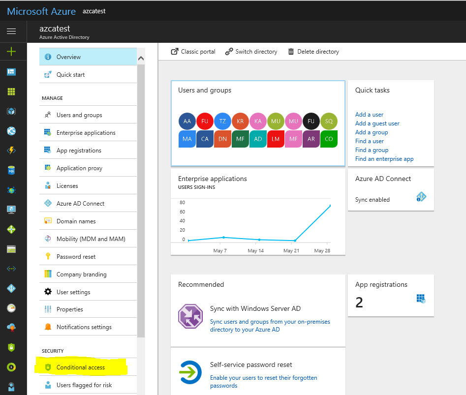
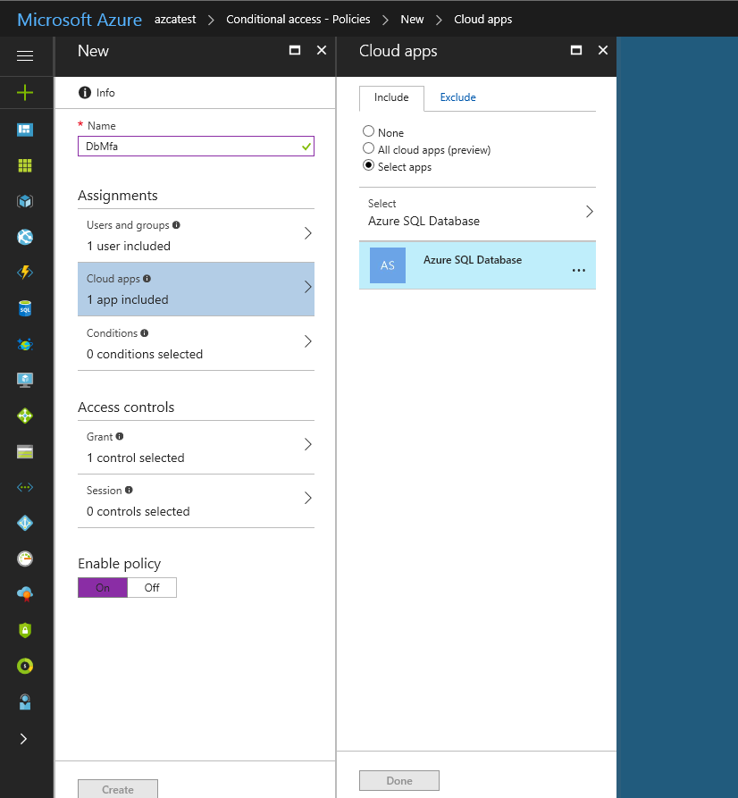
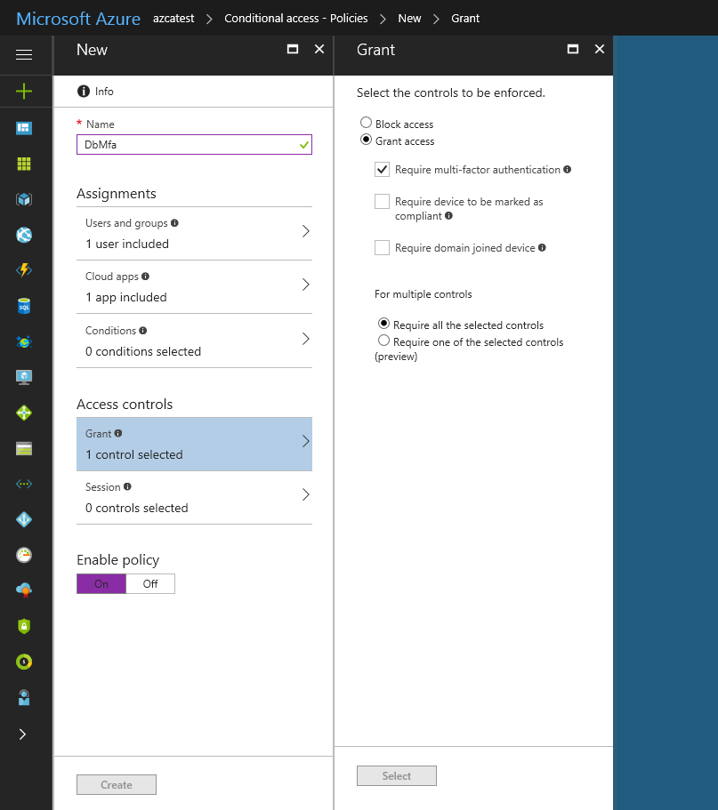

# Conditional Access (MFA) with Azure SQL Database and Data Warehouse  

Azure [SQL Database](sql-database-technical-overview.md), [Managed Instance](sql-database-managed-instance.md), and [SQL Data Warehouse](../sql-data-warehouse/sql-data-warehouse-overview-what-is.md) support Microsoft Conditional Access. 

> [!NOTE]
> This topic applies to Azure SQL server, and to both SQL Database and SQL Data Warehouse databases that are created on the Azure SQL server. For simplicity, SQL Database is used when referring to both SQL Database and SQL Data Warehouse.

The following steps show how to configure SQL Database to enforce a Conditional Access policy.  

## Prerequisites  
- You must configure your SQL Database or SQL Data Warehouse to support Azure Active Directory authentication. For specific steps, see [Configure and manage Azure Active Directory authentication with SQL Database or SQL Data Warehouse](sql-database-aad-authentication-configure.md).  
- When multi-factor authentication is enabled, you must connect with at supported tool, such as the latest SSMS. For more information, see [Configure Azure SQL Database multi-factor authentication for SQL Server Management Studio](sql-database-ssms-mfa-authentication-configure.md).  

## Configure CA for Azure SQL DB/DW  
1. Sign in to the Portal, select **Azure Active Directory**, and then select **Conditional Access**. For more information, see [Azure Active Directory Conditional Access technical reference](https://docs.microsoft.com/azure/active-directory/active-directory-conditional-access-technical-reference).  
    
     
2. In the **Conditional Access-Policies** blade, click **New policy**, provide a name, and then click **Configure rules**.  
3. Under **Assignments**, select **Users and groups**, check **Select users and groups**, and then select the user or group for Conditional Access. Click **Select**, and then click **Done** to accept your selection.  
     

4. Select **Cloud apps**, click **Select apps**. You see all apps available for Conditional Access. Select **Azure SQL Database**, at the bottom click **Select**, and then click **Done**.  
     
   If you can’t find **Azure SQL Database** listed in the following third screenshot, complete the following steps:   
   - Sign in to your Azure SQL DB/DW instance using SSMS with an AAD admin account.  
   - Execute `CREATE USER [user@yourtenant.com] FROM EXTERNAL PROVIDER`.  
   - Sign in to AAD and verify that Azure SQL Database and Data Warehouse are listed in the applications in your AAD.  

5. Select **Access controls**, select **Grant**, and then check the policy you want to apply. For this example, we select **Require multi-factor authentication**.  
     

## Summary  
The selected application (Azure SQL Database) allowing to connect to Azure SQL DB/DW using Azure AD Premium, now enforces the selected Conditional Access policy, **Required multi-factor authentication.**  
For questions about Azure SQL Database and Data Warehouse regarding multi-factor authentication, contact MFAforSQLDB@microsoft.com.  

## Next steps  

For a tutorial, see [Secure your Azure SQL Database](sql-database-security-tutorial.md).
