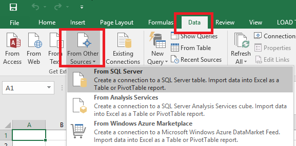
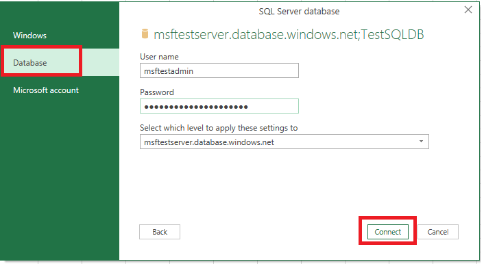
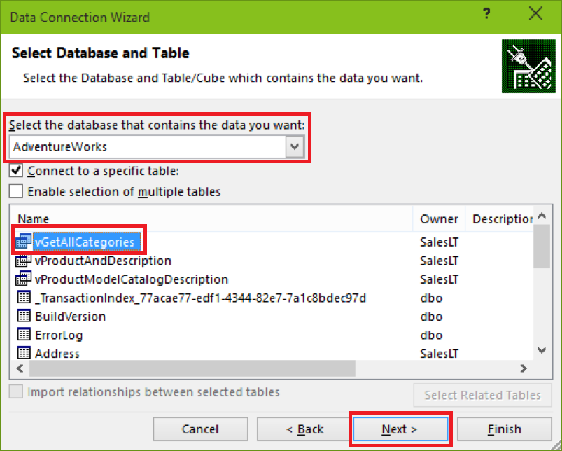
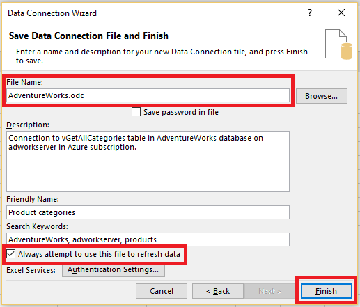
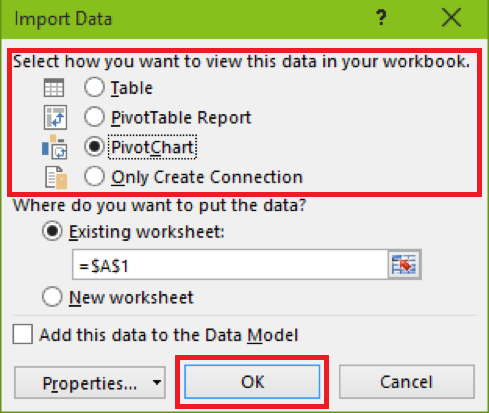
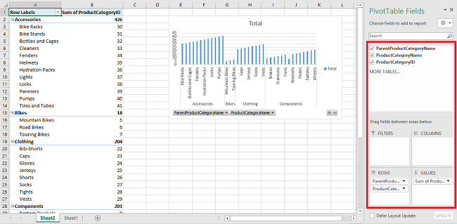
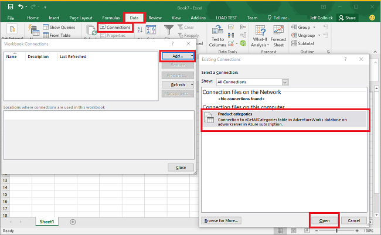

<properties
	pageTitle="Connect Excel to SQL Database | Microsoft Azure"
	description="Learn how to connect Microsoft Excel to Azure SQL database in the cloud. Import data into Excel for reporting and data exploration."
	services="sql-database"
	keywords="connect excel to sql, import data to excel"
	documentationCenter=""
	authors="joseidz"
	manager="jhubbard"
	editor=""/>

<tags
	ms.service="sql-database"
	ms.workload="data-management"
	ms.tgt_pltfrm="na"
	ms.devlang="na"
	ms.topic="get-started-article"
	ms.date="07/05/2016"
	ms.author="joseidz"/>

# SQL Database tutorial: Connect Excel to an Azure SQL database and create a report

> [AZURE.SELECTOR]
- [Visual Studio](sql-database-connect-query.md)
- [SSMS](sql-database-connect-query-ssms.md)
- [Excel](sql-database-connect-excel.md)

Learn how to connect Excel to a SQL database in the cloud so you can import data and create tables and charts based on values in the database. In this tutorial you will set up the connection between Excel and a database table, save the file that stores data and the connection information for Excel, and then create a pivot chart from the database values.

You'll need a SQL database in Azure before you get started. If you don't have one, see [Create your first SQL database](sql-database-get-started.md) to get a database with sample data up and running in a few minutes. In this article, you'll import sample data into Excel from that article, but you can follow similar steps on your own data.

You'll also need a copy of Excel. This article uses [Microsoft Excel 2016](https://products.office.com/en-US/).

## Connect Excel to a SQL database and create an odc file

1.	To connect Excel to SQL database, open Excel and then create a new workbook or open an existing Excel workbook.

2.	In the menu bar at the top of the page click **Data**, click **From Other Sources**, and then click **From SQL Server**.

	

	The Data Connection Wizard opens.

3.	In the **Connect to Database Server** dialog box, type the SQL Database **Server name** you want to connect to in the form <*servername*>**.database.windows.net**. For example, **adworkserver.database.windows.net**.

4.	Under **Log on credentials**, click **Use the following User Name and Password**, type the **User Name** and **Password** you set up for the SQL Database server when you created it, and then click **Next**.

    

	> [AZURE.TIP] Depending on your network environment, you may not be able to connect or you may lose the connection if the SQL Database server doesn't allow traffic from your client IP address. Go to the [Azure portal](https://portal.azure.com/), click SQL servers, click your server, click firewall under settings and add your client IP address. See [How to configure firewall settings](sql-database-configure-firewall-settings.md) for details.

5. In the **Select Database and Table** dialog, select the database you want to work with from the list, and then click the tables or views you want to work with (we chose **vGetAllCategories**), and then click **Next**.

	

    The **Save Data Connection File and Finish** dialog box opens, where you provide information about the Office database connection (*.odc) file that Excel uses. You can leave the defaults or customize your selections.

6. You can leave the defaults, but note the **File Name** in particular. A **Description**, a **Friendly Name**, and **Search Keywords** help you and other users remember what you're connecting to and find the connection. Click **Always attempt to use this file to refresh data** if you want connection information stored in the odc file so it can update when you connect to it, and then click **Finish**.

    

    The **Import data** dialog box appears.

## Import the data into Excel and create a pivot chart
Now that you've established the connection and created the file with data and connection information, you're reading to import the data.

1. In the **Import Data** dialog, click the option you want for presenting your data in the worksheet and then click **OK**. We chose **PivotChart**. You can also choose to create a **New worksheet** or to **Add this data to a Data Model**. For more information on Data Models, see [Create a data model in Excel](https://support.office.com/article/Create-a-Data-Model-in-Excel-87E7A54C-87DC-488E-9410-5C75DBCB0F7B). Click **Properties** to explore information about the odc file you created in the previous step and to choose options for refreshing the data.

	

    The worksheet now has an empty pivot table and chart.

8. Under **PivotTable Fields**, select all the check-boxes for the fields you want to view.

	

> [AZURE.TIP] If you want to connect other Excel workbooks and worksheets to the database, click **Data**, click **Connections**, click **Add**, choose the connection you created from the list, and then click **Open**.
> 

## Next steps

- Learn how to [Connect to SQL Database with SQL Server Management Studio](sql-database-connect-query-ssms.md) for advanced querying and analysis.
- Learn about the benefits of [elastic pools](sql-database-elastic-pool.md).
- Learn how to [create a web application that connects to SQL Database on the back-end](../app-service-web/web-sites-dotnet-deploy-aspnet-mvc-app-membership-oauth-sql-database.md).
