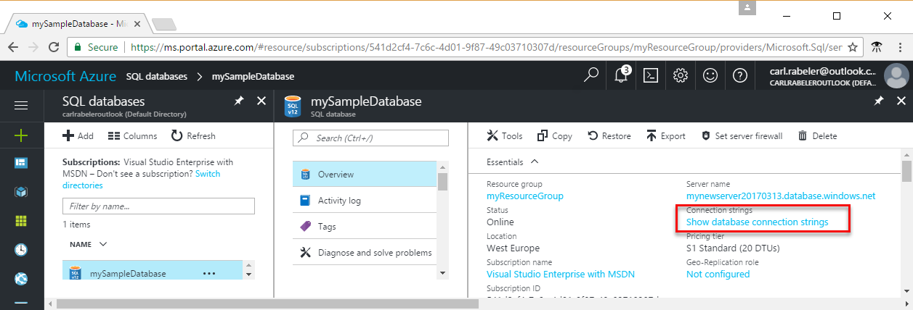

# Azure SQL Database: Use .NET (C#) to connect and query data

Use [C# and ADO.NET](https://msdn.microsoft.com/library/kb9s9ks0.aspx) to connect to and query an Azure SQL database. This guide details using C# to connect to an Azure SQL database, and then execute query, insert, update, and delete statements.

This quick start uses as its starting point the resources created in one of these quick starts:

- [Create DB - Portal](sql-database-get-started-portal.md)
- [Create DB - CLI](sql-database-get-started-cli.md)
- [Create DB - PowerShell](sql-database-get-started-powershell.md) 

Before you start, make sure you have configured your development environment for C#. See [Install Visual Studio Community for free](https://www.visualstudio.com/) or install the [ADO.NET driver for SQL Server](https://www.microsoft.com/net/download).

## Connect to database and query data

Get the connection string in the Azure portal. You use the connection string to connect to the Azure SQL database.

1. Log in to the [Azure portal](https://portal.azure.com/).
2. Select **SQL Databases** from the left-hand menu, and click your database on the **SQL databases** page. 
3. In the **Essentials** pane for your database, locate and click **Show database connection strings**.
4. Copy the **ADO.NET** connection string.

    

5. Open Visual Studio and create a console application.
6. Add ```using System.Data.SqlClient``` to your code file ([System.Data.SqlClient namespace](https://msdn.microsoft.com/library/system.data.sqlclient.aspx)). 

7. Use [SqlCommand.ExecuteReader](https://msdn.microsoft.com/library/system.data.sqlclient.sqlcommand.executereader.aspx) with a [SELECT](https://msdn.microsoft.com/library/ms189499.aspx) Transact-SQL statement, to query data in your Azure SQL database.

    ```csharp
    string strConn = "<connection string>";
    using (var connection = new SqlConnection(strConn))
    {
   connection.Open();

    SqlCommand selectCommand = new SqlCommand("", connection);
    selectCommand.CommandType = CommandType.Text;

    selectCommand.CommandText = @"SELECT TOP 20 pc.Name as CategoryName, p.name as ProductName
        FROM [SalesLT].[ProductCategory] pc
        JOIN [SalesLT].[Product] p
        ON pc.productcategoryid = p.productcategoryid";

    SqlDataReader reader = selectCommand.ExecuteReader();

    while (reader.Read())
    {
        // show data
        Console.WriteLine($"{reader.GetString(0)}\t{reader.GetString(1)}");
    }
    reader.Close();
    }
    ```

## Insert data

Use [SqlCommand.ExecuteNonQuery](https://msdn.microsoft.com/library/system.data.sqlclient.sqlcommand.executenonquery.aspx) with an [INSERT](https://msdn.microsoft.com/library/ms174335.aspx) Transcat-SQL statement to insert data into your Azure SQL database.

```csharp
SqlCommand insertCommand = new SqlCommand("", connection);
insertCommand.CommandType = CommandType.Text;
insertCommand.CommandText = @"INSERT INTO[SalesLT].[Product]
            ( [Name]
            , [ProductNumber]
            , [Color]
            , [StandardCost]
            , [ListPrice]
            , [SellStartDate]
            )
VALUES
(
            @Name,
            @ProductNumber,
            @Color,
            @StandardCost,
            @ListPrice,
            @SellStartDate)";

insertCommand.Parameters.Add("@Name", SqlDbType.Text);
insertCommand.Parameters.Add("@ProductNumber", SqlDbType.Int);
insertCommand.Parameters.Add("@Color", SqlDbType.Text);
insertCommand.Parameters.Add("@StandardCost", SqlDbType.Decimal);
insertCommand.Parameters.Add("@ListPrice", SqlDbType.Decimal);
insertCommand.Parameters.Add("@SellStartDate", SqlDbType.Date);

insertCommand.Parameters["@Name"].Value = "BrandNewProduct";
insertCommand.Parameters["@ProductNumber"].Value = 200989;
insertCommand.Parameters["@Color"].Value = "Blue";
insertCommand.Parameters["@StandardCost"].Value = 75;
insertCommand.Parameters["@ListPrice"].Value = 80;
insertCommand.Parameters["@SellStartDate"].Value = "3/15/2017";

int newrows = insertCommand.ExecuteNonQuery();
Console.WriteLine($"Inserted {newrows.ToString()} row(s).");
```

## Update data

Use [SqlCommand.ExecuteNonQuery](https://msdn.microsoft.com/library/system.data.sqlclient.sqlcommand.executenonquery.aspx) with an [UPDATE](https://msdn.microsoft.com/library/ms177523.aspx) Transact-SQL statement to update data in your Azure SQL database.

```csharp
SqlCommand updateCommand = new SqlCommand("", connection);
updateCommand.CommandType = CommandType.Text;
updateCommand.CommandText = @"UPDATE SalesLT.Product SET ListPrice = @ListPrice WHERE Name = @Name";
updateCommand.Parameters.Add("@Name", SqlDbType.Char);
updateCommand.Parameters.Add("@ListPrice", SqlDbType.Decimal);
updateCommand.Parameters["@ListPrice"].Value = 500;
updateCommand.Parameters["@Name"].Value = "BrandNewProduct";

int updatedrows = updateCommand.ExecuteNonQuery();
Console.WriteLine($"Updated {updatedrows.ToString()} row(s).");
```

## Delete data

Use [SqlCommand.ExecuteNonQuery](https://msdn.microsoft.com/library/system.data.sqlclient.sqlcommand.executenonquery.aspx) with a [DELETE](https://msdn.microsoft.com/library/ms189835.aspx) Transact-SQL statement to delete data in your Azure SQL database.

```csharp
SqlCommand deleteCommand = new SqlCommand("", connection);
deleteCommand.CommandType = CommandType.Text;
deleteCommand.CommandText = @"DELETE FROM SalesLT.Product WHERE Name = @Name";
deleteCommand.Parameters.Add("@Name", SqlDbType.Char);
deleteCommand.Parameters["@Name"].Value = "BrandNewProduct";

int deletedrows = deleteCommand.ExecuteNonQuery();
Console.WriteLine($"Deleted {deletedrows.ToString()} row(s).");
```

## Complete script

The following script contains all of the previous steps in a single code block.

```csharp
using System;
using System.Data;
using System.Data.SqlClient;

namespace ConsoleApplication1
{
    class Program
    {
        static void Main(string[] args)
        {

            string strConn = "<connection string>";

            using (var connection = new SqlConnection(strConn))
            {
                connection.Open();

                Console.WriteLine("Query data example:");
                Console.WriteLine("\n=========================================\n");

                SqlCommand selectCommand = new SqlCommand("", connection);
                selectCommand.CommandType = CommandType.Text;

                selectCommand.CommandText = @"SELECT TOP 20 pc.Name as CategoryName, p.name as ProductName
                   FROM [SalesLT].[ProductCategory] pc
                   JOIN [SalesLT].[Product] p
                   ON pc.productcategoryid = p.productcategoryid";

                SqlDataReader reader = selectCommand.ExecuteReader();

                while (reader.Read())
                {
                    // show data columns
                    Console.WriteLine($"{reader.GetString(0)}\t{reader.GetString(1)}");
                }
                reader.Close();
                Console.WriteLine("\nPress any key to continue ...");
                Console.ReadLine();

                Console.WriteLine("\nInsert data example:");
                Console.WriteLine("=========================================\n");
                SqlCommand insertCommand = new SqlCommand("", connection);
                insertCommand.CommandType = CommandType.Text;
                insertCommand.CommandText = @"INSERT INTO[SalesLT].[Product]
                          ( [Name]
                          , [ProductNumber]
                          , [Color]
                          , [StandardCost]
                          , [ListPrice]
                          , [SellStartDate]
                          )
                VALUES
                (
                            @Name,
                            @ProductNumber,
                            @Color,
                            @StandardCost,
                            @ListPrice,
                            @SellStartDate)";

                insertCommand.Parameters.Add("@Name", SqlDbType.Text);
                insertCommand.Parameters.Add("@ProductNumber", SqlDbType.Int);
                insertCommand.Parameters.Add("@Color", SqlDbType.Text);
                insertCommand.Parameters.Add("@StandardCost", SqlDbType.Decimal);
                insertCommand.Parameters.Add("@ListPrice", SqlDbType.Decimal);
                insertCommand.Parameters.Add("@SellStartDate", SqlDbType.Date);

                insertCommand.Parameters["@Name"].Value = "BrandNewProduct";
                insertCommand.Parameters["@ProductNumber"].Value = 200989;
                insertCommand.Parameters["@Color"].Value = "Blue";
                insertCommand.Parameters["@StandardCost"].Value = 75;
                insertCommand.Parameters["@ListPrice"].Value = 80;
                insertCommand.Parameters["@SellStartDate"].Value = "7/1/2016";

                int newrows = insertCommand.ExecuteNonQuery();
                Console.WriteLine($"Inserted {newrows.ToString()} row(s).");
                Console.WriteLine("\nPress any key to continue ...");
                Console.ReadLine();

                Console.WriteLine("\nUpdate data example:");
                Console.WriteLine("======================\n");
                SqlCommand updateCommand = new SqlCommand("", connection);
                updateCommand.CommandType = CommandType.Text;
                updateCommand.CommandText = @"UPDATE SalesLT.Product SET ListPrice = @ListPrice WHERE Name = @Name";
                updateCommand.Parameters.Add("@Name", SqlDbType.Char);
                updateCommand.Parameters.Add("@ListPrice", SqlDbType.Decimal);
                updateCommand.Parameters["@ListPrice"].Value = 500;
                updateCommand.Parameters["@Name"].Value = "BrandNewProduct";

                int updatedrows = updateCommand.ExecuteNonQuery();
                Console.WriteLine($"Updated {updatedrows.ToString()} row(s).");
                Console.WriteLine("\nPress any key to continue ...");
                Console.ReadLine();

                Console.WriteLine("\nDelete data example:");
                Console.WriteLine("======================\n");
                SqlCommand deleteCommand = new SqlCommand("", connection);
                deleteCommand.CommandType = CommandType.Text;
                deleteCommand.CommandText = @"DELETE FROM SalesLT.Product WHERE Name = @Name";
                deleteCommand.Parameters.Add("@Name", SqlDbType.Char);
                deleteCommand.Parameters["@Name"].Value = "BrandNewProduct";

                int deletedrows = deleteCommand.ExecuteNonQuery();
                Console.WriteLine($"Deleted {deletedrows.ToString()} row(s).");
                Console.WriteLine("\nPress any key to continue ...");
                Console.ReadLine();
            }
        }
    }
}
```

## Next steps

- For .NET documentation, see [.NET documentation](https://docs.microsoft.com/dotnet/).
- For information about querying and editing data using Visual Studio Code, see [Visual Studio Code](https://code.visualstudio.com/docs).
