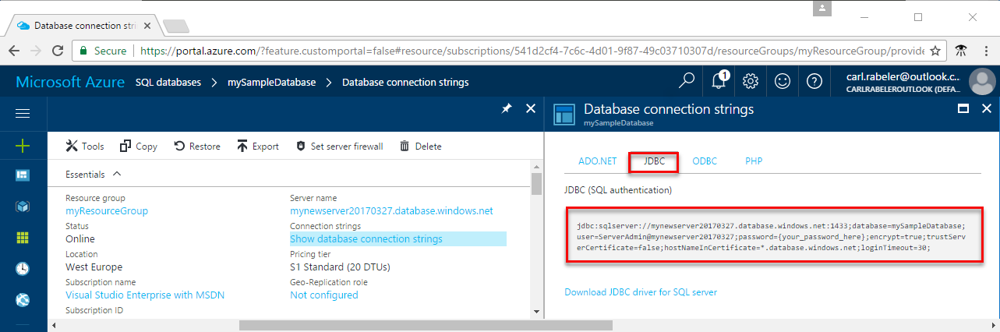

# Azure SQL Database: Use Java to connect and query data

This quick start demonstrates how to use [Java](https://docs.microsoft.com/sql/connect/jdbc/microsoft-jdbc-driver-for-sql-server) to connect to an Azure SQL database, and then use Transact-SQL statements to query, insert, update, and delete data in the database from Mac OS, Ubuntu Linux, and Windows platforms.

This quick start uses as its starting point the resources created in one of these quick starts:

- [Create DB - Portal](sql-database-get-started-portal.md)
- [Create DB - CLI](sql-database-get-started-cli.md)

## Install Java software

The steps in this section assume that you are familar with developing using Java and are new to working with Azure SQL Database. If you are new to developing with Java, go the [Build an app using SQL Server](https://www.microsoft.com/en-us/sql-server/developer-get-started/) and select **Java** and then select your operating system.

### **Mac OS**
Open your terminal and navigate to a directory where you plan on creating your Java project. Enter the following commands to install **brew** and **Maven**. 

```bash
ruby -e "$(curl -fsSL https://raw.githubusercontent.com/Homebrew/install/master/install)"
brew update
brew install maven
```

### **Linux (Ubuntu)**
Open your terminal and navigate to a directory where you plan on creating your Java project. Enter the following commands to install **Maven**. 

```bash
sudo apt-get install maven
```

### **Windows**
Install [Maven](https://maven.apache.org/download.cgi) using the official installer. Maven can be used to help manage dependencies, build, test and run your Java project. 

## Get connection information

Get the connection information needed to connect to the Azure SQL database. You will need the fully qualified server name, database name, and login information in the next procedures.

1. Log in to the [Azure portal](https://portal.azure.com/).
2. Select **SQL Databases** from the left-hand menu, and click your database on the **SQL databases** page. 
3. On the **Overview** page for your database, review the fully qualified server name as shown in the image below. You can hover over the server name to bring up the **Click to copy** option. 

    

4. If you have forgotten the login information for your Azure SQL Database server, navigate to the SQL Database server page to view the server admin name and, if necessary, reset the password.
5. Click **Show database connection strings**.

6. Review the complete **JDBC** connection string.

    	

### **Create Maven project**
From the terminal, create a new Maven project. 
```bash
mvn archetype:generate "-DgroupId=com.sqldbsamples" "-DartifactId=SqlDbSample" "-DarchetypeArtifactId=maven-archetype-quickstart" "-Dversion=1.0.0"
```

Add the **Microsoft JDBC Driver for SQL Server** to the dependencies in ***pom.xml***. 

```xml
<dependency>
	<groupId>com.microsoft.sqlserver</groupId>
	<artifactId>mssql-jdbc</artifactId>
	<version>6.1.0.jre8</version>
</dependency>
```

## Select data

Use the following code to query for the top 20 products by category using the [connection](https://docs.microsoft.com/sql/connect/jdbc/working-with-a-connection) class with a [SELECT](https://docs.microsoft.com/sql/t-sql/queries/select-transact-sql) Transact-SQL statement. Replace the hostHame, dbName, user, and password parameters with the values that you specified when you created the database with the AdventureWorksLT sample data. 

```java
package com.sqldbsamples;

import java.sql.Connection;
import java.sql.Statement;
import java.sql.PreparedStatement;
import java.sql.ResultSet;
import java.sql.DriverManager;

public class App {

	public static void main(String[] args) {
	
		// Connect to database
		String hostName = "your_server.database.windows.net";
		String dbName = "your_database";
		String user = "your_username";
		String password = "your_password";
		String url = String.format("jdbc:sqlserver://%s.database.windows.net:1433;database=%s;user=%s;password=%s;encrypt=true;hostNameInCertificate=*.database.windows.net;loginTimeout=30;", hostName, dbName, user, password);
		Connection connection = null;

		try {
				connection = DriverManager.getConnection(url);
				String schema = connection.getSchema();
				System.out.println("Successful connection - Schema: " + schema);

				System.out.println("Query data example:");
				System.out.println("=========================================");

				// Create and execute a SELECT SQL statement.
				String selectSql = "SELECT TOP 20 pc.Name as CategoryName, p.name as ProductName " 
				    + "FROM [SalesLT].[ProductCategory] pc "  
				    + "JOIN [SalesLT].[Product] p ON pc.productcategoryid = p.productcategoryid";
				
				try (Statement statement = connection.createStatement();
					ResultSet resultSet = statement.executeQuery(selectSql)) {

						// Print results from select statement
						System.out.println("Top 20 categories:");
						while (resultSet.next())
						{
						    System.out.println(resultSet.getString(1) + " "
							    + resultSet.getString(2));
						}
				}
        }
		catch (Exception e) {
		    	e.printStackTrace();
		}
	}
}
```

## Insert data

Use the following code to insert a new product into the SalesLT.Product table using the [Prepared Statements](https://docs.microsoft.com/sql/connect/jdbc/using-statements-with-sql) class with an [INSERT](https://docs.microsoft.com/sql/t-sql/statements/insert-transact-sql) Transact-SQL statement. Replace the hostHame, dbName, user, and password parameters with the values that you specified when you created the database with the AdventureWorksLT sample data. 

```java
package com.sqldbsamples;

import java.sql.Connection;
import java.sql.PreparedStatement;
import java.sql.DriverManager;

public class App {

	public static void main(String[] args) {
	
		// Connect to database
		String hostName = "your_server.database.windows.net";
		String dbName = "your_database";
		String user = "your_username";
		String password = "your_password";
		String url = String.format("jdbc:sqlserver://%s.database.windows.net:1433;database=%s;user=%s;password=%s;encrypt=true;hostNameInCertificate=*.database.windows.net;loginTimeout=30;", hostName, dbName, user, password);
		Connection connection = null;

		try {
				connection = DriverManager.getConnection(url);
				String schema = connection.getSchema();
				System.out.println("Successful connection - Schema: " + schema);

				System.out.println("Insert data example:");
				System.out.println("=========================================");

				// Prepared statement to insert data
				String insertSql = "INSERT INTO SalesLT.Product (Name, ProductNumber, Color, " 
					+ " StandardCost, ListPrice, SellStartDate) VALUES (?,?,?,?,?,?);";

				java.util.Date date = new java.util.Date();
				java.sql.Timestamp sqlTimeStamp = new java.sql.Timestamp(date.getTime());

				try (PreparedStatement prep = connection.prepareStatement(insertSql)) {
						prep.setString(1, "BrandNewProduct");
						prep.setInt(2, 200989);
						prep.setString(3, "Blue");
						prep.setDouble(4, 75);
						prep.setDouble(5, 80);
						prep.setTimestamp(6, sqlTimeStamp);

						int count = prep.executeUpdate();
						System.out.println("Inserted: " + count + " row(s)");
				}
		}
		catch (Exception e) {
		    	e.printStackTrace();
		}
	}
}
```
## Update data

Use the following code to update the new product that you previously added using the [Prepared Statements](https://docs.microsoft.com/sql/connect/jdbc/using-statements-with-sql) class with an [UPDATE](https://docs.microsoft.com/sql/t-sql/queries/update-transact-sql) Transact-SQL statement to update data in your Azure SQL database. Replace the hostHame, dbName, user, and password parameters with the values that you specified when you created the database with the AdventureWorksLT sample data. 

```java
package com.sqldbsamples;

import java.sql.Connection;
import java.sql.PreparedStatement;
import java.sql.DriverManager;

public class App {

	public static void main(String[] args) {
	
		// Connect to database
		String hostName = "your_server.database.windows.net";
		String dbName = "your_database";
		String user = "your_username";
		String password = "your_password";
		String url = String.format("jdbc:sqlserver://%s.database.windows.net:1433;database=%s;user=%s;password=%s;encrypt=true;hostNameInCertificate=*.database.windows.net;loginTimeout=30;", hostName, dbName, user, password);
		Connection connection = null;

		try {
				connection = DriverManager.getConnection(url);
				String schema = connection.getSchema();
				System.out.println("Successful connection - Schema: " + schema);

				System.out.println("Update data example:");
				System.out.println("=========================================");

				// Prepared statement to update data
				String updateSql = "UPDATE SalesLT.Product SET ListPrice = ? WHERE Name = ?";

				try (PreparedStatement prep = connection.prepareStatement(updateSql)) {
						prep.setString(1, "500");
						prep.setString(2, "BrandNewProduct");

						int count = prep.executeUpdate();
						System.out.println("Updated: " + count + " row(s)")
				}
		}
		catch (Exception e) {
		    	e.printStackTrace();
		}
	}
}
```


## Delete data

Use the following code to delete the new product that you previously added using the [Prepared Statements](https://docs.microsoft.com/sql/connect/jdbc/using-statements-with-sql) with a [DELETE](https://docs.microsoft.com/sql/t-sql/statements/delete-transact-sql) Transact-SQL statement . Replace the hostHame, dbName, user, and password parameters with the values that you specified when you created the database with the AdventureWorksLT sample data. 

```java
package com.sqldbsamples;

import java.sql.Connection;
import java.sql.PreparedStatement;
import java.sql.DriverManager;

public class App {

	public static void main(String[] args) {
	
		// Connect to database
		String hostName = "your_server.database.windows.net";
		String dbName = "your_database";
		String user = "your_username";
		String password = "your_password";
		String url = String.format("jdbc:sqlserver://%s.database.windows.net:1433;database=%s;user=%s;password=%s;encrypt=true;hostNameInCertificate=*.database.windows.net;loginTimeout=30;", hostName, dbName, user, password);
		Connection connection = null;

		try {
				connection = DriverManager.getConnection(url);
				String schema = connection.getSchema();
				System.out.println("Successful connection - Schema: " + schema);

				System.out.println("Delete data example:");
				System.out.println("=========================================");

				// Prepared statement to delete data
				String deleteSql = "DELETE SalesLT.Product WHERE Name = ?";

				try (PreparedStatement prep = connection.prepareStatement(deleteSql)) {
						prep.setString(1, "BrandNewProduct");

						int count = prep.executeUpdate();
						System.out.println("Deleted: " + count + " row(s)");
				}
        }		
		catch (Exception e) {
		    	e.printStackTrace();
		}
	}
}
```

## Next steps

- GitHub repository for [Microsoft JDBC Driver for SQL Server](https://github.com/microsoft/mssql-jdbc).
- [File issues/ask questions](https://github.com/microsoft/mssql-jdbc/issues).
- To connect and query using SQL Server Management Studio, see [Connect and query with SSMS](sql-database-connect-query-ssms.md)
- To connect and query using Visual Studio, see [Connect and query with Visual Studio Code](sql-database-connect-query-vscode.md).
- To connect and query using .NET, see [Connect and query with .NET](sql-database-connect-query-dotnet.md).
- To connect and query using PHP, see [Connect and query with PHP](sql-database-connect-query-php.md).
- To connect and query using Node.js, see [Connect and query with Node.js](sql-database-connect-query-nodejs.md).
- To connect and query using Python, see [Connect and query with Python](sql-database-connect-query-python.md).
- To connect and query using Ruby, see [Connect and query with Ruby](sql-database-connect-query-ruby.md).

