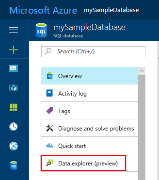
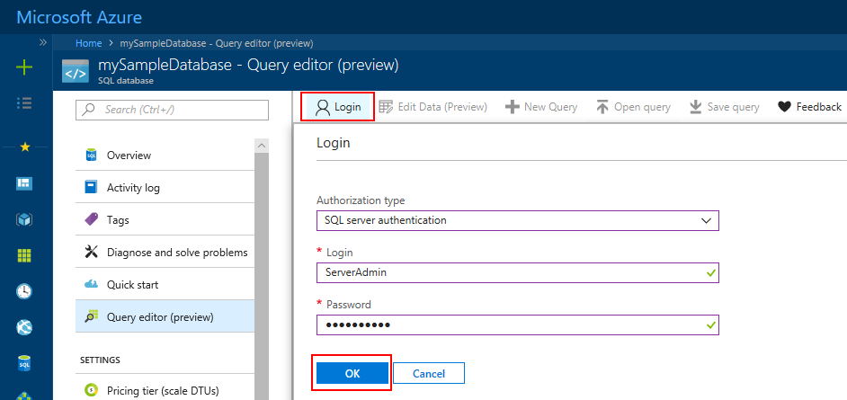
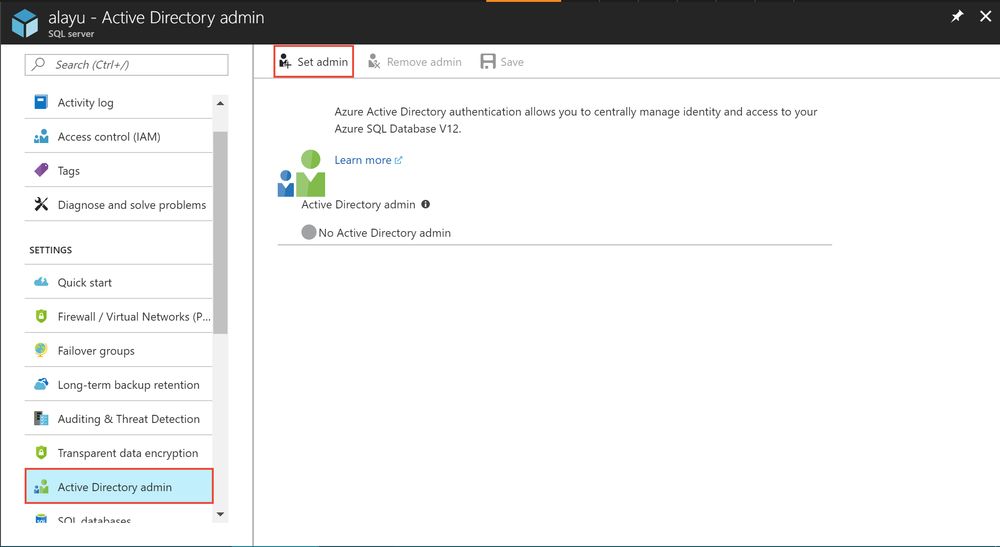
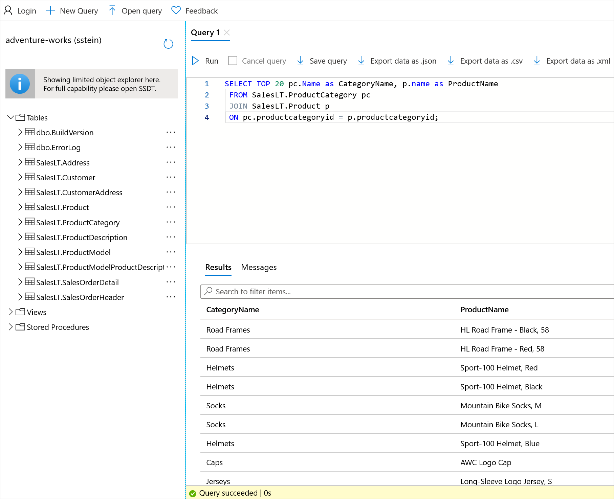

# Quickstart: Use the Azure portal's SQL query editor to connect and query data

The SQL query editor is an Azure portal browser tool providing an easy way to execute SQL queries on your Azure SQL Database or Azure SQL Data Warehouse. In this quickstart, you'll use the query editor to connect to a SQL database and then run Transact-SQL statements to query, insert, update, and delete data.

## Prerequisites

To complete this tutorial, you need:

- An Azure SQL database. You can use one of these quickstarts to create and then configure a database in Azure SQL Database:

  || Single database |
  |:--- |:--- |
  | Create| [Portal](sql-database-single-database-get-started.md) |
  || [CLI](scripts/sql-database-create-and-configure-database-cli.md) |
  || [PowerShell](scripts/sql-database-create-and-configure-database-powershell.md) |
  | Configure | [Server-level IP firewall rule](sql-database-server-level-firewall-rule.md)|
  |||

> [!NOTE]
> The query editor uses ports 443 and 1443 to communicate.  Please ensure you have enabled outbound HTTPS traffic on these ports. You will also need to add your outbound IP address to the server's allowed firewall rules to access your databases and data warehouses.

## Sign in the Azure portal

Sign in to the [Azure portal](https://portal.azure.com/).

## Connect using SQL authentication

1. Select **SQL databases** from the left-hand menu and then select **mySampleDatabase**.

2. In the left-hand menu, find and select **Query editor (preview)**. The **Login** page appears.

    

3. From the **Authorization type** drop-down menu, select  **SQL Server authentication** and enter the user ID and password of the server admin account used to create the database.

    

4. Select **OK**.


## Connect using Azure Active Directory

Configuring an Active Directory (AD) administrator enables you to use a single identity to sign in to the Azure portal and your SQL database. Follow the steps below to configure an AD admin for your SQL server.

> [!NOTE]
> * Email accounts (for example, outlook.com, gmail.com, yahoo.com, and so on) aren't yet supported as AD admins. Make sure to choose a user created either natively in the Azure AD, or federated into the Azure AD.
> * Azure AD admin sign in doesn't work with accounts that have 2-factor authentication enabled.

1. Select **All Resources** from the left-hand menu and then select your SQL server.

2. From your SQL server's **Settings** menu, select **Active Directory admin**.

3. From the AD admin page toolbar, select  **Set admin** and choose the user or group as your AD admin.

    

4. From the AD admin page toolbar, select **Save**.

5. Navigate to the **mySampleDatabase** database and, from the left-hand menu, select **Query editor (preview)**. The **Login** page appears. If you're an AD admin, then, on the right-hand side, under **Active Directory single sign-on**, a message appears saying you have been signed in.

6. Select **OK**.


## View data

1. After you're authenticated, paste the following SQL in the query editor to retrieve the top 20 products by category.

   ```sql
    SELECT TOP 20 pc.Name as CategoryName, p.name as ProductName
    FROM SalesLT.ProductCategory pc
    JOIN SalesLT.Product p
    ON pc.productcategoryid = p.productcategoryid;
   ```

2. On the toolbar, select **Run** and then review the output in the **Results** pane.



## Insert data

Run the following [INSERT](https://msdn.microsoft.com/library/ms174335.aspx) Transact-SQL statement to add a new product in the `SalesLT.Product` table.

1. Replace the previous query with this one.

   ```sql
   INSERT INTO [SalesLT].[Product]
           ( [Name]
           , [ProductNumber]
           , [Color]
           , [ProductCategoryID]
		   , [StandardCost]
		   , [ListPrice]
		   , [SellStartDate]
		   )
     VALUES
           ('myNewProduct'
           ,123456789
           ,'NewColor'
           ,1
		   ,100
		   ,100
		   ,GETDATE() );
   ```


2. Select **Run**  to insert a new row in the `Product` table. The **Messages** pane displays **Query succeeded: Affected rows: 1**.


## Update data

Run the following [UPDATE](https://msdn.microsoft.com/library/ms177523.aspx) Transact-SQL statement to modify your new product.

1. Replace the previous query with this one.

   ```sql
   UPDATE [SalesLT].[Product]
   SET [ListPrice] = 125
   WHERE Name = 'myNewProduct';
   ```

2. Select **Run** to update the specified row in the `Product` table. The **Messages** pane displays **Query succeeded: Affected rows: 1**.

## Delete data

Run the following [DELETE](https://msdn.microsoft.com/library/ms189835.aspx) Transact-SQL statement to remove your new product.

1. Replace the previous query with this one:

   ```sql
   DELETE FROM [SalesLT].[Product]
   WHERE Name = 'myNewProduct';
   ```

2. Select **Run** to delete the specified row in the `Product` table. The **Messages** pane displays **Query succeeded: Affected rows: 1**.


## Query editor considerations

There are a few things to know when working with the query editor.

* The query editor uses ports 443 and 1443 to communicate.  Please ensure you have enabled outbound HTTPS traffic on these ports. You will also need to add your outbound IP address to the server's allowed firewall rules to access your databases and data warehouses.

* Pressing F5 refreshes the query editor page and any query being worked on is lost.

* Query editor doesn't support connecting to the `master` database.

* There's a 5-minute timeout for query execution.

* The query editor only supports cylindrical projection for geography data types.

* There's no support for IntelliSense for database tables and views. However, the editor does support autocomplete on names that have already been typed.


## Next steps

To learn more about the Transact-SQL supported in Azure SQL databases, see [Resolving Transact-SQL differences during migration to SQL Database](sql-database-transact-sql-information.md).
