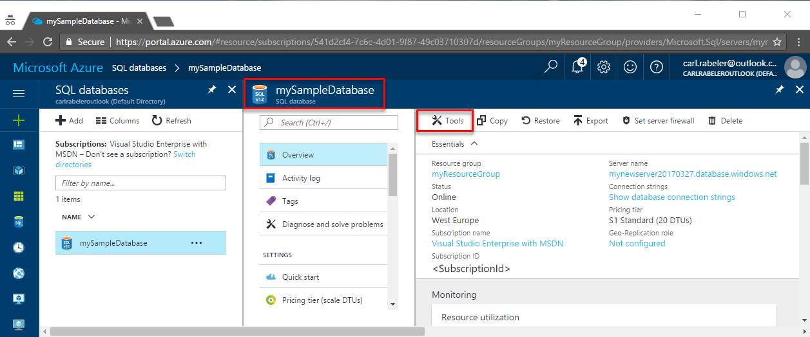

# Azure portal: Use the SQL Query Editor to connect and query data

The SQL Query Editor is a browser query tool that provides an efficient and lightweight way to execute SQL queries on your Azure SQL Database or Azure SQL Data Warehouse without leaving the Azure portal. This quick start demonstrates how to use the Query Editor to connect to a SQL database, and then use Transact-SQL statements to query, insert, update, and delete data in the database. 

## Prerequisites

This quick start uses as its starting point the resources created in one of these quick starts:

- [Create DB - Portal](sql-database-get-started-portal.md)
- [Create DB - CLI](sql-database-get-started-cli.md)
- [Create DB - PowerShell](sql-database-get-started-powershell.md)


## Log in to the Azure portal

Log in to the [Azure portal](https://portal.azure.com/).


## Connect using SQL Authentication
> [!NOTE]
> Make sure that the "Allow access to Azure Services" option is set to "ON" in your SQL Server firewall settings. This option gives the SQL Query Editor access to your databases and data warehouses.

1. Click **SQL databases** from the left-hand menu and click the database you would like to query.

2. On the SQL database page for your database, click **Tools** on the toolbar. The Tools page opens.

    

3. Click **Query editor (preview)**, click the **Preview terms** checkbox, and then click **OK**. The Query editor page opens.

4. Click **Login** and then, when prompted, select **SQL Server authentication** and then provide the server admin login and password you provided when creating the database.

     

5. Click **OK to login**.


## Connect using Azure AD

Configuring an Active Directory administrator enables you to use a single identity to login to the Azure portal and your SQL database. Follow the steps below to configure an active directory admin for the SQL Server you created.

> [!NOTE]
> Email accounts (for example outlook.com, hotmail.com, live.com, gmail.com, yahoo.com) are not yet supported as Active Directory administrators. Make sure to choose a user that was either created natively in the Azure Active Directory, or federated into the Azure Active directory.

1. Select **SQL Servers** from the left-hand menu, and select your SQL Server from the server list.

2. Select the **Active Directory Admin** setting from the settings menu of your SQL Server.

3. In the Active Directory admin blade, click the **Set admin** command, and select the user or group that will be the Active Directory administrator.

     

4. At the top of the Active Directory admin blade, click the **Save** command to set your Active Directory administrator.

Navigate to the SQL database you would like to query, click the **Tools command** on the toolbar, and select the **Query editor (preview)** option. The Query editor page opens and automatically connects you to the database.


## Run query using Query Editor

After you are authenticated, type the following query in the Query editor pane to query for the top 20 products by category.

```sql
 SELECT TOP 20 pc.Name as CategoryName, p.name as ProductName
 FROM SalesLT.ProductCategory pc
 JOIN SalesLT.Product p
 ON pc.productcategoryid = p.productcategoryid;
```

Click **Run** and then review the query results in the **Results** pane.


## Insert data using Query Editor

Use the following code to insert a new product into the SalesLT.Product table using the [INSERT](https://msdn.microsoft.com/library/ms174335.aspx) Transact-SQL statement.

1. In the query window, replace the previous query with the following query:

   ```sql
   INSERT INTO [SalesLT].[Product]
           ( [Name]
           , [ProductNumber]
           , [Color]
           , [ProductCategoryID]
		   , [StandardCost]
		   , [ListPrice]
		   , [SellStartDate]
		   )
     VALUES
           ('myNewProduct'
           ,123456789
           ,'NewColor'
           ,1
		   ,100
		   ,100
		   ,GETDATE() );
   ```

2. On the toolbar, click **Run**  to insert a new row in the Product table.

## Update data using Query Editor

Use the following code to update the new product that you previously added using the [UPDATE](https://msdn.microsoft.com/library/ms177523.aspx) Transact-SQL statement.

1. In the query window, replace the previous query with the following query:

   ```sql
   UPDATE [SalesLT].[Product]
   SET [ListPrice] = 125
   WHERE Name = 'myNewProduct';
   ```

2. On the toolbar, click **Run** to update the specified row in the Product table.

## Delete data using Query Editor

Use the following code to delete the new product that you previously added using the [DELETE](https://msdn.microsoft.com/library/ms189835.aspx) Transact-SQL statement.

1. In the query window, replace the previous query with the following query:

   ```sql
   DELETE FROM [SalesLT].[Product]
   WHERE Name = 'myNewProduct';
   ```

2. On the toolbar, click **Run** to delete the specified row in the Product table.


## Query Editor considerations

There are a few things to know when working with the Query Editor while it remains in preview state:

1. Make sure that you have set the "Allow access to Azure Services" option in your Azure SQL Server firewall settings to "ON". This option gives the SQL Query Editor access to your SQL databases and datawarehouses.

2. Azure Active Directory Administrator login does not work with accounts that have 2-factor authenticated enabled. 

3. Email accounts (for example outlook.com, hotmail.com, live.com, gmail.com, yahoo.com) are not yet supported as Active Directory administrators. Make sure to choose a user that was either created natively in the Azure Active Directory, or federated into the Azure Active directory

4. Spatial data types queries are not yet supported in the Query editor. Querying spatial columns will result in a 'System.IO.FileNotFoundException' error.

5. There is no support for IntelliSense for database tables and views. However, the editor does support auto-complete on names that have already been typed. 

6. Pressing the F5 key will refresh the Query editor page and lose the query that is being worked on. Use the Run button on the toolbar to execute queries.


## Next steps

- To learn about the Transact-SQL supported in Azure SQL databases, see [Transact-SQL differences in SQL database](sql-database-transact-sql-information.md).
