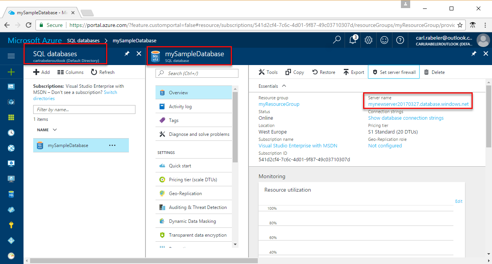

# Azure SQL Database: Use Python to connect and query data

 This quick start demonstrates how to use [Python](https://python.org) to connect to an Azure SQL database; then use Transact-SQL statements to query, insert, update, and delete data in the database from Mac OS, Ubuntu Linux, and Windows platforms.

## Prerequisites

This quick start uses as its starting point the resources created in one of these quick starts:

- [Create DB - Portal](sql-database-get-started-portal.md)
- [Create DB - CLI](sql-database-get-started-cli.md)
- [Create DB - PowerShell](sql-database-get-started-powershell.md)

## Install the Python and database communication libraries

The steps in this section assume that you are familiar with developing using Python and are new to working with Azure SQL Database. If you are new to developing with Python, go the [Build an app using SQL Server](https://www.microsoft.com/sql-server/developer-get-started/) and select **Python** and then select your operating system.

### **Mac OS**
Open your terminal and navigate to a directory where you plan on creating your python script. Enter the following commands to install **brew**, **Microsoft ODBC Driver for Mac** and **pyodbc**. pyodbc uses the Microsoft ODBC Driver on Linux to connect to SQL Databases.

``` bash
ruby -e "$(curl -fsSL https://raw.githubusercontent.com/Homebrew/install/master/install)"
brew tap microsoft/msodbcsql https://github.com/Microsoft/homebrew-msodbcsql-preview
brew update
brew install msodbcsql 
#for silent install ACCEPT_EULA=y brew install msodbcsql
sudo pip install pyodbc==3.1.1
```

### **Linux (Ubuntu)**
Open your terminal and navigate to a directory where you plan on creating your python script. Enter the following commands to install the **Microsoft ODBC Driver for Linux** and **pyodbc**. pyodbc uses the Microsoft ODBC Driver on Linux to connect to SQL Databases.

```bash
sudo su
curl https://packages.microsoft.com/keys/microsoft.asc | apt-key add -
curl https://packages.microsoft.com/config/ubuntu/16.04/prod.list > /etc/apt/sources.list.d/mssql.list
exit
sudo apt-get update
sudo apt-get install msodbcsql mssql-tools unixodbc-dev
sudo pip install pyodbc==3.1.1
```

### **Windows**
Install the [Microsoft ODBC Driver 13.1](https://www.microsoft.com/download/details.aspx?id=53339) (upgrade the driver if prompted). Pyodbc uses the Microsoft ODBC Driver on Linux to connect to SQL Databases. 

Then install **pyodbc** using pip.

```cmd
pip install pyodbc==3.1.1
```

Instructions to enable the use pip can be found [here](http://stackoverflow.com/questions/4750806/how-to-install-pip-on-windows)

## SQL server connection information

Get the connection information needed to connect to the Azure SQL database. You will need the fully qualified server name, database name, and login information in the next procedures.

1. Log in to the [Azure portal](https://portal.azure.com/).
2. Select **SQL Databases** from the left-hand menu, and click your database on the **SQL databases** page. 
3. On the **Overview** page for your database, review the fully qualified server name as shown in the image below. You can hover over the server name to bring up the **Click to copy** option. 

    

4. If you forget your server login information, navigate to the SQL Database server page to view the server admin name and, if necessary, reset the password.     
   
## Select Data

Use the following code to query for the top 20 products by category using the [pyodbc.connect](https://github.com/mkleehammer/pyodbc/wiki) function with a [SELECT](https://docs.microsoft.com/sql/t-sql/queries/select-transact-sql) Transact-SQL statement. The [cursor.execute](https://github.com/mkleehammer/pyodbc/wiki/Cursor) function is used to retrieve a result set from a query against SQL Database. This function accepts a query and returns a result set that can be iterated over with the use of **cursor.fetchone()**. Replace the server, database, username, and password parameters with the values that you specified when you created the database with the AdventureWorksLT sample data.

```Python
import pyodbc
server = 'your_server.database.windows.net'
database = 'your_database'
username = 'your_username'
password = 'your_password'
driver= '{ODBC Driver 13 for SQL Server}'
cnxn = pyodbc.connect('DRIVER='+driver+';PORT=1433;SERVER='+server+';PORT=1443;DATABASE='+database+';UID='+username+';PWD='+ password)
cursor = cnxn.cursor()
cursor.execute("SELECT TOP 20 pc.Name as CategoryName, p.name as ProductName FROM [SalesLT].[ProductCategory] pc JOIN [SalesLT].[Product] p ON pc.productcategoryid = p.productcategoryid")
row = cursor.fetchone()
while row:
    print str(row[0]) + " " + str(row[1])
    row = cursor.fetchone()
```

## Insert data
Use the following code to insert a new product into the SalesLT.Product table using the [cursor.execute](https://github.com/mkleehammer/pyodbc/wiki/Cursor) function and the [INSERT](https://docs.microsoft.com/sql/t-sql/statements/insert-transact-sql) Transact-SQL statement. Replace the server, database, username, and password parameters with the values that you specified when you created the database with the AdventureWorksLT sample data.

```Python
import pyodbc
server = 'your_server.database.windows.net'
database = 'your_database'
username = 'your_username'
password = 'your_password'
driver= '{ODBC Driver 13 for SQL Server}'
cnxn = pyodbc.connect('DRIVER='+driver+';PORT=1433;SERVER='+server+';PORT=1443;DATABASE='+database+';UID='+username+';PWD='+ password)
cursor = cnxn.cursor()
with cursor.execute("INSERT INTO SalesLT.Product (Name, ProductNumber, Color, StandardCost, ListPrice, SellStartDate) OUTPUT INSERTED.ProductID VALUES ('BrandNewProduct', '200989', 'Blue', 75, 80, '7/1/2016')"): 
	print ('Successfuly Inserted!')
cnxn.commit()
```

## Update data
Use the following code to update the new product that you previously added using the [cursor.execute](https://github.com/mkleehammer/pyodbc/wiki/Cursor) function and the [UPDATE](https://docs.microsoft.com/sql/t-sql/queries/update-transact-sql) Transact-SQL statement. Replace the server, database, username, and password parameters with the values that you specified when you created the database with the AdventureWorksLT sample data.

```Python
import pyodbc
server = 'your_server.database.windows.net'
database = 'your_database'
username = 'your_username'
password = 'your_password'
driver= '{ODBC Driver 13 for SQL Server}'
cnxn = pyodbc.connect('DRIVER='+driver+';PORT=1433;SERVER='+server+';PORT=1443;DATABASE='+database+';UID='+username+';PWD='+ password)
cursor = cnxn.cursor()
tsql = "UPDATE SalesLT.Product SET ListPrice = ? WHERE Name = ?"
with cursor.execute(tsql,50,'BrandNewProduct'):
	print ('Successfuly Updated!')
cnxn.commit()

```

## Delete data
Use the following code to delete the new product that you previously added using the [cursor.execute](https://github.com/mkleehammer/pyodbc/wiki/Cursor) function and the [DELETE](https://docs.microsoft.com/sql/t-sql/statements/delete-transact-sql) Transact-SQL statement. Replace the server, database, username, and password parameters with the values that you specified when you created the database with the AdventureWorksLT sample data.

```Python
import pyodbc
server = 'your_server.database.windows.net'
database = 'your_database'
username = 'your_username'
password = 'your_password'
driver= '{ODBC Driver 13 for SQL Server}'
cnxn = pyodbc.connect('DRIVER='+driver+';PORT=1433;SERVER='+server+';PORT=1443;DATABASE='+database+';UID='+username+';PWD='+ password)
cursor = cnxn.cursor()
tsql = "DELETE FROM SalesLT.Product WHERE Name = ?"
with cursor.execute(tsql,'BrandNewProduct'):
    print ('Successfuly Deleted!')
cnxn.commit()
```

## Next steps

- [Design your first Azure SQL database](sql-database-design-first-database.md)
- [Microsoft Python Drivers for SQL Server](https://docs.microsoft.com/sql/connect/python/python-driver-for-sql-server/)
- [Python Developer Center](https://azure.microsoft.com/develop/python/?v=17.23h)

