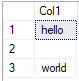
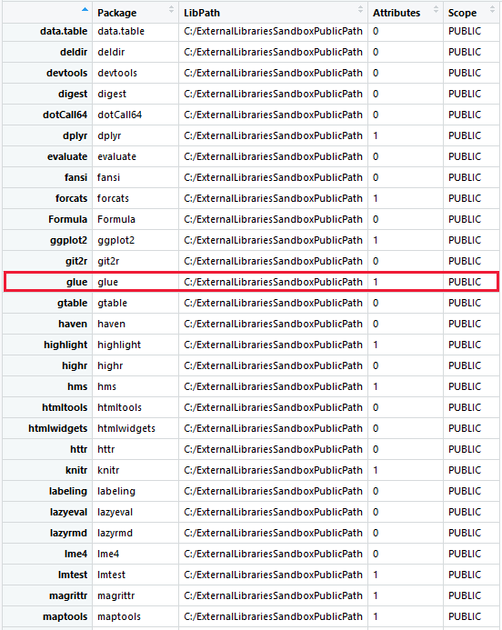

# Quickstart: Use Machine Learning Services (with R) in Azure SQL Database (preview)

This article explains how you can use the public preview of Machine Learning Services (with R) in Azure SQL Database. It walks you through the basics of moving data between a SQL database and R. It also explains how to wrap well-formed R code in the stored procedure [sp_execute_external_script](https://docs.microsoft.com/sql/relational-databases/system-stored-procedures/sp-execute-external-script-transact-sql) to build, train, and use machine learning models in a SQL database.

Machine learning in SQL Database is used to execute R code and functions and the code is fully available to relational data as stored procedures, as T-SQL script containing R statements, or as R code containing T-SQL. Use the power of enterprise R packages to deliver advanced analytics at scale, and the ability to bring calculations and processing to where the data resides, eliminating the need to pull data across the network.

If you don't have an Azure subscription, create a [free account](https://azure.microsoft.com/free/) before you begin.

## Sign up for the preview

The public preview of Machine Learning Services (with R) in SQL Database is not enabled by default. Send an email to Microsoft at [sqldbml@microsoft.com](mailto:sqldbml@microsoft.com) to sign up for the public preview.

Once you are enrolled in the program, Microsoft will onboard you to the public preview and either migrate your existing database or create a new databases on an R enabled service.

Machine Learning Services (with R) in SQL Database is currently only available in the vCore-based purchasing model in the **General Purpose** and **Business Critical** service tiers for single and pooled databases. In this initial public preview, neither the **Hyperscale** service tier nor **Managed Instance** are supported. You should not use Machine Learning Services with R for production workloads during the public preview.

When Machine Learning Services (with R) has been enabled for your SQL database, return to this page to learn how to execute R scripts in the context of a stored procedure.

Currently, R is the only supported language. There is no support for Python at this time.

## Prerequisites

To run the example code in these exercises, you must first have a SQL database with Machine Learning Services (with R) enabled. During the public preview, Microsoft will onboard you and enable machine learning for your existing or new database, as described above.

You can connect to the SQL Database and run the R scripts any database management or query tool, as long as it can connect to a SQL Database, and run a T-SQL query or stored procedure. This quickstart uses [SQL Server Management Studio](sql-database-connect-query-ssms.md).

For the [add a package](#add-package) exercise, you will also need to install [R](https://www.r-project.org/) and [RStudio Desktop](https://www.rstudio.com/products/rstudio/download/) on your local computer.

This quickstart also requires that you configure a server-level firewall rule. For a quickstart showing how to do this, see [Create server-level firewall rule](sql-database-get-started-portal-firewall.md).

## Different from SQL Server

The functionality of Machine Learning Services (with R) in Azure SQL Database is similar to [SQL Server Machine Learning Services](https://review.docs.microsoft.com/sql/advanced-analytics/what-is-sql-server-machine-learning). However, there are some differences:

- R only. Currently there is no support for Python.
- No need to configure `external scripts enabled` via `sp_configure`.
- Packages have to be installed via **sqlmlutils**.
- There is no separate external resource governance. R resources are a certain percentage of the SQL resources, depending on the tier.

## Verify R exists

You can confirm that Machine Learning Services (with R) is enabled for your SQL database. Follow the steps below.

1. Open SQL Server Management Studio and connect to your SQL database.

1. Run the code below. 

    ```sql
    EXECUTE sp_execute_external_script
    @language =N'R',
    @script=N'print(31 + 11)';
    GO
    ```
    If all is well, you should see a result message like this one.

    ```text
    STDOUT message(s) from external script: 
    42
    ```

1. If you get any errors, it might be because the public preview of Machine Learning Services (with R) is not enabled for your SQL database. See how to sign up for the public preview above.

## Basic R interaction

There are two ways you can run R code in SQL Database:

+ Add a R script as an argument of the system stored procedure, [sp_execute_external_script](https://docs.microsoft.com/sql//relational-databases/system-stored-procedures/sp-execute-external-script-transact-sql.md).
+ From a [remote R client](https://review.docs.microsoft.com/sql/advanced-analytics/r/set-up-a-data-science-client), connect to your SQL database, and execute code using the SQL Database as the compute context.

The following exercise is focused on the first interaction model: how to pass R code to a stored procedure.

1. Run a simple script to see how an R script can executed in your SQL database.

    ```sql
    EXECUTE sp_execute_external_script
    @language = N'R',
    @script = N'
    a <- 1
    b <- 2
    c <- a/b
    d <- a*b
    print(c, d)'
    ```

2. Assuming that you have everything set up correctly the correct result is calculated, and the R `print` function returns the result to the **Messages** window.

    **Results**

    ```text
    STDOUT message(s) from external script: 
    0.5 2
    ```

    While getting **stdout** messages is useful when testing your code, more often you need to return the results in tabular format, so that you can use it in an application or write it to a table. See the inputs and outputs section below for more information.

Remember, everything inside the `@script` argument must be valid R code.

## Inputs and outputs

By default, [sp_execute_external_script](https://review.docs.microsoft.com/sql/relational-databases/system-stored-procedures/sp-execute-external-script-transact-sql.md) accepts a single input dataset, which typically you supply in the form of a valid SQL query. Other types of input can be passed as SQL variables.

The stored procedure returns a single R data frame as output, but you can also output scalars and models as variables. For example, you can output a trained model as a binary variable and pass that to a T-SQL INSERT statement, to write that model to a table. You can also generate plots (in binary format) or scalars (individual values, such as the date and time, the time elapsed to train the model, and so forth).

For now, let's look at just the default input and output variables of sp_execute_external_script: `InputDataSet` and `OutputDataSet`.

1. Create a small table of test data by running the following T-SQL statement:

    ```sql
    CREATE TABLE RTestData (col1 INT NOT NULL)
    INSERT INTO RTestData VALUES (1);
    INSERT INTO RTestData VALUES (10);
    INSERT INTO RTestData VALUES (100);
    GO
    ```

    When the table has been created, use the following statement to query the table:
  
    ```sql
    SELECT * FROM RTestData
    ```

    **Results**

    

2. You can get the data from the table as input to your R script. Run the statement below. It gets the data from the table, makes a round trip through the R runtime, and returns the values with the column name *NewColName*.

    The data returned by the query is passed to the R runtime, which returns the data to SQL Database as a data frame. The WITH RESULT SETS clause defines the schema of the returned data table for SQL Database.

    ```sql
    EXECUTE sp_execute_external_script
        @language = N'R'
        , @script = N'OutputDataSet <- InputDataSet;'
        , @input_data_1 = N'SELECT * FROM RTestData;'
    WITH RESULT SETS (([NewColName] INT NOT NULL));
    ```

    **Results**

    

3. Let's change the name of the input or output variables. The script above used the default input and output variable names, _InputDataSet_ and _OutputDataSet_. To define the input data associated with  _InputDatSet_, you use the *@input_data_1* variable.

    In this script, the names of the output and input variables for the stored procedure have been changed to *SQL_out* and *SQL_in*:

    ```sql
    EXECUTE sp_execute_external_script
      @language = N'R'
      , @script = N' SQL_out <- SQL_in;'
      , @input_data_1 = N' SELECT 12 as Col;'
      , @input_data_1_name  = N'SQL_in'
      , @output_data_1_name =  N'SQL_out'
      WITH RESULT SETS (([NewColName] INT NOT NULL));
    ```

    Note that R is case-sensitive, so the case of the input and output variables in `@input_data_1_name` and `@output_data_1_name` have to match the ones in the R code in `@script`. 

    Also, the order of the parameters is important. You must specify the required parameters *@input_data_1* and *@output_data_1* first, in order to use the optional parameters *@input_data_1_name* and *@output_data_1_name*.

    Only one input dataset can be passed as a parameter, and you can return only one dataset. However, you can call other datasets from inside your R code and you can return outputs of other types in addition to the dataset. You can also add the OUTPUT keyword to any parameter to have it returned with the results. 

    The `WITH RESULT SETS` statement defines the schema for the data which is used in SQL Database. You need to provide SQL compatible data types for each column you return from R. You can use the schema definition to provide new column names too as you do not need to use the column names from the R data frame.

4. You can also generate values using the R script and leave the input query string in _@input_data_1_ blank.

    ```sql
    EXECUTE sp_execute_external_script
        @language = N'R'
        , @script = N' mytextvariable <- c("hello", " ", "world");
            OutputDataSet <- as.data.frame(mytextvariable);'
        , @input_data_1 = N''
    WITH RESULT SETS (([Col1] CHAR(20) NOT NULL));
    ```

    **Results**

    

## Check R version

If you would like to see which version of R is installed in your SQL database, do the following:

1. Run the script below on your SQL database.

    ```SQL
    EXECUTE sp_execute_external_script
    @language =N'R',
    @script=N'print(version)';
    GO
    ```

2. The R `print` function returns the version to the **Messages** window. In the example output below, you can see that SQL Database in this case have R version 3.4.4 installed.

    **Results**

    ```text
    STDOUT message(s) from external script:
                   _
    platform       x86_64-w64-mingw32
    arch           x86_64
    os             mingw32
    system         x86_64, mingw32
    status
    major          3
    minor          4.4
    year           2018
    month          03
    day            15
    svn rev        74408
    language       R
    version.string R version 3.4.4 (2018-03-15)
    nickname       Someone to Lean On
    ```

## List R packages

Microsoft provides a number of R packages pre-installed with Machine Learning Services in your SQL database. To see a list of which R packages are installed, including version, dependencies, license, and library path information, follow the steps below. To add additional packages, see the [add a package](#add-package) section.

1. Run the script below on your SQL database.

    ```SQL
    EXECUTE sp_execute_external_script @language = N'R'
    , @script = N'
    OutputDataSet <- data.frame(installed.packages()[,c("Package", "Version", "Depends", "License", "LibPath")]);'
    WITH result sets((Package NVARCHAR(255), Version NVARCHAR(100), Depends NVARCHAR(4000)
        , License NVARCHAR(1000), LibPath NVARCHAR(2000)));
    ```

2. The output is from `installed.packages()` in R and returned as a result set.

    **Results**

    


## Create a predictive model

You can train a model using R and save the model to a table in your SQL database. In this exercise, you will train a simple regression model that predicts the stopping distance of a car based on speed. You'll use the `cars` dataset included with R, because it is small and easy to understand.

1. First, create a table to save the training data.

    ```sql
    CREATE TABLE dbo.CarSpeed (speed INT NOT NULL, distance INT NOT NULL)
    GO
    INSERT INTO dbo.CarSpeed (speed, distance)
    EXEC sp_execute_external_script
    @language = N'R'
        , @script = N'car_speed <- cars;'
        , @input_data_1 = N''
        , @output_data_1_name = N'car_speed'
    GO
    ```

    Many datasets, small and large, are included with the R runtime. To get a list of datasets installed with R,  type `library(help="datasets")` from an R command prompt.

2. Create a regression model. The car speed data contains two columns, both numeric, `dist` and`speed`. There are multiple observations of some speeds. From this data, you will create a linear regression model that describes some relationship between car speed and the distance required to stop a car.

    The requirements of a linear model are simple:

    - Define a formula that describes the relationship between the dependent variable `speed` and the independent variable `distance`.

    - Provide input data to use in training the model.

    > [!TIP]
    > If you need a refresher on linear models, we recommend this tutorial, which describes the process of fitting a model using rxLinMod: [Fitting Linear Models](https://docs.microsoft.com/r-server/r/how-to-revoscaler-linear-model)

    To build the model, you define the formula inside your R code, and pass the data as an input parameter.

    ```sql
    DROP PROCEDURE IF EXISTS generate_linear_model;
    GO
    CREATE PROCEDURE generate_linear_model
    AS
    BEGIN
        EXEC sp_execute_external_script
        @language = N'R'
        , @script = N'lrmodel <- rxLinMod(formula = distance ~ speed, data = CarsData);
            trained_model <- data.frame(payload = as.raw(serialize(lrmodel, connection=NULL)));'
        , @input_data_1 = N'SELECT [speed], [distance] FROM CarSpeed'
        , @input_data_1_name = N'CarsData'
        , @output_data_1_name = N'trained_model'
        WITH RESULT SETS ((model VARBINARY(max)));
    END;
    GO
    ```

    The first argument to rxLinMod is the *formula* parameter, which defines distance as dependent on speed. The input data is stored in the variable `CarsData`, which is populated by the SQL query. If you don't assign a specific name to your input data, the default variable name would be _InputDataSet_.

2. Next, create a table where you store the model so you can retrain or use it for prediction. The output of an R package that creates a model is usually a **binary object**. Therefore, the table must provide a column of **VARBINARY(max)** type.

    ```sql
    CREATE TABLE dbo.stopping_distance_models (
        model_name VARCHAR(30) NOT NULL DEFAULT('default model') PRIMARY KEY
        , model VARBINARY(max) NOT NULL
    );
    ```
3. To save the model, run the following Transact-SQL statement to call the stored procedure, generate the model, and save it to a table.

    ```sql
    INSERT INTO dbo.stopping_distance_models (model)
    EXEC generate_linear_model;
    ```

    Note that if you run this code a second time, you get this error:

    ```text
    Violation of PRIMARY KEY constraint...Cannot insert duplicate key in object dbo.stopping_distance_models
    ```

    One option for avoiding this error is to update the name for each new model. For example, you could change the name to something more descriptive, and include the model type, the day you created it, and so forth.

    ```sql
    UPDATE dbo.stopping_distance_models
    SET model_name = 'rxLinMod ' + FORMAT(GETDATE(), 'yyyy.MM.HH.mm', 'en-gb')
    WHERE model_name = 'default model'
    ```

4. Generally, the output of R from the stored procedure [sp_execute_external_script](https://review.docs.microsoft.com/sql/relational-databases/system-stored-procedures/sp-execute-external-script-transact-sql.md) is limited to a single data frame.

    However, you can return outputs of other types, such as scalars, in addition to the data frame.

    For example, suppose you want to train a model but immediately view a table of coefficients from the model. You could create the table of coefficients as the main result set, and output the trained model in a SQL variable. You could immediately re-use the model by calling the variable, or you could save the model to a table as shown here.

    ```sql
    DECLARE @model VARBINARY(max), @modelname VARCHAR(30)
    EXEC sp_execute_external_script
        @language = N'R'
        , @script = N'
            speedmodel <- rxLinMod(distance ~ speed, CarsData)
            modelbin <- serialize(speedmodel, NULL)
            OutputDataSet <- data.frame(coefficients(speedmodel));'
        , @input_data_1 = N'SELECT [speed], [distance] FROM CarSpeed'
        , @input_data_1_name = N'CarsData'
        , @params = N'@modelbin varbinary(max) OUTPUT'
        , @modelbin = @model OUTPUT
        WITH RESULT SETS (([Coefficient] FLOAT NOT NULL));

    -- Save the generated model
    INSERT INTO dbo.stopping_distance_models(model_name, model)
    VALUES ('latest model', @model)
    ```

    **Results**

    

## Predict

Use the model you created in the previous section to score predictions against new data. To perform _scoring_ using new data, get one of the trained models from the table, and then call a new set of data on which to base predictions. Scoring is a term sometimes used in data science to mean generating predictions, probabilities, or other values based on new data fed into a trained model.

1. First, create a table with new speed data. Did you notice that the original training data stops at a speed of 25 miles per hour? That's because the original data was based on an experiment from 1920! You might wonder, how long would it take an automobile from the 1920s to stop, assuming it could get going as fast as 60 mph or even 100 mph? To answer this question, you must provide some new speed values.

    ```sql
    CREATE TABLE dbo.NewCarSpeed(speed INT NOT NULL,
        distance INT NULL
    )
    GO
    INSERT dbo.NewCarSpeed(speed)
    VALUES (40), (50), (60), (70), (80), (90), (100)
    ```

    In this example, because your model is based on the **rxLinMod** algorithm provided as part of the **RevoScaleR** package, you call the [rxPredict](https://docs.microsoft.com/r-server/r-reference/revoscaler/rxpredict) function, rather than the generic R `predict` function.

    ```sql
    DECLARE @speedmodel varbinary(max) = 
        (SELECT model FROM dbo.stopping_distance_models WHERE model_name = 'latest model');

    EXEC sp_execute_external_script
        @language = N'R'
        , @script = N'
                current_model <- unserialize(as.raw(speedmodel));
                new <- data.frame(NewCarData);
                predicted.distance <- rxPredict(current_model, new);
                str(predicted.distance);
                OutputDataSet <- cbind(new, ceiling(predicted.distance));
                '
        , @input_data_1 = N'SELECT speed FROM [dbo].[NewCarSpeed]'
        , @input_data_1_name = N'NewCarData'
        , @params = N'@speedmodel varbinary(max)'
        , @speedmodel = @speedmodel
    WITH RESULT SETS ((new_speed INT, predicted_distance INT));
    ```

    The script above performs the following steps:

    + Use a SELECT statement to get a single model from the table, and pass it as an input parameter.

    + After retrieving the model from the table, call the `unserialize` function on the model.

        > [!TIP] 
        > Also check out the new [serialization functions](https://docs.microsoft.com/r-server/r-reference/revoscaler/rxserializemodel) provided by RevoScaleR, which support realtime scoring.
    + Apply the `rxPredict` function with appropriate arguments to the model, and provide the new input data.

    + In the example, the `str` function is added during the testing phase, to check the schema of data being returned from R. You can remove the statement later.

    + The column names used in the R script are not necessarily passed to the stored procedure output. Here we've used the WITH RESULTS clause to define some new column names.

    **Results**

    

    It is also possible to use the [PREDICT in Transact-SQL](https://docs.microsoft.com/sql/t-sql/queries/predict-transact-sql) to generate a predicted value or score based on a stored model.

<a name="add-package"></a>

## Add a package

If you need to use a package that is not already installed in your SQL database, you can install it using [sqlmlutils](https://github.com/Microsoft/sqlmlutils). Follow the steps below to install the package.

1. Download the latest **sqlmlutils** zip file from [github.com/Microsoft/sqlmlutils/tree/master/R/dist](https://github.com/Microsoft/sqlmlutils/tree/master/R/dist) to your local computer. You do not need to unzip the file.

1. If you don't have R installed, download R from [www.r-project.org](https://www.r-project.org/) and install it on your local computer. R is available for Windows, MacOS, and Linux. In this example, we are using Windows.

1. First, install the **RODBCext** package, which is a prerequisite for **sqlmlutils**. **RODBCext** also installs the dependency the **RODBC** package. Open a **Command Prompt** and run the following command:

    ```
    R -e "install.packages('RODBCext', repos='https://cran.microsoft.com')"
    ```

    If you are receiving the error like **'R' is not recognized as an internal or external command, operable program or batch file.**, it likely means that path to R.exe is not included in your **PATH** environment variable on Windows. You can either add the directory to the environment variable or navigate to the directory in the command prompt (for example `cd C:\Program Files\R\R-3.5.1\bin`).

1. Use the **R CMD INSTALL** command to install **sqlmlutils**. Specify the path to the directory you have downloaded the zip file to and the name of the zip file. For example:

    ```
    R CMD INSTALL C:\Users\youruser\Downloads\sqlmlutils_0.5.0.zip
    ```

    The output you get should be similar to the following:

    ```text
    In R CMD INSTALL
    * installing to library 'C:/Users/youruser/Documents/R/win-library/3.5'
    package 'sqlmlutils' successfully unpacked and MD5 sums checked
    ```

1. In this example you will use RStudio Desktop as the IDE. You can use another IDE if you prefer. Download and install RStudio Desktop from [www.rstudio.com/products/rstudio/download/](https://www.rstudio.com/products/rstudio/download/), if you don't already have RStudio installed.

1. Open **RStudio** and create a new **R Script** file. Use the following R code to install a package using sqlmlutils. In the example below, you will install the [glue](https://cran.r-project.org/web/packages/glue/) package, which can format and interpolate a string.

    ```R
    library(sqlmlutils) 
    connection <- connectionInfo(server= "yourserver.database.windows.net", 
        database = "yourdatabase", uid = "yoursqluser", pwd = "yoursqlpassword")
    sql_install.packages(connectionString = connection, pkgs = "glue", verbose = TRUE, scope = "PUBLIC")
    ```

    > [!NOTE]
    > The **scope** can either be **PUBLIC** or **PRIVATE**. Public scope is useful for the database administrator to install packages that all users can use. Private scope makes the package only available to the user who installs it. If you don't specify the scope, the default scope is **PRIVATE**.

1. Now, verify that the **glue** package has been installed.

    ```R
    r<-sql_installed.packages(connectionString = connection, fields=c("Package", "LibPath", "Attributes", "Scope"))
    View(r)
    ```

    **Results**

    


1. Once the package is installed, you can use it in your R script through **sp_execute_external_script**. Open **SQL Server Management Studio** and connect to your SQL database. Run the following script:

    ```sql
    EXEC sp_execute_external_script @language = N'R'
    , @script = N'
    library(glue)

    name <- "Fred"
    age <- 50
    anniversary <- as.Date("2020-06-14")
    text <- glue(''My name is {name}, '',
        ''my age next year is {age + 1}, '',
        ''my anniversary is {format(anniversary, "%A, %B %d, %Y")}.'')
    print(text)
    ';
    ```

    You will see the following result in the Messages tab.

    **Results**

    ```text
    STDOUT message(s) from external script:
    My name is Fred, my age next year is 51, my anniversary is Sunday, June 14, 2020.
    ```

1. If you would like to remove the package, run the following R script in **RStudio** on your local computer.

    ```R
    library(sqlmlutils) 
    connection <- connectionInfo(server= "yourserver.database.windows.net", 
        database = "yourdatabase", uid = "yoursqluser", pwd = "yoursqlpassword")
    sql_remove.packages(connectionString = connection, pkgs = "glue", scope = "PUBLIC") 
    ```

> [!NOTE]
> Another way to install R packages to your SQL database is to uploads the R package to from the  byte stream with [CREATE EXTERNAL LIBRARY](https://docs.microsoft.com/sql/t-sql/statements/create-external-library-transact-sql).

## Next steps

For more information on Machine Learning Services, see the articles below on SQL Server Machine Learning Services. While these articles are for SQL Server, most of the information is also applicable to Machine Learning Services (with R) in Azure SQL Database.

- [SQL Server Machine Learning Services](https://review.docs.microsoft.com/sql/advanced-analytics/what-is-sql-server-machine-learning)
- [Tutorial: Learn in-database analytics using R in SQL Server](https://review.docs.microsoft.com/sql/advanced-analytics/tutorials/sqldev-in-database-r-for-sql-developers)
- [End-to-end data science walkthrough for R and SQL Server](https://review.docs.microsoft.com/sql/advanced-analytics/tutorials/walkthrough-data-science-end-to-end-walkthrough)
- [Tutorial: Use RevoScaleR R functions with SQL Server data](https://review.docs.microsoft.com/sql/advanced-analytics/tutorials/deepdive-data-science-deep-dive-using-the-revoscaler-packages)
