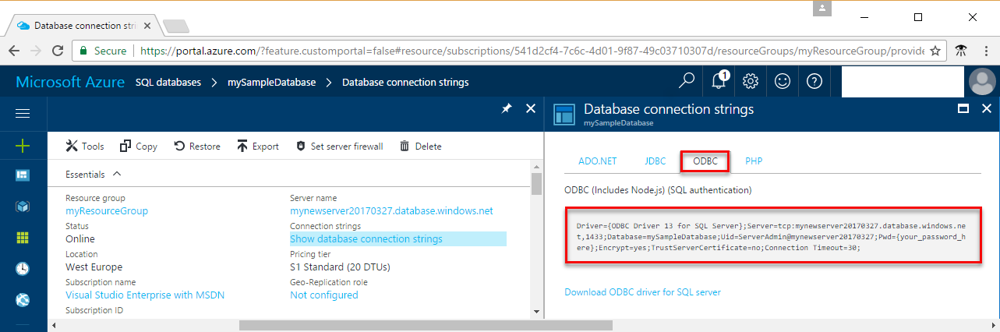

# Azure SQL Database: Use Ruby to connect and query data

Use [Ruby](https://Ruby.org) to connect to and query an Azure SQL database. This guide {should be quick start?} details using Ruby to connect to an Azure SQL database, and then execute query, insert, update, and delete statements.

This quick start uses as its starting point the resources created in one of these quick starts:

- [Create DB - Portal](sql-database-get-started-portal.md)
- [Create DB - CLI](sql-database-get-started-cli.md)

Before you start, make sure you configured your development environment for Ruby. For details, see {insert guidance coming from Andrea!}. 

## Configure Development Environment

//please review this entire section
### **Mac OS**
Open your terminal and navigate to a directory where you plan on creating your ruby script. Enter the following commands to install **brew**, **Microsoft ODBC Driver for Mac** and **FreeTDS**. FreeTDS uses the Microsoft ODBC Driver on Linux to connect to SQL Databases.

```ruby
ruby -e "$(curl -fsSL https://raw.githubusercontent.com/Homebrew/install/master/install)"
brew tap microsoft/msodbcsql https://github.com/Microsoft/homebrew-msodbcsql-preview
brew update
brew install msodbcsql 
#for silent install ACCEPT_EULA=y brew install msodbcsql
brew install FreeTDS
```

### **Linux (Ubuntu)**
Open your terminal and navigate to a directory where you plan on creating your ruby script. Enter the following commands to install the **Microsoft ODBC Driver for Linux** and **FreeTDS**. FreeTDS uses the Microsoft ODBC Driver on Linux to connect to SQL Databases.

```ruby
sudo su
curl https://packages.microsoft.com/keys/microsoft.asc | apt-key add -
curl https://packages.microsoft.com/config/ubuntu/16.04/prod.list > /etc/apt/sources.list.d/mssql.list
exit
sudo apt-get update
sudo apt-get install msodbcsql mssql-tools unixodbc-dev
wget ftp://ftp.freetds.org/pub/freetds/stable/freetds-1.00.27.tar.gz
tar -xzf freetds-1.00.27.tar.gz
cd freetds-1.00.27
./configure --prefix=/usr/local --with-tdsver=7.3
make
make install
```

### **Windows**
Install the [Microsoft ODBC Driver 13.1](https://www.microsoft.com/en-us/download/details.aspx?id=53339). FreeTDS uses the Microsoft ODBC Driver on Linux to connect to SQL Databases. 

Then install FreeTDS using ???

```ruby
???
```

Instructions to enable the use ???


## Get connection information

Get the connection string in the Azure portal. You use the connection string to connect to the Azure SQL database.

1. Log in to the [Azure portal](https://portal.azure.com/).
2. Select **SQL Databases** from the left-hand menu, and click your database on the **SQL databases** page. 
3. In the **Essentials** pane for your database, review the fully qualified server name. 

    

4. Click **Show database connection strings**.

5. Review the complete**ADO.NET** connection string.

    

## Select Data
Use the [TinyTDS::Client][https://github.com/rails-sqlserver/tiny_tds) function with a [SELECT](https://msdn.microsoft.com/library/ms189499.aspx) Transact-SQL statement, to query data in your Azure SQL database. The TinyTDS::Client function accepts a query and returns a result set. The results set is iterated over by using [result.each do |row|](https://github.com/rails-sqlserver/tiny_tds).

```ruby
require 'tiny_tds'
client = TinyTds::Client.new username: 'your_Username', password: 'your_Password',
    host: 'your_Server', port: 1433, database: 'your_Database'
puts 'Connecting to SQL Server'
def active(client)
    if client.active? == true then 'Done.' end
end
puts active(client)

puts "Reading data from table"
tsql = "SELECT TOP 20 pc.Name as CategoryName, p.name as ProductName
        FROM [SalesLT].[ProductCategory] pc
        JOIN [SalesLT].[Product] p
        ON pc.productcategoryid = p.productcategoryid"
result = client.execute(tsql)
result.each do |row|
    puts row
end
```
## Insert data
Use the [TinyTDS::Client][https://github.com/rails-sqlserver/tiny_tds) function with an [INSERT](https://msdn.microsoft.com/library/ms174335.aspx) Transact-SQL statement to insert data into your Azure SQL database.

In this example you will see how to execute an [INSERT](https://msdn.microsoft.com/library/ms174335.aspx) statement safely, pass parameters which protect your application from [SQL injection](https://technet.microsoft.com/library/ms161953(v=sql.105).aspx) vulnerability, and retrieve the auto-generated [Primary Key](https://msdn.microsoft.com/library/ms179610.aspx) value.    
  
To use TinyTDS with Azure, it is recommended that you execute several `SET` statements to change how the current session handles specific information. Recommended `SET` statements are provided in the code sample. For example, `SET ANSI_NULL_DFLT_ON` will allow new columns created to allow null values even if the nullability status of the column is not explicitly stated.  
  
To align with the Microsoft SQL Server [datetime](http://msdn.microsoft.com/library/ms187819.aspx) format, use the [strftime](http://ruby-doc.org/core-2.2.0/Time.html#method-i-strftime) function to cast to the corresponding datetime format.


```ruby
require 'tiny_tds'
client = TinyTds::Client.new username: 'your_Username', password: 'your_Password',
    host: 'your_Server', port: 1433, database: 'your_Database'
puts 'Connecting to SQL Server'
def active(client)
    if client.active? == true then 'Done.' end
end
puts active(client)
insert_sql = client.prepare "INSERT INTO SalesLT.Product (Name, ProductNumber, Color, StandardCost, ListPrice, SellStartDate) VALUES (?, ?, ?, ?, ?)"
insert_sql.execute 'BrandNewProduct', 200989, 'Blue', 75, 80, 7/1/2016'
```

## Update data
Use the [TinyTDS::Client][https://github.com/rails-sqlserver/tiny_tds) function with a [UPDATE](https://msdn.microsoft.com/library/ms189835.aspx) Transact-SQL statement to delete data in your Azure SQL database.

```
require 'tiny_tds'
client = TinyTds::Client.new username: 'your_Username', password: 'your_Password',
    host: 'your_Server', port: 1433, database: 'your_Database'
puts 'Connecting to SQL Server'
def active(client)
    if client.active? == true then 'Done.' end
end
puts active(client)
def update(name, listPrice, client)
    puts "Updating ListPrice for #{name}"
    tsql = "UPDATE SalesLT.Product SET ListPrice = N'#{listPrice}' WHERE Name =N'#{name}";
    result = client.execute(tsql)
    result.each
    puts "#{result.affected_rows} row(s) affected"
end
update(500, 'BrandNewProduct', client)
```


## Delete data
Use the [TinyTDS::Client][https://github.com/rails-sqlserver/tiny_tds) function with a [DELETE](https://msdn.microsoft.com/library/ms189835.aspx) Transact-SQL statement to delete data in your Azure SQL database.

```
require 'tiny_tds'
client = TinyTds::Client.new username: 'your_Username', password: 'your_Password',
    host: 'your_Server', port: 1433, database: 'your_Database'
puts 'Connecting to SQL Server'
def active(client)
    if client.active? == true then 'Done.' end
end
puts active(client)
def delete(name, client)
    puts "Deleting employee #{name}"
    tsql = "DELETE FROM SalesLT.Product WHERE Name = N'#{name}'"
    result = client.execute(tsql)
    result.each
    puts "#{result.affected_rows} row(s) affected"
end
delete('BrandNewProduct', client)
```

## Complete script

The following script contains all of the previous steps in a single code block.

```ruby
# connect
require 'tiny_tds'
client = TinyTds::Client.new username: 'your_username', password: 'your_password',
    host: 'localhost', port: 1433, database: 'SampleDB'
puts 'Connecting to SQL Server'
def active(client)
    if client.active? == true then 'Done.' end
end
puts active(client)

# read from table
puts "Reading data from table"
tsql = "SELECT TOP 20 pc.Name as CategoryName, p.name as ProductName
        FROM [SalesLT].[ProductCategory] pc
        JOIN [SalesLT].[Product] p
        ON pc.productcategoryid = p.productcategoryid"
result = client.execute(tsql)
result.each do |row|
    puts row
end

# insert new product
insert_sql = client.prepare "INSERT INTO SalesLT.Product (Name, ProductNumber, Color, StandardCost, ListPrice, SellStartDate) VALUES (?, ?, ?, ?, ?)"
insert_sql.execute 'BrandNewProduct', 200989, 'Blue', 75, 80, 7/1/2016'

# update ListPrice
def update(name, listPrice, client)
    puts "Updating ListPrice for #{name}"
    tsql = "UPDATE SalesLT.Product SET ListPrice = N'#{listPrice}' WHERE Name =N'#{name}";
    result = client.execute(tsql)
    result.each
    puts "#{result.affected_rows} row(s) affected"
end
update(500, 'BrandNewProduct', client)

# delete product
def delete(name, client)
    puts "Deleting employee #{name}"
    tsql = "DELETE FROM SalesLT.Product WHERE Name = N'#{name}'"
    result = client.execute(tsql)
    result.each
    puts "#{result.affected_rows} row(s) affected"
end
delete('BrandNewProduct', client)
puts "All done."
```

## Next Steps
* Review the [SQL Database Development Overview](sql-database-develop-overview.md)
* More information on the [Microsoft Ruby Driver for SQL Server](https://docs.microsoft.com/sql/connect/ruby/ruby-driver-for-sql-server/)

## Additional resources
* [Design Patterns for Multi-tenant SaaS Applications with Azure SQL Database](sql-database-design-patterns-multi-tenancy-saas-applications.md)
* Explore all the [capabilities of SQL Database](https://azure.microsoft.com/services/sql-database/)
