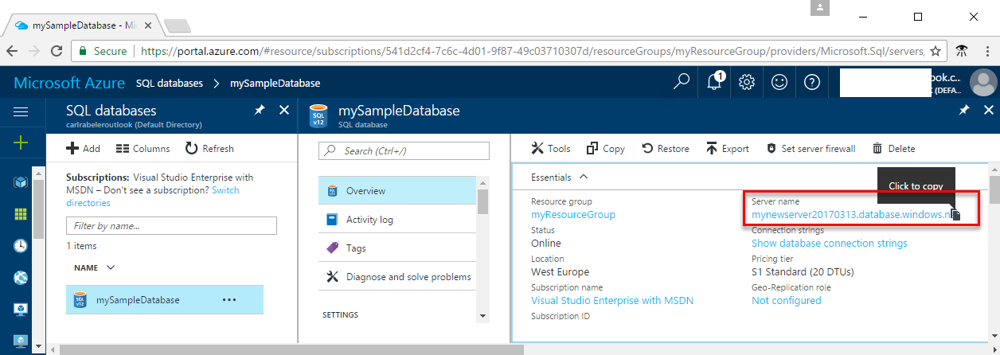

# Azure SQL Database: Use SQL Server Management Studio to connect and query data

Use [SQL Server Management Studio](https://msdn.microsoft.com/library/ms174173.aspx) (SSMS) to create and manage SQL Server resources from the user interface or in scripts. This quick start details using SSMS to connect to an Azure SQL database, and then execute query, insert, update, and delete statements.

This quick start uses as its starting point the resources created in one of these quick starts:

- [Create DB - Portal](sql-database-get-started-portal.md)
- [Create DB - CLI](sql-database-get-started-cli.md)

Before you start, make sure you have installed the newest version of [SSMS](https://msdn.microsoft.com/library/mt238290.aspx). 

## Get connection information

Get the fully qualified server name for your Azure SQL Database server in the Azure portal. You use the fully qualified server name to connect to your server using SQL Server Management Studio.

1. Log in to the [Azure portal](https://portal.azure.com/).
2. Select **SQL Databases** from the left-hand menu, and click your database on the **SQL databases** page. 
3. In the **Essentials** pane in the Azure portal page for your database, locate and then copy the **Server name**.

    

## Connect to the server and your new database

Use SQL Server Management Studio to establish a connection to your Azure SQL Database server. 

> [!IMPORTANT]
> An Azure SQL Database logical server listens on port 1433. If you are attempting to connect to an Azure SQL Database logical server from within a corporate firewall, this port must be open in the corporate firewall for you to successfully connect.
>

1. Open SQL Server Management Studio.

2. In the **Connect to Server** dialog box, enter the following information:
   - **Server type**: Specify Database engine
   - **Server name**: Enter your fully qualified server name, such as **mynewserver20170313.database.windows.net**
   - **Authentication**: Specify SQL Server Authentication
   - **Login**: Enter your server admin account
   - **Password**: Enter the password for your server admin account
 
    

3. Click **Connect**. The Object Explorer window opens in SSMS. 

    

4. In Object Explorer, expand **Databases** and then expand **mySampleDatabase** to view the objects in the sample database.

## Query data

Use the [SELECT](https://msdn.microsoft.com/library/ms189499.aspx) Transact-SQL statement to query data in your Azure SQL database.

1. In Object Explorer, right-click **mySampleDatabase** and click **New Query**. A blank query window opens that is connected to your database.
2. In the query window, enter the following query in the query window:

   ```sql
   SELECT pc.Name as CategoryName, p.name as ProductName
   FROM [SalesLT].[ProductCategory] pc
   JOIN [SalesLT].[Product] p
   ON pc.productcategoryid = p.productcategoryid;
   ```

3. On the toolbar, click **Execute** to retrieve data from the Product and ProductCategory tables.

    

## Insert data

Use the [INSERT](https://msdn.microsoft.com/library/ms174335.aspx) Transact-SQL statement to insert data into your Azure SQL database.

1. On the toolbar, click **New Query**. A blank query window opens connected to your database.
2. In the query window, enter the following query in the query window:

   ```sql
   INSERT INTO [SalesLT].[Product]
           ( [Name]
           , [ProductNumber]
           , [Color]
           , [ProductCategoryID]
		   , [StandardCost]
		   , [ListPrice]
		   , [SellStartDate]
		   )
     VALUES
           ('myNewProduct'
           ,123456789
           ,'NewColor'
           ,1
		   ,100
		   ,100
		   ,GETDATE() );
   ```

3. On the toolbar, click **Execute**  to insert a new row in the Product table.

    

## Update data

Use the [UPDATE](https://msdn.microsoft.com/library/ms177523.aspx) Transact-SQL statement to update data in your Azure SQL database.

1. On the toolbar, click **New Query**. A blank query window opens connected to your database.
2. In the query window, enter the following query in the query window:

   ```sql
   UPDATE [SalesLT].[Product]
   SET [ListPrice] = 125
   WHERE Name = 'myNewProduct';
   ```

3. On the toolbar, click **Execute** to update the specified row in the Product table.

    

## Delete data

Use the [DELETE](https://msdn.microsoft.com/library/ms189835.aspx) Transact-SQL statement to delete data in your Azure SQL database.

1. On the toolbar, click **New Query**. A blank query window opens connected to your database.
2. In the query window, enter the following query in the query window:

   ```sql
   DELETE FROM [SalesLT].[Product]
   WHERE Name = 'myNewProduct';
   ```

3. On the toolbar, click **Execute** to delete the specified row in the Product table.

    

## Next steps

- For information about SSMS, see [Use SQL Server Management Studio](https://msdn.microsoft.com/library/ms174173.aspx).
- For information about querying and editing data using Visual Studio Code, see [Visual Studio Code](https://code.visualstudio.com/docs)
