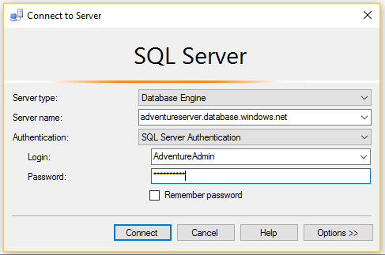

<properties
	urlDisplayName="How to connect to an Azure SQL database using SSMS"
	pageTitle="How to connect to an Azure SQL database using SSMS | Microsoft Azure"
	metaKeywords=""
	description="Learn how to connect to an Azure SQL database using SSMS."
	metaCanonical=""
	services="sql-database"
	documentationCenter=""
	title="How to connect to an Azure SQL database using SSMS"
	authors="stevestein" solutions=""
	manager="jeffreyg" editor="" />

<tags
	ms.service="sql-database"
	ms.workload="data-management"
	ms.tgt_pltfrm="na"
	ms.devlang="na"
	ms.topic="get-started-article"
	ms.date="08/31/2015"
	ms.author="sstein" />

# Connect with SQL Server Management Studio
This article shows you how to install SQL Server Management Studio (SSMS), connect to a database server in Azure, and then perform a simple query using Transact-SQL statements.

You'll need a SQL database in Azure first. You can create one quickly with the instructions in [Getting Started with Microsoft Azure SQL Database](sql-database-get-started.md). The examples here are based on the AdventureWorks sample database you create in that article, but the same steps, up until you perform the query, apply to any SQL database.

## Install and start SQL Server Management Studio (SSMS)
When working with SQL Database, you should use the most recent version of SSMS. See [Download SQL Server Management Studio](https://msdn.microsoft.com/library/mt238290.aspx) to get it. With the most recent version, SSMS automatically notifies you when the most recent update is available.

## Start SSMS and connect to your SQL database server
1. Type "Microsoft SQL Server Management Studio" in the Windows search box, and then click the desktop app to start SSMS.
2. In the **Connect to Server** dialog box, in the **Server name** box, type the name of the server that hosts your SQL database in the format *&lt;servername>*.**database.windows.net**.
3. Choose **SQL Server Authentication** from the **Authentication** list.
4. Type the **Login** and **Password** you set up when you created the server, and then click **Connect**.

	

### If the connection fails
The most common reason for connection failures are mistakes in the server name, user name, or password, as well as the server not allowing connections for security reasons. Make sure that the firewall settings of the server allow connections from your local computer's IP address and the IP address that the SSMS client uses. Sometimes they're different. 

If the connection fails because of a firewall rule, the IP address is reported in the error message. Add this IP address to the server firewall rule. For more information, see [How to: Configure Firewall Settings (Azure SQL Database)](sql-database-configure-firewall-settings.md).

## Run sample queries
After you connect, you can run a sample query. If you didn't create the database using the AdventureWorks sample in [Getting Started with Microsoft Azure SQL Database](sql-database-get-started.md), this query won't work. Skip straight to Next Steps to learn more.

1. In **Object Explorer**, navigate to the **AdventureWorks** database.
2. Right-click the database and then select **New Query**.

	

3. In the query window, copy and paste the following code.

		SELECT
		CustomerId
		,Title
		,FirstName
		,LastName
		,CompanyName
		FROM SalesLT.Customer;

4. Click the **Execute** button.  The following screen shot shows a successful query.

	

## Next steps
You can use Transact-SQL statements to create and manage databases in Azure in much the same way you can with SQL Server. If you're familiar with using Transact-SQL with SQL Server, see [Azure SQL Database Transact-SQL information)](sql-database-transact-sql-information.md) for a summary of differences.

If you're new to Transact-SQL, see [Tutorial: Writing Transact-SQL Statements](https://msdn.microsoft.com/library/ms365303.aspx) and the [Transact-SQL Reference (Database Engine)](https://msdn.microsoft.com/library/bb510741.aspx).