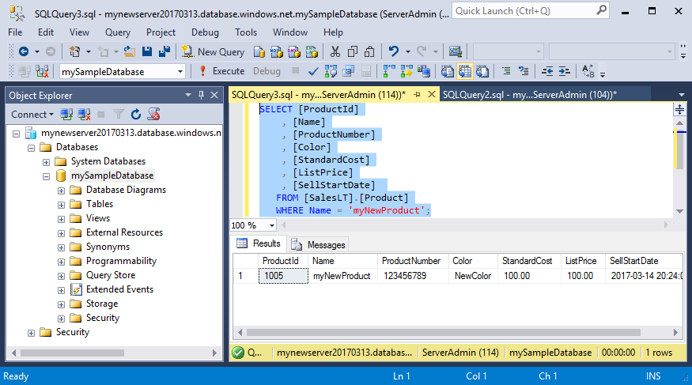
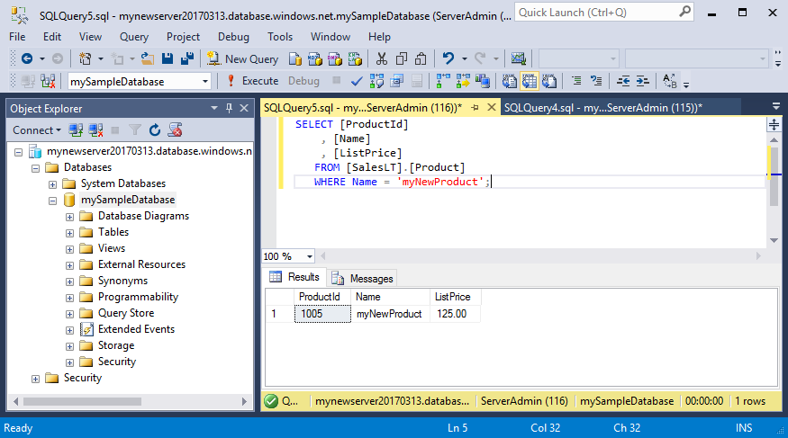
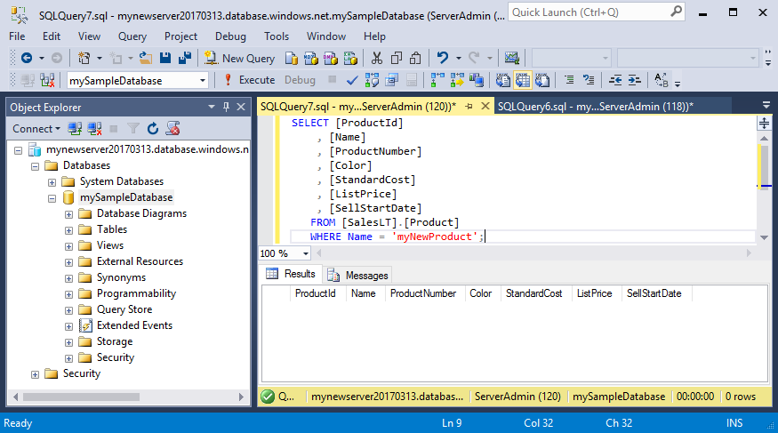

# Azure SQL Database: Use Visual Studio Code to connect and query data

[Visual Studio Code](https://code.visualstudio.com/docs) is a graphical code editor for Linux, macOS, and Windows that supports extensions. With the [mssql extension](https://aka.ms/mssql-marketplace), you can use Visual Studio Code to connect to and query an Azure SQL database. This guide details using Visual Studio Code to connect to an Azure SQL database, and then execute query, insert. update, and deletes statements.

This quick start uses as its starting point the resources created in one of these quick starts:

- [Create DB - Portal](sql-database-get-started.md)
- [Create DB - CLI](sql-database-get-started-cli.md)
- [Create DB - Powershell](sql-database-get-started-powershell.md) 

If you are completing this quick start with a different IP address, you may need to create a new server-level firewall rule.

Before you start, make sure you have installed the newest version of [Visual Studio Code](https://code.visualstudio.com/Download) and loaded the [mssql extension](https://aka.ms/mssql-marketplace). For installation guidance for the mssql extension, see [Install VS Code](https://docs.microsoft.com/en-us/sql/linux/sql-server-linux-develop-use-vscode#install-vs-code). 

## Get connection information

Get the fully qualified server name for your Azure SQL Database server in the Azure portal. You use this name to connect to your server using Visual Studio Code.

1. Log in to the [Azure portal](https://portal.azure.com/).
2. Select **SQL Databases** from the left-hand menu, and click your database on the **SQL databases** page. 
3. In the **Essentials** pane in the Azure portal page for your database, locate and then copy the **Server name** for use in the next step.

    

## Set language mode to SQL

Set the language mode is set to **SQL** in Visual Studio code to enable mssql commands and T-SQL IntelliSense.

1. Open a new Visual Studio Code window. 

2. Press **CTRL+K,M**, type **SQL** and press **ENTER** to set the language mode to SQL. 


## Connect to the server

Use SQL Server Management Studio to establish a connection to your Azure SQL Database server with SQL Server authentication.

1. In VS Code, press **CTRL+SHIFT+P** (or **F1**) to open the Command Palette.

2. Type **sqlcon** and press **ENTER**.

3. Click **Yes** to set your language to **SQL**.

4. Press **ENTER** to select **Create Connection Profile**. This creates a connection profile for your SQL Server instance.

5. Follow the prompts to specify the connection properties for the new connection profile. After specifying each value, press **ENTER** to continue. 

   The following table describes the Connection Profile properties.

   | Setting | Description |
   |-----|-----|
   | **Server name** | The fully qualified server name in the form of **mynewserver20170313.database.windows.net** |
   | **Database name** | The database name, such as **mySampleDatabase** |
   | **Authentication** | SQL Login |
   | **User name** | Your server admin account |
   | **Password (SQL Login)** | The password for your server admin account | 
   | **Save Password?** | Select **Yes** or **No** |
   | **[Optional] Enter a name for this profile** | A connection profile name, such as **lmySampleDatabase**. 

   > [!Tip] 
   > You can create and edit connection profiles in User Settings file (settings.json). Open the settings file by selecting **Preference** and then **User Settings** in the VS Code menu. For more details, see [manage connection profiles].

6. Press the **ESC** key to close the info message that informs you that the profile is created and connected.

   > [!TIP]
   > If you get a connection failure, first attempt to diagnose the problem from the error message in the **Output** panel in VS Code (select **Output** on the **View** menu). Then review the [connection troubleshooting recommendations]. A common error is the absence of a firewall rule for your IP address.

7. Verify your connection in the status bar.

   


## Query data

Use the [SELECT](https://msdn.microsoft.com/en-us/library/ms189499.aspx) Transact-SQL statement to query data in your Azure SQL database.

1. In Object Explorer, right-click **mySampleDatabase** and click **New Query**. A blank query window opens that is connected to your database.
2. In the query window, type the following query in the query window to retrieve data from the Product and ProductCategory tables:

   ```tsql
   SELECT pc.Name as CategoryName, p.name as ProductName
   FROM [SalesLT].[ProductCategory] pc
   JOIN [SalesLT].[Product] p
   ON pc.productcategoryid = p.productcategoryid;
   ```

3. On the toolbar, click **Execute**.

    

## Insert data

Use the [INSERT](https://msdn.microsoft.com/en-us/library/ms174335.aspx) Transcat-SQL statement to insert data into your Azure SQL database.

1. On the toolbar, click **New Query**. A blank query window opens connected to your database.
2. In the query window, type the following query in the query window to insert a new row in the Product table:

   ```tsql
   INSERT INTO [SalesLT].[Product]
           ( [Name]
           , [ProductNumber]
           , [Color]
           , [ProductCategoryID]
		   , [StandardCost]
		   , [ListPrice]
		   , [SellStartDate]
		   )
     VALUES
           ('myNewProduct'
           ,123456789
           ,'NewColor'
           ,1
		   ,100
		   ,100
		   ,GETDATE() );
   ```

3. On the toolbar, click **Execute**.

    

4. In the query window, use the following query to view the newly added product:

   ```tsql
   SELECT [ProductId]
	, [Name]
	, [ProductNumber]
	, [Color]
	, [StandardCost]
	, [ListPrice]
	, [SellStartDate] 
   FROM [SalesLT].[Product]
   WHERE Name = 'myNewProduct';
   ```

    


## Update data

Use the [UPDATE](https://msdn.microsoft.com/en-us/library/ms177523.aspx) Transact-SQL statement to update data in your Azure SQL database.

1. On the toolbar, click **New Query**. A blank query window opens connected to your database.
2. In the query window, type the following query in the query window to update a row in the Product table:

   ```tsql
   UPDATE [SalesLT].[Product]
   SET [ListPrice] = 125
   WHERE Name = 'myNewProduct';
   ```

3. On the toolbar, click **Execute**.

    

4. In the query window, use the following query to view the updated list price for the product:

   ```tsql
   SELECT [ProductId]
	, [Name]
	, [ListPrice]
   FROM [SalesLT].[Product]
   WHERE Name = 'myNewProduct';
   ```

    

## Delete data

Use the [DELETE](https://msdn.microsoft.com/en-us/library/ms189835.aspx) Transact-SQL statement to delete data in your Azure SQL database.

1. On the toolbar, click **New Query**. A blank query window opens connected to your database.
2. In the query window, type the following query in the query window to delete a row in the Product table:

   ```tsql
   DELETE FROM [SalesLT].[Product]
   WHERE Name = 'myNewProduct';
   ```

3. On the toolbar, click **Execute**.

    

4. In the query window, use the following query to verify the row was deleted:

   ```tsql
   SELECT [ProductId]
	, [Name]
	, [ProductNumber]
	, [Color]
	, [StandardCost]
	, [ListPrice]
	, [SellStartDate] 
   FROM [SalesLT].[Product]
   WHERE Name = 'myNewProduct';
   ```

    

## Next steps

- For more information about SSMS, see [Use SQL Server Management Studio](https://msdn.microsoft.com/library/ms174173.aspx).
- For a getting started with SQL Server authentication tutorial, see [SQL authentication and authorization](sql-database-control-access-sql-authentication-get-started.md).
- For a getting started with Azure Active Directory authentication tutorial, see [Azure AD authentication and authorization](sql-database-control-access-aad-authentication-get-started.md).
