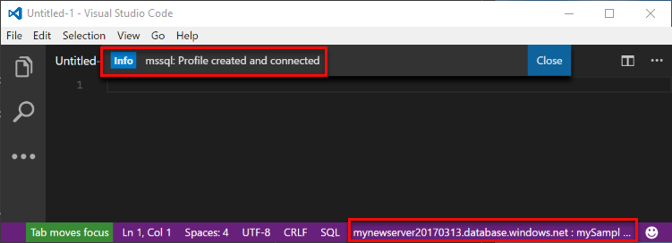
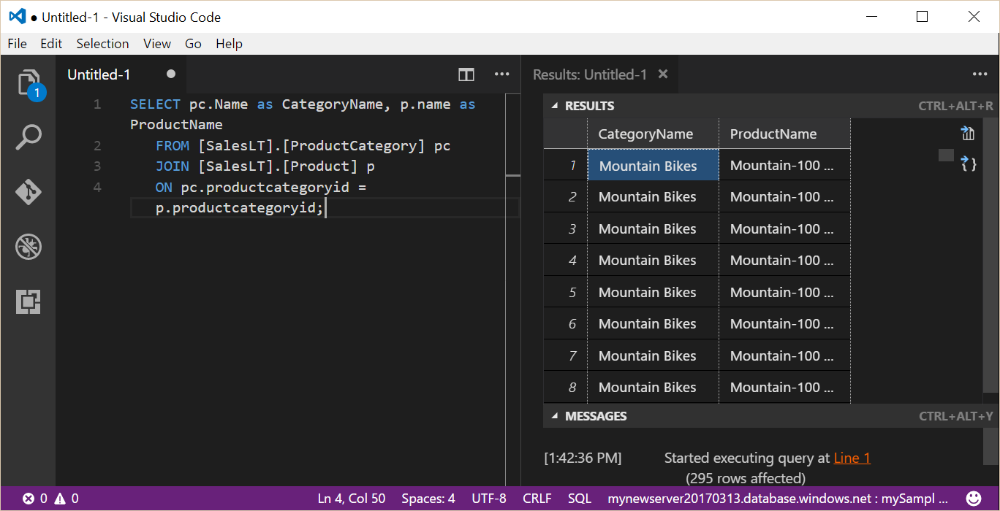

# Azure SQL Database: Use Visual Studio Code to connect and query data

[Visual Studio Code](https://code.visualstudio.com/docs) is a graphical code editor for Linux, macOS, and Windows that supports extensions, including the [mssql extension](https://aka.ms/mssql-marketplace) for querying Microsoft SQL Server, Azure SQL Database, and SQL Data Warehouse. This quickstart demonstrates how to use Visual Studio Code to connect to an Azure SQL database, and then use Transact-SQL statements to query, insert, update, and delete data in the database.

## Prerequisites

This quickstart uses as its starting point the resources created in one of these quickstarts:

[!INCLUDE [prerequisites-create-db](../../includes/sql-database-connect-query-prerequisites-create-db-includes.md)]

#### Install VS Code

Before you start, make sure you have installed the newest version of [Visual Studio Code](https://code.visualstudio.com/Download) and loaded the [mssql extension](https://aka.ms/mssql-marketplace). For installation guidance for the mssql extension, see [Install VS Code](https://docs.microsoft.com/sql/linux/sql-server-linux-develop-use-vscode#install-vs-code) and see [mssql for Visual Studio Code](https://marketplace.visualstudio.com/items?itemName=ms-mssql.mssql). 

## Configure VS Code 

### **Mac OS**
For macOS, you need to install OpenSSL which is a prerequisite for .Net Core that mssql extension uses. Open your terminal and enter the following commands to install **brew** and **OpenSSL**. 

```bash
ruby -e "$(curl -fsSL https://raw.githubusercontent.com/Homebrew/install/master/install)"
brew update
brew install openssl
mkdir -p /usr/local/lib
ln -s /usr/local/opt/openssl/lib/libcrypto.1.0.0.dylib /usr/local/lib/
ln -s /usr/local/opt/openssl/lib/libssl.1.0.0.dylib /usr/local/lib/
```

### **Linux (Ubuntu)**

No special configuration needed.

### **Windows**

No special configuration needed.

## SQL server connection information

Get the connection information needed to connect to the Azure SQL database. You will need the fully qualified server name, database name, and login information in the next procedures.

[!INCLUDE [prerequisites-server-connection-info](../../includes/sql-database-connect-query-prerequisites-server-connection-info-includes.md)]

## Set language mode to SQL

Set the language mode is set to **SQL** in Visual Studio Code to enable mssql commands and T-SQL IntelliSense.

1. Open a new Visual Studio Code window. 

2. Click **Plain Text** in the lower right-hand corner of the status bar.
3. In the **Select language mode** drop-down menu that opens, type **SQL**, and then press **ENTER** to set the language mode to SQL. 

   

## Connect to your database

Use Visual Studio Code to establish a connection to your Azure SQL Database server.

> [!IMPORTANT]
> Before continuing, make sure that you have your server, database, and login information ready. Once you begin entering the connection profile information, if you change your focus from Visual Studio Code, you have to restart creating the connection profile.
>

1. In VS Code, press **CTRL+SHIFT+P** (or **F1**) to open the Command Palette.

2. Type **sqlcon** and press **ENTER**.

3. Press **ENTER** to select **Create Connection Profile**. This creates a connection profile for your SQL Server instance.

4. Follow the prompts to specify the connection properties for the new connection profile. After specifying each value, press **ENTER** to continue. 

   | Setting       | Suggested value | Description |
   | ------------ | ------------------ | ------------------------------------------------- | 
   | **Server name | The fully qualified server name | The name should be something like this: **mynewserver20170313.database.windows.net**. |
   | **Database name** | mySampleDatabase | The name of the database to which to connect. |
   | **Authentication** | SQL Login| SQL Authentication is the only authentication type that we have configured in this tutorial. |
   | **User name** | The server admin account | This is the account that you specified when you created the server. |
   | **Password (SQL Login)** | The password for your server admin account | This is the password that you specified when you created the server. |
   | **Save Password?** | Yes or No | Select Yes if you do not want to enter the password each time. |
   | **Enter a name for this profile** | A profile name, such as **mySampleDatabase** | A saved profile name speeds your connection on subsequent logins. | 

5. Press the **ESC** key to close the info message that informs you that the profile is created and connected.

6. Verify your connection in the status bar.

   

## Query data

Use the following code to query for the top 20 products by category using the [SELECT](https://msdn.microsoft.com/library/ms189499.aspx) Transact-SQL statement.

1. In the **Editor** window, enter the following query in the empty query window:

   ```sql
   SELECT pc.Name as CategoryName, p.name as ProductName
   FROM [SalesLT].[ProductCategory] pc
   JOIN [SalesLT].[Product] p
   ON pc.productcategoryid = p.productcategoryid;
   ```

2. Press **CTRL+SHIFT+E** to retrieve data from the Product and ProductCategory tables.

    

## Insert data

Use the following code to insert a new product into the SalesLT.Product table using the [INSERT](https://msdn.microsoft.com/library/ms174335.aspx) Transact-SQL statement.

1. In the **Editor** window, delete the previous query and enter the following query:

   ```sql
   INSERT INTO [SalesLT].[Product]
           ( [Name]
           , [ProductNumber]
           , [Color]
           , [ProductCategoryID]
		   , [StandardCost]
		   , [ListPrice]
		   , [SellStartDate]
		   )
     VALUES
           ('myNewProduct'
           ,123456789
           ,'NewColor'
           ,1
		   ,100
		   ,100
		   ,GETDATE() );
   ```

2. Press **CTRL+SHIFT+E** to insert a new row in the Product table.

## Update data

Use the following code to update the new product that you previously added using the [UPDATE](https://msdn.microsoft.com/library/ms177523.aspx) Transact-SQL statement.

1.  In the **Editor** window, delete the previous query and enter the following query:

   ```sql
   UPDATE [SalesLT].[Product]
   SET [ListPrice] = 125
   WHERE Name = 'myNewProduct';
   ```

2. Press **CTRL+SHIFT+E** to update the specified row in the Product table.

## Delete data

Use the following code to delete the new product that you previously added using the [DELETE](https://docs.microsoft.com/sql/t-sql/statements/delete-transact-sql) Transact-SQL statement.

1. In the **Editor** window, delete the previous query and enter the following query:

   ```sql
   DELETE FROM [SalesLT].[Product]
   WHERE Name = 'myNewProduct';
   ```

2. Press **CTRL+SHIFT+E** to delete the specified row in the Product table.

## Next steps

- To connect and query using SQL Server Management Studio, see [Connect and query with SSMS](sql-database-connect-query-ssms.md).
- To connect and query using the Azure portal, see [Connect and query with the Azure portal SQL query editor](sql-database-connect-query-portal.md).
- For an MSDN magazine article on using Visual Studio Code, see [Create a database IDE with MSSQL extension blog post](https://msdn.microsoft.com/magazine/mt809115).
