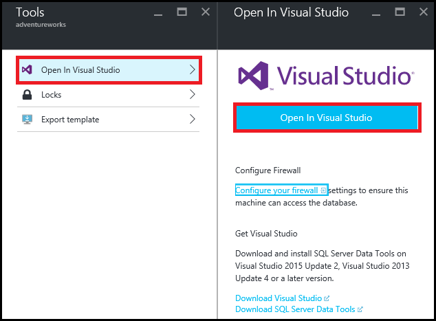
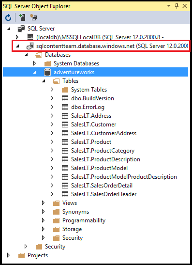
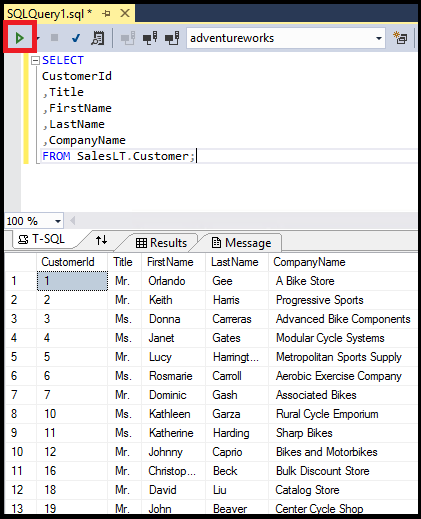

# Connect to a SQL Database with Visual Studio
> [!div class="op_single_selector"]
> * [Visual Studio](sql-database-connect-query.md)
> * [SSMS](sql-database-connect-query-ssms.md)
> * [Excel](sql-database-connect-excel.md)
> 
> 

Learn how to connect to an Azure SQL database in Visual Studio. 

## Prerequisites
To connect to a SQL database using Visual Studio, you need the following: 

* A SQL database to connect to. This article uses the **AdventureWorks** sample database. To get the AdventureWorks sample database, see [Create the demo database](sql-database-get-started.md).
* Visual Studio 2013 update 4 (or later). Microsoft now provides Visual Studio Community for *free*.
  
  * [Visual Studio Community, download](http://www.visualstudio.com/products/visual-studio-community-vs)
  * [More options for free Visual Studio](http://www.visualstudio.com/products/free-developer-offers-vs.aspx)

## Open Visual Studio from the Azure portal
1. Log in to the [Azure portal](https://portal.azure.com/).
2. Click **More Services** > **SQL databases**
3. Open the **AdventureWorks** database blade by locating and clicking the *AdventureWorks* database.
4. Click the **Tools** button at the top of the database blade:
   
    
5. Click **Open in Visual Studio** (if you need Visual Studio, click the download link):
   
    
6. Visual Studio opens with the **Connect to Server** window already set to connect to the server and database you selected in the portal.  (Click **Options** to verify that the connection is set to the correct database.)
   Type your server admin password and click **Connect**.

    

1. If you do not have a firewall rule set up for your computer's IP address, you get a *Cannot connect* message here. To create a firewall rule, see [Configure an Azure SQL Database server-level firewall rule](sql-database-configure-firewall-settings.md).
2. After successfully connecting, the **SQL Server Object Explorer** window opens with a connection to your database.
   
    

## Run a sample query
Now that we're connected to the database, the following steps show how to run a simple query:

1. Right-click the database and then select **New Query**.
   
    
2. In the query window, copy and paste the following code.
   
        SELECT
        CustomerId
        ,Title
        ,FirstName
        ,LastName
        ,CompanyName
        FROM SalesLT.Customer;
3. Click the **Execute** button to run the query:
   
    

## Next steps
* Opening SQL databases in Visual Studio uses SQL Server Data Tools. For more details, see [SQL Server Data Tools](https://msdn.microsoft.com/library/hh272686.aspx).
* To connect to a SQL database using code, see [Connect to SQL Database by using .NET (C#)](sql-database-develop-dotnet-simple.md).

