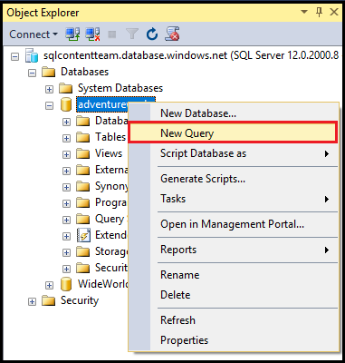
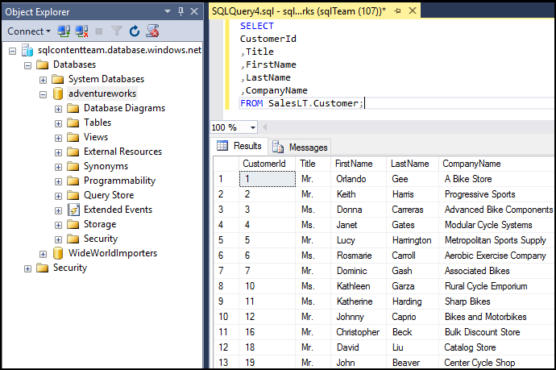

<properties
	pageTitle="Connect to SQL Database with a C# query | Microsoft Azure"
	description="Write a program in C# to query and connect to SQL database. Info about IP addresses, connection strings, secure login, and free Visual Studio."
	services="sql-database"
	keywords="c# database query, c# query, connect to database, SQL C#"
	documentationCenter=""
	authors="MightyPen"
	manager="jhubbard"
	editor=""/>

<tags
	ms.service="sql-database"
	ms.workload="data-management"
	ms.tgt_pltfrm="na"
	ms.devlang="dotnet"
	ms.topic="get-started-article"
	ms.date="04/25/2016"
	ms.author="annemill"/>

# Connect to a SQL Database with Visual Studio

> [AZURE.SELECTOR]
- [Visual Studio](sql-database-connect-query.md)
- [SSMS](sql-database-connect-query-ssms.md)
- [Excel](sql-database-connect-excel.md)

Learn how to connect to an Azure SQL Database in Visual Studio. 

## Prerequisites

To connect to SQL Database using Visual Studio, you must have: 

- An Azure account and subscription. You can sign up for a [free trial](https://azure.microsoft.com/pricing/free-trial/).

- An **AdventureWorksLT** demonstration database on the Azure SQL Database service.
 - [Create the demo database](sql-database-get-started.md) in minutes.

- Visual Studio 2013 update 4 (or later). Microsoft now provides Visual Studio Community for *free*.
 - [Visual Studio Community, download](http://www.visualstudio.com/products/visual-studio-community-vs)
 - [More options for free Visual Studio](http://www.visualstudio.com/products/free-developer-offers-vs.aspx)
 - Or, let the [step](#InstallVSForFree) later in this topic describe how the [Azure Portal](https://portal.azure.com/) guides you to the install of Visual Studio.

&nbsp;

## Step 1: Install Visual Studio Community for free

If you need to install Visual Studio, you can:

- Install Visual Studio Community for free by navigating your browser to Visual Studio product webpages that provide free downloads and other options; or
- Let the [Azure Portal](https://portal.azure.com/) guide you to the download webpage, which described next.

### Visual Studio through the Azure Portal

1. Login through the [Azure Portal](https://portal.azure.com/), http://portal.azure.com/.

2. Click **BROWSE* ALL** > **SQL databases**. A blade opens that searches for databases.

3. In the filter text box near the top, start typing the name of your **AdventureWorksLT** database.

4. When you see the row for your database on your server, click the row. A blade opens for your database.

5. For convenience, click the minimize control on each of the previous blades.

6. Click the **Open in Visual Studio** button near the top on your database blade. A new blade about Visual Studio opens with links to install locations for Visual Studio.

	![Open in Visual Studio button][20-OpenInVisualStudioButton]

7. Click the **Community (free)** link, or a similar link. A new webpage is added.

8. Use links on the new webpage to install Visual Studio.

9. After Visual Studio is installed, on the **Open In Visual Studio** blade click the **Open In Visual Studio** button. Visual Studio opens.

10. For the benefit its **SQL Server Object Explorer** pane, Visual Studio asks you to fill in connection string fields in a dialog.
 - Choose **SQL Server Authentication**, not **Windows Authentication**.
 - Remember to specify your **AdventureWorksLT** database (**Options** > **Connection Properties** in the dialog).

11. In the **SQL Server Object Explorer**, expand the node for your database.

## Step 2:  Run sample queries

After you connect to your logical server, you can connect to a database and run a sample query. 

1. In **Object Explorer**, navigate to a databbase on the server to which you have permission, such as the **AdventureWorks** sample database.
2. Right-click the database and then select **New Query**.

	

3. In the query window, copy and paste the following code.

		SELECT
		CustomerId
		,Title
		,FirstName
		,LastName
		,CompanyName
		FROM SalesLT.Customer;

4. Click the **Execute** button.  The following screen shot shows a successful query.

	

## Next steps

[Connect to SQL Database by using .NET (C#)](sql-database-develop-dotnet-simple.md) 

<!-- Image references. -->

[20-OpenInVisualStudioButton]: ./media/sql-database-connect-query/connqry-free-vs-e.png

