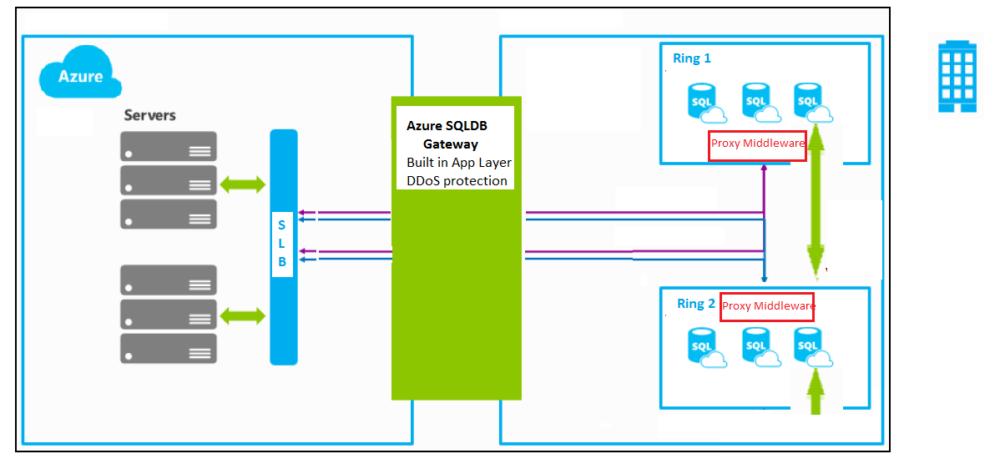
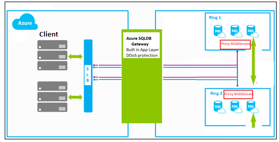
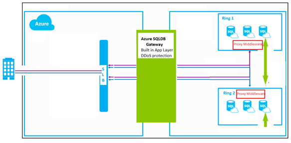

# Azure SQL Database Connectivity Architecture 

This article explains the Azure SQL Database connectivity architecture and explains how the different components function to direct traffic to your instance of Azure SQL Database. These Azure SQL Database connectivity components function to direct network traffic to the Azure database with clients connecting from within Azure and with clients connecting from outside of Azure. This article also provides script samples to change how connectivity occurs, and the considerations related to changing the default connectivity settings. 

## Connectivity architecture

The following diagram provides a high-level overview of the Azure SQL Database connectivity architecture.




The following steps describe how a connection is established to an Azure SQL database through the Azure SQL Database software load-balancer (SLB) and the Azure SQL Database gateway.

- Clients within Azure or outside of Azure connect to the SLB, which has a public IP address and listens on port 1433.
- The SLB directs traffic to the Azure SQL Database gateway.
- The gateway redirects the traffic to the correct proxy middleware.
- The proxy middleware redirects the traffic to the appropriate Azure SQL database.

> [!IMPORTANT]
> Each of these components has distributed denial of service (DDoS) protection built-in at the network and the app layer.
>

## Connectivity from within Azure

If you are connecting from within Azure, your connections have a connection policy of **Redirect** by default. A policy of **Redirect** means that connections after the TCP session is established to the Azure SQL database, the client session is then redirected to the proxy middleware with a change to the destination virtual IP from that of the Azure SQL Database gateway to that of the proxy middleware. Thereafter, all subsequent packets flow directly via the proxy middleware, bypassing the Azure SQL Database gateway. The following diagram illustrates this traffic flow.



## Connectivity from outside of Azure

If you are connecting from outside Azure, your connections have a connection policy of **Proxy** by default. A policy of **Proxy** means that the TCP session is established via the Azure SQL Database gateway and all subsequent packets flow via the gateway. The following diagram illustrates this traffic flow.



> [!IMPORTANT]
> When using service endpoints with Azure SQL Database your policy is **Proxy** by default. To enable connectivity from inside your VNet, you must allow outbound connections to the Azure SQL Database Gateway IP addresses specified in the list below. 
When using service endpoints we highly recommend changing your connection policy to **Redirect** to enable better performance. If you change your connection policy to **Redirect** it will not be sufficient to allow outbound on your NSG to Azure SQLDB gateway IPs listed below, you must allow outbound to all Azure SQLDB IPs. This can be accomplished with the help of NSG (Network Security Groups) Service Tags. For more information, see [Service Tags](https://docs.microsoft.com/azure/virtual-network/security-overview#service-tags).

## Azure SQL Database gateway IP addresses

To connect to an Azure SQL database from on-premises resources, you need to allow outbound network traffic to the Azure SQL Database gateway for your Azure region. Your connections only go via the gateway when connecting in Proxy mode, which is the default when connecting from on-premises resources.

The following table lists the primary and secondary IPs of the Azure SQL Database gateway for all data regions. For some regions, there are two IP addresses. In these regions, the primary IP address is the current IP address of the gateway and the second IP address is a failover IP address. The failover address is the address to which we might move your server to keep the service availability high. For these regions, we recommend that you allow outbound to both the IP addresses. The second IP address is owned by Microsoft and does not listen in on any services until it is activated by Azure SQL Database to accept connections.

> [!IMPORTANT]
> If you are connecting from within Azure your connection policy will be **Redirect** by default (except if you are using service endpoints). It will not be sufficient to allow the following IPs. You must allow all Azure SQL Database IPs. If you are connecting from within a VNet, this can be accomplished with the help of NSG (Network Security Groups) Service Tags. For more information, see [Service Tags](https://docs.microsoft.com/azure/virtual-network/security-overview#service-tags).

| Region Name | Primary IP address | Secondary IP address |
| --- | --- |--- |
| Australia East | 191.238.66.109 | 13.75.149.87 |
| Australia South East | 191.239.192.109 | 13.73.109.251 |
| Brazil South | 104.41.11.5 | |
| Canada Central | 40.85.224.249 | |
| Canada East | 40.86.226.166 | |
| Central US | 23.99.160.139 | 13.67.215.62 |
| East Asia | 191.234.2.139 | 52.175.33.150 |
| East US 1 | 191.238.6.43 | 40.121.158.30 |
| East US 2 | 191.239.224.107 | 40.79.84.180 * |
| India Central | 104.211.96.159  | |
| India South | 104.211.224.146	 | |
| India West | 104.211.160.80 | |
| Japan East | 191.237.240.43 | 13.78.61.196 |
| Japan West | 191.238.68.11 | 104.214.148.156 |
| Korea Central | 52.231.32.42 | |
| Korea South | 52.231.200.86 |  |
| North Central US | 23.98.55.75 | 23.96.178.199 |
| North Europe | 191.235.193.75 | 40.113.93.91 |
| South Central US | 23.98.162.75 | 13.66.62.124 |
| South East Asia | 23.100.117.95 | 104.43.15.0 |
| UK North | 13.87.97.210 | |
| UK South 1 | 51.140.184.11 | |
| UK South 2 | 13.87.34.7 | |
| UK West | 51.141.8.11	 | |
| West Central US | 13.78.145.25 | |
| West Europe | 191.237.232.75 | 40.68.37.158 |
| West US 1 | 23.99.34.75 | 104.42.238.205 |
| West US 2 | 13.66.226.202	 | |
||||

\* **NOTE:** *East US 2* has also a tertiary IP address of `52.167.104.0`.

## Change Azure SQL Database connection policy

To change the Azure SQL Database connection policy for an Azure SQL Database server, use the [conn-policy](https://docs.microsoft.com/cli/azure/sql/server/conn-policy) command.

- If your connection policy is set to **Proxy**, all network packets flow via the Azure SQL Database gateway. For this setting, you need to allow outbound to only the Azure SQL Database gateway IP. Using a setting of **Proxy** has more latency than a setting of **Redirect**.
- If your connection policy is setting **Redirect**, all network packets flow directly to the middleware proxy. For this setting, you need to allow outbound to multiple IPs.

## Script to change connection settings via PowerShell

> [!IMPORTANT]
> This script requires the [Azure PowerShell module](/powershell/azure/install-azurerm-ps).
>

The following PowerShell script shows how to change the connection policy.

```powershell
Connect-AzureRmAccount
Select-AzureRmSubscription -SubscriptionName <Subscription Name>

# Azure Active Directory ID
$tenantId = "<Azure Active Directory GUID>"
$authUrl = "https://login.microsoftonline.com/$tenantId"

# Subscription ID
$subscriptionId = "<Subscription GUID>"

# Create an App Registration in Azure Active Directory.  Ensure the application type is set to NATIVE
# Under Required Permissions, add the API:  Windows Azure Service Management API

# Specify the redirect URL for the app registration
$uri = "<NATIVE APP - REDIRECT URI>"

# Specify the application id for the app registration
$clientId = "<NATIVE APP - APPLICATION ID>"

# Logical SQL Server Name
$serverName = "<LOGICAL DATABASE SERVER - NAME>"

# Resource Group where the SQL Server is located
$resourceGroupName= "<LOGICAL DATABASE SERVER - RESOURCE GROUP NAME>"


# Login and acquire a bearer token
$AuthContext = [Microsoft.IdentityModel.Clients.ActiveDirectory.AuthenticationContext]$authUrl
$result = $AuthContext.AcquireToken(
"https://management.core.windows.net/",
$clientId,
[Uri]$uri,
[Microsoft.IdentityModel.Clients.ActiveDirectory.PromptBehavior]::Auto
)

$authHeader = @{
'Content-Type'='application\json; '
'Authorization'=$result.CreateAuthorizationHeader()
}

#Get current connection Policy
Invoke-RestMethod -Uri "https://management.azure.com/subscriptions/$subscriptionId/resourceGroups/$resourceGroupName/providers/Microsoft.Sql/servers/$serverName/connectionPolicies/Default?api-version=2014-04-01-preview" -Method GET -Headers $authHeader

#Set connection policy to Proxy
$connectionType="Proxy" <#Redirect / Default are other options#>
$body = @{properties=@{connectionType=$connectionType}} | ConvertTo-Json

# Apply Changes
Invoke-RestMethod -Uri "https://management.azure.com/subscriptions/$subscriptionId/resourceGroups/$resourceGroupName/providers/Microsoft.Sql/servers/$serverName/connectionPolicies/Default?api-version=2014-04-01-preview" -Method PUT -Headers $authHeader -Body $body -ContentType "application/json"
```

## Script to change connection settings via Azure CLI

> [!IMPORTANT]
> This script requires the [Azure CLI](https://docs.microsoft.com/cli/azure/install-azure-cli?view=azure-cli-latest).
>

The following CLI script shows how to change the connection policy.

<pre>
# Get SQL Server ID
sqlserverid=$(az sql server show -n <b>sql-server-name</b> -g <b>sql-server-group</b> --query 'id' -o tsv)

# Set URI
id="$sqlserverid/connectionPolicies/Default"

# Get current connection policy 
az resource show --ids $id

# Update connection policy 
az resource update --ids $id --set properties.connectionType=Proxy

</pre>

## Next steps

- For information on how to change the Azure SQL Database connection policy for an Azure SQL Database server, see [conn-policy](https://docs.microsoft.com/cli/azure/sql/server/conn-policy).
- For information about Azure SQL Database connection behavior for clients that use ADO.NET 4.5 or a later version, see [Ports beyond 1433 for ADO.NET 4.5](sql-database-develop-direct-route-ports-adonet-v12.md).
- For general application development overview information, see [SQL Database Application Development Overview](sql-database-develop-overview.md).
