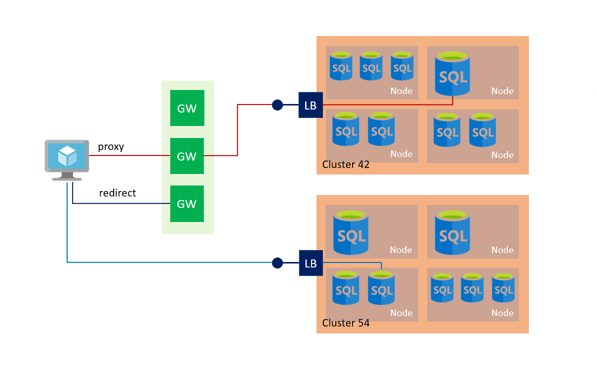
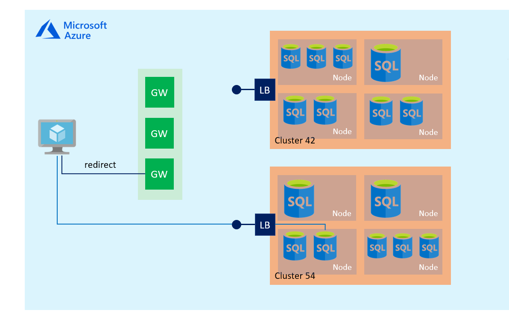
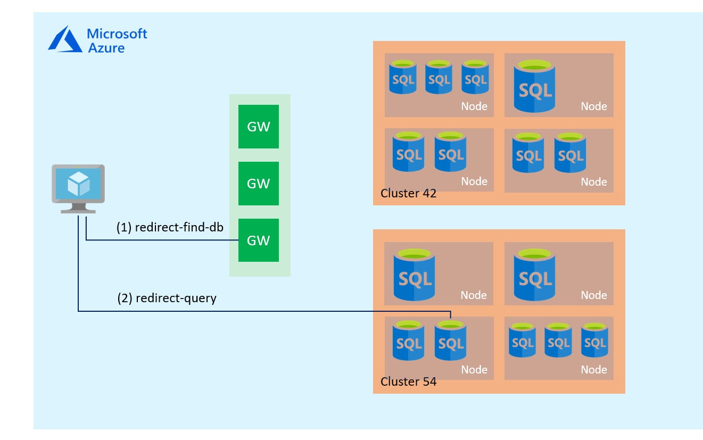

# Azure SQL Connectivity Architecture

This article explains the Azure SQL Database and SQL Data Warehouse connectivity architecture as well as how the different components function to direct traffic to your instance of Azure SQL. These connectivity components function to direct network traffic to the Azure SQL Database or SQL Data Warehouse with clients connecting from within Azure and with clients connecting from outside of Azure. This article also provides script samples to change how connectivity occurs, and the considerations related to changing the default connectivity settings.

## Connectivity architecture

The following diagram provides a high-level overview of the Azure SQL Database connectivity architecture.



The following steps describe how a connection is established to an Azure SQL database:

- Clients connect to the gateway, that has a public IP address and listens on port 1433.
- The gateway, depending on the effective connection policy, redirects or proxies the traffic to the right database cluster.
- Inside the database cluster traffic is forwarded to the appropriate Azure SQL database.

## Connection policy

Azure SQL Database supports the following three options for the connection policy setting of a SQL Database server:

- **Redirect (recommended):** Clients establish connections directly to the node hosting the database. To enable connectivity, the clients must allow outbound firewall rules to all Azure IP addresses in the region using Network Security Groups (NSG) with [service tags](../virtual-network/security-overview.md#service-tags)) for ports 11000-11999, not just the Azure SQL Database gateway IP addresses on port 1433. Because packets go directly to the database, latency and throughput have improved performance.
- **Proxy:** In this mode, all connections are proxied via the Azure SQL Database gateways. To enable connectivity, the client must have outbound firewall rules that allow only the Azure SQL Database gateway IP addresses (usually two IP addresses per region). Choosing this mode can result in higher latency and lower throughput, depending on nature of the workload. We highly recommend the `Redirect` connection policy over the `Proxy` connection policy for the lowest latency and highest throughput.
- **Default:** This is the connection policy in effect on all servers after creation unless you explicitly alter the connection policy to either `Proxy` or `Redirect`. The effective policy depends on whether connections originate from within Azure (`Redirect`) or outside of Azure (`Proxy`).

## Connectivity from within Azure

If you are connecting from within Azure your connections have a connection policy of `Redirect` by default. A policy of `Redirect` means that after the TCP session is established to the Azure SQL database, the client session is then redirected to the right database cluster with a change to the destination virtual IP from that of the Azure SQL Database gateway to that of the cluster. Thereafter, all subsequent packets flow directly to the cluster, bypassing the Azure SQL Database gateway. The following diagram illustrates this traffic flow.



## Connectivity from outside of Azure

If you are connecting from outside Azure, your connections have a connection policy of `Proxy` by default. A policy of `Proxy` means that the TCP session is established via the Azure SQL Database gateway and all subsequent packets flow via the gateway. The following diagram illustrates this traffic flow.



## Azure SQL Database gateway IP addresses

The table below lists the IP Addresses of Gateways by region. To connect to an Azure SQL Database, you need to allow network traffic to & from **all** Gateways for the region.

Details of how traffic shall be migrated to new Gateways in specific regions are in the following article: [Azure SQL Database traffic migration to newer Gateways](sql-database-gateway-migration.md)


| Region Name          | Gateway IP Addresses |
| --- | --- |
| Australia Central    | 20.36.105.0 |
| Australia Central2   | 20.36.113.0 |
| Australia East       | 13.75.149.87, 40.79.161.1 |
| Australia South East | 191.239.192.109, 13.73.109.251 |
| Brazil South         | 104.41.11.5, 191.233.200.14 |
| Canada Central       | 40.85.224.249      |
| Canada East          | 40.86.226.166      |
| Central US           | 13.67.215.62, 52.182.137.15, 23.99.160.139, 104.208.16.96 | 
| China East           | 139.219.130.35     |
| China East 2         | 40.73.82.1         |
| China North          | 139.219.15.17      |
| China North 2        | 40.73.50.0         |
| East Asia            | 191.234.2.139, 52.175.33.150, 13.75.32.4 |
| East US              | 40.121.158.30, 40.79.153.12, 191.238.6.43, 40.78.225.32 |
| East US 2            | 40.79.84.180, 52.177.185.181, 52.167.104.0,  191.239.224.107, 104.208.150.3 | 
| France Central       | 40.79.137.0, 40.79.129.1 |
| Germany Central      | 51.4.144.100       |
| Germany North East   | 51.5.144.179       |
| India Central        | 104.211.96.159     |
| India South          | 104.211.224.146    |
| India West           | 104.211.160.80     |
| Japan East           | 13.78.61.196, 40.79.184.8, 13.78.106.224, 191.237.240.43, 40.79.192.5 | 
| Japan West           | 104.214.148.156, 40.74.100.192, 191.238.68.11, 40.74.97.10 | 
| Korea Central        | 52.231.32.42       |
| Korea South          | 52.231.200.86      |
| North Central US     | 23.96.178.199, 23.98.55.75, 52.162.104.33 |
| North Europe         | 40.113.93.91, 191.235.193.75, 52.138.224.1 | 
| South Africa North   | 102.133.152.0      |
| South Africa West    | 102.133.24.0       |
| South Central US     | 13.66.62.124, 23.98.162.75, 104.214.16.32   | 
| South East Asia      | 104.43.15.0, 23.100.117.95, 40.78.232.3   | 
| UAE Central          | 20.37.72.64        |
| UAE North            | 65.52.248.0        |
| UK South             | 51.140.184.11      |
| UK West              | 51.141.8.11        |
| West Central US      | 13.78.145.25       |
| West Europe          | 40.68.37.158, 191.237.232.75, 104.40.168.105  |
| West US              | 104.42.238.205, 23.99.34.75, 13.86.216.196   |
| West US 2            | 13.66.226.202      |
|                      |                    |

## Change Azure SQL Database connection policy

To change the Azure SQL Database connection policy for an Azure SQL Database server, use the [conn-policy](https://docs.microsoft.com/cli/azure/sql/server/conn-policy) command.

- If your connection policy is set to `Proxy`, all network packets flow via the Azure SQL Database gateway. For this setting, you need to allow outbound to only the Azure SQL Database gateway IP. Using a setting of `Proxy` has more latency than a setting of `Redirect`.
- If your connection policy is setting `Redirect`, all network packets flow directly to the database cluster. For this setting, you need to allow outbound to multiple IPs.

## Script to change connection settings via PowerShell

[!INCLUDE [updated-for-az](../../includes/updated-for-az.md)]
> [!IMPORTANT]
> The PowerShell Azure Resource Manager module is still supported by Azure SQL Database, but all future development is for the Az.Sql module. For these cmdlets, see [AzureRM.Sql](https://docs.microsoft.com/powershell/module/AzureRM.Sql/). The arguments for the commands in the Az module and in the AzureRm modules are substantially identical. The following script requires the [Azure PowerShell module](/powershell/azure/install-az-ps).

The following PowerShell script shows how to change the connection policy.

```powershell
# Get SQL Server ID
$sqlserverid=(Get-AzSqlServer -ServerName sql-server-name -ResourceGroupName sql-server-group).ResourceId

# Set URI
$id="$sqlserverid/connectionPolicies/Default"

# Get current connection policy
(Get-AzResource -ResourceId $id).Properties.connectionType

# Update connection policy
Set-AzResource -ResourceId $id -Properties @{"connectionType" = "Proxy"} -f
```

## Script to change connection settings via Azure CLI

> [!IMPORTANT]
> This script requires the [Azure CLI](https://docs.microsoft.com/cli/azure/install-azure-cli).

### Azure CLI in a bash shell

> [!IMPORTANT]
> This script requires the [Azure CLI](https://docs.microsoft.com/cli/azure/install-azure-cli).

The following CLI script shows how to change the connection policy in a bash shell.

```azurecli-interactive
# Get SQL Server ID
sqlserverid=$(az sql server show -n sql-server-name -g sql-server-group --query 'id' -o tsv)

# Set URI
ids="$sqlserverid/connectionPolicies/Default"

# Get current connection policy
az resource show --ids $ids

# Update connection policy
az resource update --ids $ids --set properties.connectionType=Proxy
```

### Azure CLI from a Windows command prompt

> [!IMPORTANT]
> This script requires the [Azure CLI](https://docs.microsoft.com/cli/azure/install-azure-cli).

The following CLI script shows how to change the connection policy from a Windows command prompt (with Azure CLI installed).

```azurecli
# Get SQL Server ID and set URI
FOR /F "tokens=*" %g IN ('az sql server show --resource-group myResourceGroup-571418053 --name server-538465606 --query "id" -o tsv') do (SET sqlserverid=%g/connectionPolicies/Default)

# Get current connection policy
az resource show --ids %sqlserverid%

# Update connection policy
az resource update --ids %sqlserverid% --set properties.connectionType=Proxy
```

## Next steps

- For information on how to change the Azure SQL Database connection policy for an Azure SQL Database server, see [conn-policy](https://docs.microsoft.com/cli/azure/sql/server/conn-policy).
- For information about Azure SQL Database connection behavior for clients that use ADO.NET 4.5 or a later version, see [Ports beyond 1433 for ADO.NET 4.5](sql-database-develop-direct-route-ports-adonet-v12.md).
- For general application development overview information, see [SQL Database Application Development Overview](sql-database-develop-overview.md).
