# Azure AD authentication, access, and database-level firewall rules
In this how-to guide, you learn how to use SQL Server Management Studio to work with Azure Active Directory authentication, logins, users, and database roles that grant access and permissions to Azure SQL Database servers and databases. You learn to:

- View user permissions in the master database and in user databases
- Create logins and users based on Azure Active Directory authentication
- Grant server-wide and database-specific permissions to users
- Log in to a user database as a non-admin user
- Create database-level firewall rules for database users
- Create server-level firewall rules for server admins

**Time estimate**: This how-to guide takes approximately 45 minutes to complete (assuming you have already met the prerequisites).

## Prerequisites

* **An Azure account**. You need an Azure account. You can [open a free Azure account](https://azure.microsoft.com/free/) or [Activate Visual Studio subscriber benefits](https://azure.microsoft.com/pricing/member-offers/msdn-benefits/). 

* **Azure create permissions**. You must be able to connect to the Azure portal using an account that is a member of either the subscription owner or contributor role. For more information on role-based access control (RBAC), see [Getting started with access management in the Azure portal](../active-directory/role-based-access-control-what-is.md).

* **SQL Server Management Studio**. You can download and install the latest version of SQL Server Management Studio (SSMS) at [Download SQL Server Management Studio](https://msdn.microsoft.com/library/mt238290.aspx). Always use the latest version of SSMS when connecting to Azure SQL Database as new capabilities are continually being released.

* **Base server and databases** To install and configure a server and the two databases used in this how-to guide, click the **Deploy to Azure** button. Clicking the button opens the **Deploy from a template** blade; create a new resource group, and provide the **Admin Login Password** for the new server that will be created:

   [](https://portal.azure.com/#create/Microsoft.Template/uri/https%3A%2F%2Fsqldbtutorial.blob.core.windows.net%2Ftemplates%2Fsqldbgetstarted.json)

   > [!NOTE]
   > The completion of the related how-to guide for SQL Server authentication, [SQL authentication, logins and user accounts, database roles, permissions, server-level firewall rules, and database-level firewall rules](sql-database-control-access-sql-authentication-get-started.md), is optional - however, there are concepts covered in that how-to guide that are not repeated here. The procedures in this how-to guide related to server and database level firewalls are not required if you completed this related how-to guide on the same computers (with the same IP addresses) and are marked as optional for that reason. Also, the screenshots in this how-to guide assume that you have completed of this related how-to guide. 
   >

* You have created and populated an Azure Active Directory. For more information, see [Integrating your on-premises identities with Azure Active Directory](../active-directory/active-directory-aadconnect.md), [Add your own domain name to Azure AD](../active-directory/active-directory-add-domain.md), [Microsoft Azure now supports federation with Windows Server Active Directory](https://azure.microsoft.com/blog/2012/11/28/windows-azure-now-supports-federation-with-windows-server-active-directory/), [Administering your Azure AD directory](https://msdn.microsoft.com/library/azure/hh967611.aspx), [Manage Azure AD using Windows PowerShell](https://msdn.microsoft.com/library/azure/jj151815.aspx), and [Hybrid Identity Required Ports and Protocols](../active-directory/active-directory-aadconnect-ports.md).

> [!NOTE]
> This how-to guide helps you to learn the content of these learn topics: [SQL Database access and control](sql-database-control-access.md), [Logins, users, and database roles](sql-database-manage-logins.md), [Principals](https://msdn.microsoft.com/library/ms181127.aspx), [Database roles](https://msdn.microsoft.com/library/ms189121.aspx), [SQL Database firewall rules](sql-database-firewall-configure.md), and [Azure Active Directory authentication](sql-database-aad-authentication.md). 
>  

## Sign in to the Azure portal using your Azure account
Using your [existing subscription](https://account.windowsazure.com/Home/Index), follow these steps to connect to the Azure portal.

1. Open your browser of choice and connect to the [Azure portal](https://portal.azure.com/).
2. Sign in to the [Azure portal](https://portal.azure.com/).
3. On the **Sign in** page, provide the credentials for your subscription.
   
## Provision an Azure Active Directory admin for your SQL logical server

In this section of the how-to guide, you view information about the security configuration for your logical server in the Azure portal.

1. Open the **SQL Server** blade for your logical server and view the information in the **Overview** page. Notice that an Azure Active Directory admin has not been configured.

   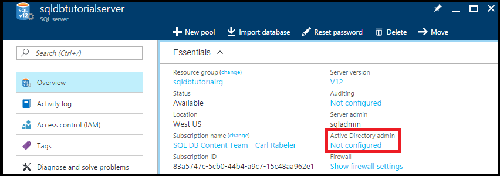

2. Click **Not configured** in the **Essentials** pane to open the **Active Directory admin** blade.

   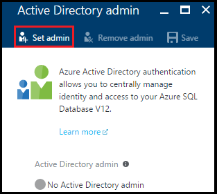

3. Click **Set admin** to open the **Add admin** blade and then select an Active Directory user or group account as the Active Directory admin for your server.

   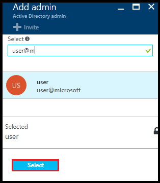

4. Click **Select** and then click **Save**.

   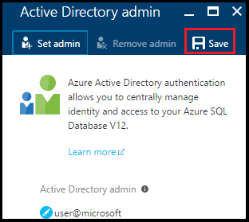

> [!NOTE]
> To review connection information for this server, go to [Connect with SSMS](sql-database-connect-query-ssms.md). For this how-to guide series, the fully qualified server name is 'sqldbtutorialserver.database.windows.net'.
>

## Connect to SQL server using SQL Server Management Studio (SSMS)

1. If you have not already done so, download and install the latest version of SSMS at [Download SQL Server Management Studio](https://msdn.microsoft.com/library/mt238290.aspx). To stay up-to-date, the latest version of SSMS prompts you when there is a new version available to download.

2. After installing, type **Microsoft SQL Server Management Studio** in the Windows search box and click **Enter** to open SSMS.

   

3. In the **Connect to Server** dialog box, select one of the Active Directory authentication methods and then provide the appropriate authentication information. For information on choosing a method, see [Azure Active Directory authentication](sql-database-aad-authentication.md) and [SSMS support for Azure AD MFA](sql-database-ssms-mfa-authentication.md).

   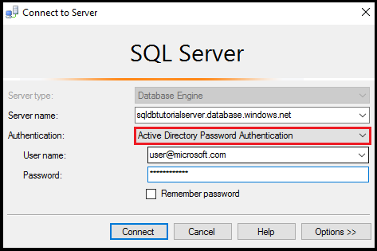

4. Enter the necessary information to connect to your SQL server using SQL Server Authentication and the Server admin account.

5. Click **Connect**.

   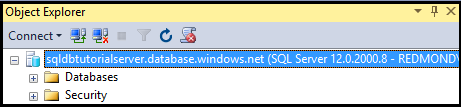

## View the Server admin account and its permissions 
In this section of the how-to guide, you view information about the server admin account and its permissions in the master database and in user databases.

1. In Object Explorer, expand **Databases**, expand **System databases**, expand **master**, expand **Security**, and then expand **Users**. Notice that a user account has been created in the master database for the Active Directory admin. Notice also that a login was not created for Active Directory admin user account.

   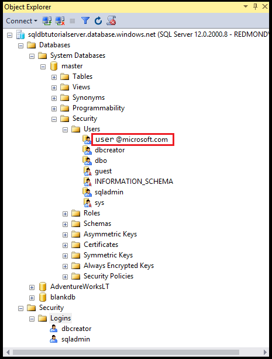

   > [!NOTE]
   > For information about the other user accounts that appear, see [Principals](https://msdn.microsoft.com/library/ms181127.aspx).
   >

2. In Object Explorer, right-click **master** and then click **New Query** to open a query window connected to the master database.
3. In the query window, execute the following query to return information about the user executing the query. Notice that user@microsoft.com is returned for the user account executing this query (we see a different result when we query a user database later in this procedure).

   ```
   SELECT USER;
   ```

   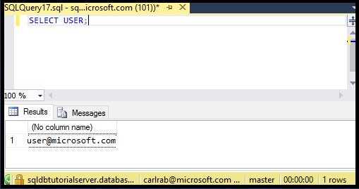

4. In the query window, execute the following query to return information about the permissions of the Active Directory admin user. Notice that the Active Directory admin user has permissions to connect to the master database, create logins and users, select information from the sys.sql_logins table, and add users to the dbmanager and dbcreator database roles. These permissions are in addition to permissions granted to the public role from which all users inherit permissions (such as permissions to select information from certain tables). See [Permissions](https://msdn.microsoft.com/library/ms191291.aspx) for more information.

   ```
   SELECT prm.permission_name
      , prm.class_desc
      , prm.state_desc
      , p2.name as 'Database role'
      , p3.name as 'Additional database role' 
   FROM sys.database_principals p
   JOIN sys.database_permissions prm
      ON p.principal_id = prm.grantee_principal_id
      LEFT JOIN sys.database_principals p2
      ON prm.major_id = p2.principal_id
      LEFT JOIN sys.database_role_members r
      ON p.principal_id = r.member_principal_id
      LEFT JOIN sys.database_principals p3
      ON r.role_principal_id = p3.principal_id
   WHERE p.name = 'user@microsoft.com';
   ```

   

6. In Object Explorer, expand **blankdb**, expand **Security**, and then expand **Users**. Notice that there is no user account called user@microsoft.com in this database.

   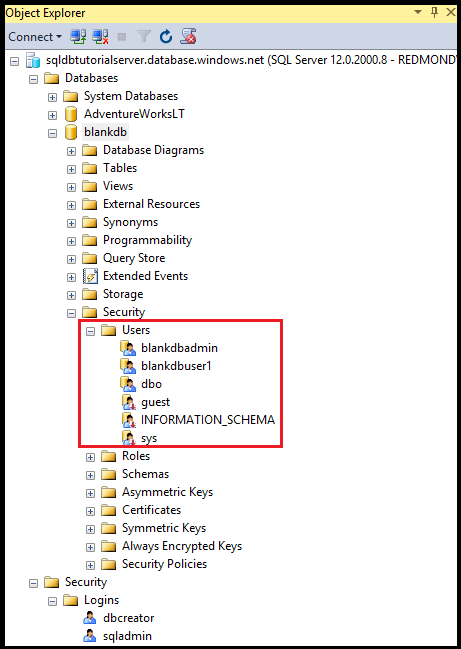

7. In Object Explorer, right-click **blankdb** and then click **New Query**.

8. In the query window, execute the following query to return information about the user executing the query. Notice that dbo is returned for the user account executing this query (by default, the Server admin login is mapped to the dbo user account in each user database).

   ```
   SELECT USER;
   ```

   

9. In the query window, execute the following query to return information about the permissions of the dbo user. Notice that dbo is a member of the public role and also a member of the db_owner fixed database role. See [Database-Level Roles](https://msdn.microsoft.com/library/ms189121.aspx) for more information.

   ```
   SELECT prm.permission_name
      , prm.class_desc
      , prm.state_desc
      , p2.name as 'Database role'
      , p3.name as 'Additional database role' 
   FROM sys.database_principals AS p
   JOIN sys.database_permissions AS prm
      ON p.principal_id = prm.grantee_principal_id
      LEFT JOIN sys.database_principals AS p2
      ON prm.major_id = p2.principal_id
      LEFT JOIN sys.database_role_members r
      ON p.principal_id = r.member_principal_id
      LEFT JOIN sys.database_principals AS p3
      ON r.role_principal_id = p3.principal_id
   WHERE p.name = 'dbo';
   ```

   

10. Optionally, repeat the previous three steps for the AdventureWorksLT user database.

## Create a new user in the AdventureWorksLT database with SELECT permissions

In this section of the how-to guide, you create a user account in the AdventureWorksLT database based on a user's principal name of an Azure AD user or display name for an Azure AD group, test this user's permissions as member of the public role, grant this user SELECT permissions, and then test this user's permissions again.

> [!NOTE]
> Database-level users ([contained users](https://msdn.microsoft.com/library/ff929188.aspx)) increase the portability of your database, a capability that we explore in later how-to guides.
>

1. In Object Explorer, right-click **AdventureWorksLT** and then click **New Query** to open a query window connected to the AdventureWorksLT database.
2. Execute the following statement to create a user account in the AdventureWorksLT database for a user in the Microsoft domain called aaduser1.

   ```
   CREATE USER [aaduser1@microsoft.com]
   FROM EXTERNAL PROVIDER;
   ```
   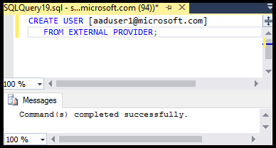

3. In the query window, execute the following query to return information about the permissions of user1. Notice that the only permissions that user1 has are the permissions inherited from the public role.

   ```
   SELECT prm.permission_name
      , prm.class_desc
      , prm.state_desc
      , p2.name as 'Database role'
      , p3.name as 'Additional database role' 
   FROM sys.database_principals AS p
   JOIN sys.database_permissions AS prm
      ON p.principal_id = prm.grantee_principal_id
      LEFT JOIN sys.database_principals AS p2
      ON prm.major_id = p2.principal_id
      LEFT JOIN sys.database_role_members r
      ON p.principal_id = r.member_principal_id
      LEFT JOIN sys.database_principals AS p3
      ON r.role_principal_id = p3.principal_id
   WHERE p.name = 'aaduser1@microsoft.com';
   ```

   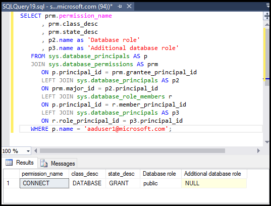

4. Execute the following queries to attempt to query a table in the AdventureWorksLT database as user1.

   ```
   EXECUTE AS USER = 'aaduser1@microsoft.com';  
   SELECT * FROM [SalesLT].[ProductCategory];
   REVERT;
   ```

   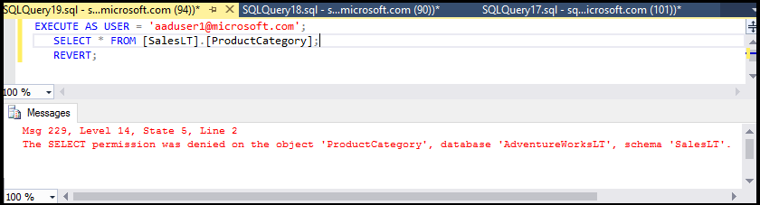

5. Execute the following statement to grant SELECT permissions on the ProductCategory table in the SalesLT schema to user1.

   ```
   GRANT SELECT ON OBJECT::[SalesLT].[ProductCategory] to [aaduser1@microsoft.com];
   ```

   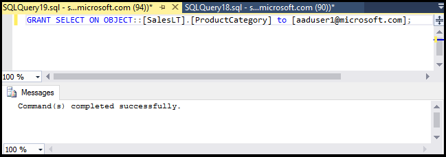

6. Execute the following queries to attempt to query a table in the AdventureWorksLT database as user1.

   ```
   EXECUTE AS USER = 'aaduser1@microsoft.com';  
   SELECT * FROM [SalesLT].[ProductCategory];
   REVERT;
   ```

   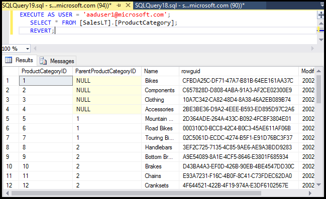

## Create a database-level firewall rule for AdventureWorksLT database users

> [!NOTE]
> You do not need to complete this procedure if you completed the equivalent procedure in the related how-to guide for SQL Server authentication, [SQL authentication and authorization](sql-database-control-access-sql-authentication-get-started.md) and are learning using the same computer with the same IP address.
>

In this section of the how-to guide, you attempt to log in using the new user account from a computer with a different IP address, create a database-level firewall rule as the Server admin, and then successfully log in using this new database-level firewall rule. 

> [!NOTE]
> [Database-level firewall rules](sql-database-firewall-configure.md) increase the portability of your database, a capability that we explore in later how-to guides.
>

1. On another computer for which you have not already created a server-level firewall rule, open SQL Server Management Studio.

   > [!IMPORTANT]
   > Always use the latest version of SSMS at [Download SQL Server Management Studio](https://msdn.microsoft.com/library/mt238290.aspx). 
   >

2. In the **Connect to Server** window, enter the server name and authentication information to connect using SQL Server authentication with the aaduser1@microsoft.com account. 
    
   

3. Click **Options** in the **Connect to server** dialog box to specify the database to which you want to connect and then type **AdventureWorksLT** in the **Connect to Database** drop-down box on the **Connection Properties** tab.
   
   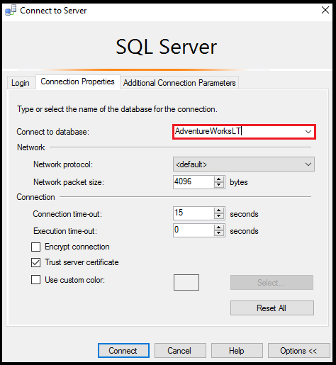

4. Click **Connect**. A dialog box appears informing you that the computer from which you are attempting to connect to SQL Database does not have a firewall rule enabling access to the database. The dialog box that you receive has two variations depending upon steps you have previously taken with firewalls, but you usually get the first dialog box shown.

   

   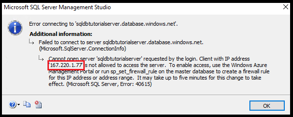

   > [!NOTE]
   > The newest versions of SSMS include the functionality to allow subscription owners and contributors to sign in to Microsoft Azure and create a server-level firewall rule.
   > 

4. Copy the client IP address from this dialog box for use in step 7.
5. Click **Cancel** but do not close the **Connect to Server** dialog box.
6. Switch back to a computer for which you have already created a server-level firewall rule and connect to your server using the Server admin account.
7. In a new query window connected to the AdventureWorksLT database as Server admin, execute the following statement to create a database-level firewall by executing [sp_set_database_firewall_rule](https://msdn.microsoft.com/library/dn270010.aspx) using the IP address from step 4:

   ```
   EXEC sp_set_database_firewall_rule @name = N'AdventureWorksLTFirewallRule', 
     @start_ip_address = 'x.x.x.x', @end_ip_address = 'x.x.x.x';
   ```

   

8. Switch computers again and click **Connect** in the **Connect to Server** dialog box to connect to AdventureWorksLT as aaduser1. 

9. In Object Explorer, expand **Databases**, expand **AdventureWorksLT**, and then expand **Tables**. Notice that user1 only has permission to view a single table, the **SalesLT.ProductCategory** table. 

10. In Object Explorer, right-click **SalesLT.ProductCategory** and click **Select Top 1000 Rows**.   

## Next steps
- For an overview of access and control in SQL Database, see [SQL Database access and control](sql-database-control-access.md).
- For an overview of logins, users, and database roles in SQL Database, see [Logins, users, and database roles](sql-database-manage-logins.md).
- For more information about database principals, see [Principals](https://msdn.microsoft.com/library/ms181127.aspx).
- For more information about database roles, see [Database roles](https://msdn.microsoft.com/library/ms189121.aspx).
- For more information about firewall rules in SQL Database, see [SQL Database firewall rules](sql-database-firewall-configure.md).

