# SQL Server authentication, access, and database-level firewall rules

In this tutorial, you learn how to use SQL Server Management Studio to work with SQL Server authentication, logins, users, and database roles that grant access and permissions to Azure SQL Database servers and databases. After you complete this tutorial, you will know how to:

- Create logins and users based on SQL Server authentication
- Add users to roles and grant permissions to roles
- Use T-SQL to create a database-level and a server-level firewall rule 
- Connect as a user to a specific database using SSMS
- View user permissions in the master database and in user databases

**Time estimate**: This tutorial takes approximately 45 minutes to complete (assuming you have already met the prerequisites).

> [!NOTE]
> This tutorial helps you to learn the content of these topics: [SQL Database access and control](sql-database-control-access.md), [Logins, users, and database roles](sql-database-manage-logins.md), [Principals](https://msdn.microsoft.com/library/ms181127.aspx), [Database roles](https://msdn.microsoft.com/library/ms189121.aspx), and [SQL Database firewall rules](sql-database-firewall-configure.md). For a tutorial about Azure Active Directory authentication, see [Getting started with Azure AD Authentication](sql-database-control-access-aad-authentication-get-started.md).
>  

## Prerequisites

* **An Azure account**. You need an Azure account. You can [open a free Azure account](https://azure.microsoft.com/free/) or [Activate Visual Studio subscriber benefits](https://azure.microsoft.com/pricing/member-offers/msdn-benefits/). 

* **Azure create permissions**. You must be able to connect to the Azure portal using an account that is a member of either the subscription owner or contributor role. For more information on role-based access control (RBAC), see [Getting started with access management in the Azure portal](../active-directory/role-based-access-control-what-is.md).

* **SQL Server Management Studio**. You can download and install the latest version of SQL Server Management Studio (SSMS) at [Download SQL Server Management Studio](https://msdn.microsoft.com/library/mt238290.aspx). Always use the latest version of SSMS when connecting to Azure SQL Database as new capabilities are continually being released.

* **Base server and databases** To install and configure a server and the two databases used in this tutorial, click the **Deploy to Azure** button. Clicking the button opens the **Deploy from a template** blade; create a new resource group, and provide the **Admin Login Password** for the new server that will be created:

   [](https://portal.azure.com/#create/Microsoft.Template/uri/https%3A%2F%2Fsqldbtutorial.blob.core.windows.net%2Ftemplates%2Fsqldbgetstarted.json)


## Sign in to the Azure portal using your Azure account
The steps in this procedure show you how to connect to the Azure portal using your Azure account](https://account.windowsazure.com/Home/Index).

1. Open your browser of choice and connect to the [Azure portal](https://portal.azure.com/).
2. Sign in to the [Azure portal](https://portal.azure.com/).
3. On the **Sign in** page, provide the credentials for your subscription.

## View logical server security information in the Azure portal

The steps in this procedure show you how to view information about the security configuration for your logical server in the Azure portal.

1. Open the **SQL Server** blade for your server and view the information in the **Overview** page.

   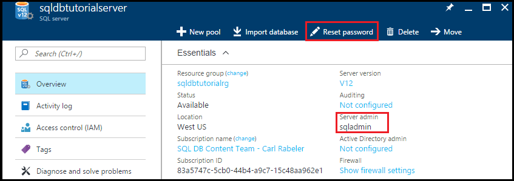

2. Make note of the name for server admin on your logical server. 

3. If you do not remember the password, click **Reset password** to set a new password.

4. If you need to get the connection information for this server, click **Properties**.

## View server admin permissions using SSMS

The steps in this procedure show you how to view information about the server admin account and its permissions in the master database and in user databases.

1. Open SQL Server Management Studio and connect to your server as the server admin using SQL Server Authentication and the Server admin account.

   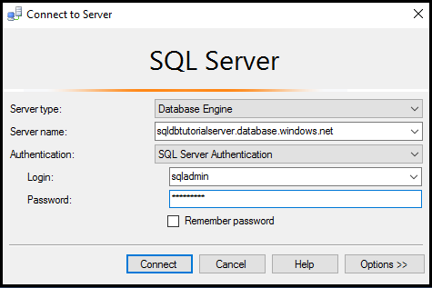

2. Click **Connect**.

   

3. In Object Explorer, expand **Security**, and then expand **Logins** to view the existing logins for your server - the only login on a new server is the login for server admin account.

   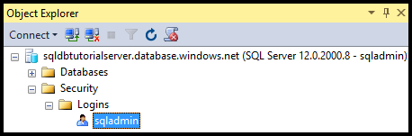

4. In Object Explorer, expand **Databases**, expand **System databases**, expand **master**, expand **Security**, and then expand **Users** to view the user account that was created for the server admin login in this database.

   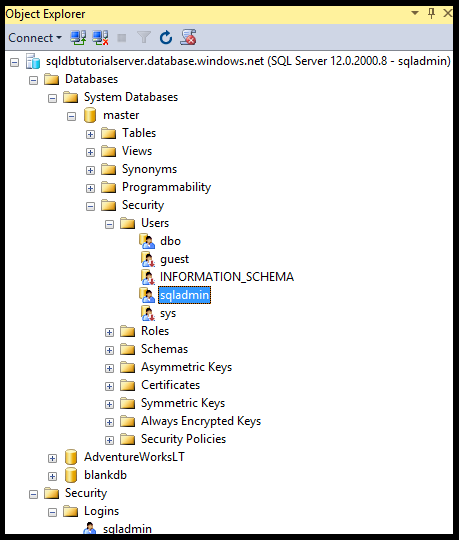

   > [!NOTE]
   > For information about the other user accounts that appear in the Users node, see [Principals](https://msdn.microsoft.com/library/ms181127.aspx).
   >

5. In Object Explorer, right-click **master** and then click **New Query** to open a query window connected to the master database.
6. In the query window, execute the following query to return information about the user executing the query. 

   ```
   SELECT USER;
   ```

   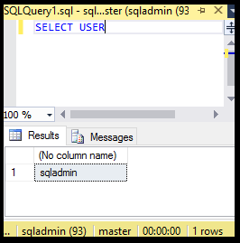

7. In the query window, execute the following query to return information about the permissions of the sqladmin user in the **master** database. 

   ```
   SELECT prm.permission_name
      , prm.class_desc
      , prm.state_desc
      , p2.name as 'Database role'
      , p3.name as 'Additional database role' 
   FROM sys.database_principals p
   JOIN sys.database_permissions prm
      ON p.principal_id = prm.grantee_principal_id
      LEFT JOIN sys.database_principals p2
      ON prm.major_id = p2.principal_id
      LEFT JOIN sys.database_role_members r
      ON p.principal_id = r.member_principal_id
      LEFT JOIN sys.database_principals p3
      ON r.role_principal_id = p3.principal_id
   WHERE p.name = 'sqladmin';
   ```

   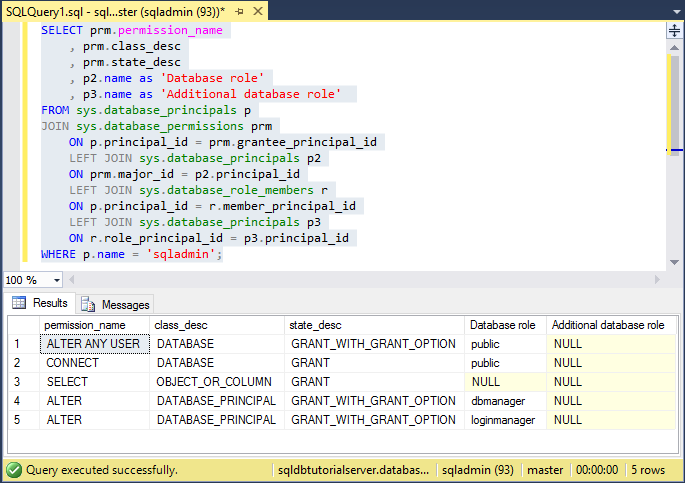

   >[!NOTE]
   > The server admin has permissions to connect to the master database, create logins and users, select information from the sys.sql_logins table, and add users to the dbmanager and dbcreator database roles. These permissions are in addition to permissions granted to the public role from which all users inherit permissions (such as permissions to select information from certain tables). See [Permissions](https://msdn.microsoft.com/library/ms191291.aspx) for more information.
   >

8. In Object Explorer, expand **blankdb**, expand **Security**, and then expand **Users** to view the user account that was created for the server admin login in this database (and in each user database).

   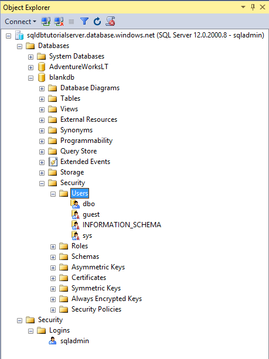

9. In Object Explorer, right-click **blankdb** and then click **New Query**.

10. In the query window, execute the following query to return information about the user executing the query.

   ```
   SELECT USER;
   ```

   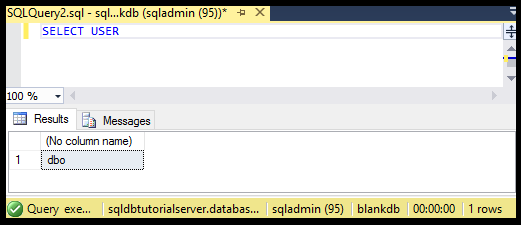

11. In the query window, execute the following query to return information about the permissions of the dbo user. 

   ```
   SELECT prm.permission_name
      , prm.class_desc
      , prm.state_desc
      , p2.name as 'Database role'
      , p3.name as 'Additional database role' 
   FROM sys.database_principals AS p
   JOIN sys.database_permissions AS prm
      ON p.principal_id = prm.grantee_principal_id
      LEFT JOIN sys.database_principals AS p2
      ON prm.major_id = p2.principal_id
      LEFT JOIN sys.database_role_members r
      ON p.principal_id = r.member_principal_id
      LEFT JOIN sys.database_principals AS p3
      ON r.role_principal_id = p3.principal_id
   WHERE p.name = 'dbo';
   ```

   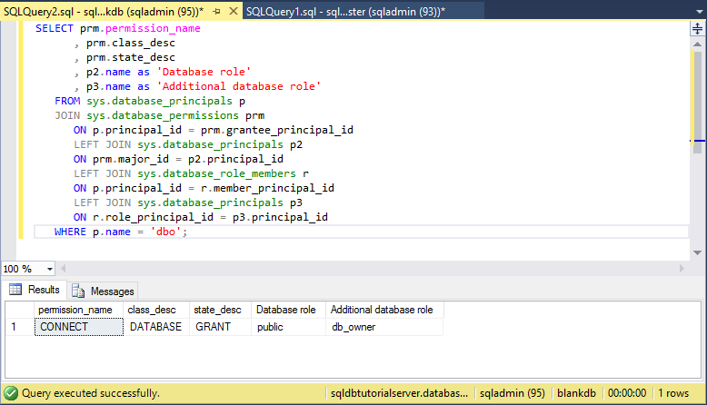

   > [!NOTE]
   > The dbo user is a member of the public role and also a member of the db_owner fixed database role. See [Database-Level Roles](https://msdn.microsoft.com/library/ms189121.aspx) for more information.
   >

## Create a new user with SELECT permissions

The steps in this procedure show you how to create a database-level user, test the default permissions of a new user(through the public role), grant a user **SELECT** permissions, and view these modified permissions.

> [!NOTE]
> Database-level users are also called [contained users](https://msdn.microsoft.com/library/ff929188.aspx) and increase the portability of your database. For information about the benefits of portability, see [Configure and manage Azure SQL Database security for geo-restore or failover to a secondary server](sql-database-geo-replication-security-config.md).
>

1. In Object Explorer, right-click **sqldbtutorialdb** and then click **New Query**.
2. Execute the following statement in this query window to create a user called **user1** in the sqldbtutorialdb database.

   ```
   CREATE USER user1
   WITH PASSWORD = 'p@ssw0rd';
   ```
   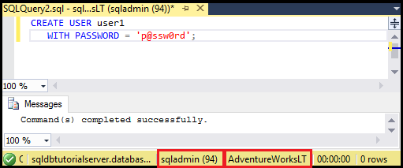

3. In the query window, execute the following query to return information about the permissions of user1.

   ```
   SELECT prm.permission_name
      , prm.class_desc
      , prm.state_desc
      , p2.name as 'Database role'
      , p3.name as 'Additional database role' 
   FROM sys.database_principals AS p
   JOIN sys.database_permissions AS prm
      ON p.principal_id = prm.grantee_principal_id
      LEFT JOIN sys.database_principals AS p2
      ON prm.major_id = p2.principal_id
      LEFT JOIN sys.database_role_members r
      ON p.principal_id = r.member_principal_id
      LEFT JOIN sys.database_principals AS p3
      ON r.role_principal_id = p3.principal_id
   WHERE p.name = 'user1';
   ```

   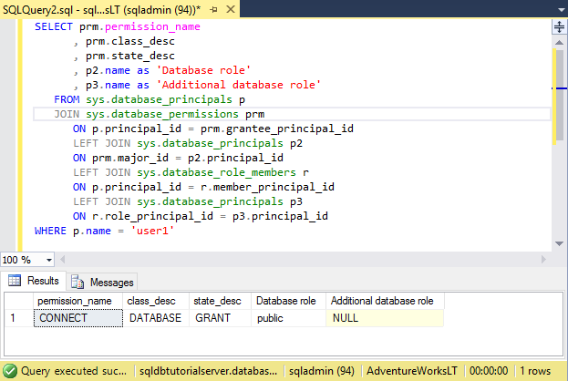

   > [!NOTE]
   > A new user in a database only has the permissions inherited from the public role.
   >

4. Execute the following queries using the **EXECUTE AS USER** statement to attempt to query the SalesLT.ProductCategory table in the sqldbtutorialdb database as **user1** with only the permissions inherited from the public role.

   ```
   EXECUTE AS USER = 'user1';  
   SELECT * FROM [SalesLT].[ProductCategory];
   REVERT;
   ```

   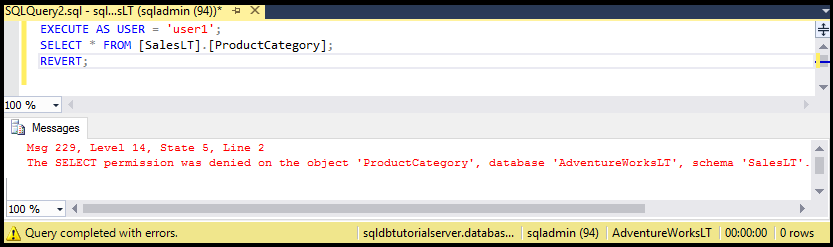

   > [!NOTE]
   > By default, the public role does not grant **SELECT** permissions on user objects.
   >

5. Execute the following statement to grant **SELECT** permissions on the SalesLT.ProductCategory table to **user1**.

   ```
   GRANT SELECT ON OBJECT::[SalesLT].[ProductCategory] to user1;
   ```

   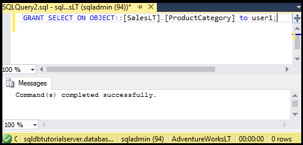

6. Execute the following queries to successfully query the SalesLT.ProductCategory table in the sqldbtutorialdb database as **user1**.

   ```
   EXECUTE AS USER = 'user1';  
   SELECT * FROM [SalesLT].[ProductCategory];
   REVERT;
   ```

   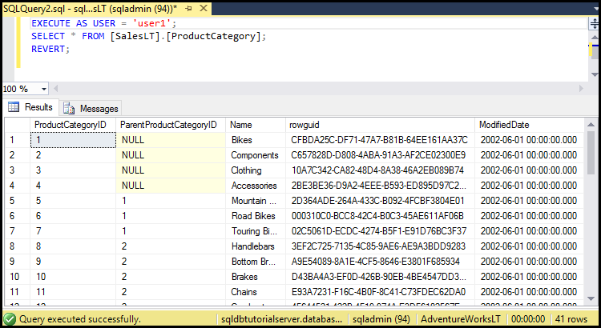

## Create a database-level firewall rule using T-SQL

The steps in this procedure show you how to create a database-level firewall rule using the [sp_set_database_firewall_rule](https://msdn.microsoft.com/library/dn270010.aspx) system stored procedure. A database-level firewall rule allows a server admin to allow users through the Azure SQL Database firewall only for specific databases.

> [!NOTE]
> [Database-level firewall rules](sql-database-firewall-configure.md) increase the portability of your database. For information about the benefits of portability, see [Configure and manage Azure SQL Database security for geo-restore or failover to a secondary server](sql-database-geo-replication-security-config.md).
>

> [!IMPORTANT]
> To test a database-level firewall rule, connect from another computer (or delete the server-level firewall rule in the Azure portal.)
>

1. Open SQL Server Management Studio on a computer for which you do not have a server-level firewall rule.

2. In the **Connect to Server** window, enter the server name and authentication information to connect using SQL Server authentication with the **user1** account. 
    
   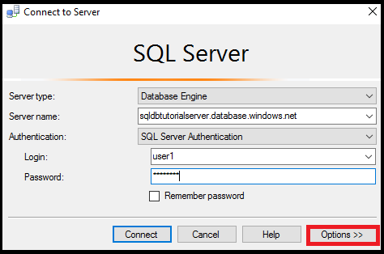

3. Click **Options** in the **Connect to server** dialog box to specify the database to which you want to connect and then type **sqldbtutorialdb** in the **Connect to Database** drop-down box on the **Connection Properties** tab.
   
   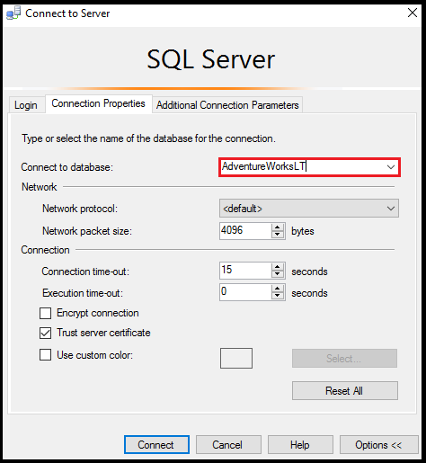

4. Click **Connect**. 

   A dialog box appears informing you that the computer from which you are attempting to connect to SQL Database does not have a firewall rule enabling access to the database. 

   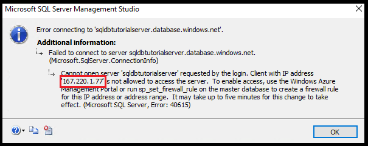


5. Copy the client IP address from this dialog box for use in step 8.
6. Click **OK** to close the error dialog box, but do not close the **Connect to Server** dialog box.
7. Switch back to a computer for which you have already created a server-level firewall rule. 
8. Connect to the sqldbtutorialdb database in SSMS as server admin and execute the following statement to create a database-level firewall using the IP address (or address range) from step 5.  

   ```
   EXEC sp_set_database_firewall_rule @name = N'sqldbtutorialdbFirewallRule', 
     @start_ip_address = 'x.x.x.x', @end_ip_address = 'x.x.x.x';
   ```

   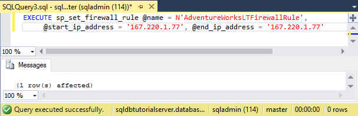

9. Switch computers again and click **Connect** in the **Connect to Server** dialog box to connect to sqldbtutorialdb as user1. 

   > [!NOTE]
   > After you create the database-level firewall rule, it may take up to 5 minutes to become active.
   >

10. After you connect successfully, expand **Databases** in Object Explorer. Notice that **user1** can only view the **sqldbtutorialdb** database.

   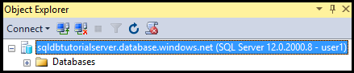

11. Expand **sqldbtutorialdb**, and then expand **Tables**. Notice that user1 only has permission to view a single table, the **SalesLT.ProductCategory** table. 

   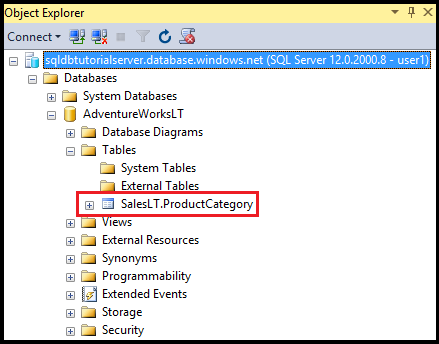

## Create a new user as db_owner and a database-level firewall rule

The steps in this procedure show you how to create a user in another database with db_owner database role permissions and create a database-level firewall for this other database. This new user with **db_owner** role membership will only be able to connect to and manage this single database.

1. Switch to your computer with a connection to SQL Database using the server admin account.
2. Open a query window connected to the **blankdb** database and execute the following statement to create a user called blankdbadmin in the blankdb database.

   ```
   CREATE USER blankdbadmin
   WITH PASSWORD = 'p@ssw0rd';
   ```

3. In the same query window, execute the following statement to add the blankdbadmin user to the db_owner database role. This user can now perform all actions necessary to manage the blankdb database.

   ```
   ALTER ROLE db_owner ADD MEMBER blankdbadmin; 
   ```

4. In the same query window, execute the following statement to create a database-level firewall by executing [sp_set_database_firewall_rule](https://msdn.microsoft.com/library/dn270010.aspx) using the IP address from step 4 in the previous procedure (or a range of IP addresses for users of this database):

   ```
   EXEC sp_set_database_firewall_rule @name = N'blankdbFirewallRule', 
     @start_ip_address = 'x.x.x.x', @end_ip_address = 'x.x.x.x';
   ```

5. Switch computers (to one for which you have created a database-level firewall rule) and connect to the blankdb database using the blankdbadmin user account.
6. Open a query window to the blankdb database and execute the following statement to create a user called blankdbuser1 in the blankdb database.

   ```
   CREATE USER blankdbuser1
   WITH PASSWORD = 'p@ssw0rd';
   ```
 
7. As necessary for your learning environment, create an additional database-level firewall rule for this user. However, if you created the database-level firewall rule using an IP address range, this may not be necessary.

## Grant dbmanager permissions and create a server-level firewall rule

The steps in this procedure show you how to create a login and user in the master database with permissions to create and manage new user databases. The steps also show you how to create an additional server-level firewall rule using Transact-SQL using [sp_set_firewall_rule](https://msdn.microsoft.com/library/dn270017.aspx). 

> [!IMPORTANT]
>The first server-level firewall rule must always be created in Azure (in the Azure portal, using PowerShell, or the REST API).
>

> [!IMPORTANT]
> Creating logins in the master database and creating a user account from a login is required for the server admin to delegate create database permissions to another user. However, creating logins and then creating users from logins decreases the portability of your environment.
>

1. Switch to your computer with a connection to SQL Database using the server admin account.
2. Open a query window connected to the master database and execute the following statement to create a login called dbcreator in the master database.

   ```
   CREATE LOGIN dbcreator
   WITH PASSWORD = 'p@ssw0rd';
   ```

3. In the same query window, 

   ```
   CREATE USER dbcreator
   FROM LOGIN dbcreator;
   ```

3. In the same query window, execute the following query to add the dbcreator user to the dbmanager database role. This user can now create and manage databases created by the user.

   ```
   ALTER ROLE dbmanager ADD MEMBER dbcreator; 
   ```

4. In the same query window, execute the following query to create a server-level firewall by executing [sp_set_firewall_rule](https://msdn.microsoft.com/library/dn270017.aspx) using an IP address appropriate for your environment:

   ```
   EXEC sp_set_firewall_rule @name = N'dbcreatorFirewallRule', 
     @start_ip_address = 'x.x.x.x', @end_ip_address = 'x.x.x.x';
   ```

5. Switch computers (to one for which you have created a server-level firewall rule) and connect to the master database using the dbcreator user account.
6. Open a query window to the master database and execute the following query to create a database called foo.

   ```
   CREATE DATABASE FOO (EDITION = 'basic');
   ```
 7. Optionally, delete this database to save money using the following statement:

   ```
   DROP DATABASE FOO;
   ```

## Complete script

To create the logins and users, add them to roles, grant them permissions, create database-level firewall rules, and create server-level firewall rules, execute the following statements in the appropriate databases on your server.

### master database
Execute these statements in the master database using the server admin account, adding the appropriate IP addresses or range.

```
CREATE LOGIN dbcreator WITH PASSWORD = 'p@ssw0rd';
CREATE USER dbcreator FROM LOGIN dbcreator;
ALTER ROLE dbmanager ADD MEMBER dbcreator;
EXEC sp_set_firewall_rule @name = N'dbcreatorFirewallRule', 
     @start_ip_address = 'x.x.x.x', @end_ip_address = 'x.x.x.x';
```

### sqldbtutorialdb database
Execute these statements in the sqldbtutorialdb database using the server admin account, adding the appropriate IP addresses or range.

```
CREATE USER user1 WITH PASSWORD = 'p@ssw0rd';
GRANT SELECT ON OBJECT::[SalesLT].[ProductCategory] to user1;
EXEC sp_set_database_firewall_rule @name = N'sqldbtutorialdbFirewallRule', 
     @start_ip_address = 'x.x.x.x', @end_ip_address = 'x.x.x.x';
```

### blankdb database
Execute these statements in the blankdb database using the server admin account, adding the appropriate IP addresses or range.

```
CREATE USER blankdbadmin
   WITH PASSWORD = 'p@ssw0rd';
ALTER ROLE db_owner ADD MEMBER blankdbadmin;
EXEC sp_set_database_firewall_rule @name = N'blankdbFirewallRule', 
     @start_ip_address = 'x.x.x.x', @end_ip_address = 'x.x.x.x';
CREATE USER blankdbuser1
   WITH PASSWORD = 'p@ssw0rd';
```

## Next steps
- For an overview of access and control in SQL Database, see [SQL Database access and control](sql-database-control-access.md).
- For an overview of logins, users, and database roles in SQL Database, see [Logins, users, and database roles](sql-database-manage-logins.md).
- For more information about database principals, see [Principals](https://msdn.microsoft.com/library/ms181127.aspx).
- For more information about database roles, see [Database roles](https://msdn.microsoft.com/library/ms189121.aspx).
- For more information about firewall rules in SQL Database, see [SQL Database firewall rules](sql-database-firewall-configure.md).
- For a tutorial using Azure Active Directory authentication, see [Azure AD authentication and authorization](sql-database-control-access-aad-authentication-get-started.md).

