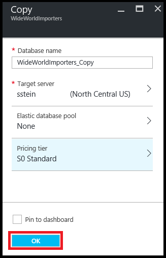

<properties
	pageTitle="Copy an Azure SQL database using the Azure portal | Microsoft Azure"
	description="Create a copy of an Azure SQL database"
	services="sql-database"
	documentationCenter=""
	authors="stevestein"
	manager="jhubbard"
	editor=""/>

<tags
	ms.service="sql-database"
	ms.devlang="NA"
	ms.date="09/19/2016"
	ms.author="sstein"
	ms.workload="data-management"
	ms.topic="article"
	ms.tgt_pltfrm="NA"/>

# Copy an Azure SQL Database using the Azure portal

> [AZURE.SELECTOR]
- [Overview](sql-database-copy.md)
- [Azure portal](sql-database-copy-portal.md)
- [PowerShell](sql-database-copy-powershell.md)
- [T-SQL](sql-database-copy-transact-sql.md)

The following steps show you how to copy a SQL database with the [Azure portal](https://portal.azure.com) to the same server or a different server.

To copy a SQL database, you need the following items:

- An Azure subscription. If you need an Azure subscription simply click **FREE TRIAL** at the top of this page, and then come back to finish this article.
- A SQL database to copy. If you do not have a SQL database, create one following the steps in this article: [Create your first Azure SQL Database](sql-database-get-started.md).

## Copy your SQL database

Open the SQL database page for the database you want to copy:

1.	Go to the [Azure portal](https://portal.azure.com).
2.	Click **More services** > **SQL databases**, and then click the desired database.
3.	On the SQL database page, click **Copy**:

    

1.  On the **Copy** page, a default database name is provided. Type a different name if you want (all databases on a server must have unique names).
2.  Select a **Target server**. The target server is where the database copy is created. You can copy the database to the same server, or a different server. You can create a server or select an existing server from the list. 
3.  After selecting the **Target server**, the **Elastic database pool**, and **Pricing tier** options will be enabled. If the server has a pool, you can copy the database into it.
3.  Click **OK** to start the copy process.

    

## Monitor the progress of the copy operation

- After starting the copy, click the portal notification for details.

    ![notification][3]
 
    ![monitor][4]

## Verify the database is live on the server

- Click **More services** > **SQL databases** and verify the new database is **Online**.

## Resolve logins

To resolve logins after the copy operation completes, see [Resolve logins](sql-database-copy-transact-sql.md#resolve-logins-after-the-copy-operation-completes)

## Next steps

- See [Copy an Azure SQL database](sql-database-copy.md) for an overview of copying an Azure SQL Database.
- See [Copy an Azure SQL database using PowerShell](sql-database-copy-powershell.md) to copy a database using PowerShell.
- See [Copy an Azure SQL database using T-SQL](sql-database-copy-transact-sql.md) to copy a database using Transact-SQL.
- See [How to manage Azure SQL database security after disaster recovery](sql-database-geo-replication-security-config.md) to learn about managing users and logins when copying a database to a different logical server.

## Additional resources

- [Manage logins](sql-database-manage-logins.md)
- [Connect to SQL Database with SQL Server Management Studio and perform a sample T-SQL query](sql-database-connect-query-ssms.md)
- [Export the database to a BACPAC](sql-database-export.md)
- [Business Continuity Overview](sql-database-business-continuity.md)
- [SQL Database documentation](https://azure.microsoft.com/documentation/services/sql-database/)

<!--Image references-->
[1]: ./media/sql-database-copy-portal/copy.png
[2]: ./media/sql-database-copy-portal/copy-ok.png
[3]: ./media/sql-database-copy-portal/copy-notification.png
[4]: ./media/sql-database-copy-portal/monitor-copy.png

