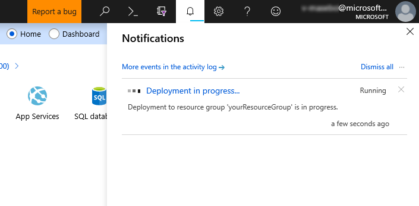
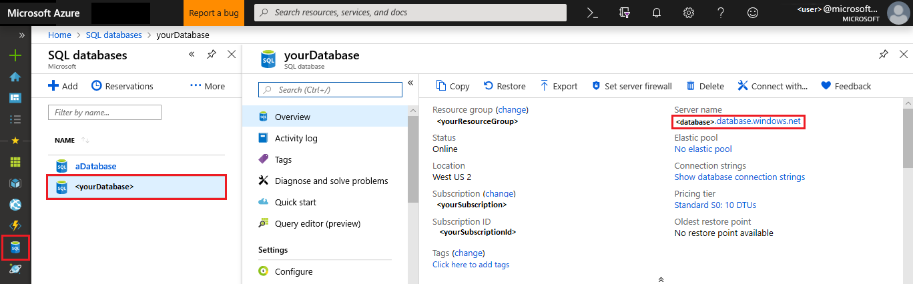

# Tutorial: Design a relational database in a single database within Azure SQL Database C&#x23; and ADO.NET

Azure SQL Database is a relational database-as-a-service (DBaaS) in the Microsoft Cloud (Azure). In this tutorial, you learn how to use the Azure portal and ADO.NET with Visual Studio to:

> [!div class="checklist"]
> * Create a single database using the Azure portal*
> * Set up a server-level IP firewall rule using the Azure portal
> * Connect to the database with ADO.NET and Visual Studio
> * Create tables with ADO.NET
> * Insert, update, and delete data with ADO.NET
> * Query data ADO.NET

*If you don't have an Azure subscription, [create a free account](https://azure.microsoft.com/free/) before you begin.

## Prerequisites

An installation of [Visual Studio 2019](https://www.visualstudio.com/downloads/) or later.

## Create a blank single database

A single database in Azure SQL Database is created with a defined set of compute and storage resources. The database is created within an [Azure resource group](../azure-resource-manager/resource-group-overview.md) and is managed using an [database server](sql-database-servers.md).

Follow these steps to create a blank single database.

1. Click **Create a resource** in the upper left-hand corner of the Azure portal.
2. On the **New** page, select **Databases** in the Azure Marketplace section, and then click **SQL Database** in the **Featured** section.

   

3. Fill out the **SQL Database** form with the following information, as shown on the preceding image:

    | Setting       | Suggested value | Description |
    | ------------ | ------------------ | ------------------------------------------------- |
    | **Database name** | *yourDatabase* | For valid database names, see [Database identifiers](/sql/relational-databases/databases/database-identifiers). |
    | **Subscription** | *yourSubscription*  | For details about your subscriptions, see [Subscriptions](https://account.windowsazure.com/Subscriptions). |
    | **Resource group** | *yourResourceGroup* | For valid resource group names, see [Naming rules and restrictions](/azure/architecture/best-practices/naming-conventions). |
    | **Select source** | Blank database | Specifies that a blank database should be created. |

4. Click **Server** to use an existing database server or create and configure a new database server. Either select an existing server or click **Create a new server** and fill out the **New server** form with the following information:

    | Setting       | Suggested value | Description |
    | ------------ | ------------------ | ------------------------------------------------- |
    | **Server name** | Any globally unique name | For valid server names, see [Naming rules and restrictions](/azure/architecture/best-practices/naming-conventions). |
    | **Server admin login** | Any valid name | For valid login names, see [Database identifiers](/sql/relational-databases/databases/database-identifiers). |
    | **Password** | Any valid password | Your password must have at least eight characters and must use characters from three of the following categories: upper case characters, lower case characters, numbers, and non-alphanumeric characters. |
    | **Location** | Any valid location | For information about regions, see [Azure Regions](https://azure.microsoft.com/regions/). |

    

5. Click **Select**.
6. Click **Pricing tier** to specify the service tier, the number of DTUs or vCores, and the amount of storage. You may explore the options for the number of DTUs/vCores and storage that is available to you for each service tier.

    After selecting the service tier, the number of DTUs or vCores, and the amount of storage, click **Apply**.

7. Enter a **Collation** for the blank database (for this tutorial, use the default value). For more information about collations, see [Collations](/sql/t-sql/statements/collations)

8. Now that you've completed the **SQL Database** form, click **Create** to provision the single database. This step may take a few minutes.

9. On the toolbar, click **Notifications** to monitor the deployment process.

   

## Create a server-level IP firewall rule

The SQL Database service creates an IP firewall at the server-level. This firewall prevents external applications and tools from connecting to the server and any databases on the server unless a firewall rule allows their IP through the firewall. To enable external connectivity to your single database, you must first add an IP firewall rule for your IP address (or IP address range). Follow these steps to create a [SQL Database server-level IP firewall rule](sql-database-firewall-configure.md).

> [!IMPORTANT]
> The SQL Database service communicates over port 1433. If you are trying to connect to this service from within a corporate network, outbound traffic over port 1433 may not be allowed by your network's firewall. If so, you cannot connect to your single database unless your administrator opens port 1433.

1. After the deployment completes, click **SQL databases** from the left-hand menu and then click *yourDatabase* on the **SQL databases** page. The overview page for your database opens, showing you the fully qualified **Server name** (such as *yourserver.database.windows.net*) and provides options for further configuration.

2. Copy this fully qualified server name for use to connect to your server and databases from SQL Server Management Studio.

   

3. Click **Set server firewall** on the toolbar. The **Firewall settings** page for the SQL Database server opens.

   

4. Click **Add client IP** on the toolbar to add your current IP address to a new IP firewall rule. An IP firewall rule can open port 1433 for a single IP address or a range of IP addresses.

5. Click **Save**. A server-level IP firewall rule is created for your current IP address opening port 1433 on the SQL Database server.

6. Click **OK** and then close the **Firewall settings** page.

Your IP address can now pass through the IP firewall. You can now connect to your single database using SQL Server Management Studio or another tool of your choice. Be sure to use the server admin account you created previously.

> [!IMPORTANT]
> By default, access through the SQL Database IP firewall is enabled for all Azure services. Click **OFF** on this page to disable for all Azure services.

[!INCLUDE [sql-database-csharp-adonet-create-query-2](../../includes/sql-database-csharp-adonet-create-query-2.md)]

## Next steps

In this tutorial, you learned basic database tasks such as create a database and tables, connect to the database, load data, and run queries. You learned how to:

> [!div class="checklist"]
> * Create a database
> * Set up a firewall rule
> * Connect to the database with [Visual Studio and C#](sql-database-connect-query-dotnet-visual-studio.md)
> * Create tables
> * Insert, update, delete, and query data

Advance to the next tutorial to learn about data migration.

> [!div class="nextstepaction"]
> [Migrate SQL Server to Azure SQL Database offline using DMS](../dms/tutorial-sql-server-to-azure-sql.md)
