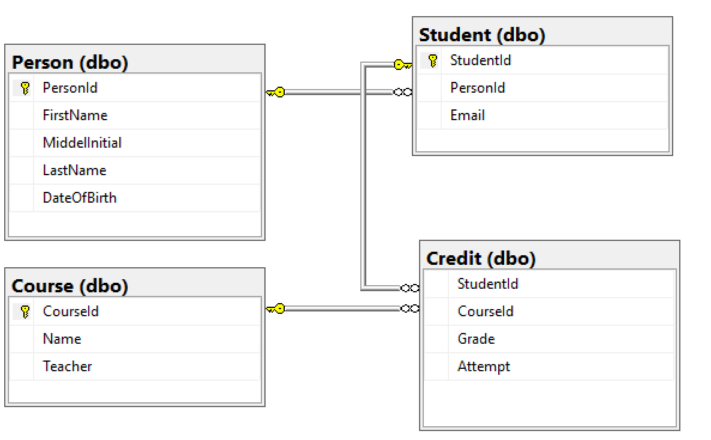
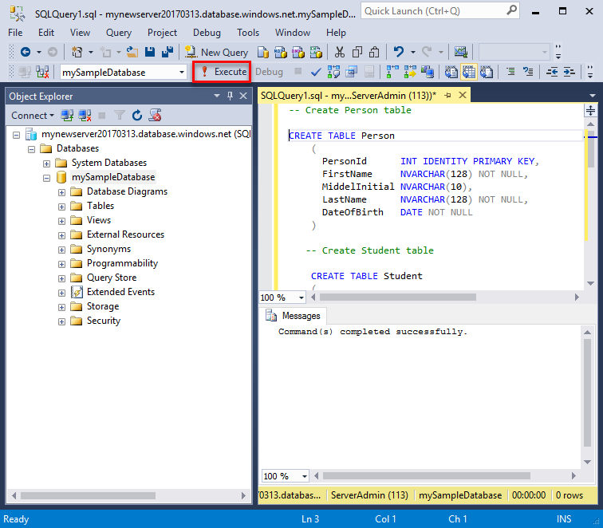
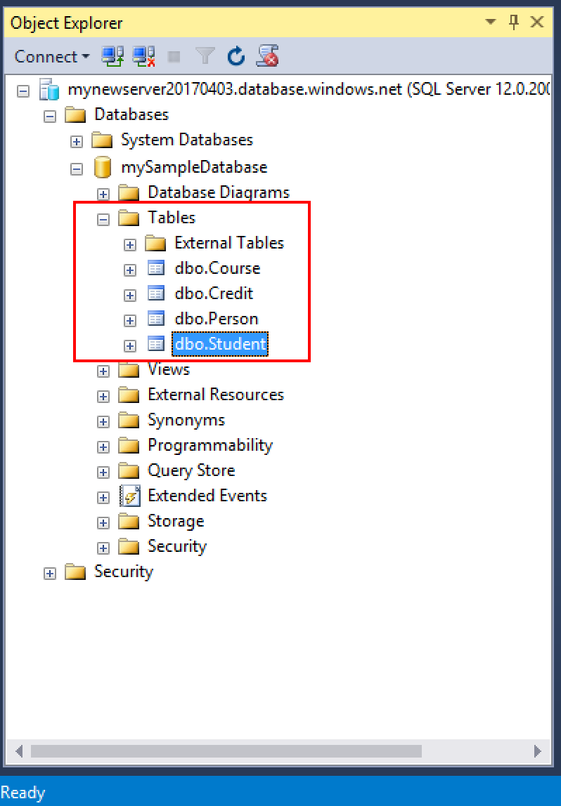

# Tutorial: Design your first Azure SQL database using SSMS

Azure SQL Database is a relational database-as-a service (DBaaS) in the Microsoft Cloud (Azure). In this tutorial, you learn how to use the Azure portal and [SQL Server Management Studio](https://msdn.microsoft.com/library/ms174173.aspx) (SSMS) to: 

> [!div class="checklist"]
> * Create a database in the Azure portal*
> * Set up a server-level firewall rule in the Azure portal
> * Connect to the database with SSMS
> * Create tables with SSMS
> * Bulk load data with BCP
> * Query that data with SSMS

If you don't have an Azure subscription, [create a free account](https://azure.microsoft.com/free/) before you begin.

   >[!NOTE]
   > For the purpose of this tutorial, we are using the [DTU-based purchasing model](sql-database-service-tiers-dtu.md), but you do have the option of choosing the [vCore-based purchasing model](sql-database-service-tiers-vcore.md). 

## Prerequisites

To complete this tutorial, make sure you have installed:
- The newest version of [SQL Server Management Studio](https://msdn.microsoft.com/library/ms174173.aspx) (SSMS).
- The newest version of [BCP and SQLCMD](https://www.microsoft.com/download/details.aspx?id=36433).

## Log in to the Azure portal

Sign in to the [Azure portal](https://portal.azure.com/).

## Create a blank SQL database

An Azure SQL database is created with a defined set of [compute and storage resources](sql-database-service-tiers-dtu.md). The database is created within an [Azure resource group](../azure-resource-manager/resource-group-overview.md) and in an [Azure SQL Database logical server](sql-database-features.md). 

Follow these steps to create a blank SQL database. 

1. Click **Create a resource** in the upper left-hand corner of the Azure portal.

2. On the **New** page, select **Databases** in the Azure Marketplace section, and then click **SQL Database** in the **Featured** section.

   

3. Fill out the SQL Database form with the following information, as shown on the preceding image:   

   | Setting       | Suggested value | Description | 
   | ------------ | ------------------ | ------------------------------------------------- | 
   | **Database name** | mySampleDatabase | For valid database names, see [Database Identifiers](https://docs.microsoft.com/sql/relational-databases/databases/database-identifiers). | 
   | **Subscription** | Your subscription  | For details about your subscriptions, see [Subscriptions](https://account.windowsazure.com/Subscriptions). |
   | **Resource group** | myResourceGroup | For valid resource group names, see [Naming rules and restrictions](https://docs.microsoft.com/azure/architecture/best-practices/naming-conventions). |
   | **Select source** | Blank database | Specifies that a blank database should be created. |

4. Click **Server** to create and configure a new server for your new database. Fill out the **New server form** with the following information: 

   | Setting       | Suggested value | Description | 
   | ------------ | ------------------ | ------------------------------------------------- | 
   | **Server name** | Any globally unique name | For valid server names, see [Naming rules and restrictions](https://docs.microsoft.com/azure/architecture/best-practices/naming-conventions). | 
   | **Server admin login** | Any valid name | For valid login names, see [Database Identifiers](https://docs.microsoft.com/sql/relational-databases/databases/database-identifiers).|
   | **Password** | Any valid password | Your password must have at least eight characters and must contain characters from three of the following categories: upper case characters, lower case characters, numbers, and non-alphanumeric characters. |
   | **Location** | Any valid location | For information about regions, see [Azure Regions](https://azure.microsoft.com/regions/). |

   

5. Click **Select**.

6. Click **Pricing tier** to specify the service tier, the number of DTUs or vCores, and the amount of storage. Explore the options for the number of DTUs/vCores and storage that is available to you for each service tier. For the purpose of this tutorial, we are using the [DTU-based purchasing model](sql-database-service-tiers-dtu.md), but you do have the option of choosing the [vCore-based purchasing model](sql-database-service-tiers-vcore.md). 

7. For this tutorial, select the **Standard** service tier and then use the slider to select **100 DTUs (S3)** and **400** GB of storage.

   

8. Accept the preview terms to use the **Add-on Storage** option. 

   > [!IMPORTANT]
   > More than 1 TB of storage in the Premium tier is currently available in all regions except the following: UK North, West Central US, UK South2, China East, USDoDCentral, Germany Central, USDoDEast, US Gov Southwest, US Gov South Central, Germany Northeast,  China North, US Gov East. In other regions, the storage max in the Premium tier is limited to 1 TB. See [P11-P15 Current Limitations]( sql-database-dtu-resource-limits-single-databases.md#single-database-limitations-of-p11-and-p15-when-the-maximum-size-greater-than-1-tb).

9. After selecting the server tier, the number of DTUs, and the amount of storage, click **Apply**.  

10. Select a **collation** for the blank database (for this tutorial, use the default value). For more information about collations, see [Collations](https://docs.microsoft.com/sql/t-sql/statements/collations)

11. Now that you have completed the SQL Database form, click **Create** to provision the database. Provisioning takes a few minutes. 

12. On the toolbar, click **Notifications** to monitor the deployment process.
    
     

## Create a server-level firewall rule

The SQL Database service creates a firewall at the server-level that prevents external applications and tools from connecting to the server or any databases on the server unless a firewall rule is created to open the firewall for specific IP addresses. Follow these steps to create a [SQL Database server-level firewall rule](sql-database-firewall-configure.md) for your client's IP address and enable external connectivity through the SQL Database firewall for your IP address only. 

> [!NOTE]
> SQL Database communicates over port 1433. If you are trying to connect from within a corporate network, outbound traffic over port 1433 may not be allowed by your network's firewall. If so, you cannot connect to your Azure SQL Database server unless your IT department opens port 1433.
>

1. After the deployment completes, click **SQL databases** from the left-hand menu and then click **mySampleDatabase** on the **SQL databases** page. The overview page for your database opens, showing you the fully qualified server name (such as **mynewserver-20170824.database.windows.net**) and provides options for further configuration. 

2. Copy this fully qualified server name for use to connect to your server and its databases in subsequent tutorials and quickstarts. 

    

3. Click **Set server firewall** on the toolbar. The **Firewall settings** page for the SQL Database server opens. 

    

4. Click **Add client IP** on the toolbar to add your current IP address to a new firewall rule. A firewall rule can open port 1433 for a single IP address or a range of IP addresses.

5. Click **Save**. A server-level firewall rule is created for your current IP address opening port 1433 on the logical server.

6. Click **OK** and then close the **Firewall settings** page.

You can now connect to the SQL Database server and its databases using SQL Server Management Studio or another tool of your choice from this IP address using the server admin account created previously.

> [!IMPORTANT]
> By default, access through the SQL Database firewall is enabled for all Azure services. Click **OFF** on this page to disable for all Azure services.

## SQL server connection information

Get the fully qualified server name for your Azure SQL Database server in the Azure portal. You use the fully qualified server name to connect to your server using SQL Server Management Studio.

1. Sign in to the [Azure portal](https://portal.azure.com/).
2. Select **SQL Databases** from the left-hand menu and click your database on the **SQL databases** page. 
3. In the **Essentials** pane in the Azure portal page for your database, locate and then copy the **Server name**.

   

## Connect to the database with SSMS

Use [SQL Server Management Studio](https://docs.microsoft.com/sql/ssms/sql-server-management-studio-ssms) to establish a connection to your Azure SQL Database server.

1. Open SQL Server Management Studio.

2. In the **Connect to Server** dialog box, enter the following information:

   | Setting       | Suggested value | Description | 
   | ------------ | ------------------ | ------------------------------------------------- | 
   | Server type | Database engine | This value is required |
   | Server name | The fully qualified server name | The name should be something like this: **mynewserver20170824.database.windows.net**. |
   | Authentication | SQL Server Authentication | SQL Authentication is the only authentication type that we have configured in this tutorial. |
   | Login | The server admin account | This is the account that you specified when you created the server. |
   | Password | The password for your server admin account | This is the password that you specified when you created the server. |

   

3. Click **Options** in the **Connect to server** dialog box. In the **Connect to database** section, enter **mySampleDatabase** to connect to this database.

     

4. Click **Connect**. The Object Explorer window opens in SSMS. 

5. In Object Explorer, expand **Databases** and then expand **mySampleDatabase** to view the objects in the sample database.

     

## Create tables in the database 

Create a database schema with four tables that model a student management system for universities using [Transact-SQL](https://docs.microsoft.com/sql/t-sql/language-reference):

- Person
- Course
- Student
- Credit that model a student management system for universities

The following diagram shows how these tables are related to each other. Some of these tables reference columns in other tables. For example, the Student table references the **PersonId** column of the **Person** table. Study the diagram to understand how the tables in this tutorial are related to one another. For an in-depth look at how to create effective database tables, see [Create effective database tables](https://msdn.microsoft.com/library/cc505842.aspx). For information about choosing data types, see [Data types](https://docs.microsoft.com/sql/t-sql/data-types/data-types-transact-sql).

> [!NOTE]
> You can also use the [table designer in SQL Server Management Studio](https://docs.microsoft.com/sql/ssms/visual-db-tools/design-database-diagrams-visual-database-tools) to create and design your tables. 



1. In Object Explorer, right-click **mySampleDatabase** and click **New Query**. A blank query window opens that is connected to your database.

2. In the query window, execute the following query to create four tables in your database: 

   ```sql 
   -- Create Person table

   CREATE TABLE Person
   (
   PersonId   INT IDENTITY PRIMARY KEY,
   FirstName   NVARCHAR(128) NOT NULL,
   MiddelInitial NVARCHAR(10),
   LastName   NVARCHAR(128) NOT NULL,
   DateOfBirth   DATE NOT NULL
   )
   
   -- Create Student table
 
   CREATE TABLE Student
   (
   StudentId INT IDENTITY PRIMARY KEY,
   PersonId  INT REFERENCES Person (PersonId),
   Email   NVARCHAR(256)
   )
   
   -- Create Course table
 
   CREATE TABLE Course
   (
   CourseId  INT IDENTITY PRIMARY KEY,
   Name   NVARCHAR(50) NOT NULL,
   Teacher   NVARCHAR(256) NOT NULL
   ) 

   -- Create Credit table
 
   CREATE TABLE Credit
   (
   StudentId   INT REFERENCES Student (StudentId),
   CourseId   INT REFERENCES Course (CourseId),
   Grade   DECIMAL(5,2) CHECK (Grade <= 100.00),
   Attempt   TINYINT,
   CONSTRAINT  [UQ_studentgrades] UNIQUE CLUSTERED
   (
   StudentId, CourseId, Grade, Attempt
   )
   )
   ```

   

3. Expand the 'tables' node in the SQL Server Management Studio Object explorer to see the tables you created.

   

## Load data into the tables

1. Create a folder called **SampleTableData** in your Downloads folder to store sample data for your database. 

2. Right-click the following links and save them into the **SampleTableData** folder. 

   - [SampleCourseData](https://sqldbtutorial.blob.core.windows.net/tutorials/SampleCourseData)
   - [SamplePersonData](https://sqldbtutorial.blob.core.windows.net/tutorials/SamplePersonData)
   - [SampleStudentData](https://sqldbtutorial.blob.core.windows.net/tutorials/SampleStudentData)
   - [SampleCreditData](https://sqldbtutorial.blob.core.windows.net/tutorials/SampleCreditData)

3. Open a command prompt window and navigate to the SampleTableData folder.

4. Execute the following commands to insert sample data into the tables replacing the values for **ServerName**, **DatabaseName**, **UserName**, and **Password** with the values for your environment.
  
   ```bcp
   bcp Course in SampleCourseData -S <ServerName>.database.windows.net -d <DatabaseName> -U <Username> -P <password> -q -c -t ","
   bcp Person in SamplePersonData -S <ServerName>.database.windows.net -d <DatabaseName> -U <Username> -P <password> -q -c -t ","
   bcp Student in SampleStudentData -S <ServerName>.database.windows.net -d <DatabaseName> -U <Username> -P <password> -q -c -t ","
   bcp Credit in SampleCreditData -S <ServerName>.database.windows.net -d <DatabaseName> -U <Username> -P <password> -q -c -t ","
   ```

You have now loaded sample data into the tables you created earlier.

## Query data

Execute the following queries to retrieve information from the database tables. See [Writing SQL Queries](https://technet.microsoft.com/library/bb264565.aspx) to learn more about writing SQL queries. The first query joins all four tables to find all the students taught by 'Dominick Pope' who have a grade higher than 75% in his class. The second query joins all four tables and finds all courses in which 'Noe Coleman' has ever enrolled.

1. In a SQL Server Management Studio query window, execute the following query:

   ```sql 
   -- Find the students taught by Dominick Pope who have a grade higher than 75%

   SELECT  person.FirstName,
   person.LastName,
   course.Name,
   credit.Grade
   FROM  Person AS person
   INNER JOIN Student AS student ON person.PersonId = student.PersonId
   INNER JOIN Credit AS credit ON student.StudentId = credit.StudentId
   INNER JOIN Course AS course ON credit.CourseId = course.courseId
   WHERE course.Teacher = 'Dominick Pope' 
   AND Grade > 75
   ```

2. In a SQL Server Management Studio query window, execute following query:

   ```sql
   -- Find all the courses in which Noe Coleman has ever enrolled

   SELECT  course.Name,
   course.Teacher,
   credit.Grade
   FROM  Course AS course
   INNER JOIN Credit AS credit ON credit.CourseId = course.CourseId
   INNER JOIN Student AS student ON student.StudentId = credit.StudentId
   INNER JOIN Person AS person ON person.PersonId = student.PersonId
   WHERE person.FirstName = 'Noe'
   AND person.LastName = 'Coleman'
   ```

## Next steps 
In this tutorial, you learned basic database tasks such as create a database and tables, load and query data, and restore the database to a previous point in time. You learned how to:
> [!div class="checklist"]
> * Create a database
> * Set up a firewall rule
> * Connect to the database with [SQL Server Management Studio](https://msdn.microsoft.com/library/ms174173.aspx) (SSMS)
> * Create tables
> * Bulk load data
> * Query that data

Advance to the next tutorial to learn about designing a database using Visual Studio and C#.

> [!div class="nextstepaction"]
>[Design an Azure SQL database and connect with C# and ADO.NET](sql-database-design-first-database-csharp.md)
