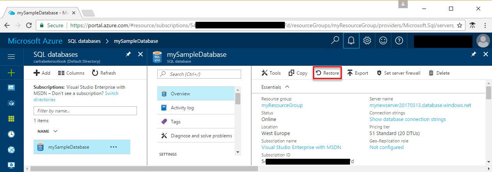
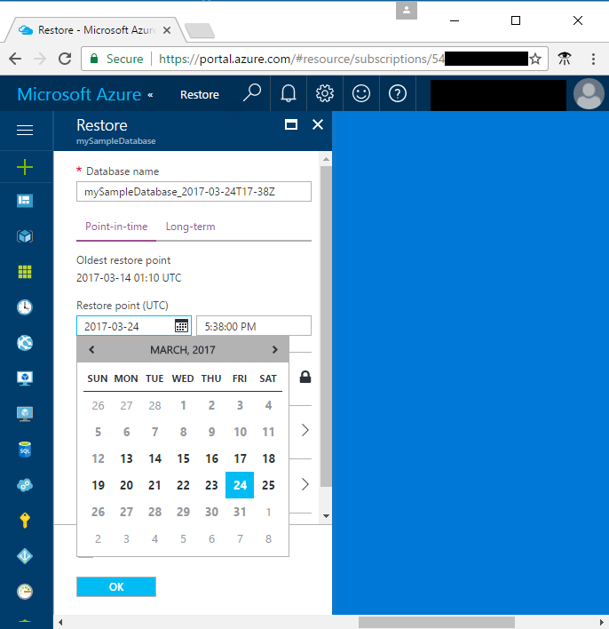

# Design your first Azure SQL database

In this tutorial, you use the Azure portal to create a database on a new server with a server-level firewall. You will then use SQL Server Management Studio to create a table, load data into that table, query the table, and add an index to the table. Finally, you will use the SQL Database service's automated backups to restore the database to an earlier point in time before you added this new table.

To complete this tutorial, make sure you have installed the newest version of [SQL Server Management Studio](https://msdn.microsoft.com/library/ms174173.aspx) (SSMS) 

## Step 1: Log in to the Azure portal

Log in to the [Azure portal](https://portal.azure.com/).

## Step 2: Create a SQL database

An Azure SQL database is created with a defined set of [compute and storage resources](sql-database-service-tiers.md). The database is created within an [Azure resource group](../azure-resource-manager/resource-group-overview.md) and in an [Azure SQL Database logical server](sql-database-features.md). 

Follow these steps to create a SQL database containing the Adventure Works LT sample data. 

1. Click the **New** button found on the upper left-hand corner of the Azure portal.

2. Select **Databases** from the **New** page, and select **SQL Database** from the **Databases** page.

    

3. Fill out the SQL Database form with the following information, as shown on the preceding image:     

   - Database name: **mySampleDatabase**
   - Resource group: **myResourceGroup**
   - Source: **Sample (AdventureWorksLT)**

4. Click **Server** to create and configure a new server for your new database. Fill out the **New server form** specifying a globally unique server name, provide a name for the Server admin login, and then specify the password of your choice. 

    
5. Click **Select**.

6. Click **Pricing tier** to specify the service tier and performance level for your new database. For this quick start, select **20 DTUs** and **250** GB of storage

    

7. Click **Apply**.  

8. Click **Create** to provision the database. Provisioning takes a few minutes. 

9. On the toolbar, click **Notifications** to monitor the deployment process.

    


## Step 3: Create a server-level firewall rule

The SQL Database service creates a firewall at the server-level preventing external applications and tools from connecting to the server or any databases on the server unless a firewall rule is created to open the firewall for specific IP addresses. Follow these steps to create a [SQL Database server-level firewall rule](sql-database-firewall-configure.md) for your client's IP address and enable external connectivity through the SQL Database firewall for your IP address only. 

1. After the deployment completes, click **SQL databases** from the left-hand menu and click your new database, **mySampleDatabase**, on the **SQL databases** page. The overview page for your database opens, showing you the fully qualified server name (such as **mynewserver20170327.database.windows.net**) and provides options for further configuration.

       

2. Click **Set server firewall** on the toolbar as shown in the previous image. The **Firewall settings** page for the SQL Database server opens. 

3. Click **Add client IP** on the toolbar and then click **Save**. A server-level firewall rule is created for your current IP address.

       

4. Click **OK** and then click the **X** to close the **Firewall settings** page.

You can now connect to the database and its server using SQL Server Management Studio or another tool of your choice.

## Step 4 - Get connection information

Get the fully qualified server name for your Azure SQL Database server in the Azure portal. You use the fully qualified server name to connect to your server using SQL Server Management Studio.

1. Log in to the [Azure portal](https://portal.azure.com/).
2. Select **SQL Databases** from the left-hand menu, and click your database on the **SQL databases** page. 
3. In the **Essentials** pane in the Azure portal page for your database, locate and then copy the **Server name**.

    

## Step 5 - Connect to the server using SSMS

Use SQL Server Management Studio to establish a connection to your Azure SQL Database server.

1. Type **SSMS** in the Windows search box and then click **Enter** to open SSMS.

2. In the **Connect to Server** dialog box, enter the following information:
   - **Server type**: Specify Database engine
   - **Server name**: Enter your fully qualified server name, such as **mynewserver20170313.database.windows.net**
   - **Authentication**: Specify SQL Server Authentication
   - **Login**: Enter your server admin account
   - **Password**: Enter the password for your server admin account
 
    

3. Click **Connect**. The Object Explorer window opens in SSMS. 

    

4. In Object Explorer, expand **Databases** and then expand **mySampleDatabase** to view the objects in the sample database.

## Step 6 - Create and query a table 
1. In Object Explorer, right-click **mySampleDatabase** and click **New Query**. A blank query window opens that is connected to your database.
2. In the query window, execute following query:

   ```sql 
   CREATE TABLE [dbo].[Students]
   (
     [student_id] int, 
     [name] varchar(100),
     [age] int,
     [email] varchar(100),
     [AddressID] int REFERENCES [SalesLT].[Address] (AddressID)
   );
   ```

   Once the query is complete, you have created an empty table in your database called Students.

3. In an SSMS query window, execute following query: 

   ```sql
   SELECT name, age, email 
   FROM [dbo].[Students]
   ```

   The Students table returns no data.

## Step 7 - Load data into the table 
1. Open a command prompt window.

2. Execute the following PowerShell command to download a sample text file to your current directory.

   ```powershell
   powershell -command "& { (New-Object Net.WebClient).DownloadFile('https://sqldbtutorial.blob.core.windows.net/tutorials/SampleStudentData.txt', 'SampleStudentData.txt'); echo 'Download complete' }" 
   ``` 

3. When this completes, execute the following command to insert 1000 rows into the Student table, replacing the values for **ServerName**, **DatabaseName**, **UserName**, and **Password** with the values for your environment.

   ```bcp
   bcp Students in SampleStudentData.txt -S <ServerName> -d <DatabaseName> -U <Username> -P <password> -q -c -t ","
   ```

You have now loaded sample data into the table you created earlier.

## Step 8 - Add an index to a table
To make searching for specific values in the table more efficient, create an index on the Students table. An index organizes the data in such a way, that now all data has to be looked at to find a specific value.

1. In an SSMS query window, execute following query:

   ```sql 
   CREATE NONCLUSTERED INDEX IX_Age ON Students (age);
   ```

2. In an SSMS query window, execute following query:

   ```sql
   SELECT name, age, email 
   FROM [dbo].[Students]
   WHERE age > 20
   ```

   This query returns the name, age, and email of students who are older than 20 years old.

## Step 9 - Restore a database to a point in time 
Databases in Azure have [continuous backups](sql-database-automated-backups.md) that are taken automatically every 5 - 10 minutes. These backups allow you to restore your database to a previous point in time. Restoring a database to a different point in time creates a duplicate database in the same server as the original database as of the point in time you specify (within the retention period for your service tier). The following steps restore the sample database to a point before the **Students** table was added. 

1. On the SQL Database page for your database, click **Restore** on the toolbar. The **Restore** page opens.

    

2. Fill out the **Restore** form with the required information:
	* Database name: Provide a database name 
	* Point-in-time: Select the **Point-in-time** tab on the Restore form 
	* Restore point: Select a time that occurs before the database was changed
	* Target server: You cannot change this value when restoring a database 
	* Elastic database pool: Select **None**  
	* Pricing tier: Select **20 DTUs** and **250 GB** of storage.

    

3. Click **OK** to restore the database to a point in time before the *Students* table was added.

## Next Steps 
For PowerShell samples for common tasks, see [SQL Database PowerShell samples](sql-database-powershell-samples.md)
