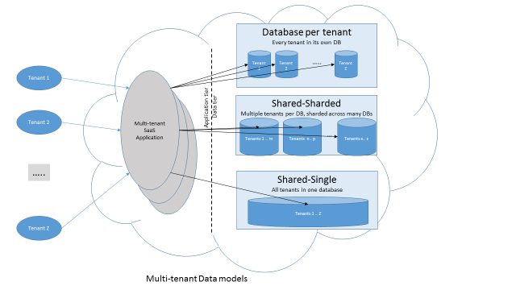
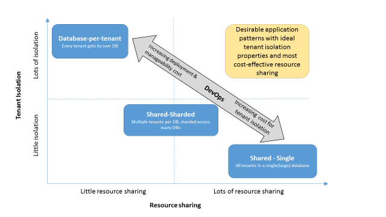
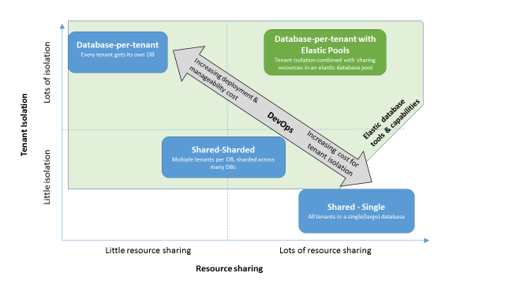

<properties
   pageTitle="Design patterns for multitenant SaaS applications and Azure SQL Database | Microsoft Azure"
   description="This article discusses the requirements and common data architecture patterns of multitenant database applications running in a cloud environment need to consider and the various tradeoffs associated with these patterns. It also explains how Azure SQL Database, with its elastic database pools and elastic tools, help address these requirements in a no-compromise fashion."
   keywords=""
   services="sql-database"
   documentationCenter=""
   authors="carlrabeler"
   manager="jhubbard"
   editor=""/>

<tags
   ms.service="sql-database"
   ms.devlang="NA"
   ms.topic="article"
   ms.tgt_pltfrm="NA"
   ms.workload="sqldb-design"
   ms.date="06/07/2016"
   ms.author="carlrab"/>

# Design patterns for multitenant SaaS applications and Azure SQL Database

In this article, you can learn about the requirements and common data architecture patterns of multitenant software as a service (SaaS) database applications that run in a cloud environment. It also explains the factors you need to consider and the trade-offs of different design patterns. Elastic database pools and elastic tools in Azure SQL Database can help you meet your specific requirements without compromising other objectives.

Developers sometimes make choices that work against their long-term best interests when they design tenancy models for the data tiers of multitenant applications. Initially, at least, a developer might perceive ease of development and lower cloud service provider costs as more important than tenant isolation or the scalability of an application. This can lead to customer satisfaction concerns and a costly course-correction later.

A multitenant application is an application that's hosted in a cloud environment and that provides the same set of services to hundreds or thousands of tenants who do not share or see each other’s data. An example is an SaaS application that provides services to tenants in a cloud-hosted environment.

## Multitenant applications

In multitenant applications, data and workload can be easily partitioned. You can partition data and workload, for example, along tenant boundaries, because most requests occur within the confines of a tenant. That property is inherent in the data and the workload, and it favors the application patterns discussed in this article.

Developers use this type of application across the whole spectrum of cloud-based applications, including:

- Partner database applications that are being transitioned to the cloud as SaaS applications
- SaaS applications built for the cloud from the ground up
- Direct, customer-facing applications
- Employee-facing enterprise applications

SaaS applications that are designed for the cloud and those with roots as partner database applications typically will be multitenant applications. These SaaS applications deliver a specialized software application as a service to their tenants. Tenants can access the application service and have full ownership of associated data stored as part of the application. But to take advantage of the benefits of SaaS, tenants must surrender some control over their own data. They trust the SaaS service provider to keep their data safe and isolated from other tenants’ data. Examples of this kind of multitenant SaaS application are MYOB, SnelStart, and Salesforce.com. Each of these applications can be partitioned along tenant boundaries and support the application design patterns we discuss in this article.

Applications that provide a direct service to customers or to employees within an organization (often referred to as users, rather than tenants) are another category on the multitenant application spectrum. Customers subscribe to the service and do not own the data that the service provider collects and stores. Service providers have less stringent requirements to keep their customers’ data isolated from each other beyond government-mandated privacy regulations. Examples of this kind of customer-facing multitenant application are media content providers like Netflix, Spotify, and Xbox LIVE. Other examples of easily partitionable applications are customer-facing, Internet-scale applications or Internet of Things (IoT) applications in which each customer or device can serve as a partition, and partition boundaries can separate users and devices.

Not all applications partition easily along a single property such as tenant, customer, user, or device. A complex enterprise resource planning (ERP) application, for example, has products, orders, and customers. It usually has a complex schema with thousands of highly interconnected tables.

No single partition strategy can apply to all tables and work across an application's workload. This article focuses on multitenant applications that have easily partitionable data and workloads.

## Multitenant application design trade-offs

The design pattern that a multitenant application developer chooses typically is based on a consideration of the following factors:

-	**Tenant isolation**. The developer needs to ensure that no tenant has unwanted access to other tenants’ data. The isolation requirement extends to other properties, such as providing protection from noisy neighbors, being able to restore a tenant’s data, and implementing tenant-specific customizations.
-	**Cloud resource cost**. An SaaS application needs to be cost-competitive. A multitenant application developer might choose to optimize for lower cost in the use of cloud resources, such as storage and compute costs.
-	**Ease of DevOps**. A multitenant application developer needs to incorporate isolation protection, maintain and monitor the health of their application and database schema, and troubleshoot tenant issues. Complexity in application development and operation translates directly to increased cost and challenges with tenant satisfaction.
-	**Scalability**. Being able to incrementally add more tenants and capacity for tenants who require it is imperative to a successful SaaS operation.

Each of these factors has trade-offs compared to another. The lowest-cost cloud offering might not offer the most convenient development experience. It’s important for a developer to make informed choices about these options and their trade-offs during the application design process.

A popular development pattern is to pack multiple tenants into one or a few databases. The benefits of this approach are a lower cost because you pay for a small number of databases, and the relative simplicity of working with a limited number of databases. But over time, a SaaS multitenant application developer will realize that this choice has substantial downsides in tenant isolation and scalability. If tenant isolation becomes important, additional effort is required to protect tenant data in shared storage from unauthorized access or noisy neighbors. This might significantly boost development efforts and isolation maintenance costs. Similarly, if adding tenants is required, this design pattern typically requires expertise to redistribute tenant data across databases to properly scale the data tier of an application.  

Tenant isolation often is a fundamental requirement in SaaS multitenant applications that cater to businesses and organizations. A developer might be tempted by perceived advantages in simplicity and cost over tenant isolation and scalability. This trade-off can prove complex and expensive as the service grows and tenant isolation requirements become more important and managed at the application layer. However, in multitenant applications that provide a direct, consumer-facing service to customers, tenant isolation might be a lower priority than optimizing for cloud resource cost.

## Multitenant data models

Common design practices for placing tenant data follow three distinct models, shown in Figure 1.

  
    Figure 1: Common design practices for multitenant data models

-	**Database-per-tenant**. Each tenant has its own database. All tenant-specific data is confined to the tenant’s database and isolated from other tenants and their data.
-	**Shared database-sharded**. Multiple tenants share one of multiple databases. A distinct set of tenants is assigned to each database by using a partitioning strategy such as hash, range, or list partitioning. This data distribution strategy often is referred to as sharding.
-	**Shared database-single**. A single, sometimes large, database contains data for all tenants, which are disambiguated in a tenant ID column.

> [AZURE.NOTE] An application developer might choose to place different tenants in different database schemas, and then use the schema name to disambiguate the different tenants. We do not recommend this approach because it usually requires the use of dynamic SQL, and it can’t be effective in plan caching. In the remainder of this article, we focus on the shared table approach for this category of multitenant application.

## Popular multitenant data models

It’s important to evaluate the different types of multitenant data models in terms of the application design trade-offs we’ve already identified. These factors help characterize the three most common multitenant data models described earlier and their database usage as shown in Figure 2.

-	**Isolation**. The degree of isolation between tenants can be a measure of how much tenant isolation a data model achieves.
-	**Cloud resource cost**. The amount of resource sharing between tenants can optimize cloud resource cost. A resource can be defined as the compute and storage cost.
-	**DevOps cost**. The ease of application development, deployment, and manageability reduces overall SaaS operation cost.  

In Figure 2, the Y axis shows the level of tenant isolation. The X axis shows the level of resource sharing. The gray, diagonal arrow in the middle indicates the direction of DevOps costs, tending to increase or decrease.

Figure 2: Popular multitenant data models

The lower-right quadrant in Figure 2 shows an application pattern that uses a potentially large, shared single database and the shared table (or separate schema) approach. It's good for resource sharing because all tenants use the same database resources (CPU, memory, input/output) in a single database. But tenant isolation is limited. You might need to take additional steps to protect tenants from each other at the application layer. This can significantly increase the DevOps cost of developing and managing the application. Scalability is limited by the scale of the hardware that hosts the database.

The lower-left quadrant in Figure 2 illustrates multiple tenants sharded across multiple databases (typically, different hardware scale units). Each database hosts a subset of tenants, which addresses the scalability concern of other patterns. If more capacity is required for more tenants, you can easily place the tenants on new databases allocated to new hardware scale units. However, the amount of resource sharing is reduced. Only tenants placed on the same scale units share resources. This approach provides little improvement to tenant isolation because many tenants are still collocated without being automatically protected from each other’s actions. Application complexity remains high.

The upper-left quadrant in Figure 2 is the third approach. It places each tenant’s data in its own database. This approach has good tenant-isolation properties but limits resource sharing when each database has its own dedicated resources. This is a good approach if all tenants have predictable workloads. But the provider cannot optimize resource sharing if tenant workloads become less predictable, which is common for SaaS applications. The provider must either over-provision to meet demands or lower resources. Either action results in either higher costs or lower tenant satisfaction. A higher degree of resource sharing across tenants becomes desirable to make the solution more cost-effective. Increasing the number of databases also increases DevOps cost to deploy and maintain the application. Despite these concerns, this method provides the best and easiest isolation for tenants.

These factors also influence the design pattern a customer chooses:

-	**Ownership of tenant data**. An application in which tenants retain ownership of their own data favors the pattern of a single database per tenant.
-	**Scale**. An application that targets hundreds of thousands or millions of tenants favors database sharing approaches such as sharding. Isolation requirements still can pose challenges.
-	**Value and business model**. If an application’s per-tenant revenue if very small (less than a dollar), isolation requirements become less critical and a shared database makes sense. If per-tenant revenue is a few dollars or more, a database-per-tenant model is more feasible. It might help reduce development costs.

Given the design trade-offs shown in Figure 2, an ideal multitenant model needs to incorporate good tenant isolation properties with optimal resource sharing among tenants. This is a model that fits in the category described in the upper-right quadrant of Figure 2.

## Multitenancy support in Azure SQL Database

Azure SQL Database supports all multitenant application patterns outlined in Figure 2. With elastic database pools, it now also supports a new application pattern that combines good resource sharing and the isolation benefits of the database-per-tenant approach (see the upper-right quadrant in Figure 3). Elastic database tools and capabilities in SQL Database can help reduce the cost to develop and operate an application that has many databases (shown in the shaded area in Figure 3 below). These tools can help you build and manage applications that use any of the multi-database patterns.

Figure 3: Multitenant application patterns in Azure SQL Database

## Database-per-tenant model with elastic pools and tools

Elastic database pools in SQL Database combine tenant isolation with resource sharing among tenant databases to better support the database-per-tenant approach. SQL Database is designed to be a data tier solution for SaaS providers who build multitenant applications. Combined with elastic database tool offerings, multitenancy is built in and the burden of resource sharing among tenants shifts from the application to the database service layer. The complexity of managing and querying at scale across databases is simplified with elastic jobs, elastic query, elastic transactions, and the elastic database client library.

| Application requirements | SQL database capabilities |
| ------------------------ | ------------------------- |
| Tenant isolation and resource sharing | [Elastic database pools](sql-database-elastic-pool.md): Allocate a pool of SQL Database resources and share the resources across a number of databases. Also, individual databases can draw as much resources from the pool as needed to accommodate capacity demand spikes due to changes in tenant workloads. The elastic pool itself can be scaled up or down as needed. Elastic pools also provide ease of manageability and monitoring and troubleshooting at the pool level. |
| Ease of DevOps across databases | [Elastic database pools](sql-database-elastic-pool.md): As noted earlier.|
||[Elastic query](sql-database-elastic-query-horizontal-partitioning.md): Query across databases for reporting or cross-tenant analysis.|
||[Elastic jobs](sql-database-elastic-jobs-overview.md): Package and reliably deploy database maintenance operations or database schema changes to a number of databases.|
||[Elastic transactions](sql-database-elastic-transactions-overview.md): Process changes to several databases in an atomic and isolated way. This is needed when applications need “all or nothing” guarantees over several database operations. |
||[Elastic database client library](sql-database-elastic-database-client-library.md): Manage data distributions and map tenants to databases. |

## Shared models

As described earlier, for most SaaS providers, a shared model approach might pose problems with tenant isolation issues and complexities with application development and maintenance. However, for multitenant applications that provide a service directly to consumers, tenant isolation requirements may not be as high a priority as minimizing cost. They might be able to pack tenants in one or more databases at a very high density to reduce costs. Shared-database models using a single database or multiple sharded databases might result in additional efficiencies in resource sharing and overall cost. Azure SQL Database provides some features that help customers build isolation for improved security and management at scale in the data tier.

| Application requirements | SQL database capabilities |
| ------------------------ | ------------------------- |
| Security isolation features | [Row-level security](https://msdn.microsoft.com/library/dn765131.aspx) |
|| [Database schema](https://msdn.microsoft.com/library/dd207005.aspx) |
| Ease of DevOps across databases | [Elastic query](sql-database-elastic-query-horizontal-partitioning.md) |
|| [Elastic jobs](sql-database-elastic-jobs-overview.md) |
|| [Elastic transactions](sql-database-elastic-transactions-overview.md) |
|| [Elastic database client library](sql-database-elastic-database-client-library.md) |
|| [Elastic database split and merge](sql-database-elastic-scale-overview-split-and-merge.md) |

## Summary

Tenant isolation requirements are very important for most SaaS multitenant applications. The best option to provide isolation leans heavily toward the database-per-tenant approach. The other two approaches require investments in complex application layers that require skilled development staff to provide isolation. This can significantly increase cost and risk. If isolation requirements are not accounted for early in the service development, retrofitting them can be even more costly in the first two models. The main drawbacks associated with the database-per-tenant model are related to increased cloud resource costs due to reduced sharing, and maintaining and managing a large number of databases. SaaS application developers often struggle when they make these trade-offs.

Although trade-offs might be major barriers with most cloud database service providers, Azure SQL Database eliminates the barriers with its elastic database pool and elastic database capabilities. SaaS developers can combine the isolation characteristics of a database-per-tenant model and optimize resource sharing and the manageability improvements of a large number of databases by using elastic pools and associated tools.

Multitenant application providers who have no tenant isolation requirements and who can pack tenants in a database at a very high density to reduce costs might find that shared data models result in additional efficiency in resource sharing and reduce overall cost. Azure SQL Database elastic database tools, sharding libraries, and security features help SaaS providers build and manage multitenant applications.

## Next steps

[Get started with elastic database tools](sql-database-elastic-scale-get-started.md) with a sample app that demonstrates the client library.

Create an [elastic pool custom dashboard for SaaS](https://github.com/Microsoft/sql-server-samples/tree/master/samples/manage/azure-sql-db-elastic-pools-custom-dashboard) with a sample app that uses elastic pools for a cost-effective, scalable database solution.

Use the Azure SQL Database tools to [migrate existing databases to scale out](sql-database-elastic-convert-to-use-elastic-tools.md).

View our tutorial on how to [create an elastic pool](sql-database-elastic-pool-create-portal.md).  

Learn how to [monitor and manage an elastic database pool](sql-database-elastic-pool-manage-portal.md).

## Additional resources

- [What is an Azure elastic database pool?](sql-database-elastic-pool.md)
- [Scaling out with Azure SQL Database](sql-database-elastic-scale-introduction.md)
- [Multitenant applications with elastic database tools and row-level security](sql-database-elastic-tools-multi-tenant-row-level-security.md)
- [Authentication in multitenant apps by using Azure Active Directory and OpenID Connect](../guidance/guidance-multitenant-identity-authenticate.md)
- [Tailspin Surveys application](../guidance/guidance-multitenant-identity-tailspin.md)
- [Solution quick starts](sql-database-solution-quick-starts.md)

## Questions and feature requests

For questions, you'll find us in the [SQL Database forum](http://social.msdn.microsoft.com/forums/azure/home?forum=ssdsgetstarted). Add a feature request in the [SQL Database feedback forum](https://feedback.azure.com/forums/217321-sql-database/).
