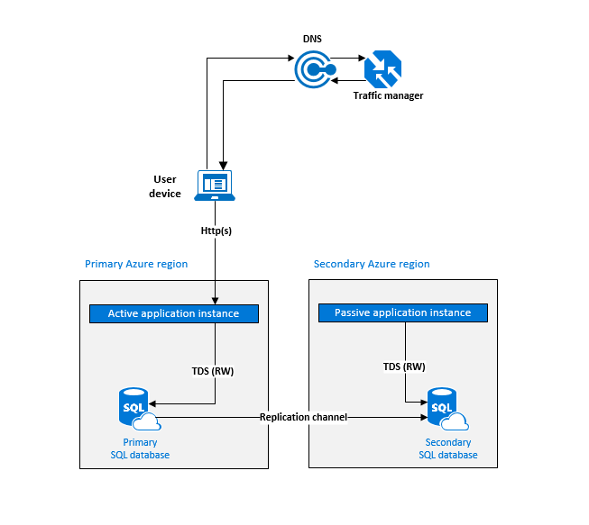
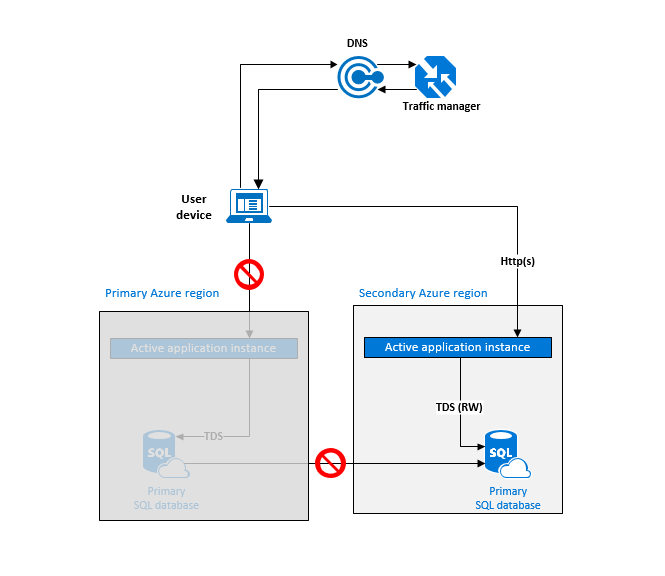
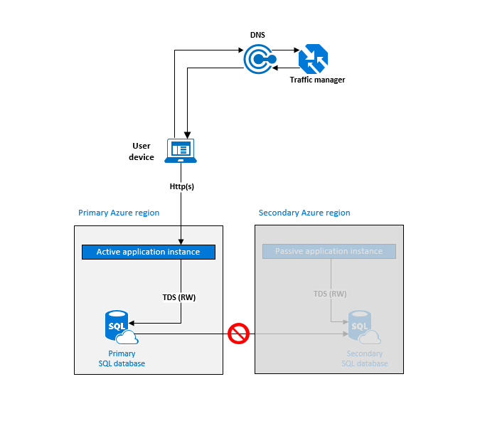
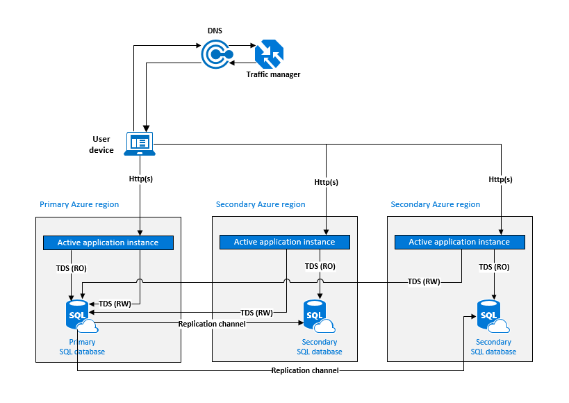
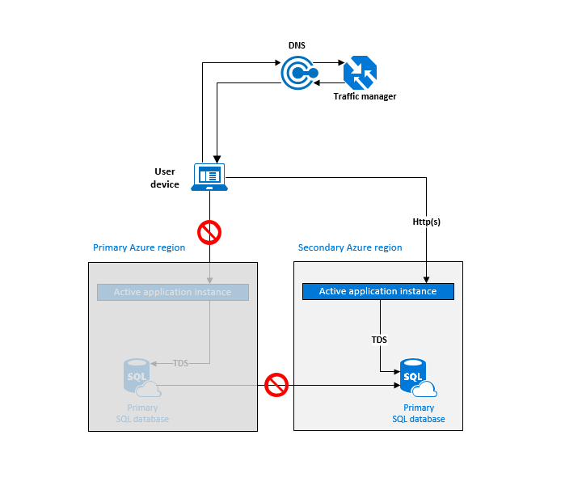
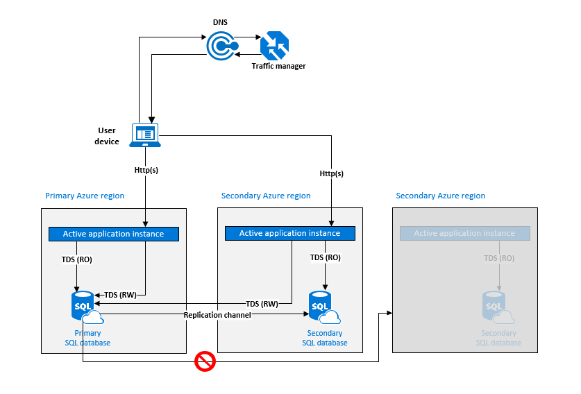
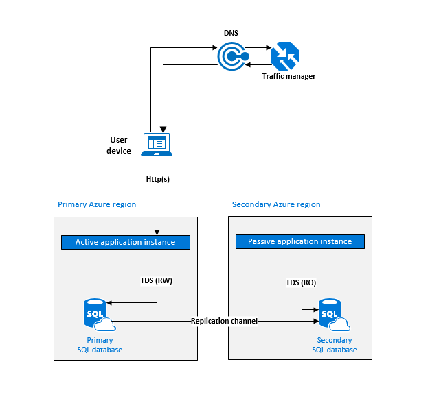
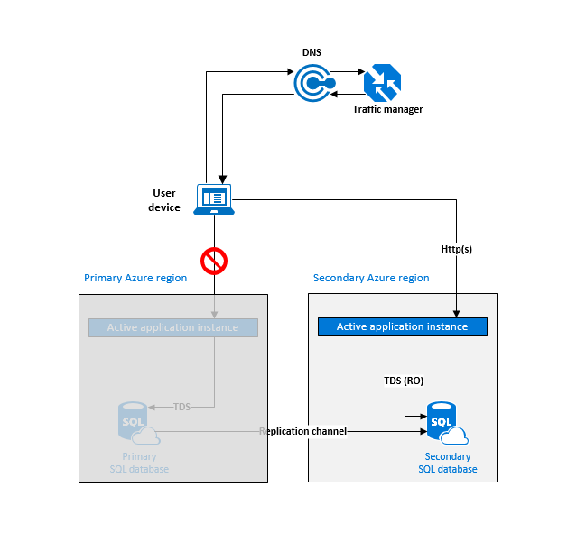
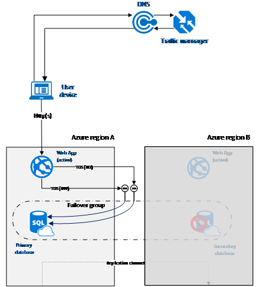

<properties
   pageTitle="Cloud disaster recovery solutions - SQL Database Active Geo-Replication | Microsoft Azure"
   description="Learn how to design cloud disaster recovery solutions for business continuity planning using geo-replication for app data backup with Azure SQL Database."
   keywords="cloud disaster recovery,disaster recovery solutions,app data backup,geo-replication,business continuity planning"
   services="sql-database"
   documentationCenter=""
   authors="anosov1960"
   manager="jhubbard"
   editor="monicar"/>

<tags
   ms.service="sql-database"
   ms.devlang="NA"
   ms.topic="article"
   ms.tgt_pltfrm="NA"
   ms.workload="data-management"
   ms.date="07/20/2016"
   ms.author="sashan"/>

# Design an application for cloud disaster recovery using Active Geo-Replication in SQL Database

> [AZURE.NOTE] [Active Geo-Replication](sql-database-geo-replication-overview.md) is now available for all databases in all tiers.

Learn how to use [Active Geo-Replication](sql-database-geo-replication-overview.md) in SQL Database to design database applications resilient to regional failures and catastrophic outages. For business continuity planning, you'll consider the application deployment topology, the service level agreement you are targeting, traffic latency, and costs. In this article we look at the common application patterns, and discuss the benefits and trade-offs of each option.

## Design pattern 1: Active-passive deployment for cloud disaster recovery with a co-located database

This option is best suited for applications with the following characteristics:

+ Active instance in a single Azure region
+ Strong dependency on read-write (RW) access to data
+ Cross-region connectivity between the application logic and the database is not acceptable due to latency and traffic cost    

In this case the application deployment topology is optimized for handling regional disasters when all application components are impacted and need to failover as a unit. For geographic redundancy both the application logic and the database are replicated to another region but not used for application workload under the normal conditions. The application in the secondary region should be configured to use a SQL connection string to the secondary database. Traffic manager is set up to use [failover routing method](../traffic-manager/traffic-manager-configure-failover-routing-method.md).  

> [AZURE.NOTE] [Azure traffic manager](../traffic-manager/traffic-manager-overview.md) is used throughout this article for illustration purposes only. You can use any load-balancing solution that supports failover routing method.    

In addition to the main application instances, you should consider deploying a small [worker role application](cloud-services-choose-me.md#tellmecs) that monitors your primary database by issuing periodic T-SQL read-only (RO) commands. You can use it to automatically trigger failover, to generate an alert on your application's admin console, or to do both. To ensure that monitoring is not impacted by region-wide outages you should deploy the monitoring application instances to each region and have them connected to the database in the other region but only the instance in the secondary region needs to be active.

> [AZURE.NOTE] Both monitoring applications should be active and probe both primary and secondary databases. The latter can be used to detect a failure in the secondary region and alert when the application is not protected.     

The following diagram shows this configuration before an outage.

After an outage in the primary region the monitoring application detects that the primary database is not accessible and registers an alert. Depending on your application SLA you can decide how many consecutive monitoring probes should fail before it declares a database outage. To achieve coordinated failover of the application end-point and the database you should have the monitoring application perform the following steps:

1. [Update the status of the primary end-point](https://msdn.microsoft.com/library/hh758250.aspx) to trigger end-point failover.
2. Call the secondary database to [initiate database failover](sql-database-geo-replication-portal.md).

After failover, the application will process the user requests in the secondary region but will remain co-located with the database because the primary database will now be in the secondary region. This is illustrated by the next diagram. In all diagrams solid lines indicates active connections, dotted lines indicate suspended connections and stop signs indicate action triggers.

If an outage happens in the secondary region the replication link between the primary and the secondary database will be suspended and the monitoring application will register an alert that the primary database is exposed. This will not impact the application's performance but it will operate exposed and therefore at higher risk in case both regions fail in succession.

> [AZURE.NOTE] We only recommend deployment configurations with a single DR region. This is because most of the Azure geographies have two regions. These configurations will not protect your application from a catastrophic failure of both regions. In an unlikely event of such a failure you can recover your databases in a third region using [geo-restore operation](sql-database-disaster-recovery.md#recovery-using-geo-restore).

Once the outage is mitigated the secondary database will be automatically synchronized with the primary. During synchronization performance of the primary could be slightly impacted depending on the amount of data that needs to be synchronized. The following diagram illustrates an outage in the secondary region.

The key **advantages** of this design pattern are:

+ The SQL connection string is set during the application deployment in each region and doesn’t change after failover.
+ The application's performance is not impacted by failover as the application and the database are always co-located.

The main **tradeoff** is that the redundant application instance in the secondary region is only used for disaster recovery.

## Design pattern 2: Active-active deployment for application load balancing
This cloud disaster recovery option is best suited for applications with the following characteristics:

+ High ratio of database reads to writes
+ Database write latency does not impact the end user experience  
+ Read-only logic can be separated from read-write logic by using a different connection string
+ Read-only logic does not depend on data being fully synchronized with the latest updates  

If your applications has these characteristics, load balancing the end user connections across multiple application instances in different regions can improve performance and the end-user experience. To achieve that, each region should have an active instance of the application with the read-write (RW) logic connected to the primary database in the primary region. The read-only (RO) logic should be connected to a secondary database in the same region as the application instance. Traffic manager should be set up to use [round-robin routing](../traffic-manager/traffic-manager-configure-round-robin-routing-method.md) or [performance routing](../traffic-manager/traffic-manager-configure-performance-routing-method.md) with [end-point monitoring](../traffic-manager/traffic-manager-monitoring.md) enabled for each application instance.

As in pattern #1, you should consider deploying a similar monitoring application. But unlike pattern #1 it will not be responsible for triggering the end-point failover.

> [AZURE.NOTE] While this pattern uses more than one secondary database only one of the secondaries would be used for failover for the reasons noted earlier. Because this pattern requires read-only access to the secondary it requires Active Geo-Replication.

Traffic manager should be configured for performance routing to direct the user connections to the application instance closest to the user's geographic location. The following diagram illustrates this configuration before an outage.

If a database outage is detected in the primary region you initiate failover of the primary database to one of the secondary regions, which will change the location of the primary database. Traffic manager will automatically exclude the offline end-point from the routing table but will continue routing the end user traffic to the remaining online instances. Because the primary database is now in a different region all online instances must change their read-write SQL connection string to connect to the new primary. It is important that you make this change prior to initiating the database failover. The read-only SQL connection strings should remain unchanged as they always point to the database in the same region. The failover steps are:  

1. Change read-write SQL connection strings to point to the new primary.
2. Call the designated secondary database to [initiate database failover](sql-database-geo-replication-portal.md).

The following diagram illustrates the new configuration after the failover.

In case of an outage in one of the secondary regions traffic manager will automatically remove the offline end-point in that region from the routing table. The replication channel to the secondary database in that region will be suspended. Because the remaining regions will get additional user traffic the application's performance may be impacted during the outage. Once the outage is mitigated the secondary database in the impacted region will be immediately synchronized with the primary. During synchronization performance of the primary could be slightly impacted depending on the amount of data that needs to be synchronized. The following diagram illustrates an outage in one of the secondary regions.

The key **advantage** of this design pattern is that you can scale the application workload across multiple secondaries to achieve the optimal end user performance. The **tradeoffs** of this option are:

+ Read-write connections between the application instances and database have varying latency and cost
+ Application performance is impacted during the outage
+ Application instances are required to dynamically change the SQL connection string after database failover.  

> [AZURE.NOTE] A similar approach can be used to offload specialized workloads such as reporting jobs, business intelligence tools or backups. Typically these workloads consume significant database resources therefore it is recommended that you designate one of the secondary databases for them with the performance level matched to the anticipated workload.

## Design pattern 3: Active-passive deployment for data preservation  
This option is best suited for applications with the following characteristics:

+ Any data loss is high business risk; the database failover can only be used as a last resort if the outage is permanent.
+ The application can operate in "read-only mode" for a period of time.

In this pattern, the application switches to read-only mode when connected to the secondary database. The application logic in the primary region is co-located with the primary database and operates in read-write mode (RW), the application logic in the secondary region is co-located with the secondary database and is ready to operate in read-only  mode (RO).  Traffic manager should be set up to use [failover routing](../traffic-manager/traffic-manager-configure-failover-routing-method.md) with [end-point monitoring](../traffic-manager/traffic-manager-monitoring.md) enabled for both application instances.

The following diagram illustrates this configuration before an outage.

When traffic manager detects a connectivity failure to the primary region it will automatically switch user traffic to the application instance in the secondary region. With this pattern it is important that you **do not** initiate database failover after the outage is detected. The application in the secondary region is activated and operates in read-only mode using the secondary database. This is illustrated by the following diagram.

Once the outage in the primary region is mitigated traffic manager will detect the restoration of connectivity in the primary region and will switch user traffic back to the application instance in the primary region. That application instance resumes and operates in read-write mode using the primary database.

> [AZURE.NOTE] Because this pattern requires read-only access to the secondary it requires Active Geo-Replication.

In case of an outage in the secondary region traffic manager will mark the application end-point in the primary region as degraded and the replication channel will be suspended. However it will not impact the application's performance during the outage. Once the outage is mitigated the secondary database will be immediately synchronized with the primary. During synchronization performance of the primary could be slightly impacted depending on the amount of data that needs to be synchronized.

This design pattern has several **advantages**:

+ It avoids data loss during the temporary outages.
+ It does not require you to deploy a monitoring application as the recovery is triggered by traffic manager.
+ Downtime depends only on how quickly traffic manager detects the connectivity failure, which is configurable.

The **tradeoffs** are:

+ Application must be able to operate in read-only mode.
+ It is required to dynamically switch to it when it is connected to a read-only database.
+ Resumption of read-write operations requires recovery of the primary region, which means full data access may be disabled for hours or even days.

> [AZURE.NOTE] In case of a permanent service outage in the region you will have to manually activate database failover and accept the data loss. The application will be functional in the secondary region with read-write access to the database.

## Business continuity planning: Choose an application design for cloud disaster recovery

Your specific cloud disaster recovery strategy can combine or extend these design patterns to best meet the needs of your application.  As mentioned earlier, the strategy you choose will be based on the SLA you want to offer to your customers and the application deployment topology. To help guide your decision the table below compares the choices based on the estimated data loss or recovery point objective (RPO) and estimated recovery time (ERT).

| Pattern | RPO | ERT
| :--- |:--- | :---
| Active-passive deployment for disaster recovery with co-located database access | Read-write access < 5 sec | Failure detection time + failover API call + application verification test
| Active-active deployment for application load balancing | Read-write access < 5 sec | Failure detection time + failover API call + SQL connection string change + application verification test
| Active-passive deployment for data preservation | Read-only access < 5 sec Read-write access = zero |  Read-only access = connectivity failure detection time + application verification test  Read-write access = time to mitigate the outage

## Next steps

- For information about using and configuring Active Geo-Replication for disaster recovery, see [Active Geo-Replication](sql-database-geo-replication-overview.md)
- For information about using Geo-Restore for disaster recovery, see [Geo-Restore](sql-database-recovery-using-backups.md#geo-restore)

## Next steps

- To learn about Azure SQL Database automated backups, see [SQL Database automated backups](sql-database-automated-backups.md)
- For a business continuity overview and scenarios, see [Business continuity overview](sql-database-business-continuity.md)
- To learn about using automated backups for recovery, see [restore a database from the service-initiated backups](sql-database-recovery-using-backups.md)
- To learn about faster recovery options, see [Active-Geo-Replication](sql-database-geo-replication-overview.md)  
- To learn about using automated backups for archiving, see [database copy](sql-database-copy.md)
