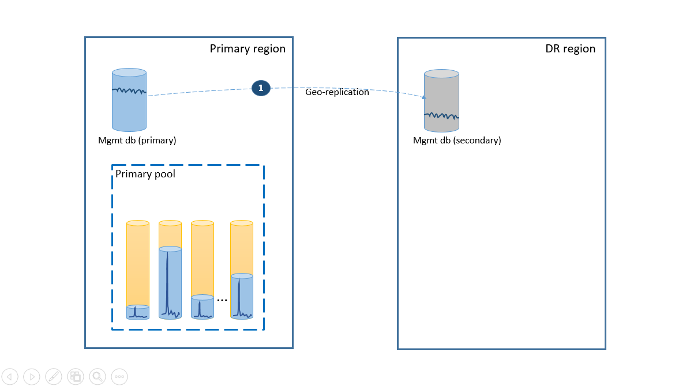
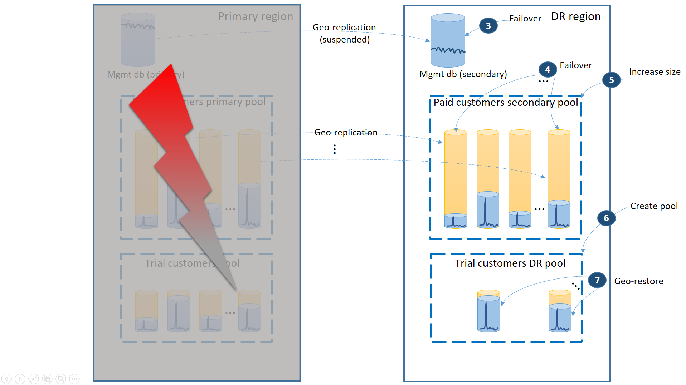
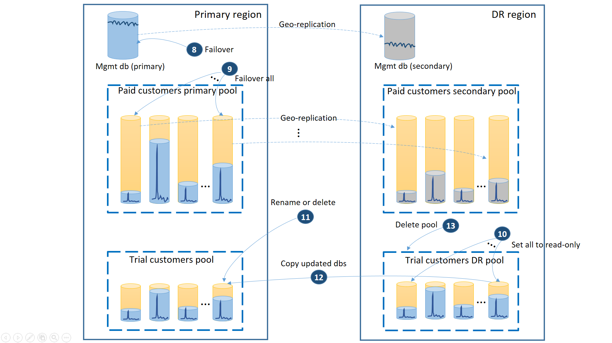

# Disaster recovery strategies for applications using SQL Database elastic pools

Over the years we have learned that cloud services are not foolproof and catastrophic incidents happen. SQL Database provides several capabilities to provide for the business continuity of your application when these incidents occur. [Elastic pools](sql-database-elastic-pool.md) and single databases support the same kind of disaster recovery (DR) capabilities. This article describes several DR strategies for elastic pools that leverage these SQL Database business continuity features.

This article uses the following canonical SaaS ISV application pattern:

A modern cloud-based web application provisions one SQL database for each end user. The ISV has many customers and therefore uses many databases, known as tenant databases. Because the tenant databases typically have unpredictable activity patterns, the ISV uses an elastic pool to make the database cost very predictable over extended periods of time. The elastic pool also simplifies the performance management when the user activity spikes. In addition to the tenant databases the application also uses several databases to manage user profiles, security, collect usage patterns etc. Availability of the individual tenants does not impact the application’s availability as whole. However, the availability and performance of management databases is critical for the application’s function and if the management databases are offline the entire application is offline.

This article discusses DR strategies covering a range of scenarios from cost sensitive startup applications to ones with stringent availability requirements.

> [!NOTE]
> If you are using Premium or Business Critical databases and elastic pools, you can make them resilient to regional outages by converting them to zone redundant deployment configuration. See [Zone-redundant databases](sql-database-high-availability.md).

## Scenario 1. Cost sensitive startup

I am a startup business and am extremely cost sensitive.  I want to simplify deployment and management of the application and I can have a limited SLA for individual customers. But I want to ensure the application as a whole is never offline.

To satisfy the simplicity requirement, deploy all tenant databases into one elastic pool in the Azure region of your choice and deploy management databases as geo-replicated single databases. For the disaster recovery of tenants, use geo-restore, which comes at no additional cost. To ensure the availability of the management databases, geo-replicate them to another region using an auto-failover group (step 1). The ongoing cost of the disaster recovery configuration in this scenario is equal to the total cost of the secondary databases. This configuration is illustrated on the next diagram.

If an outage occurs in the primary region, the recovery steps to bring your application online are illustrated by the next diagram.

* The failover group initiates automatic failover of the management database to the DR region. The application is automatically reconnected to the new primary and all new accounts and tenant databases are created in the DR region. The existing customers see their data temporarily unavailable.
* Create the elastic pool with the same configuration as the original pool (2).
* Use geo-restore to create copies of the tenant databases (3). You can consider triggering the individual restores by the end-user connections or use some other application-specific priority scheme.

At this point your application is back online in the DR region, but some customers experience delay when accessing their data.

If the outage was temporary, it is possible that the primary region is recovered by Azure before all the database restores are complete in the DR region. In this case, orchestrate moving the application back to the primary region. The process takes the steps illustrated on the next diagram.

* Cancel all outstanding geo-restore requests.
* Fail over the management databases to the primary region (5). After the region’s recovery, the old primaries have automatically become secondaries. Now they switch roles again.
* Change the application's connection string to point back to the primary region. Now all new accounts and tenant databases are created in the primary region. Some existing customers see their data temporarily unavailable.
* Set all databases in the DR pool to read-only to ensure they cannot be modified in the DR region (6).
* For each database in the DR pool that has changed since the recovery, rename or delete the corresponding databases in the primary pool (7).
* Copy the updated databases from the DR pool to the primary pool (8).
* Delete the DR pool (9)

At this point your application is online in the primary region with all tenant databases available in the primary pool.

The key **benefit** of this strategy is low ongoing cost for data tier redundancy. Backups are taken automatically by the SQL Database service with no application rewrite and at no additional cost.  The cost is incurred only when the elastic databases are restored. The **trade-off** is that the complete recovery of all tenant databases takes significant time. The length of time depends on the total number of restores you initiate in the DR region and overall size of the tenant databases. Even if you prioritize some tenants' restores over others, you are competing with all the other restores that are initiated in the same region as the service arbitrates and throttles to minimize the overall impact on the existing customers' databases. In addition, the recovery of the tenant databases cannot start until the new elastic pool in the DR region is created.

## Scenario 2. Mature application with tiered service

I am a mature SaaS application with tiered service offers and different SLAs for trial customers and for paying customers. For the trial customers, I have to reduce the cost as much as possible. Trial customers can take downtime but I want to reduce its likelihood. For the paying customers, any downtime is a flight risk. So I want to make sure that paying customers are always able to access their data.

To support this scenario, separate the trial tenants from paid tenants by putting them into separate elastic pools. The trial customers have lower eDTU or vCores per tenant and lower SLA with a longer recovery time. The paying customers are in a pool with higher eDTU or vCores per tenant and a higher SLA. To guarantee the lowest recovery time, the paying customers' tenant databases are geo-replicated. This configuration is illustrated on the next diagram.

As in the first scenario, the management databases are quite active so you use a single geo-replicated database for it (1). This ensures the predictable performance for new customer subscriptions, profile updates, and other management operations. The region in which the primaries of the management databases reside is the primary region and the region in which the secondaries of the management databases reside is the DR region.

The paying customers’ tenant databases have active databases in the “paid” pool provisioned in the primary region. Provision a secondary pool with the same name in the DR region. Each tenant is geo-replicated to the secondary pool (2). This enables quick recovery of all tenant databases using failover.

If an outage occurs in the primary region, the recovery steps to bring your application online are illustrated in the next diagram:

* Immediately fail over the management databases to the DR region (3).
* Change the application’s connection string to point to the DR region. Now all new accounts and tenant databases are created in the DR region. The existing trial customers see their data temporarily unavailable.
* Fail over the paid tenant's databases to the pool in the DR region to immediately restore their availability (4). Since the failover is a quick metadata level change, consider an optimization where the individual failovers are triggered on demand by the end-user connections.
* If your secondary pool eDTU size or vCore value was lower than the primary because the secondary databases only required the capacity to process the change logs while they were secondaries, immediately increase the pool capacity now to accommodate the full workload of all tenants (5).
* Create the new elastic pool with the same name and the same configuration in the DR region for the trial customers' databases (6).
* Once the trial customers’ pool is created, use geo-restore to restore the individual trial tenant databases into the new pool (7). Consider triggering the individual restores by the end-user connections or use some other application-specific priority scheme.

At this point your application is back online in the DR region. All paying customers have access to their data while the trial customers experience delay when accessing their data.

When the primary region is recovered by Azure *after* you have restored the application in the DR region you can continue running the application in that region or you can decide to fail back to the primary region. If the primary region is recovered *before* the failover process is completed, consider failing back right away. The failback takes the steps illustrated in the next diagram:

* Cancel all outstanding geo-restore requests.
* Fail over the management databases (8). After the region’s recovery, the old primary automatically become the secondary. Now it becomes the primary again.  
* Fail over the paid tenant databases (9). Similarly, after the region’s recovery, the old primaries automatically become the secondaries. Now they become the primaries again.
* Set the restored trial databases that have changed in the DR region to read-only (10).
* For each database in the trial customers DR pool that changed since the recovery, rename or delete the corresponding database in the trial customers primary pool (11).
* Copy the updated databases from the DR pool to the primary pool (12).
* Delete the DR pool (13).

> [!NOTE]
> The failover operation is asynchronous. To minimize the recovery time it is important that you execute the tenant databases' failover command in batches of at least 20 databases.

The key **benefit** of this strategy is that it provides the highest SLA for the paying customers. It also guarantees that the new trials are unblocked as soon as the trial DR pool is created. The **trade-off** is that this setup increases the total cost of the tenant databases by the cost of the secondary DR pool for paid customers. In addition, if the secondary pool has a different size, the paying customers experience lower performance after failover until the pool upgrade in the DR region is completed.

## Scenario 3. Geographically distributed application with tiered service

I have a mature SaaS application with tiered service offers. I want to offer a very aggressive SLA to my paid customers and minimize the risk of impact when outages occur because even brief interruption can cause customer dissatisfaction. It is critical that the paying customers can always access their data. The trials are free and an SLA is not offered during the trial period.

To support this scenario, use three separate elastic pools. Provision two equal size pools with high eDTUs or vCores per database in two different regions to contain the paid customers' tenant databases. The third pool containing the trial tenants can have lower eDTUs or vCores per database and be provisioned in one of the two regions.

To guarantee the lowest recovery time during outages, the paying customers' tenant databases are geo-replicated with 50% of the primary databases in each of the two regions. Similarly, each region has 50% of the secondary databases. This way, if a region is offline, only 50% of the paid customers' databases are impacted and have to fail over. The other databases remain intact. This configuration is illustrated in the following diagram:

As in the previous scenarios, the management databases are quite active so configure them as single geo-replicated databases (1). This ensures the predictable performance of the new customer subscriptions, profile updates and other management operations. Region A is the primary region for the management databases and the region B is used for recovery of the management databases.

The paying customers’ tenant databases are also geo-replicated but with primaries and secondaries split between region A and region B (2). This way, the tenant primary databases impacted by the outage can fail over to the other region and become available. The other half of the tenant databases are not be impacted at all.

The next diagram illustrates the recovery steps to take if  an outage occurs in region A.

* Immediately fail over the management databases to region B (3).
* Change the application’s connection string to point to the management databases in region B. Modify the management databases to make sure the new accounts and tenant databases are created in region B and the existing tenant databases are found there as well. The existing trial customers see their data temporarily unavailable.
* Fail over the paid tenant's databases to pool 2 in region B to immediately restore their availability (4). Since the failover is a quick metadata level change, you may consider an optimization where the individual failovers are triggered on demand by the end-user connections.
* Since now pool 2 contains only primary databases, the total workload in the pool increases and can immediately increase its eDTU size (5) or number of vCores.
* Create the new elastic pool with the same name and the same configuration in the region B for the trial customers' databases (6).
* Once the pool is created use geo-restore to restore the individual trial tenant database into the pool (7). You can consider triggering the individual restores by the end-user connections or use some other application-specific priority scheme.

> [!NOTE]
> The failover operation is asynchronous. To minimize the recovery time, it is important that you execute the tenant databases' failover command in batches of at least 20 databases.

At this point your application is back online in region B. All paying customers have access to their data while the trial customers experience delay when accessing their data.

When region A is recovered you need to decide if you want to use region B for trial customers or failback to using the trial customers pool in region A. One criteria could be the % of trial tenant databases modified since the recovery. Regardless of that decision, you need to re-balance the paid tenants between two pools. the next diagram illustrates the process when the trial tenant databases fail back to region A.  

* Cancel all outstanding geo-restore requests to trial DR pool.
* Fail over the management database (8). After the region’s recovery, the old primary automatically became the secondary. Now it becomes the primary again.  
* Select which paid tenant databases fail back to pool 1 and initiate failover to their secondaries (9). After the region’s recovery, all databases in pool 1 automatically became secondaries. Now 50% of them become primaries again.
* Reduce the size of pool 2 to the original eDTU (10) or number of vCores.
* Set all restored trial databases in the region B to read-only (11).
* For each database in the trial DR pool that has changed since the recovery, rename or delete the corresponding database in the trial primary pool (12).
* Copy the updated databases from the DR pool to the primary pool (13).
* Delete the DR pool (14).

The key **benefits** of this strategy are:

* It supports the most aggressive SLA for the paying customers because it ensures that an outage cannot impact more than 50% of the tenant databases.
* It guarantees that the new trials are unblocked as soon as the trail DR pool is created during the recovery.
* It allows more efficient use of the pool capacity as 50% of secondary databases in pool 1 and pool 2 are guaranteed to be less active than the primary databases.

The main **trade-offs** are:

* The CRUD operations against the management databases have lower latency for the end users connected to region A than for the end users connected to region B as they are executed against the primary of the management databases.
* It requires more complex design of the management database. For example, each tenant record has a location tag that needs to be changed during failover and failback.  
* The paying customers may experience lower performance than usual until the pool upgrade in region B is completed.

## Summary

This article focuses on the disaster recovery strategies for the database tier used by a SaaS ISV multi-tenant application. The strategy you choose is based on the needs of the application, such as the business model, the SLA you want to offer to your customers, budget constraint etc. Each described strategy outlines the benefits and trade-off so you could make an informed decision. Also, your specific application likely includes other Azure components. So you review their business continuity guidance and orchestrate the recovery of the database tier with them. To learn more about managing recovery of database applications in Azure, refer to [Designing cloud solutions for disaster recovery](sql-database-designing-cloud-solutions-for-disaster-recovery.md).  

## Next steps

* To learn about Azure SQL Database automated backups, see [SQL Database automated backups](sql-database-automated-backups.md).
* For a business continuity overview and scenarios, see [Business continuity overview](sql-database-business-continuity.md).
* To learn about using automated backups for recovery, see [restore a database from the service-initiated backups](sql-database-recovery-using-backups.md).
* To learn about faster recovery options, see [Active geo-replication](sql-database-active-geo-replication.md) and [Auto-failover groups](sql-database-auto-failover-group.md).
* To learn about using automated backups for archiving, see [database copy](sql-database-copy.md).
