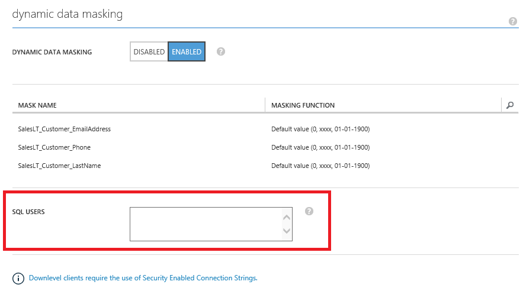
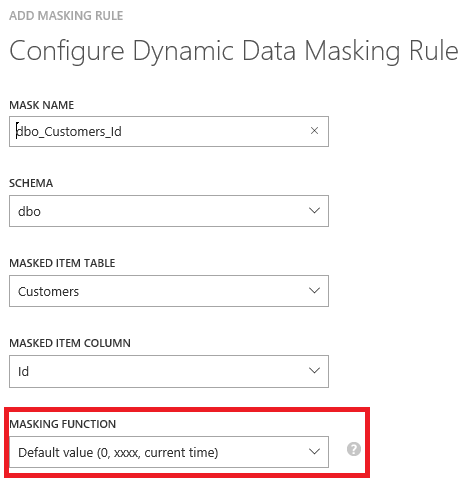

<properties
   pageTitle="Get started with SQL Database Dynamic Data Masking (Azure Classic Portal)"
   description="How to get started with SQL Database Dynamic Data Masking in the Azure Classic Portal"
   services="sql-database"
   documentationCenter=""
   authors="ronitr"
   manager="jhubbard"
   editor=""/>

<tags
   ms.service="sql-database"
   ms.devlang="NA"
   ms.topic="article"
   ms.tgt_pltfrm="NA"
   ms.workload="data-services"
   ms.date="07/10/2016"
   ms.author="ronitr; ronmat; v-romcal; sstein"/>

# Get started with SQL Database Dynamic Data Masking (Azure Classic Portal)

> [AZURE.SELECTOR]
- [Dynamic Data Masking - Azure Portal](sql-database-dynamic-data-masking-get-started.md)

## Overview

SQL Database Dynamic Data Masking limits sensitive data exposure by masking it to non-privileged users. Dynamic data masking is supported for the V12 version of Azure SQL Database.

Dynamic data masking helps prevent unauthorized access to sensitive data by enabling customers to designate how much of the sensitive data to reveal with minimal impact on the application layer. It’s a policy-based security feature that hides the sensitive data in the result set of a query over designated database fields, while the data in the database is not changed.

For example, a service representative at a call center may identify callers by several digits of their social security number or credit card number, but those data items should not be fully exposed to the service representative. A masking rule can be defined that masks all but the last four digits of any social security number or credit card number in the result set of any query. As another example, an appropriate data mask can be defined to protect personally identifiable information (PII) data, so that a developer can query production environments for troubleshooting purposes without violating compliance regulations.

## SQL Database Dynamic Data Masking basics

You set up dynamic data masking policy in the Azure Classic Portal under the Auditing & Security tab for your database.

> [AZURE.NOTE] To set up dynamic data masking in the Azure Portal, see [Get started with SQL Database Dynamic Data Masking (Azure Portal)](sql-database-dynamic-data-masking-get-started.md).

### Dynamic data masking permissions

Dynamic data masking can be configured by the Azure Database admin, server admin, or security officer roles.

### Dynamic data masking policy

* **SQL users excluded from masking** - A set of SQL users or AAD identities that will get unmasked data in the SQL query results. Note that users with administrator privileges will always be excluded from masking, and will see the original data without any mask.

* **Masking rules** - A set of rules that define the designated fields to be masked and the masking function that will be used. The designated fields can be defined using a database schema name, table name and column name.

* **Masking functions** - A set of methods that control the exposure of data for different scenarios.

| Masking Function | Masking Logic |
|----------|---------------|
| **Default**  |**Full masking according to the data types  of the designated fields**  • Use XXXX or fewer Xs if the size of the field is less than 4 characters for string data types (nchar, ntext, nvarchar). • Use a zero value for numeric data types (bigint, bit, decimal, int, money, numeric, smallint, smallmoney, tinyint, float, real). • Use 01-01-1900 for date/time data types (date, datetime2, datetime, datetimeoffset, smalldatetime, time). • For SQL variant, the default value of the current type is used. • For XML the document <masked/> is used. • Use an empty value for special data types (timestamp  table, hierarchyid, GUID, binary, image, varbinary spatial types).
| **Credit card** |**Masking method which exposes the last four digits of the designated fields** and adds a constant string as a prefix in the form of a credit card.  XXXX-XXXX-XXXX-1234|
| **Social security number** |**Masking method which exposes the last four digits of the designated fields** and adds a constant string as a prefix in the form of an American social security number.  XXX-XX-1234 |
| **Email** | **Masking method which exposes the first letter and replaces the domain with XXX.com** using a constant string prefix in the form of an email address.  aXX@XXXX.com |
| **Random number** | **Masking method which generates a random number** according to the selected boundaries and actual data types. If the designated boundaries are equal, then the masking function will be a constant number.   |
| **Custom text** | **Masking method which exposes the first and last characters** and adds a custom padding string in the middle. If the original string is shorter than the exposed prefix and suffix, only the padding string will be used. prefix[padding]suffix   |

## Set up dynamic data masking for your database using the Azure Classic Portal

1. Launch the Azure Classic Portal at [https://manage.windowsazure.com](https://manage.windowsazure.com).

2. Click the database you want to mask, and then click the **AUDITING & SECURITY** tab.

3. Under **dynamic data masking**, click **ENABLED** to enable the dynamic data masking feature.  

4. Type the SQL users or AAD identities that should be excluded from masking, and have access to the unmasked sensitive data. This should be a semicolon-separated list of users. Note that users with administrator privileges always have access to the original unmasked data.

	>[AZURE.TIP] To make it so the application layer can display sensitive data for application privileged users, add the SQL user or AAD identity the application uses to query the database. It is highly recommended that this list contain a minimal number of privileged users to minimize exposure of the sensitive data.

	

5. At the bottom of the page in the menu bar, click **Add MASK** to open the masking rule configuration window.

6. Select the **Schema**, **Table** and **Column** from the dropdown lists to define the designated fields that will be masked.

7. Choose a **MASKING FUNCTION** from the list of sensitive data masking categories.

	

8. Click **OK** in the data masking rule window to update the set of masking rules in the dynamic data masking policy.

9. Click **SAVE** to save the new or updated masking policy.

## Set up dynamic data masking for your database using Transact-SQL statements

See [Dynamic Data Masking](https://msdn.microsoft.com/library/mt130841.aspx).

## Set up dynamic data masking for your database using Powershell cmdlets

See [Azure SQL Database Cmdlets](https://msdn.microsoft.com/library/azure/mt574084.aspx).

## Set up dynamic data masking for your database using REST API

See [Operations for Azure SQL Databases](https://msdn.microsoft.com/library/dn505719.aspx).
