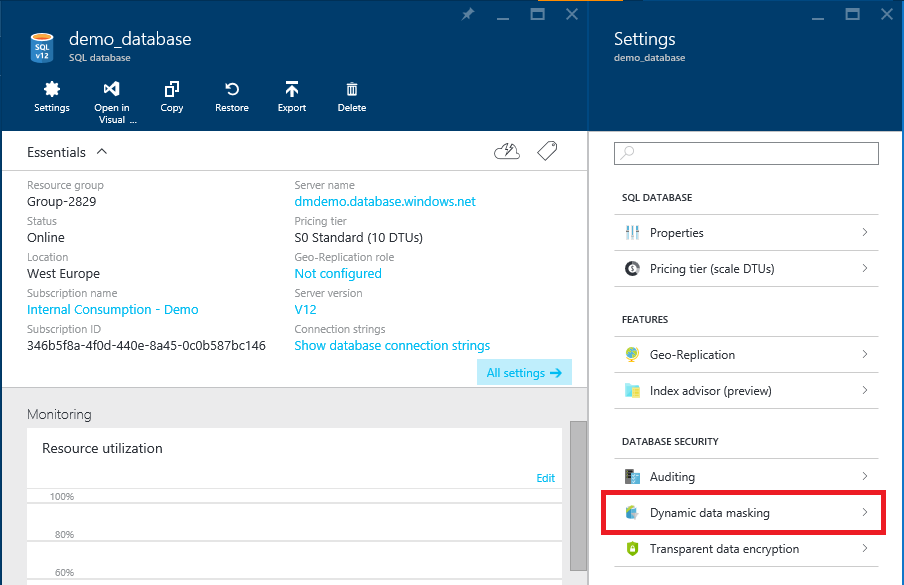
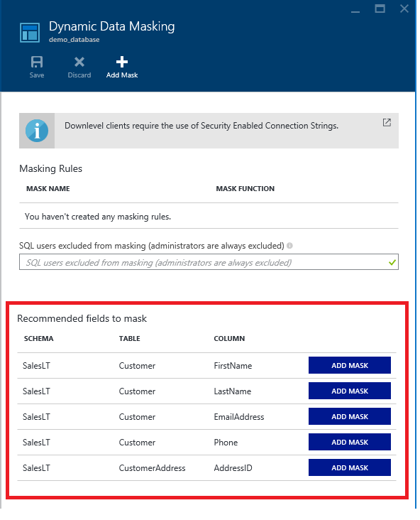
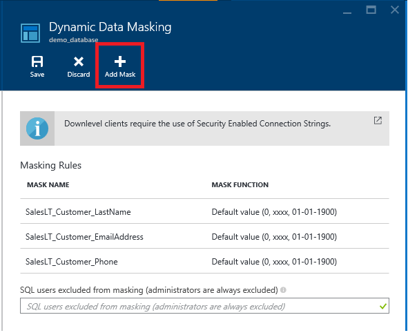
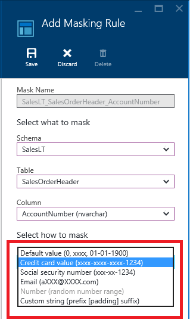

# Get started with SQL Database dynamic data masking with the Azure portal

This article shows you how to implement [dynamic data masking](sql-database-dynamic-data-masking-get-started.md) with the Azure portal. You can also implement dynamic data masking using [Azure SQL Database cmdlets](https://docs.microsoft.com/powershell/module/azurerm.sql/) or the [REST API](https://msdn.microsoft.com/library/dn505719.aspx).

## Set up dynamic data masking for your database using the Azure portal
1. Launch the Azure portal at [https://portal.azure.com](https://portal.azure.com).
2. Navigate to the settings page of the database that includes the sensitive data you want to mask.
3. Click the **Dynamic Data Masking** tile that launches the **Dynamic Data Masking** configuration page.
   
   * Alternatively, you can scroll down to the **Operations** section and click **Dynamic Data Masking**.
     
       
4. In the **Dynamic Data Masking** configuration page, you may see some database columns that the recommendations engine has flagged for masking. In order to accept the recommendations, just click **Add Mask** for one or more columns and a mask is created based on the default type for this column. You can change the masking function by clicking on the masking rule and editing the masking field format to a different format of your choice. Be sure to click **Save** to save your settings.
   
      
5. To add a mask for any column in your database, at the top of the **Dynamic Data Masking** configuration page, click **Add Mask** to open the **Add Masking Rule** configuration page.
   
      
6. Select the **Schema**, **Table** and **Column** to define the designated field for masking.
7. Choose a **Masking Field Format** from the list of sensitive data masking categories.
   
              
8. Click **Save** in the data masking rule page to update the set of masking rules in the dynamic data masking policy.
9. Type the SQL users or AAD identities that should be excluded from masking, and have access to the unmasked sensitive data. This should be a semicolon-separated list of users. Users with administrator privileges always have access to the original unmasked data.
   
    
   
   > [!TIP]
   > To make it so the application layer can display sensitive data for application privileged users, add the SQL user or AAD identity the application uses to query the database. It is highly recommended that this list contain a minimal number of privileged users to minimize exposure of the sensitive data.
   > 
   > 
10. Click **Save** in the data masking configuration page to save the new or updated masking policy.

## Next steps

* For an overview of dynamic data masking, see [dynamic data masking](sql-database-dynamic-data-masking-get-started.md).
* You can also implement dynamic data masking using [Azure SQL Database cmdlets](https://docs.microsoft.com/powershell/module/azurerm.sql/) or the [REST API](https://msdn.microsoft.com/library/dn505719.aspx).
