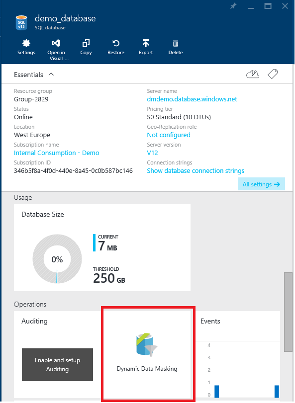
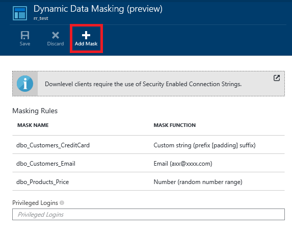
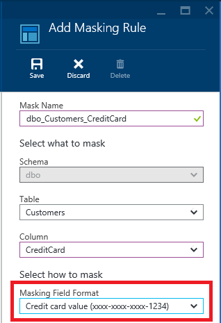
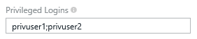

<properties 
   pageTitle="Get started with SQL Database Dynamic Data Masking (Azure Preview portal)" 
   description="How to get started with SQL Database Dynamic Data Masking in the Azure Preview portal" 
   services="sql-database" 
   documentationCenter="" 
   authors="nadavhelfman"
   manager="jeffreyg" 
   editor="v-romcal"/>

<tags
   ms.service="sql-database"
   ms.devlang="NA"
   ms.topic="article"
   ms.tgt_pltfrm="NA"
   ms.workload="data-services" 
   ms.date="07/30/2015"
   ms.author="nadavh; ronmat; v-romcal; sstein"/>

# Get started with SQL Database Dynamic Data Masking (Azure Preview portal)

> [AZURE.SELECTOR]
- [Dynamic Data Masking - Azure portal](sql-database-dynamic-data-masking-get-started-portal.md)

## Overview

SQL Database Dynamic Data Masking limits sensitive data exposure by masking it to non-privileged users. Dynamic data masking is in preview for Basic, Standard, and Premium service tiers in the V12 version of Azure SQL Database.

Dynamic data masking helps prevent unauthorized access to sensitive data by enabling customers to designate how much of the sensitive data to reveal with minimal impact on the application layer. It’s a policy-based security feature that hides the sensitive data in the result set of a query over designated database fields, while the data in the database is not changed.

For example, a call center support person may identify callers by several digits of their social security number or credit card number, but those data items should not be fully exposed to the support person. A developer can define a masking rule to be applied to each query result that masks all but the last four digits of any social security number or credit card number in the result set. For another example, by using the appropriate data mask to protect personally identifiable information (PII) data, a developer can query production environments for troubleshooting purposes without violating compliance regulations.

## SQL Database Dynamic Data Masking basics

You set up a dynamic data masking policy in the Azure Preview portal by selecting the Dynamic Data Masking operation in your SQL Database configuration blade.
Before setting up dynamic data masking check if you are using a ["Downlevel Client"](sql-database-auditing-and-dynamic-data-masking-downlevel-clients.md).

### Dynamic data masking permissions

Dynamic data masking can be configured by the Azure Database admin, server admin, or security officer roles.

### Dynamic data masking policy

* **Privileged logins** - A set of logins that will get unmasked data in the SQL query results.
  
* **Masking rules** - A set of rules that define the designated fields to be masked and the masking function that will be used. The designated fields can be defined using a database table name and column name.

* **Masking functions** - A set of methods that control the exposure of data for different scenarios.

| Masking Function | Masking Logic |
|----------|---------------|
| **Default**  |**Full masking according to the data types of the designated fields**  • Use XXXXXXXX or fewer Xs if the size of the field is less than 8 characters for string data types (nchar, ntext, nvarchar). • Use a zero value for numeric data types (bigint, bit, decimal, int, money, numeric, smallint, smallmoney, tinyint, float, real). • Use 01-01-1900 for date/time data types (date, datetime2, datetime, datetimeoffset, smalldatetime, time). • For SQL variant, the default value of the current type is used. • For XML the document <masked/> is used. • Use an empty value for special data types (timestamp  table, hierarchyid, GUID, binary, image, varbinary spatial types).
| **Credit card** |**Masking method which exposes the last four digits of the designated fields** and adds a constant string as a prefix in the form of a credit card.  XXXX-XXXX-XXXX-1234|
| **Social security number** |**Masking method which exposes the last two digits of the designated fields** and adds a constant string as a prefix in the form of an American social security number.  XXX-XX-XX12 |
| **Email** | **Masking method which exposes the first letter and replaces the domain with XXX.com** using a constant string prefix in the form of an email address.  aXX@XXXX.com |
| **Random number** | **Masking method which generates a random number** according to the selected boundaries and actual data types. If the designated boundaries are equal, then the masking function will be a constant number.   |
| **Custom text** | **Masking method which exposes the first and last characters** and adds a custom padding string in the middle. prefix[padding]suffix   |

  

### Security-enabled connection string

If you are using a ["Downlevel Client"](sql-database-auditing-and-dynamic-data-masking-downlevel-clients.md), then you must update existing clients (example: applications) to use a modified connection string format. Please click [here](sql-database-auditing-and-dynamic-data-masking-downlevel-clients.md) for details.

## Set up dynamic data masking for your database using the Azure Preview portal

1. Launch the Azure Preview portal at [https://portal.azure.com](https://portal.azure.com).
	 
2. Navigate to the configuration blade of the database that includes the sensitive data you want to mask.
	
3. Click the **Dynamic Data Masking** tile which launches the **Dynamic Data Masking** configuration blade.

	* Alternatively, you can scroll down to the **Operations** section and click **Dynamic Data Masking**.
	 
	  

4. In the **Dynamic Data Masking** configuration blade, click **Add Mask** to open the **Add Masking Rule** configuration blade.

	  

5. Select the **Table** and **Column**, to define the designated fields that will be masked.

6. Choose a **Masking Field Format** from the list of sensitive data masking categories.

	  		

7. Click **Save** in the data masking rule blade to update the set of masking rules in the dynamic data masking policy.

8. Type the privileged logins that should have access to the unmasked sensitive data.
 
	

	>[AZURE.TIP] To make it so the application layer can display sensitive data for application privileged users, add the SQL login of the application that is being used to query the database. It is highly recommended that this list contain a minimal number of logins to minimize exposure of the sensitive data.

9. Click **Save** in the data masking configuration blade to save the new or updated masking policy.

10. If you are using a ["Downlevel Client"](sql-database-auditing-and-dynamic-data-masking-downlevel-clients.md), then you must update existing clients (example: applications) to use a modified connection string format. For more information, see [Downlevel clients](sql-database-auditing-and-dynamic-data-masking-downlevel-clients.md).

## Set up dynamic data masking for your database using Powershell cmdlets

See [Azure SQL Database Cmdlets](https://msdn.microsoft.com/library/azure/mt163521.aspx).

## Set up dynamic data masking for your database using REST API

See [Operations for Azure SQL Databases](https://msdn.microsoft.com/library/dn505719.aspx).
