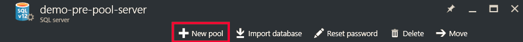
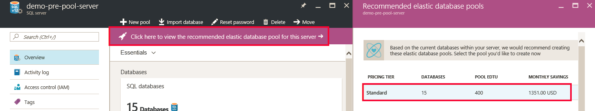
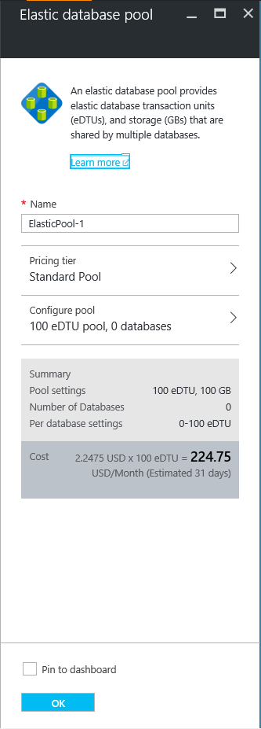
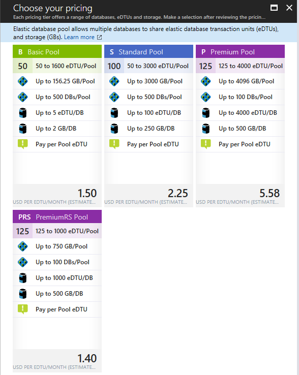
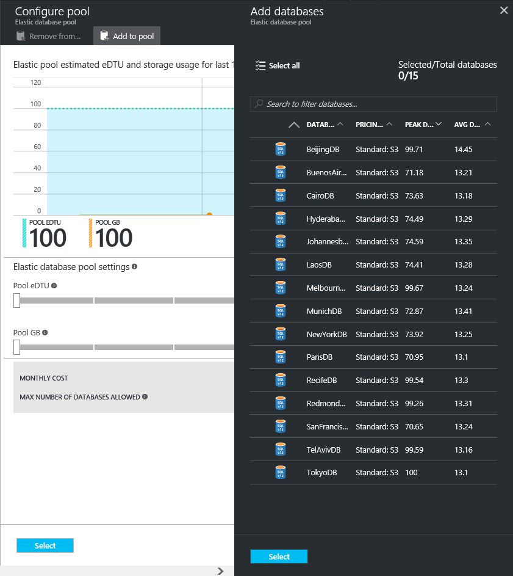
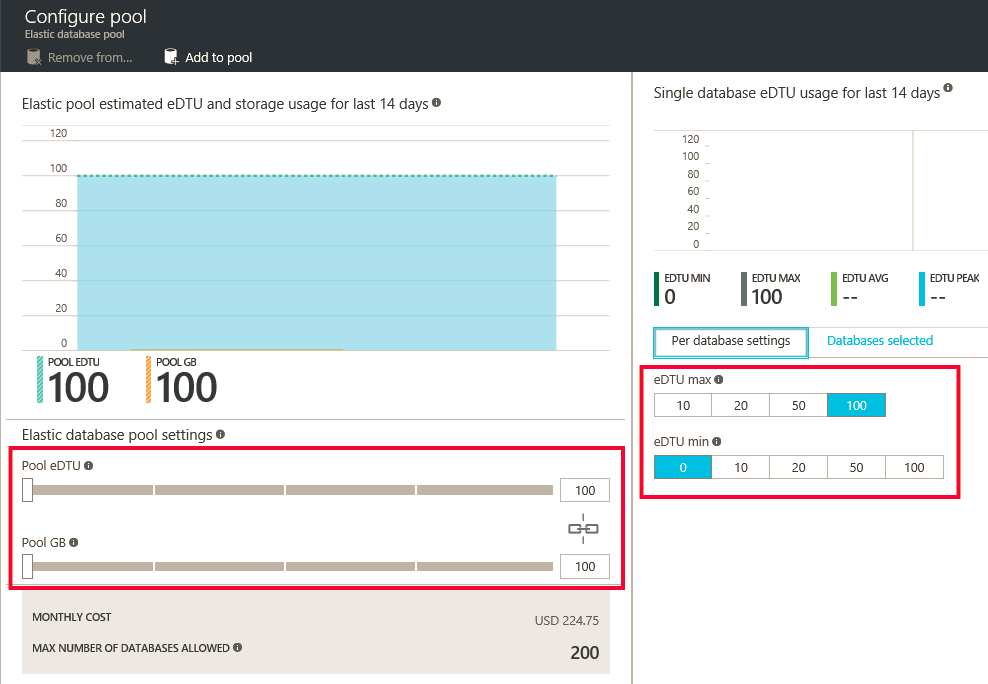
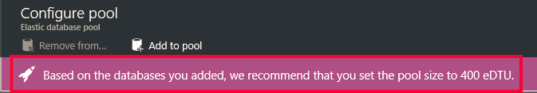

<properties
	pageTitle="Create a new elastic pool with the Azure portal | Microsoft Azure"
	description="How to add a scalable elastic database pool to your SQL database configuration for easier administration and resource sharing across many databases."
	keywords="scalable database,database configuration"
	services="sql-database"
	documentationCenter=""
	authors="ninarn"
	manager="jhubbard"
	editor=""/>

<tags
	ms.service="sql-database"
	ms.devlang="NA"
	ms.date="07/20/2016"
	ms.author="ninarn"
	ms.workload="data-management"
	ms.topic="get-started-article"
	ms.tgt_pltfrm="NA"/>

# Create a new elastic database pool with the Azure portal

> [AZURE.SELECTOR]
- [Azure portal](sql-database-elastic-pool-create-portal.md)
- [PowerShell](sql-database-elastic-pool-create-powershell.md)
- [C#](sql-database-elastic-pool-create-csharp.md)

This article shows you how to create a scalable [elastic database pool](sql-database-elastic-pool.md) with the [Azure portal](https://portal.azure.com/). There are two ways you can create a pool. You can do it from scratch if you know the pool setup you want, or start with a recommendation from the service. SQL Database has built-in intelligence that recommends a pool setup if it's more cost-efficient for you based on the past usage telemetry for your databases.

You can add multiple pools to a server, but you can't add databases from different servers into the same pool. To create a pool, you need at least one database in a V12 server. If you don't have one, see [Create your first Azure SQL database](sql-database-get-started.md). You can create a pool with only one database, but pools are only cost-efficient with multiple databases. See [Price and performance considerations for an elastic database pool](sql-database-elastic-pool-guidance.md).

> [AZURE.NOTE] Pools are only available with SQL Database V12 servers. If you have databases on a V11 server, you can [use a PowerShell script to identify them as candidates for a pool](sql-database-elastic-pool-database-assessment-powershell.md) on a V12 server, and then [use PowerShell to upgrade to V12 and create a pool](sql-database-upgrade-server-powershell.md) in one step.

## Step 1: Create a new pool

This article shows how to create a new pool from an existing **server** blade in the portal, which is the easiest way to move existing databases into a pool. 

> [AZURE.NOTE] Whether you already have a server or not, you can also create a new pool from the **SQL elastic pools** blade (below the list on the left side of the portal, click **Browse** **>** **SQL elastic pools**). Clicking **+Add** on the **SQL elastic pools** blade provides steps to create a new server during the pool provisioning workflow.

1. In the [Azure portal](http://portal.azure.com/) below the list on the left side, click **Browse** **>** **SQL servers**, and then click the server that contains the databases you want to add to a pool.
2. Click **New pool**.

    

    **-OR-**

    You may see a message saying there are recommended elastic database pools for the server (V12 only). Click the message to see the recommended pools based on historical database usage telemetry, and then click the tier to see more details and customize the pool. See [Understand pool recommendations](#understand-pool-recommendations) later in this topic for how the recommendation is made.

    

    The **Elastic database pool** blade appears, which is where you'll set up your pool. If you clicked **New pool** in the previous step, the portal chooses a **Standard pool** under **Pricing tier**, a unique **Name** for the pool, and a default configuration for the pool. If you chose a recommended pool, the recommended tier and configuration of the pool are already chosen, but you can still change them.

    

3. Specify a name for the elastic pool, or leave it as the default.

## Step 2: Choose a pricing tier

The pool's pricing tier determines the features available to the elastic databases in the pool, and the maximum number of eDTUs (eDTU MAX), and storage (GBs) available to each database. For details, see Service Tiers.

To change the pricing tier for the pool, click **Pricing tier**, click the pricing tier your want, and then click **Select**.

> [AZURE.IMPORTANT] After you choose the pricing tier and commit your changes by clicking **OK** in the last step, you won't be able to change the pricing tier of the pool. To change the pricing tier for an existing elastic pool create a new elastic pool in the desired pricing tier and migrate the elastic databases to this new pool.

## Step 3: Configure the pool

After setting the pricing tier, click Configure pool where you add databases, set pool eDTUs and storage (pool GBs), and where you set the min and max eDTUs for the elastic databases in the pool.

1. Click **Configure pool**
2. Select the databases you want to add to the pool. This step is optional while creating the pool. Databases can be added after the pool has been created.
    To add databases, click **Add database**, click the databases that you want to add, and then click the **Select** button.

    

    If the databases you're working with have enough historical usage telemetry, the **Estimated eDTU and GB usage** graph and the **Actual eDTU usage** bar chart update to help you make configuration decisions. Also, the service may give you a recommendation message to help you right-size the pool. See [Dynamic Recommendations](#dynamic-recommendations).

3. Use the controls on the **Configure pool** page to explore settings and configure your pool. See [Elastic pools limits](sql-database-elastic-pool.md#edtu-and-storage-limits-for-elastic-pools-and-elastic-databases) for more detail about limits for each service tier, and see [Price and performance considerations for elastic database pools](sql-database-elastic-pool-guidance.md) for detailed guidance on right-sizing a pool. For more details about pool settings, see [Elastic database pool properties](sql-database-elastic-pool.md#elastic-database-pool-properties).

	

4. Click **Select** in the **Configure Pool** blade after changing settings.
5. Click **OK** to create the pool.

## Understand pool recommendations

The SQL Database service evaluates usage history and recommends one or more pools when it is more cost-effective than using single databases. Each recommendation is configured with a unique subset of the server's databases that best fit the pool.

  

The pool recommendation comprises:

- A pricing tier for the pool (Basic, Standard, or Premium)
- Appropriate **POOL eDTUs** (also called Max eDTUs per pool)
- The **eDTU MAX** and **eDTU Min** per database
- The list of recommended databases for the pool

The service takes the last 30 days of telemetry into account when recommending pools. For a database to be considered as a candidate for an elastic database pool it must exist for at least 7 days. Databases that are already in an elastic database pool are not considered as candidates for elastic database pool recommendations.

The service evaluates resource needs and cost effectiveness of moving the single databases in each service tier into pools of the same tier. For example, all Standard databases on a server are assessed for their fit into a Standard Elastic Pool. This means the service does not make cross-tier recommendations such as moving a Standard database into a Premium pool.

### Dynamic recommendations

After adding databases to the pool, recommendations will be dynamically generated based on the historical usage of the databases you have selected. These recommendations will be shown in the eDTU and GB usage chart as well as in a recommendation banner at the top of the **Configure pool** blade. These recommendations are intended to assist you in creating a pool optimized for your specific databases.

## Additional resources

- [Manage a SQL Database elastic pool with the portal](sql-database-elastic-pool-manage-portal.md)
- [Manage a SQL Database elastic pool with PowerShell](sql-database-elastic-pool-manage-powershell.md)
- [Manage a SQL Database elastic pool with C#](sql-database-elastic-pool-manage-csharp.md)
- [Scaling out with Azure SQL Database](sql-database-elastic-scale-introduction.md) 

