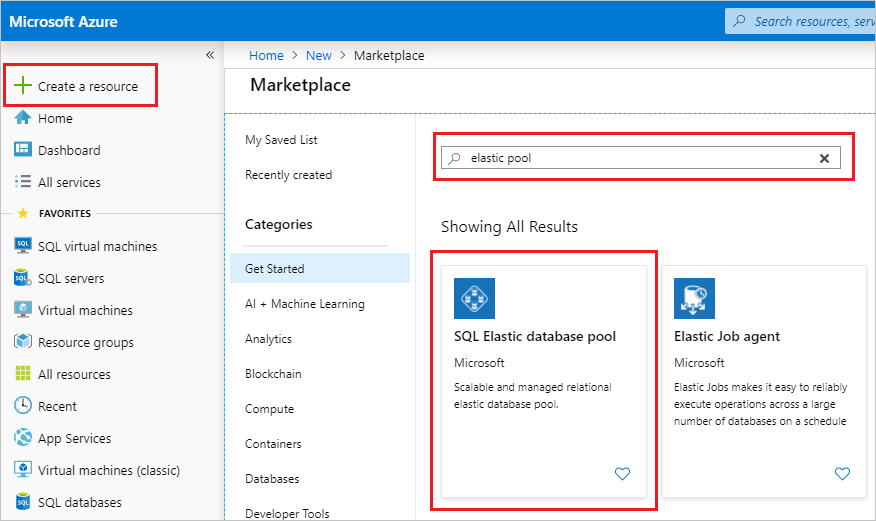
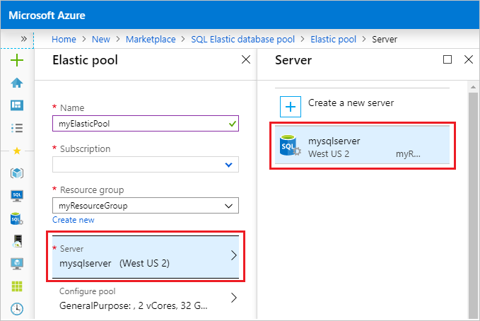
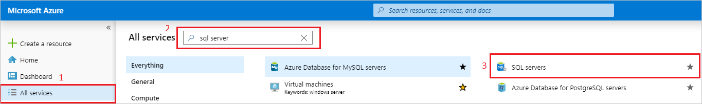
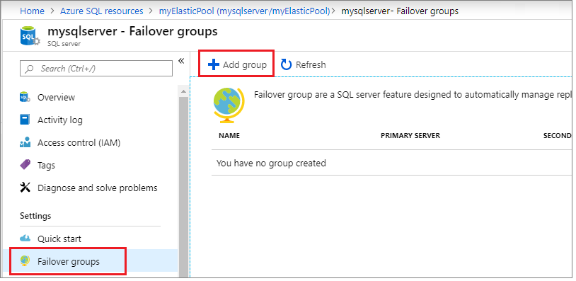
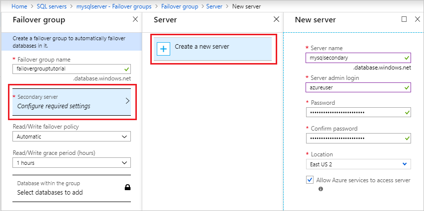
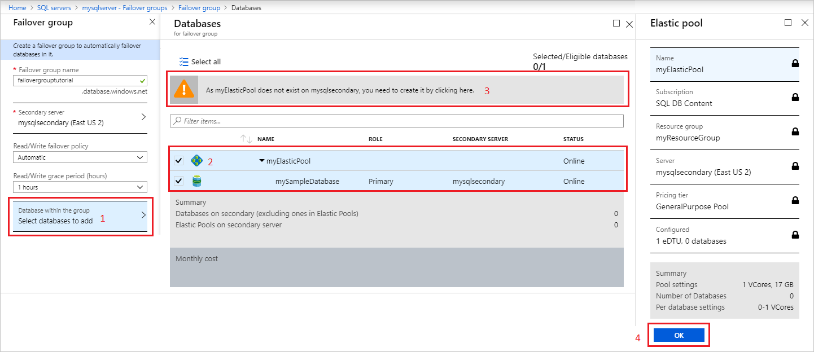
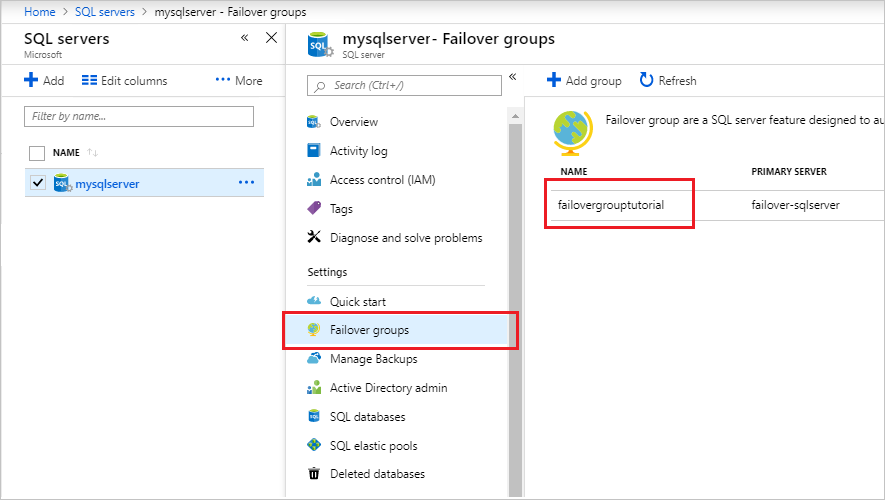
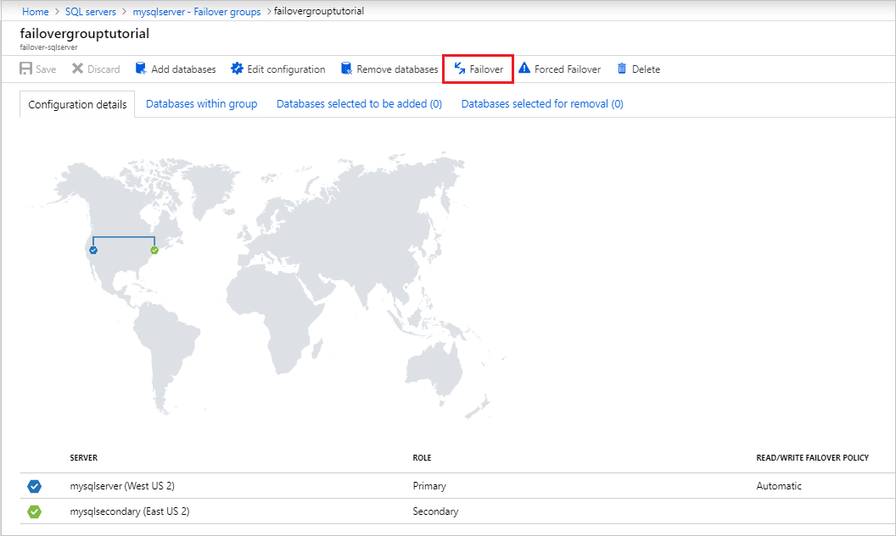

# Tutorial: Add an Azure SQL Database elastic pool to a failover group

Configure a failover group for an Azure SQL Database elastic pool and test failover using the Azure portal.  In this tutorial, you will learn how to:

> [!div class="checklist"]
> - Create an Azure SQL Database single database.
> - Add the single database into an elastic pool. 
> - Create a [failover group](sql-database-auto-failover-group.md) for an elastic pool between two logical SQL servers.
> - Test failover.

## Prerequisites

To complete this tutorial, make sure you have: 

- An Azure subscription. [Create a free account](https://azure.microsoft.com/free/) if you don't already have one.

## 1 - Create a single database 

[!INCLUDE [sql-database-create-single-database](includes/sql-database-create-single-database.md)]

## 2 - Add single database to elastic pool

1. Choose **Create a resource** in the upper left-hand corner of the [Azure portal](https://portal.azure.com).
1. Type `elastic pool` in the search box, press enter, select the **SQL Elastic database pool** icon, and then select **Create**. 

    

1. Configure your elastic pool with the following values:
   - **Name**: Provide a unique name for your elastic pool, such as `myElasticPool`. 
   - **Subscription**: Select your subscription from the drop-down.
   - **ResourceGroup**: Select `myResourceGroup` from the drop-down, the resource group you created in section 1. 
   - **Server**: Select the server you created in section 1 from the drop down.  

       

   - **Compute + storage**: Select **Configure elastic pool** to configure your compute, storage, and add your single database to your elastic pool. On the **Pool Settings** tab, leave the default of Gen5, with 2 vCores and 32gb. 

1. On the **Configure** page, select the **Databases** tab, and then choose to **Add database**. Choose the database you created in section 1 and then select **Apply** to add it to your elastic pool. Select **Apply** again to apply your elastic pool settings and close the **Configure** page. 

    

1. Select **Review + create** to review your elastic pool settings and then select **Create** to create your elastic pool. 

## 3 - Create the failover group 
In this step, you will create a [failover group](sql-database-auto-failover-group.md) between an existing Azure SQL server and a new Azure SQL server in another region. Then add the elastic pool to the failover group. 

1. Select **All Services** on the upper-left hand corner of the [Azure portal](https://portal.azure.com). 
1. Type `sql servers` in the search box. 
1. (Optional) Select the star icon next to SQL Servers to favorite **SQL servers** and add it to your left-hand navigation pane. 
    
    

1. Select **SQL servers** and choose the server you created in section 1.
1. Select **Failover groups** under the **Settings** pane, and then select **Add group** to create a new failover group. 

    

1. On the **Failover Group** page, enter or select the following values, and then select **Create**:
    - **Failover group name**: Type in a unique failover group name, such as `failovergrouptutorial`. 
    - **Secondary server**: Select the option to *configure required settings* and then choose to **Create a new server**. Alternatively, you can choose an already-existing server as the secondary server. After entering the following values for your new secondary server, select **Select**. 
        - **Server name**: Type in a unique name for the secondary server, such as `mysqlsecondary`. 
        - **Server admin login**: Type `azureuser`
        - **Password**: Type a complex password that meets password requirements.
        - **Location**: Choose a location from the drop-down, such as East US 2. This location cannot be the same location as your primary server.

       > [!NOTE]
       > The server login and firewall settings must match that of your primary server. 
    
       

1. Select **Databases within the group** then select the elastic pool you created in section 2. A warning should appear, prompting you to create an elastic pool on the secondary server. Select the warning, and then select **OK** to create the elastic pool on the secondary server. 
        
    
        
1. Select **Select** to apply your elastic pool settings to the failover group, and then select **Create** to create your failover group. Adding the elastic pool to the failover group will automatically start the geo-replication process. 

## 4 - Test failover 
In this step, you will fail your failover group over to the secondary server, and then fail back using the Azure portal. 

1. Navigate to your **SQL servers** server within the [Azure portal](https://portal.azure.com). 
1. Select **Failover groups** under the **Settings** pane and then choose the failover group you created in section 2. 
  
   

1. Review which server is primary, and which server is secondary. 
1. Select **Failover** from the task pane to fail over your failover group containing your elastic pool. 
1. Select **Yes** on the warning that notifies you that TDS sessions will be disconnected. 

   

1. Review which server is primary, which server is secondary. If failover succeeded, the two servers should have swapped roles. 
1. Select **Failover** again to fail the failover group back to the original settings. 

## Clean up resources 
Clean up resources by deleting the resource group. 

1. Navigate to your resource group in the [Azure portal](https://portal.azure.com).
1. Select  **Delete resource group** to delete all the resources in the group, as well as the resource group itself. 
1. Type the name of the resource group, `myResourceGroup`, in the textbox, and then select **Delete** to delete the resource group.  

## Next steps

In this tutorial, you added an Azure SQL Database single database to a failover group, and tested failover. You learned how to:

> [!div class="checklist"]
> - Create an Azure SQL Database single database.
> - Add the single database into an elastic pool. 
> - Create a [failover group](sql-database-auto-failover-group.md) for an elastic pool between two logical SQL servers.
> - Test failover.

Advance to the next tutorial on how to migrate using DMS.

> [!div class="nextstepaction"]
> [Tutorial: Migrate SQL Server to a pooled database using DMS](../dms/tutorial-sql-server-to-azure-sql.md?toc=/azure/sql-database/toc.json)
