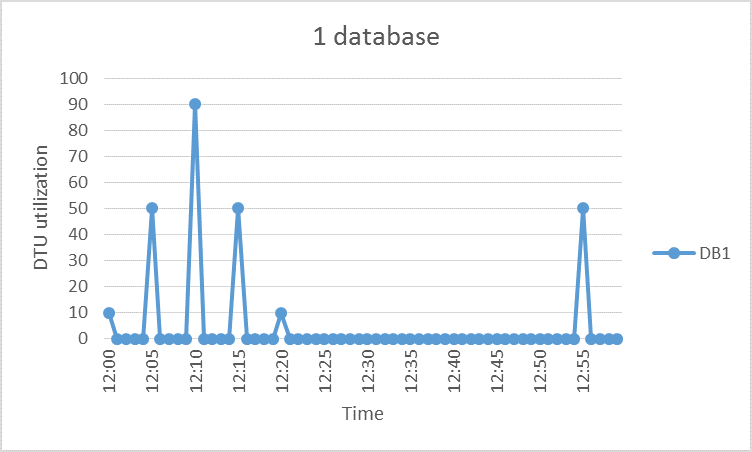
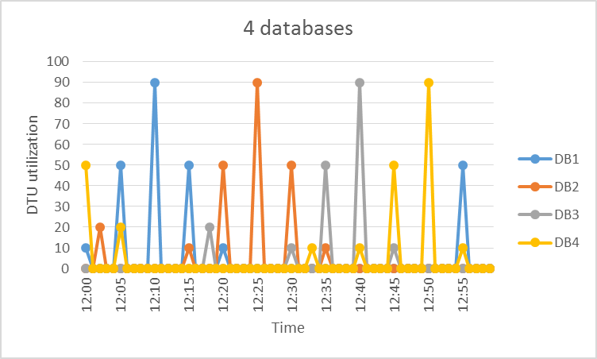

<properties
	pageTitle="When should an elastic database pool be used?"
	description="An elastic database pool is a collection of available resources that are shared by a group of elastic databases. This document provides guidance to help assess the suitability of using an elastic database pool for a group of databases."
	services="sql-database"
	documentationCenter=""
	authors="stevestein"
	manager="jhubbard"
	editor=""/>

<tags
	ms.service="sql-database"
	ms.devlang="NA"
	ms.date="05/23/2016"
	ms.author="sstein"
	ms.workload="data-management"
	ms.topic="article"
	ms.tgt_pltfrm="NA"/>

# When should an elastic database pool be used?
Assess whether using an elastic database pool is cost efficient based on database usage patterns and pricing differences between an elastic database pool and single databases. Additional guidance is also provided to assist in determining the current pool size required for an existing set of SQL databases.  

- For an overview of pools, see [SQL Database elastic database pools](sql-database-elastic-pool.md).

> [AZURE.NOTE] Elastic pools are generally available (GA) in all Azure regions except North Central US, West India and China North where it is currently in preview.  GA of elastic pools in these regions will be provided as soon as possible.

## Elastic database pools

SaaS developers build applications on top of large scale data-tiers consisting of multiple databases. A common application pattern is to provision a single database for each customer. But different customers often have varying and unpredictable usage patterns, and it is difficult to predict the resource requirements of each individual database user. So the developer may overprovision resources at considerable expense to ensure favorable throughput and response times for all databases. Or, the developer can spend less and risk a poor performance experience for their customers. To learn more about design patterns for SaaS applications using elastic pools, see [Design Patterns for Multi-tenant SaaS Applications with Azure SQL Database](sql-database-design-patterns-multi-tenancy-saas-applications.md).

Elastic pools in Azure SQL Database enable SaaS developers to optimize the price performance for a group of databases within a prescribed budget while delivering performance elasticity for each database. Pools enable the developer to purchase elastic Database Transaction Units (eDTUs) for a pool shared by multiple databases to accommodate unpredictable periods of usage by individual databases. The eDTU requirement for a pool is determined by the aggregate utilization of its databases. The amount of eDTUs available to the pool is controlled by the developer budget. Pools make it easy for the developer to reason over the impact of budget on performance and vice versa for their pool. The developer simply adds databases to the pool, sets the minimum and maximum eDTUs  for the databases, and then sets the eDTU of the pool based on their budget. A developer can use pools  to seamlessly grow their service from a lean startup to a mature business at ever-increasing scale.  
## When to consider a pool

Pools are well suited for a large number of databases with specific utilization patterns. For a given database, this pattern is characterized by low average utilization with relatively infrequent utilization spikes.

The more databases you can add to a pool the greater your savings become. Depending on your application utilization pattern, it is possible to see savings with as few as two S3 databases.  

The following sections help you understand how to assess if your specific collection of databases will benefit from being in a pool. The examples use Standard pools but the same principles also apply to Basic and Premium pools.

### Assessing database utilization patterns

The following figure shows an example of a database that spends much time idle, but also periodically spikes with activity. This is a utilization pattern that is well suited for a pool:

   

For the five-minute period illustrated above, DB1 peaks up to 90 DTUs, but its overall average usage is less than five DTUs. An S3 performance level is required to run this workload in a single database, but this leaves most of the resources unused during periods of low activity.

A pool allows these unused DTUs to be shared across multiple databases, and so reduces the total amount of DTUs needed and overall cost.

Building on the previous example, suppose there are additional databases with similar utilization patterns as DB1. In the next two figures below, the utilization of four databases and 20 databases are layered onto the same graph to illustrate the non-overlapping nature of their utilization over time:

   

   

The aggregate DTU utilization across all 20 databases is illustrated by the black line in the above figure. This shows that the aggregate DTU utilization never exceeds 100 DTUs, and indicates that the 20 databases can share 100 eDTUs over this time period. This results in a 20x reduction in DTUs and a 13x price reduction compared to placing each of the databases in S3 performance levels for single databases.

This example is ideal for the following reasons:

- There are large differences between peak utilization and average utilization per database.  
- The peak utilization for each database occurs at different points in time.
- eDTUs are shared between a large number of databases.

The price of a pool is a function of the pool eDTUs. While the eDTU unit price for a pool is 1.5x greater than the DTU unit price for a single database, **pool eDTUs can be shared by many databases and so in many cases fewer total eDTUs are needed**. These distinctions in pricing and eDTU sharing are the basis of the price savings potential that pools can provide.  

The following rules of thumb related to database count and database utilization help to ensure that a pool delivers reduced cost compared to using performance levels for single databases.

### Minimum number of databases

If the sum of the DTUs of performance levels for single databases is more than 1.5x the eDTUs needed for the pool, then an elastic pool is more cost effective. For available sizes, see [eDTU and storage limits for elastic database pools and elastic databases](sql-database-elastic-pool.md#edtu-and-storage-limits-for-elastic-pools-and-elastic-databases).

***Example*** 
At least two S3 databases or at least 15 S0 databases are needed for a 100 eDTU pool to be more cost-effective than using performance levels for single databases.

### Maximum number of concurrently peaking databases

By sharing eDTUs, not all databases in a pool can simultaneously use eDTUs up to the limit available when using performance levels for single databases. The fewer databases that concurrently peak, the  lower the pool eDTU can be set and the more cost-effective the pool becomes. In general, not more than 2/3 (or 67%) of the databases in the pool should simultaneously peak to their eDTU limit.

***Example*** 
To reduce costs for three S3 databases in a 200 eDTU pool, at most two of these databases can simultaneously peak in their utilization.  Otherwise, if more than two of these four S3 databases simultaneously peak, the pool would have to be sized to more than 200 eDTUs.  And if the pool is resized to more than 200 eDTUs, more S3 databases would need to be added to the pool to keep costs lower than performance levels for single databases.  

Note this example does not consider utilization of other databases in the pool. If all databases have some utilization at any given point in time, then less than 2/3 (or 67%) of the databases can peak simultaneously.

### DTU utilization per database

A large difference between the peak and average utilization of a database indicates prolonged periods of low utilization and short periods of high utilization. This utilization pattern is ideal for sharing resources across databases. A database should be considered for a pool when its peak utilization is about 1.5 times greater than its average utilization.

***Example*** 
An S3 database that peaks to 100 DTUs and on average uses 67 DTUs or less is a good candidate for sharing eDTUs in a pool.  Alternatively, an S1 database that peaks to 20 DTUs and on average uses 13 DTUs or less is a good candidate for a pool.

## Sizing an elastic pool

The best size for a pool depends on the aggregate eDTUs and storage resources needed for all databases in the pool. This involves determining the larger of the following:

* Maximum DTUs utilized by all databases in the pool.
* Maximum storage bytes utilized by all databases in the pool.

For available sizes, see [eDTU and storage limits for elastic database pools and elastic databases](sql-database-elastic-pool.md#edtu-and-storage-limits-for-elastic-pools-and-elastic-databases).

SQL Database automatically evaluates the historical resource usage of databases in an existing SQL Database server and recommends the appropriate pool configuration in the Azure portal. In addition to the recommendations, a built-in experience estimates the eDTU usage for a custom croup of databases on the server. This enables you to do a "what-if" analysis by interactively adding databases to the pool and removing them to get resource usage analysis and sizing advice before committing your changes. For a how-to, see [Monitor, manage, and size an elastic pool](sql-database-elastic-pool-manage-portal.md).

For more flexible resource usage assessments that allow ad hoc sizing estimates for servers earlier than V12, as well as sizing estimates for databases in different servers, see the [Powershell script for identifying databases suitable for an elastic database pool](sql-database-elastic-pool-database-assessment-powershell.md).

| Capability     | Portal experience|	PowerShell script|
|:---------------|:----------|:----------|
| Granularity    | 15 seconds | 15 seconds
| Considers pricing differences between a pool and performance levels for single databases| Yes| No
| Allows customizing the list of the databases analyzed| Yes| Yes
| Allows customizing the period of time used in the analysis| No| Yes
| Allows customizing the list of databases analyzed across different servers| No| Yes
| Allows customizing the list of databases analyzed on v11 servers| No| Yes

In cases where you can't use tooling, the following step-by-step can help you estimate whether a pool is more cost-effective than single databases:

1.	Estimate the eDTUs needed for the pool as follows:

    MAX(<*Total number of DBs* X *average DTU utilization per DB*>, 
    <*Number of concurrently peaking DBs* X *Peak DTU utilization per DB*)

2.	Estimate the storage space needed for the pool by adding the number of bytes needed for all the databases in the pool.  Then determine the eDTU pool size that provides this amount of storage.  For pool storage limits based on eDTU pool size, see [eDTU and storage limits for elastic database pools and elastic databases](sql-database-elastic-pool.md#edtu-and-storage-limits-for-elastic-pools-and-elastic-databases).
3.	Take the larger of the eDTU estimates from Step 1 and Step 2.
4.	See the [SQL Database pricing page](https://azure.microsoft.com/pricing/details/sql-database/) and find the smallest eDTU pool size that is greater than the estimate from Step 3.
5.	Compare the pool price from Step 5 to the price of using the appropriate performance levels for single databases.

## Summary

Not all single databases are optimum candidates for pools. Databases with usage patterns that are characterized by low average utilization and relatively infrequent utilization spikes are excellent candidates. Application usage patterns are dynamic, so use the information and tools described in this article to make an initial assessment to see if a pool is a good choice for some or all of your databases. This article is just a starting point to help with your decision as to whether or not an elastic pool is a good fit. Remember that you should continually monitor historical resource usage and constantly reassess the performance levels of all of your databases. Keep in mind that you can easily move databases in and out of elastic pools, and if you have a very large number of databases you can have multiple pools of varying sizes that you can divide your databases into.

## Next steps

- [Create an elastic database pool](sql-database-elastic-pool-create-portal.md)
- [Monitor, manage, and size an elastic database pool](sql-database-elastic-pool-manage-portal.md)
- [SQL Database options and performance: understand what's available in each service tier](sql-database-service-tiers.md)
- [PowerShell script for identifying databases suitable for an elastic database pool](sql-database-elastic-pool-database-assessment-powershell.md)
