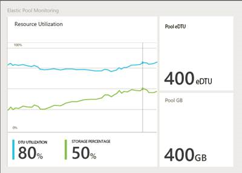
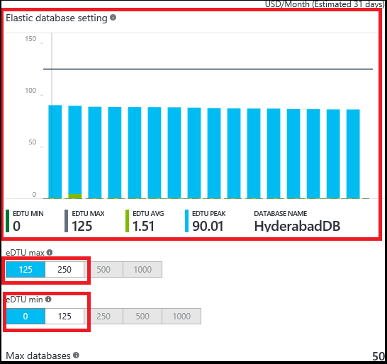
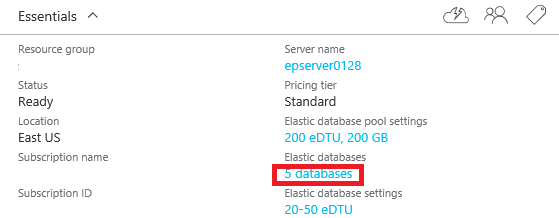
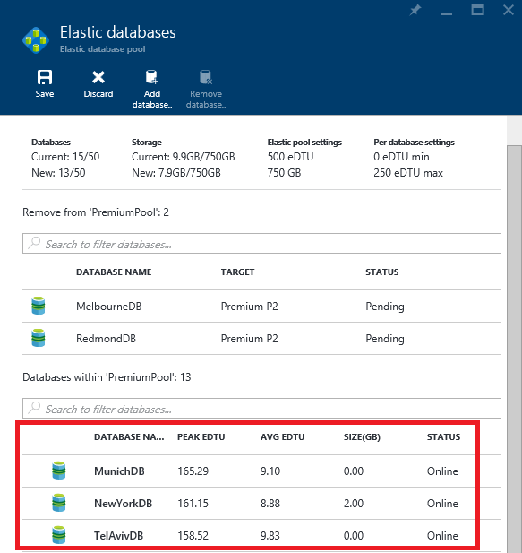
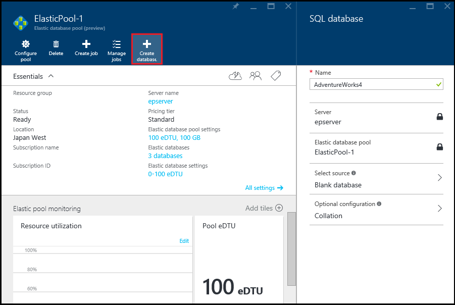

<properties
	pageTitle="Monitor, manage, and size an elastic database pool"
	description="Learn how to use the Azure portal and SQL Database's built-in intelligence to manage, monitor, and right-size a scalable elastic database pool to optimize database performance and manage cost."
	keywords=""
	services="sql-database"
	documentationCenter=""
	authors="sidneyh"
	manager="jhubbard"
	editor="cgronlun"/>

<tags
	ms.service="sql-database"
	ms.devlang="NA"
	ms.date="04/01/2016"
	ms.author="sidneyh"
	ms.workload="data-management"
	ms.topic="article"
	ms.tgt_pltfrm="NA"/>

# Monitor, manage, and size an elastic database pool with the Azure portal

> [AZURE.SELECTOR]
- [Azure portal](sql-database-elastic-pool-manage-portal.md)
- [C#](sql-database-elastic-pool-manage-csharp.md)
- [PowerShell](sql-database-elastic-pool-manage-powershell.md)
- [T-SQL](sql-database-elastic-pool-manage-tsql.md)

This article describes how to use the Azure portal to monitor, manage, and right-size an elastic database pool and the databases in the pool. SQL Database has built-in intelligence that analyzes historical usage telemetry and proactively recommends a pool for databases when it's more cost-effective. You can also add and remove databases before you commit to changes and see the impact on pool performance and storage. 

To work through the steps in this article, you'll need databases and a pool. See [create a pool](sql-database-elastic-pool-create-portal.md) if you already have databases, and the [SQL database tutorial](sql-database-get-started) if you don't. 

**To choose a pool to work with:**

- In the [Azure portal](https://portal.azure.com) click **Browse**, click **SQL elastic pools**, and then click the pool you want to work with from the list.

##Monitor resource utilization of a pool
After you select a pool to work with, under **Elastic Pool Monitoring**, a chart and live tiles show you important utilization information for your pool.

**To change the date range, the chart type (bar or line), or the resources shown:**

- Click **Edit**, pick the settings that you want, and then click **Save** to update the chart.

**To change the live tiles:**

- Click **Add tiles** and then select the tiles you want from the tile gallery that appears on the left.

##Add an alert to a pool resource
You can add rules to resources that send email to people or alert strings to URL endpoints when the resource hits a utilization threshold that you set up.

**To add an alert to any resource:**

1. Click the **Resource utilization** chart to open the **Metric** blade, click **Add alert**, and then fill out the information in the **Add an alert rule** blade (**Resource** is automatically set up to be the pool you're working with).
2. Type a **Name** and **Description** that identifies the alert to you and recipients.
3. Choose a **Metric** that you want to alert from the list.

    The chart dynamically shows resource utilization for that metric to help you choose a threshold.

4. Choose a **Condition** (greater than, less than, etc.) and a **Threshold**.
5. Click **OK**.

##Change eDTU per pool and database eDTU
When you see the resource utilization of a pool, you may discover that the pool needs a different eDTU setting, or individual databases in the pool need different eDTU settings. You can change the setup of the pool at any time to get the best balance of performance and cost. See [Price and performance considerations](sql-database-elastic-pool-guidance.md) for more information.

**To change the pool eDTU and eDTU per database:**

1. Click **Configure pool** to open the **Configure performance** blade.

    Under **Elastic database pool settings**, a chart shows you the recent trend of eDTU and storage utilization in percent of capacity for the pool.

    

2. Click a different **Pool eDTU**, and you'll see the estimated monthly cost of the change you want to make, and the chart updates to show the predicted utilization values with the new max eDTU you selected.

    

3. Under **Elastic database setting**, a bar graph shows the eDTU utilization of each database in the pool.

4. Click **eDTU max** to set the maximum and **eDTU min** to set the minimum number of eDTU for the databases in the pool.

    

##Add and remove databases

After you create a pool, you can add databases to the pool or remove them. You can only add databases on the same SQL server.

**To add databases:**

1. In the blade for the pool, under **Elastic databases** click the link that shows the number of databases in the pool.

    

2. In the **Elastic databases** blade, click **Add database**, click the databases that you want to add, and then click the **Select** button.

    The **Elastic databases** blade now lists the database you just added, with **AVG DTU** and storage utilization as **SIZE(GB)**, along with a **Pending** status. The pool utilization values now show you what the **New** values will be if you save your changes.

    

3. Click **Save** and then click **OK** when the portal tells you the request has been submitted. The number of databases in the pool shows up on the blade for the pool when the operation is done.

**To remove databases:**

1. In the blade for the pool, under **Elastic databases** click the link that shows the number of databases in the pool.

    

2. In the **Elastic databases** blade, from the list of databases in the pool, click the databases you want to remove, and then click **Remove databases**.

    The pool utilization values now show you what the **New** values will be if you save your changes.

3. Click **Save** and then click **OK** when the portal tells you the request has been submitted. The number of databases in the pool shows up on the blade for the pool when the operation is done.

## Create a new database in a pool

In the blade for the database, just click **Create database**. The SQL database is already configured for the correct server and pool so click through to select other settings, and then click **OK** to create a new database in the pool.

   

##Create and manage elastic jobs

Elastic jobs let you run Transact-SQL scripts against any number of databases in the pool. Before you use jobs, install elastic jobs components and provide your credentials. For more information, see [Elastic database jobs overview](sql-database-elastic-jobs-overview.md).

## Additional resources

- [SQL Database elastic pool](sql-database-elastic-pool.md)
- [Create an elastic database pool with the portal](sql-database-elastic-pool-create-csharp.md)
- [Create an elastic database pool with PowerShell](sql-database-elastic-pool-create-powershell.md)
- [Create an elastic database pool with C#](sql-database-elastic-pool-create-csharp.md)
- [Price and performance considerations for elastic database pools](sql-database-elastic-pool-guidance.md)
