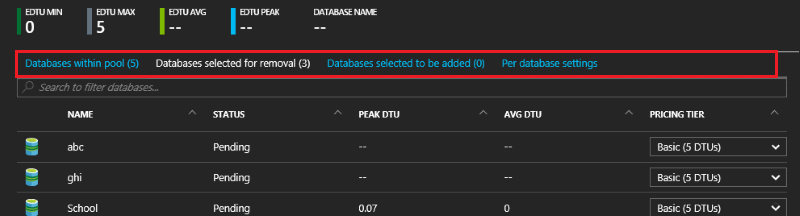
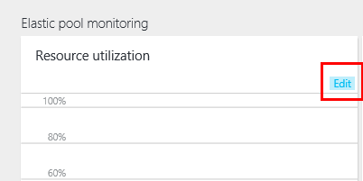
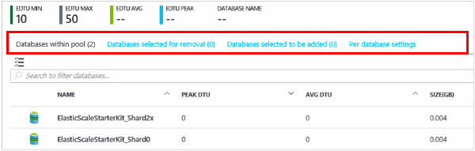

<properties
	pageTitle="Monitor and manage an elastic database pool with the Azure portal | Microsoft Azure"
	description="Learn how to use the Azure portal and SQL Database's built-in intelligence to manage, monitor, and right-size a scalable elastic database pool to optimize database performance and manage cost."
	keywords=""
	services="sql-database"
	documentationCenter=""
	authors="ninarn"
	manager="jhubbard"
	editor="cgronlun"/>

<tags
	ms.service="sql-database"
	ms.devlang="NA"
	ms.date="04/28/2016"
	ms.author="ninarn"
	ms.workload="data-management"
	ms.topic="article"
	ms.tgt_pltfrm="NA"/>

# Monitor and manage an elastic database pool with the Azure portal

> [AZURE.SELECTOR]
- [Azure portal](sql-database-elastic-pool-manage-portal.md)
- [PowerShell](sql-database-elastic-pool-manage-powershell.md)
- [C#](sql-database-elastic-pool-manage-csharp.md)
- [T-SQL](sql-database-elastic-pool-manage-tsql.md)

You can use the Azure portal to monitor, manage, and configure an elastic database pool and the databases in the pool. SQL Database has built-in intelligence that analyzes historical usage of all databases on a server (whether they are in pools or not), and recommends a pool for databases when it's more cost-effective. 

The portal lets you change pool and database settings, preview the changes, then commit all changes simultaneously. You can preview changes such as adding and removing databases. The potential effect on performance and pricing will also be displayed. 

To work through the steps in this article, you'll need a few databases and a pool. If you have existing databases, see [create a pool](sql-database-elastic-pool-create-portal.md); if you don't have a database, see the [SQL database tutorial](sql-database-get-started). 

## Select a pool to work with

1. In the [Azure portal](https://portal.azure.com) click **Browse**
2. Click **SQL elastic pools**
3. From the list, click the pool you want to work with.

## Move a database into an elastic pool

You can add or remove databases from an existing pool. The databases can be in other pools. However, you can only add databases that are on the same logical server.

1. In the blade for the pool, under **Elastic databases** click **Configure pool**.

    ![Click Configure pool][1]

2. In the **Configure pool** blade, click **Add to pool**.

	

	
3. In the **Add databases** blade, select the database or databases to add to the pool. Then click **Select**.

	

    The **Configure pool** blade now lists the database you just added, with its status set to **Pending**.

    

3. In the "Configure pool blade", click **Save**.

    

## Move a database out of an elastic pool

1. In the **Configure pool** blade, select the database or databases to remove.

    

2. Click **Remove from pool**.

    

	Selected databases show up in the UI as "databases selected to be removed."

## Monitor resource utilization of a pool

1. Select a pool to work with.
2. Under **Elastic Pool Monitoring**, a chart and live tiles show you important utilization information for your pool.

**To change the chart and display:**

- Click **Edit**.

	

- In the **Edit Chart** blade, select a new time range (past hour, today, or past week), or click **custom** to set a different time span. Select the chart type (bar or line), then select the resources to monitor. 

	

- Then click **OK**.

## Add an alert to a pool resource

You can add rules to resources that send email to people or alert strings to URL endpoints when the resource hits a utilization threshold that you set up.

**To add an alert to any resource:**

1. Click the **Resource utilization** chart to open the **Metric** blade, click **Add alert**, and then fill out the information in the **Add an alert rule** blade (**Resource** is automatically set up to be the pool you're working with).
2. Type a **Name** and **Description** that identifies the alert to you and recipients.
3. Choose a **Metric** that you want to alert from the list.

    The chart dynamically shows resource utilization for that metric to help you choose a threshold.

4. Choose a **Condition** (greater than, less than, etc.) and a **Threshold**.
5. Click **OK**.

## Change performance settings of a pool

As you monitor the resource utilization of a pool, you may discover that the pool needs a more eDTUs. Or individual databases in the pool need different eDTU settings. You can change the setup of the pool at any time to get the best balance of performance and cost. See [When should an elastic database pool be used?](sql-database-elastic-pool-guidance.md) for more information.

**To change the eDTUs per pool, and eDTUs per database:**

1. Open the **Configure pool** blade.

    Under **Elastic database pool settings**, use the sliders to change the pool settings.

    

2. When the setting changes, the display shows the estimated monthly cost of the change.

    

## Preview database actions

You can preview the addition and removal of databases before committing the action on the **Configure pool** blade:

.

## Create and manage elastic jobs

Elastic jobs let you run Transact-SQL scripts against any number of databases in the pool. Before you use jobs, install elastic jobs components and provide your credentials. For more information, see [Elastic database jobs overview](sql-database-elastic-jobs-overview.md).

See [Scaling out with Azure SQL Database](sql-database-elastic-scale-introduction.md): use elastic database tools to scale-out, move data, query, or create transactions.

## Additional resources

- [SQL Database elastic pool](sql-database-elastic-pool.md)
- [Create an elastic database pool with the portal](sql-database-elastic-pool-create-csharp.md)
- [Create an elastic database pool with PowerShell](sql-database-elastic-pool-create-powershell.md)
- [Create an elastic database pool with C#](sql-database-elastic-pool-create-csharp.md)
- [Price and performance considerations for elastic database pools](sql-database-elastic-pool-guidance.md)

<!--Image references-->
[1]: ./media/sql-database-elastic-pool-manage-portal/configure-pool.png
